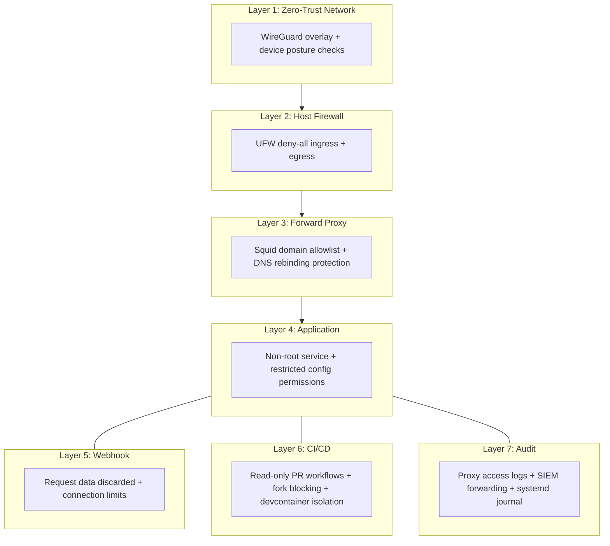

# Security Architecture

## Overview

hide-my-list is an autonomous AI agent that manages tasks on behalf of users. Because the agent has API credentials and runs continuously, it requires robust containment beyond what a typical web application needs.

The security architecture follows three principles:

- **Defense in depth**: 7 layers, no single point of trust
- **Deny by default**: network, firewall, and proxy all default deny
- **Least privilege**: each component gets only the access it needs

## Security Layers

### Layer 1: Zero-Trust Network Access

The agent VM is only reachable through a WireGuard-based overlay network (Tailscale).

- **No public IP exposure** — the VM has no ports open on the public internet
- **Network authentication** — accessing the Control UI requires Tailscale identity (via Tailscale Serve)
- **ACLs** — network-level access control lists restrict which users and devices can reach the agent
- **Device posture checks** — OS type and version are verified before access is granted

### Layer 2: Host Firewall

UFW enforces deny-by-default for both ingress and egress traffic.

| Direction | Allowed | Purpose |
|-----------|---------|---------|
| Inbound | SSH (22/tcp) | Management access |
| Inbound | WireGuard (41641/udp) | Overlay network tunnel |
| Outbound | DNS (53) | Name resolution |
| Outbound | NTP (123/udp) | Time synchronization |
| Outbound | WireGuard (41641/udp) | Overlay network tunnel |
| Outbound | Overlay subnet only | All other traffic (routed through proxy) |

HTTP (80/tcp) and HTTPS (443/tcp) are **not open**. All web traffic is forced through the forward proxy via the overlay subnet.

### Layer 3: Forward Proxy

A Squid forward proxy enforces a domain allowlist with deny-by-default policy.

**Access control:**
- `http_access deny all` — default deny; only explicitly allowlisted domains are reachable
- `HTTP_PROXY` / `HTTPS_PROXY` environment variables on the systemd unit force all application traffic through the proxy
- APT package manager also routes through the proxy (via `/etc/apt/apt.conf.d/`)

**DNS rebinding protection** — the proxy blocks connections to private network destinations, preventing the agent from pivoting to internal services:

| Blocked Range | Purpose |
|---------------|---------|
| 10.0.0.0/8 | RFC 1918 private |
| 172.16.0.0/12 | RFC 1918 private |
| 192.168.0.0/16 | RFC 1918 private |
| 127.0.0.0/8 | Loopback |
| 169.254.0.0/16 | Link-local |
| Overlay subnet | Prevents proxy-mediated access to overlay network services |

**Privacy and hardening:**
- Caching disabled (`cache deny all`) — the proxy is a security gateway, not a performance cache
- `forwarded_for delete` — strips client identity from proxied requests
- Version string suppressed — reduces fingerprinting surface

### Layer 4: Application Security

- **Non-root execution** — the systemd service runs as a regular user, not root
- **Restricted config permissions** — the OpenClaw config file is set to `0600` (owner-only read/write)
- **No credentials in repo** — API keys are stored in the OpenClaw config on the host, never logged or committed
- **Auto-restart with backoff** — `Restart=on-failure` with `RestartSec=10` prevents tight restart loops

### Layer 5: Webhook Security

The webhook listener ([`scripts/webhook-signal.sh`](scripts/webhook-signal.sh)) receives CI/CD notifications with minimal attack surface:

- **All request data discarded** — `exec 0</dev/null` closes stdin before any processing; HTTP body, headers, path, and query string are never read, logged, or stored
- **Self-generated signal only** — the handler writes a Unix timestamp to a signal file; no external data reaches the agent
- **Connection limits** — `socat max-children=2` caps concurrent connections (slowloris mitigation)
- **Hard timeout** — `timeout 3` kills any connection handler after 3 seconds
- **Separate exposure** — webhooks are exposed via Tailscale Funnel on a different port than the Control UI

### Layer 6: CI/CD Security

- **Read-only PR workflows** — PR test workflows have minimal permissions (`contents: read`, `pull-requests: read`) and no access to secrets
- **Fork PRs blocked** — external/fork PRs cannot trigger Claude Code reviews; an authorization check verifies the PR author is a repository collaborator, member, or owner
- **Multi-agent review pipeline** — 6 specialized reviewers (design, code, test, concurrency, docs, psych research) review every PR
- **No infrastructure credentials** — review agents run on GitHub Actions runners with standard network access but receive no SSH keys or infrastructure secrets
- **Devcontainer isolation** — the devcontainer image is built only from the main branch, never from PR branches, preventing malicious Dockerfile injection

### Layer 7: Audit and Monitoring

- **Proxy access logs** — every proxied request is logged with domain, allow/deny decision, and client IP
- **SIEM forwarding** — proxy logs are collected and forwarded to a Gravwell SIEM instance via file-follow ingestion
- **systemd journal** — application stdout/stderr is captured in the systemd journal for operational debugging

## Threat Model

| Threat | Mitigating Layers | How |
|--------|-------------------|-----|
| **Data exfiltration** (agent sends data to unauthorized endpoint) | L2, L3 | Firewall blocks direct egress; proxy allowlists only required API domains |
| **Internal network pivoting** (agent reaches other hosts) | L2, L3 | Firewall restricts egress to overlay subnet; proxy blocks RFC 1918, loopback, link-local, and overlay destinations |
| **Webhook injection** (attacker sends malicious payload via webhook) | L5 | Request data is discarded before processing; only a self-generated timestamp is written |
| **Credential theft** (API keys extracted from config or logs) | L4 | Config file is 0600; keys never logged or committed; proxy strips forwarded-for headers |
| **Malicious PR** (adversary submits PR with harmful code) | L6 | Fork PRs blocked from Claude reviews; devcontainer never built from PR branches; PR workflows are read-only |
| **Unauthorized access** (attacker reaches agent UI or SSH) | L1, L2 | Overlay network + device posture required; firewall allows only SSH and WireGuard inbound |
| **Supply chain compromise** (malicious dependency update) | L3, L6 | Proxy allowlist limits reachable package registries; CI runs in isolated containers |

## Reporting Security Issues

If you discover a security vulnerability, please report it through [GitHub's private vulnerability reporting](https://github.com/NickBorgersProbably/hide-my-list/security/advisories/new). Do not open a public issue.

We will acknowledge your report within 48 hours and work with you to understand and address the issue.
