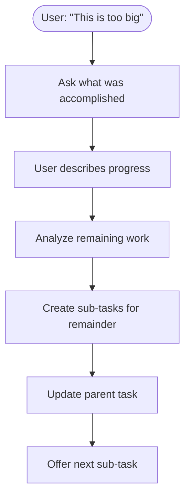
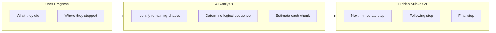
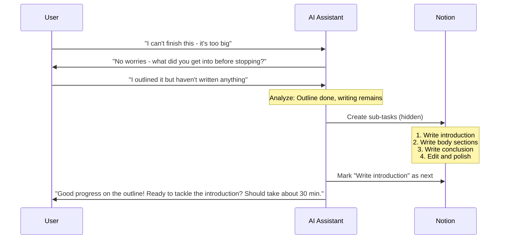

# Cannot Finish Handling

Assumes you've already read `docs/ai-prompts/shared.md` for the base prompt, shame-prevention templates, user preferences context, and output handling.

## Module 5: Cannot Finish Handling

When user indicates they cannot finish a task, understand what was accomplished and break down what remains.



### Cannot Finish Prompt

```
The user indicates they cannot finish the current task. Gather progress and break down remaining work.

CURRENT TASK: {task_title}
ORIGINAL TIME ESTIMATE: {time_estimate} minutes
USER MESSAGE: "{user_message}"

STEP 1: Ask what was accomplished
Generate a brief, friendly question to understand their progress.

STEP 2: Once progress is described, analyze remaining work
- What did the user complete?
- What specific work remains?
- How can remaining work be broken into 15-90 minute chunks?

STEP 3: Create sub-tasks for remaining work
- Each sub-task must be specific and actionable
- First sub-task should be the immediate next step
- Sub-tasks are HIDDEN from user

OUTPUT (JSON):
{
  "phase": "ask_progress" | "analyze_remaining",
  "user_message": "...",
  "progress_question": "..." (if phase=ask_progress),
  "completed_portion": "..." (if phase=analyze_remaining),
  "remaining_sub_tasks": [
    {
      "title": "...",
      "time_estimate_minutes": 0,
      "sequence": 1
    }
  ] (if phase=analyze_remaining),
  "next_sub_task_message": "..." (offer first remaining sub-task)
}
```

### Progress Question Templates (Shame-Safe)

> **Shame Prevention:** "Cannot finish" = second highest shame-risk moment. User says they couldn't do something — lead with progress acknowledgment, never with what's left undone. Reframe as learning task's real size.

| Scenario | Question |
|----------|----------|
| Just started | "No worries — you figured out it's bigger than it seemed. What did you get into?" |
| Partially done | "Got it — you made real progress. What part did you get through?" |
| Stuck | "That's totally fine — now we know more about this task. Where'd you get to?" |
| Overwhelmed | "Totally understand — this clearly needed to be broken down more. Tell me what you accomplished." |

### Remaining Work Analysis



### Cannot Finish Response Flow



### Sub-task Creation Rules

| Original Task Type | Typical Breakdown Pattern |
|-------------------|---------------------------|
| Writing task | Outline → Sections → Edit → Finalize |
| Research task | Define scope → Gather sources → Analyze → Summarize |
| Planning task | Requirements → Options → Decision → Documentation |
| Coding task | Design → Implement → Test → Refactor |
| Creative task | Brainstorm → Draft → Iterate → Polish |

**Key Principle:** CANNOT_FINISH signals original breakdown left tasks too large. New breakdown should create smaller, more achievable chunks.


---

See also:
- `docs/ai-prompts/shared.md` — shame-prevention base, base prompt
- `docs/ai-prompts/intake.md` — sub-task creation rules
