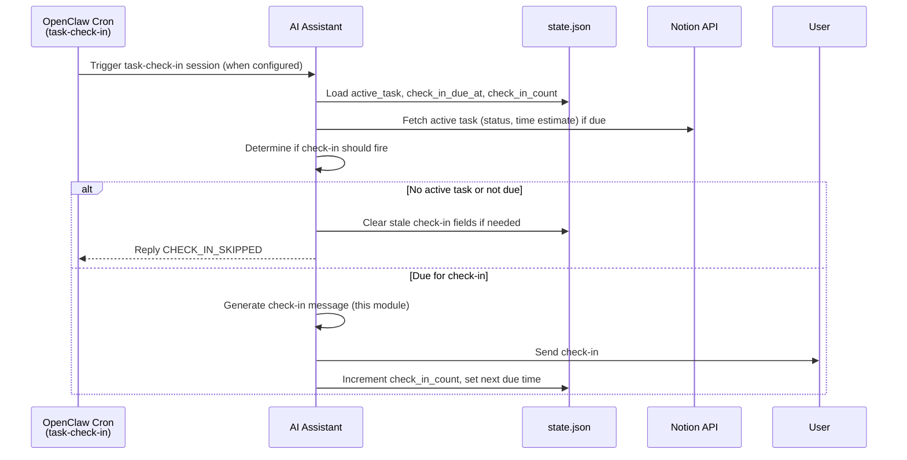
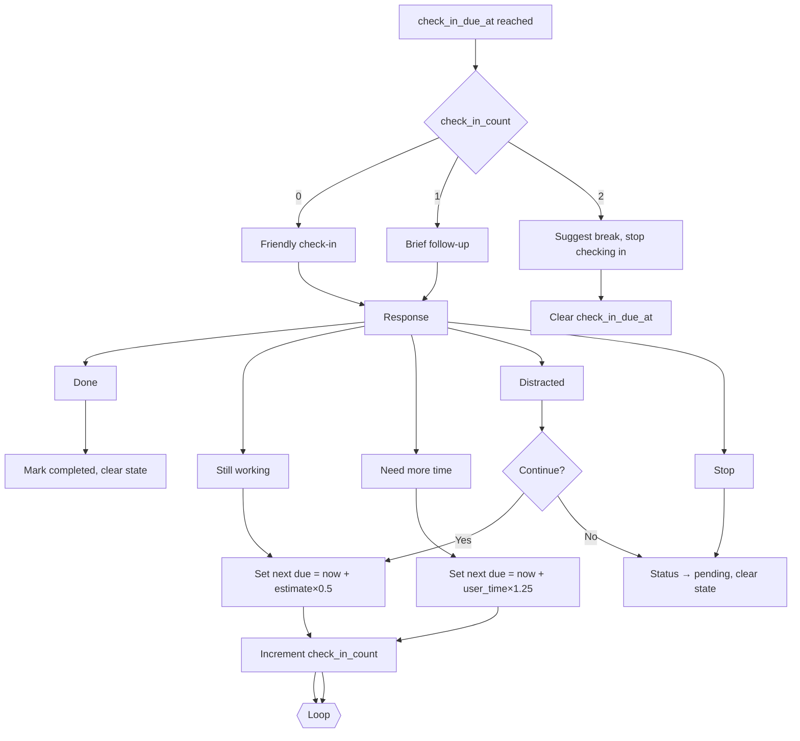

# Check-In Handling

Assumes you've already read `docs/ai-prompts/shared.md` for the base prompt, shame-prevention templates, user preferences context, and output handling.

## Module 6: Check-In Handling

Check-in module designed for OpenClaw's durable cron job `task-check-in`, which wakes agent to confirm progress on active task. No frontend timer. Timing tracked in `state.json` and Notion. If cron not configured, skip module.



### Runtime Data

When user accepts task:
- Update Notion `Started At` to current timestamp.
- Write to `state.json.active_task`:
  - `id`, `title`, `time_estimate`, `energy`
  - `started_at` (ISO 8601, UTC)
  - `check_in_due_at` = `started_at + time_estimate × 1.25`
  - `check_in_count` = 0
- Set `conversation_state = "active"`.

**When configured:** run `task-check-in` cron every 5 minutes. Each invocation:
1. Load `state.json.active_task`. If empty, exit.
2. If task status in Notion no longer `In Progress`, clear active task and exit.
3. If `now < check_in_due_at`, exit (no ping yet).
4. Otherwise, set `conversation_state = "checking_in"` and call this module.

### Check-In Prompt

```
The user accepted a task but the expected completion time has passed.
Check in on their progress.

ACTIVE TASK: {task_title}
TIME ESTIMATE: {time_estimate} minutes
TIME ELAPSED: {elapsed_minutes} minutes
TASK CONTEXT: {ai_context}

Generate a brief, friendly check-in message. Keep it casual and non-judgmental.
The user may have:
- Completed the task and forgot to say so
- Still be working on it
- Gotten distracted
- Needed more time than estimated

OUTPUT (JSON):
{
  "check_in_message": "..." (brief, friendly follow-up question)
}
```

### Check-In Response Prompt

```
The user responded to a check-in about their active task.

TASK: {task_title}
USER RESPONSE: "{user_response}"

Classify the response and determine next action.

RESPONSE CATEGORIES:
- done: User completed the task
- still_working: User is still actively working
- distracted: User got sidetracked
- need_more_time: User needs additional time
- abandoned: User wants to stop working on this task

OUTPUT (JSON):
{
  "response_category": "...",
  "task_update": {
    "status": "in_progress" | "completed" | "pending",
    "note": "..." (optional note to append)
  },
  "schedule_follow_up": true | false,
  "follow_up_minutes": null | number,
  "user_message": "..." (response to user)
}
```

### Check-In Message Templates (Shame-Safe)

> **Shame Prevention:** Check-ins = potential shame trigger — user may feel caught for not finishing on time. Keep check-ins curious and warm, never supervisory. Tone: "friend checking in," not "manager following up."

| Scenario | Example Message |
|----------|-----------------|
| First check-in | "How's the quarterly report going? Still at it?" |
| User says done | "Nice! Marking that off. Ready for another?" |
| User still working | "No rush — keep at it! I'll check back in a bit." |
| User got distracted | "Happens to literally everyone. Want to jump back in, or try something else?" |
| User needs more time | "No problem — time estimates are just guesses anyway. About how much longer?" |
| User abandons | "Totally fine — I'll keep it for later. No pressure. What sounds good now?" |

### Check-In Timing

Store all timings in UTC:

| Event | How to calculate | Where stored |
|-------|------------------|--------------|
| First check-in | `started_at + (time_estimate_minutes × 1.25)` | `state.json.active_task.check_in_due_at` |
| Second check-in | `now + (time_estimate_minutes × 0.5)` | overwrite `check_in_due_at` |
| Third check-in | `now + (time_estimate_minutes × 0.25)` | overwrite `check_in_due_at` |

Examples (45 min estimate):
- Start at 14:00 → first check-in at 14:56 UTC
- User still working → second at 15:23 UTC
- Still working again → final at 15:34 UTC

### Repeated Check-Ins

Use `state.json.active_task.check_in_count` to control intensity:



If `check_in_count` reaches 3 without completion, clear `check_in_due_at` and deliver "take a break" message. Further follow-ups require user to re-accept task.

### State Updates After Each Check-In

| Scenario | Required updates |
|----------|------------------|
| Task completed | Update Notion status → `completed`; clear `active_task` from `state.json`; reset `conversation_state = "idle"` |
| Still working | Increment `check_in_count`; set new `check_in_due_at`; keep `conversation_state = "active"` |
| Needs more time | Same as still working but use user-specified duration |
| Distracted but recommits | Increment `check_in_count`; set new due at 0.5× |
| Distracted and stops | Return task to queue (`pending`), clear `active_task`, reset state |
| Wants to abandon | Same as above |

### Exiting Without Action

If cron fires and no check-in due (no active task, already completed, or window not reached), respond `CHECK_IN_SKIPPED` in session log and ensure `conversation_state` returns to `idle`. Prevents false positives, keeps cron idempotent.


---

See also:
- `docs/ai-prompts/shared.md` — shame-prevention base, base prompt
