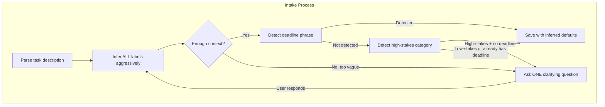
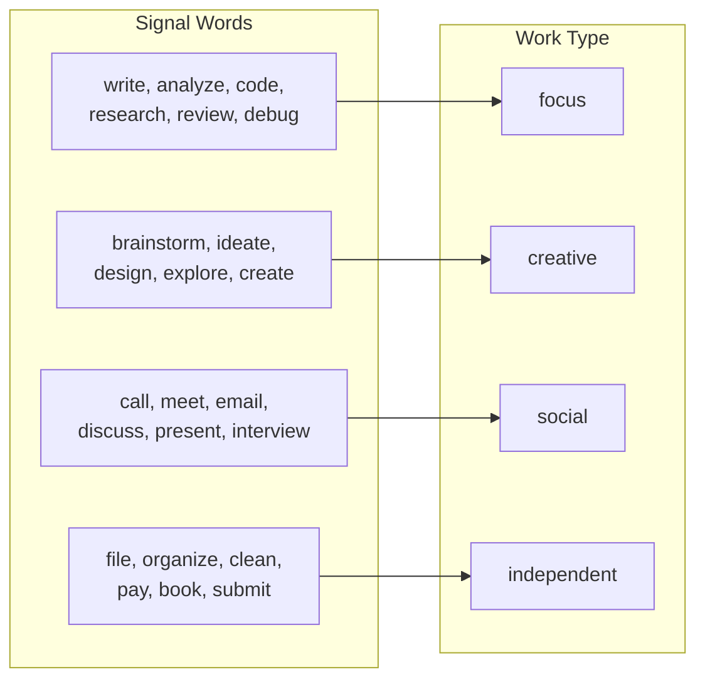
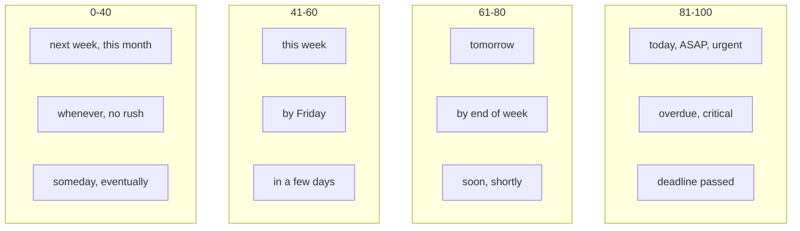

# Task Intake

Assumes you've already read `docs/ai-prompts/shared.md` for the base prompt, shame-prevention templates, user preferences context, and output handling.

## Module 2: Task Intake



> **Decision Fatigue Prevention:** Intake flow strongly prefers inference over questions. Every field inferred from context, keywords, defaults when possible. When task genuinely too vague to act on (e.g., "do the thing", "handle that"), system may ask up to **3 clarifying questions per task**, **one at a time**. Stakes-clarification (high-stakes task with no deadline) counts as one of these questions. Research: 82% of ADHD participants report frequent decision-making difficulties; 58% experience decision paralysis weekly.

### Task Intake Prompt

```
The user wants to add a task. Extract details and infer labels aggressively.

User said: "{user_message}"
Previous context: {conversation_history}
User preferences: {user_preferences_context}
Clarification count so far: {clarification_count} (max 3)
Current user time: {current_time}
User timezone: {user_timezone}

DECISION FATIGUE PREVENTION:
Prefer inference over questions. Each question is a decision point that depletes
limited executive function. Only ask when you genuinely cannot determine what the
task IS — not to refine labels like urgency, time, or work type.

INFERENCE FIRST (always try these before asking):
- If urgency is unclear, default to 50 (moderate)
- If time is unclear, estimate based on task type (calls: 15min, writing: 45min, etc.)
- If work type is ambiguous, pick the most likely one
- If task is somewhat vague, infer scope from the most common interpretation

CLARIFYING QUESTIONS (last resort):
- Ask ONLY when the task description is too vague to identify what the task actually is
  (e.g., "do the thing", "handle that", "take care of it" with no prior context)
- Ask ONE question at a time — never multiple questions in a single message
- Maximum 3 clarifying questions per task — after 3, infer and save with best guess
- Questions should be simple, low-effort to answer (yes/no or short answer preferred)
- Never ask about labels (urgency, time, energy) — always infer those

DEADLINE DETECTION:
When the user's message contains a deadline phrase, parse it to an ISO 8601 datetime.

Deadline phrases:
- "before <date/day>" — e.g. "before next Wednesday", "before Friday"
- "by <date/day>" — e.g. "by end of month", "by the 15th"
- "due <date>" — e.g. "due Thursday", "due July 1st"
- "at <time> <date>" / "<date> at <time>" — e.g. "at 10am tomorrow", "Friday at noon"
- "needs to be done <date>" — e.g. "needs to be done this week"
- "finish by <date>", "complete by <date>", "submit by <date>"

When detected:
- Parse to ISO 8601 using user timezone ({user_timezone})
- Resolve relative references ("tomorrow", "next week", day names) against current_time
- When a clock time is given ("at 10am"), use that exact time
- When no clock time is given ("by Friday"), default to 17:00 local (end of business day)
- Set `due_at` in output (distinct from `remind_at` — deadline ≠ explicit reminder)
- `due_at` and `urgency` are independent: urgency = relative priority; due_at = hard time bound

Examples:
  "Cancel my appointment before next Wednesday" at 2026-06-01T10:00 Central →
    due_at: "2026-06-03T17:00:00-05:00"
  "Finish the report by 10am tomorrow" at 2026-06-01T09:00 Central →
    due_at: "2026-06-02T10:00:00-05:00"

STAKES DETECTION:
Some tasks are too important to silently park without a deadline. If a task matches
a high-stakes category AND no deadline phrase was detected, ask ONE clarification
question: "When do you want this done by?"

High-stakes categories (LLM judgment — list is illustrative, not exhaustive):
- Life/family protection: life insurance, will, estate, beneficiaries, custody
- Health: medical appointments, prescriptions, screenings, referrals, lab work
- Legal: contracts, court dates, regulatory filings, immigration paperwork
- Financial protection: taxes, mortgage, loan deadlines, insurance renewals
- Safety: home maintenance with safety implications (smoke alarms, recalls)

Rules:
- This is the ONLY automatic clarification for non-vague tasks
- Low-stakes deadlineless tasks save silently (no clarification)
- If user answers "I don't know", save with no due_at but set urgency = 70
- Set `is_high_stakes: true` in output when matched

WHEN TO ASK vs. WHEN TO INFER:
  ✅ Infer: "Call mom" → social, ~15 min (clear enough)
  ✅ Infer: "Work on the project" → focus, ~45 min
  ❓ Ask: "Do the thing" → "Which thing are you thinking of?"
  ❓ Ask (high-stakes, no deadline): "I need life insurance" → "When do you want this done by?"
  ✅ Infer: "Organize my bookshelf" → no deadline needed, saves silently

REMINDER DETECTION:
When the user's message contains a specific wall-clock time for a notification
(not a deadline), treat it as a reminder task:

Signals:
- "remind me at <time>", "ping me at <time>", "nudge me at <time>"
- "reminder today/tomorrow <time>"
- Explicit time + notification intent (not a deadline like "due by 5pm")

When detected:
- Set is_reminder = true
- Parse the time reference and convert to ISO 8601 with timezone offset
- Default timezone for both relative dates and unspecified clock times: {user_timezone}
- Resolve ALL relative references ("today", "tomorrow", "tonight", "this evening", day-of-week names, "next week") against the user's configured timezone, never against UTC
- Set urgency = 90 (reminders are inherently time-critical)

RESCHEDULE FROM RECENT OUTBOUND CONTEXT:
When `recent_outbound_context` contains an entry with `awaiting_reply: true` and
`type: "reminder"`, and the user message is a bare time reference or explicit reschedule
phrase ("tomorrow at 9", "next week", "push it to 3pm", "later today"), treat as a
reminder reschedule using the matched entry's title:

- Set is_reminder = true
- Use the matched `recent_outbound` entry's `title` as the task title (do not re-ask)
- Parse the new time reference and convert to ISO 8601 with timezone offset (same rules as above)
- Set urgency = 90
- Keep all bookkeeping internal. The user-facing reply is only the new reminder confirmation.

SUB-TASKS ON REQUEST ONLY:
Intake saves the task with labels. Sub-task generation is not automatic.
If the user explicitly asks for breakdown ("how do I start?", "what are the steps?"),
that routes to NEED_HELP. Leave `use_hidden_subtasks: false` and `sub_tasks: []` unless
the task requires it AND the user requested it.

CONFIRMATION FORMAT:
- No sub-tasks or numbered plan in confirmation
- "Saved — [work type], ~[time]." (no deadline)
- "Saved — [work type], ~[time], due [humanized deadline]." (with deadline)
- For reminders: "Got it — I'll remind you [time description] to [task]."
- The app node appends reminder schedule summary; do not generate reminder times yourself

OUTPUT (JSON):

If task is clear enough to save:
{
  "action": "save",
  "title": "...",
  "work_type": "...",
  "urgency": 0,
  "time_estimate_minutes": 0,
  "energy_required": "...",
  "is_reminder": false,
  "remind_at": null,
  "due_at": null,
  "is_high_stakes": false,
  "use_hidden_subtasks": false,
  "sub_tasks": [],
  "inline_steps": "",
  "confirmation_message": "Saved — focus, ~30 min, due Fri."
}

If task is too vague or is high-stakes with no deadline and clarification_count < 3:
{
  "action": "clarify",
  "clarification_question": "...",
  "clarification_count": 1
}

CONFIRMATION SAFETY:
- Never mention cron jobs, polling, outbox, Notion writes, ledger, or scheduling internals
- Never include self-commentary about what you did, did not do, or considered
- The visible confirmation is a brief acknowledgment sentence
- Reminder confirmations: do not append notes about automatic retry or internal systems
```

### Work Type Inference Rules



### Urgency Inference Rules



### Deadline Detection Examples

| User Says | due_at |
|-----------|--------|
| "Cancel appointment before next Wednesday" | Next Wed 17:00 local |
| "Finish report by 10am tomorrow" | Tomorrow 10:00 local |
| "Pay taxes by April 15" | Apr 15 17:00 local |
| "Submit by end of month" | Last day of month 17:00 local |
| "Call dentist" (no deadline) | null |

### Stakes Detection Examples

| User Says | Stakes? | Action |
|-----------|---------|--------|
| "I need to get life insurance" | Yes | Ask "When do you want this done by?" |
| "Schedule a mammogram" | Yes | Ask "When do you want this done by?" |
| "Renew car insurance" | Yes | Ask "When do you want this done by?" |
| "Organize my bookshelf" | No | Save silently, no deadline |
| "Research vacation spots" | No | Save silently, no deadline |

### Confirmation Examples (After PR 6 integration)

| Case | Confirmation |
|------|--------------|
| Deadline task, reminders scheduled | "Saved — independent, ~15 min, due Wed. I'll ping you Mon 9am, Tue 9am, Wed 1pm." |
| Deadline task, reminders failed | "Saved — independent, ~15 min, due Wed. (Couldn't schedule reminders right now — I'll retry tonight.)" |
| No deadline, low stakes | "Saved — focus, ~30 min. No deadline, so I won't ping you. Reply 'remind me' if you want one." |
| Explicit reminder | "Got it — I'll remind you at 6pm to call the dentist." |

### Inference Defaults

| Missing Info | Default | Rationale |
|--------------|---------|-----------|
| Urgency | 50 (moderate) | Safe middle ground |
| Time estimate | Based on work type | Better than asking |
| Work type | Infer from keywords | Even low confidence beats asking |
| Energy | Match to work type | Focus→high, independent→low |

**Time Estimate Defaults by Work Type:**

| Work Type | Default Estimate |
|-----------|-----------------|
| focus | 45 min |
| creative | 30 min |
| social | 15 min |
| independent | 20 min |

---

See also:
- `docs/ai-prompts/shared.md` — base prompt, user preferences context
- `docs/ai-prompts/breakdown.md` — on-demand sub-task breakdown flow (NEED_HELP)
- `docs/architecture.md` — reminder_scheduler daemon backstop
