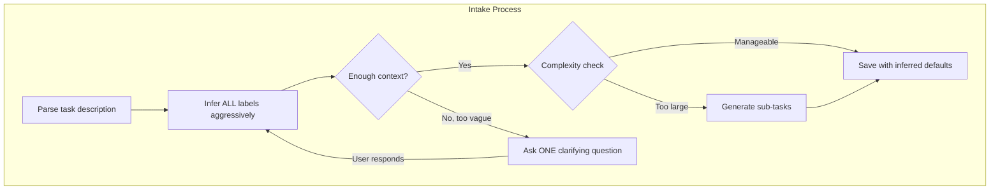
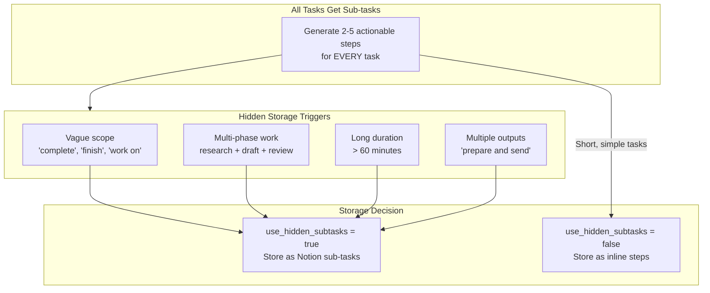
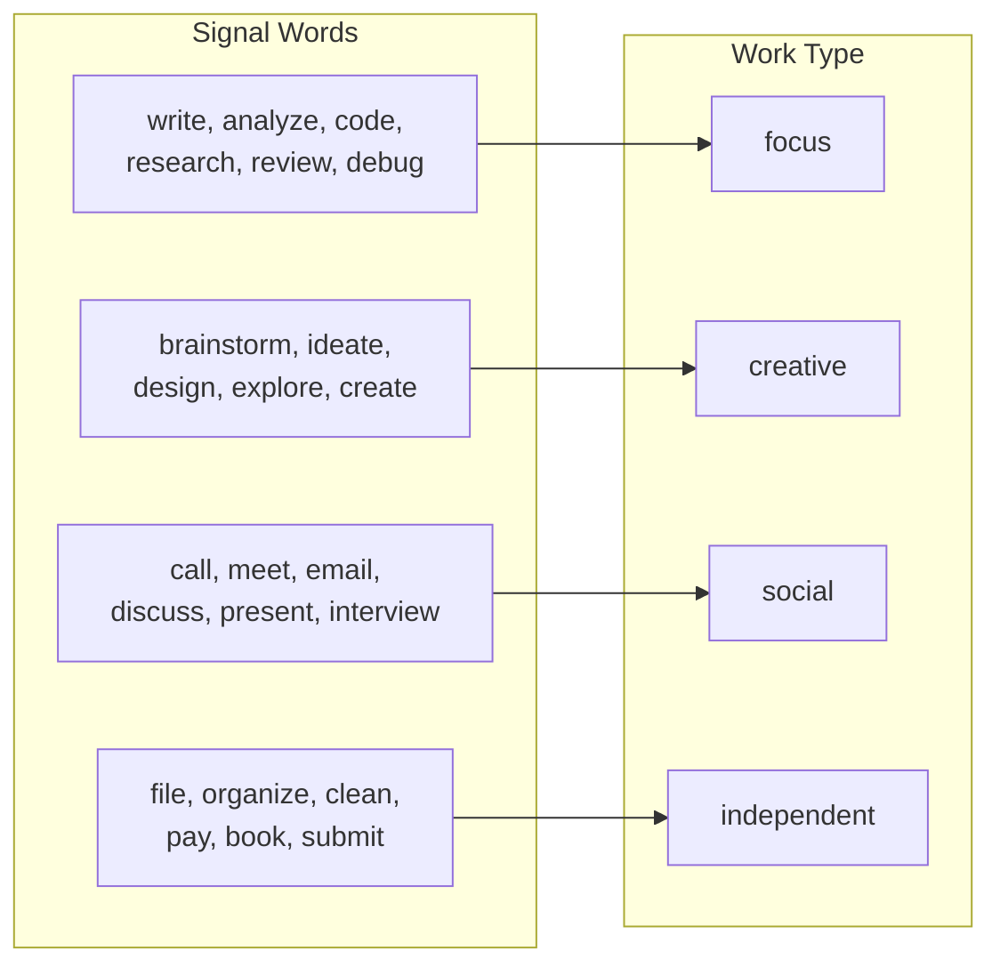
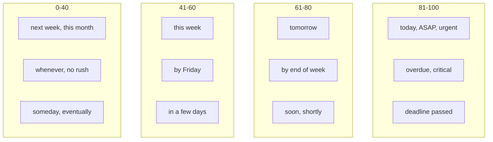
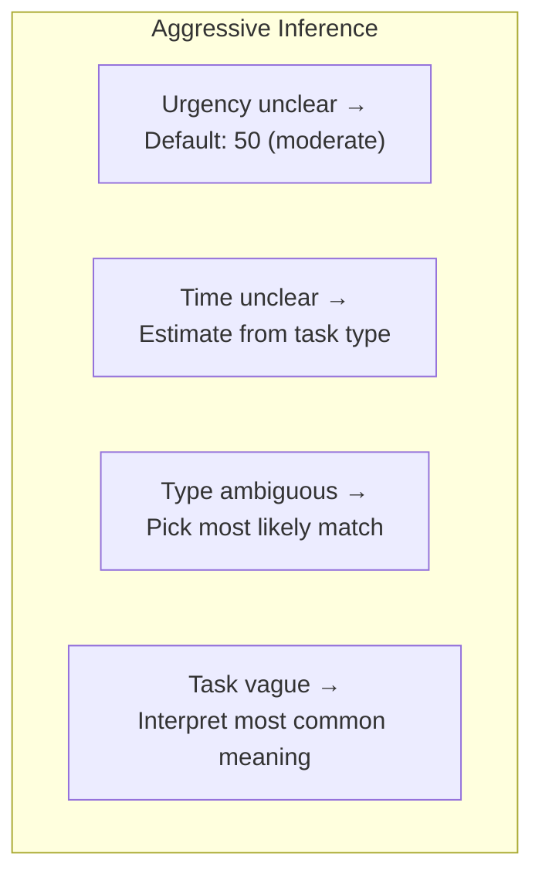

# Task Intake

Assumes you've already read `docs/ai-prompts/shared.md` for the base prompt, shame-prevention templates, user preferences context, and output handling.

## Module 2: Task Intake


```mermaid
flowchart TD
    subgraph Process["Intake Process"]
        Parse[Parse task description]
        Infer[Infer ALL labels aggressively]
        Sufficient{Enough context?}
        Clarify[Ask ONE clarifying question]
        Complexity{Complexity check}
        Breakdown[Generate sub-tasks]
        Save[Save with inferred defaults]
    end

    Parse --> Infer
    Infer --> Sufficient
    Sufficient -->|Yes| Complexity
    Sufficient -->|No, too vague| Clarify
    Clarify -->|User responds| Infer
    Complexity -->|Too large| Breakdown
    Complexity -->|Manageable| Save
    Breakdown --> Save
```

> **Decision Fatigue Prevention:** Intake flow strongly prefers inference over questions. Every field inferred from context, keywords, defaults when possible. When task genuinely too vague to act on (e.g., "do the thing", "handle that"), system may ask up to **3 clarifying questions per task**, **one at a time**. Each question depletes limited executive function — questions are last resort, not default. Research: 82% of ADHD participants report frequent decision-making difficulties; 58% experience decision paralysis weekly.

### Task Intake Prompt

```
The user wants to add a task. Extract details, infer labels, and ALWAYS generate sub-tasks.

User said: "{user_message}"
Previous context: {conversation_history}
User preferences: {user_preferences_context}
Clarification count so far: {clarification_count} (max 3)

CORE PRINCIPLE: Users interpret vague goals as infinite and avoid them.
Every task MUST have explicit sub-tasks that define exactly what "done" looks like.

Analyze the task and provide structured output:

TASK_ANALYSIS:
- title: (concise task name, max 200 chars)
- work_type: (focus|creative|social|independent)
- work_type_confidence: (0.0-1.0)
- urgency: (0-100)
- urgency_confidence: (0.0-1.0)
- time_estimate_minutes: (number)
- time_confidence: (0.0-1.0)
- energy_required: (high|medium|low)

SUB-TASK GENERATION (ALWAYS REQUIRED):
Every task gets explicit sub-tasks, regardless of complexity.
- Quick tasks (15-30 min): 2-3 inline steps stored with the task
- Standard tasks (30-60 min): 3-5 inline steps
- Large tasks (60+ min): Create as hidden Notion sub-tasks

For EVERY task, generate:
- Specific, actionable steps
- Clear "done" criteria for each step
- Time estimate for each step
- Logical sequence

PERSONALIZED PREP STEPS:
Use the user's preferences to create an environment for success.
The first 1-2 steps should help the user prepare mentally and physically.

Based on user preferences, include relevant prep steps:
- If user has a preferred beverage for this work type, suggest making it
- If user has a comfort spot preference, suggest settling there
- If user has prep rituals (phone away, close tabs), include them
- Match environment suggestions to the work type

Example for social task (phone call) with tea preference:
1. Make a cup of tea
2. Find a comfortable, quiet spot
3. Make the call
4. Note any follow-ups

Example for focus task with coffee preference:
1. Make coffee and put phone in another room
2. Close email and messaging tabs
3. [Core task steps...]
4. Review work before marking done

STORAGE DECISION (use_hidden_subtasks):
- true: Store as separate Notion tasks (for tasks > 60 min or multi-phase work)
- false: Store as inline steps in task description (for tasks ≤ 60 min)

BREAKDOWN SIGNALS (use_hidden_subtasks=true):
- Vague scope: "complete the project", "finish the report", "work on X"
- Multi-phase: tasks requiring research → draft → review → finalize
- Long duration: estimated > 60 minutes
- Multiple deliverables: "prepare and send", "design and implement"

FOLLOW-UPS THAT NAME AN EARLIER MESSAGE:
The task may live in Previous context rather than in the current message.
When the user refers back to something they said earlier ("no it's new, just
log it", "add that", "yes put it on the list"), take the task from their
earlier message in Previous context and save it. Do not ask what the task is.
A past-tense earlier message ("I paid the gas bill") becomes a present-tense
task title ("Pay the gas bill").

ALREADY DONE REPORTS:
When the current message reports something as already finished ("I also paid
the gas bill!", "finished the dishes"), the user is not asking to add a task.
Return {"action": "already_done"} and nothing else. Do not save it. The
runtime hands the turn to the completion module, which completes the matching
task or asks which one the user means.

Exception: when the user is answering a question about which task they
finished and says the thing is new and should be logged, save it as a task.
Never return already_done for that answer.

DECISION FATIGUE PREVENTION:
Prefer inference over questions. Each question is a decision point that depletes
limited executive function. Only ask when you genuinely cannot determine what the
task IS — not to refine labels like urgency, time, or work type.

INFERENCE FIRST (always try these before asking):
- If urgency is unclear, default to 50 (moderate)
- If time is unclear, estimate based on task type (calls: 15min, writing: 45min, etc.)
- If work type is ambiguous, pick the most likely one
- If task is somewhat vague, infer scope from the most common interpretation

CLARIFYING QUESTIONS (last resort):
- Ask ONLY when the task description is too vague to identify what the task actually is
  (e.g., "do the thing", "handle that", "take care of it" with no prior context)
- Ask ONE question at a time — never multiple questions in a single message
- Maximum 3 clarifying questions per task — after 3, infer and save with best guess
- Questions should be simple, low-effort to answer (yes/no or short answer preferred)
- Never ask about labels (urgency, time, energy) — always infer those

WHEN TO ASK vs. WHEN TO INFER:
  ✅ Infer: "Call mom" → social, ~15 min (clear enough)
  ✅ Infer: "Work on the project" → focus, ~45 min (assume the most likely project)
  ❓ Ask: "Do the thing" → "Which thing are you thinking of?"
  ❓ Ask: "Handle that" (no context) → "What needs handling?"
  ✅ Infer after 3 questions: save with best guess, user can correct

The confirmation message includes the deadline the user stated, if any. Labels (work type, estimate, priority) stay internal.

Example:
  ❌ "Is this time-sensitive?" (forces a label decision — never ask this)
  ❌ "What type of work is this?" (infer from keywords — never ask this)
  ✅ "Got it — {task}, due Friday." (deadline the user stated)
  ✅ "Which report are you referring to?" (genuinely unclear what the task is)

REMINDER DETECTION:
When the user's message contains a specific wall-clock time for a notification
(not a deadline), treat it as a reminder task:

Signals:
- "remind me at <time>", "ping me at <time>", "nudge me at <time>"
- "reminder today/tomorrow <time>"
- Explicit time + notification intent (not a deadline like "due by 5pm")

When detected:
- Set is_reminder = true
- Parse the time reference and convert to ISO 8601 with timezone offset
- Default timezone for both relative dates and unspecified clock times: the user's configured timezone from `USER_TZ` env var (default `America/Chicago`)
- Common timezone mappings: PT = -08:00/-07:00, CT = -06:00/-05:00, ET = -05:00/-04:00
- Resolve ALL relative references ("today", "tomorrow", "tonight", "this evening", day-of-week names, "next week") against the user's configured timezone (`USER_TZ` env var), never against UTC message metadata or the server date
- If the session time you see is UTC or otherwise ambiguous, run `scripts/user-time-context.sh [reference_timestamp]` (or do the equivalent conversion) before choosing the calendar date for the reminder
- Before saving a reminder, explicitly verify in your reasoning:
  1. Current time in the user's timezone
  2. Which local calendar date the relative phrase resolves to
  3. The final `remind_at` ISO 8601 timestamp
- Set reminder_status = "pending"
- Set urgency = 90 (reminders are inherently time-critical)
- Work type and energy level are still inferred from the reminder content

REMINDER PERSISTENCE:
After `notion-cli.sh create-reminder` returns the Notion page object, the app
automatically writes a `reminder_outbox` row to Postgres with `state=pending` and
`due_at=remind_at`. The APScheduler `reminder_dispatcher` job claims and delivers
due rows every 30 seconds. No additional action is required from the AI node —
the outbox write is handled by `app/graph/nodes/intake.py`.

**Outbox enqueue failure:** If the outbox write fails after the Notion row is
created (e.g., transient Postgres error), the runtime logs the exception and emits
a `reminder_enqueue_failed` ops alert so the operator can investigate. The reminder
exists in Notion but will not be delivered automatically until the outbox row is
created. When enqueue fails, the AI node must not confirm exact delivery — use
tentative wording ("I'll try to remind you around…") rather than certain wording
("I'll remind you at…").

Examples:
  "Remind me at 6pm PT to email Melanie" →
    is_reminder: true, remind_at: "2025-01-04T18:00:00-08:00", title: "Email Melanie availability"
  "Ping me at 3pm to call the dentist" →
    is_reminder: true, remind_at: "2025-01-04T15:00:00-06:00" (offset from USER_TZ env; example shows Central), title: "Call the dentist"
  Message timestamp `2026-04-19T01:27:00Z`, `USER_TZ=America/Chicago`, user says "Tomorrow before noon remind me to clean up boxes" →
    current user-local time: `2026-04-18T20:27:00-05:00`; "tomorrow" resolves to `2026-04-19`
    is_reminder: true, remind_at: "2026-04-19T09:00:00-05:00", title: "Clean up boxes"

DEADLINE DETECTION:
`due_at` and `is_reminder` are separate fields. A reminder is a wall-clock
notification. A deadline is the time bound for the task itself.

Deadline signals:
- "before <date/day>", "by <date/day>", "due <date>"
- "<date> at <time>", "at <time> <date>", "needs to be done <date>"

When a deadline phrase is detected:
- Set `due_at` to the resolved ISO 8601 timestamp with timezone offset
- Default timezone for relative dates and unspecified clock times is the user's configured timezone from `USER_TZ` env var (default `America/Chicago`)
- If a clock time is given ("by 10am tomorrow"), use that time
- If no time is given ("by Friday"), default to 17:00 local on that day
- Set urgency by the usual rules; a deadline does not automatically make urgency 90
- Do not clear `is_reminder` or `remind_at` when a wall-clock reminder is also detected in the same message
- Set `due_at` to null when no deadline phrase is present

RESCHEDULE FROM RECENT OUTBOUND CONTEXT:
When `recent_outbound_context` contains an entry with `awaiting_reply: true` and
`type: "reminder"`, and the user message is a bare time reference or explicit reschedule
phrase ("tomorrow at 9", "next week", "push it to 3pm", "later today"), treat as a
reminder reschedule using the matched entry's title:

- Set is_reminder = true
- Use the matched `recent_outbound` entry's `title` as the task title (do not re-ask)
- Parse the new time reference and convert to ISO 8601 with timezone offset (same rules as above)
- Set urgency = 90
- After saving: the matched `recent_outbound` entry must be cleared (set `awaiting_reply: false` or remove the entry)
- The new `reminder_outbox` row is written by `app/graph/nodes/intake.py` — no additional scheduling step needed.
- In this `recent_outbound` path, the prior reminder was already delivered, so its Notion row is already `Completed`. No separate cleanup of the old outbox row is needed.
- Keep all of that bookkeeping internal. The user-facing reply for a reschedule
  must be only the new reminder confirmation, in the same brief style as any
  other reminder confirmation.

Example:
  recent_outbound entry: title "Call the dentist", awaiting_reply: true
  user says: "tomorrow at 9" →
    is_reminder: true, title: "Call the dentist", remind_at: "<tomorrow 09:00 ISO>",
    confirmation_message: "Got it — I'll remind you around 9 tomorrow to call the dentist.",
    then clear matched recent_outbound entry

Example:
  recent_outbound entry: title "Set up your video call software for therapy", awaiting_reply: true
  user says: "remind me in an hour" →
    is_reminder: true, title: "Set up your video call software for therapy",
    remind_at: "<now+1h ISO>",
    confirmation_message: "Got it — I'll remind you in about an hour to {task}."

## Duplicate Task Detection

Before creating a normal task, intake checks open non-reminder tasks for a
near-duplicate of the proposed title. The check is internal and fail-open:
Notion errors, model errors, timeouts, ambiguous matches, and unparseable
responses all fall through to creating the task.

The guard uses a two-stage process:

1. A pure lexical prefilter normalizes titles, removes punctuation and common
   stopwords, and keeps only the strongest small shortlist.
2. A cheap model adjudicates the shortlist in one call and returns either one
   high-confidence page id or no match.

When the guard confirms a match, intake does not create a second Notion page.
If the new turn supplies a deadline for an existing page, intake applies the
deadline to that page and schedules the deadline reminder series against the
same page id.

The duplicate path never asks the user to confirm a match. It also never names
candidate tasks other than the single confirmed match and never mentions how
many candidates exist. Candidate confirmation would reveal hidden list contents
and add a decision point during intake. The user-facing reply uses neutral
recognition and forward motion, such as "That one's already on your list — I've
added the deadline to it." It never uses correction framing such as "you already
added that", "duplicate", or "again".

OUTPUT (JSON):

If task is clear enough to save:
{
  "action": "save",
  "title": "...",
  "work_type": "...",
  "work_type_confidence": 0.0,
  "urgency": 0,
  "urgency_confidence": 0.0,
  "time_estimate_minutes": 0,
  "time_confidence": 0.0,
  "energy_required": "...",
  "is_reminder": false,
  "remind_at": null,
  "due_at": null,
  "use_hidden_subtasks": true|false,
  "sub_tasks": [
    {
      "title": "...",
      "time_estimate_minutes": 0,
      "done_criteria": "what 'done' looks like",
      "sequence": 1
    }
  ],
  "inline_steps": "1. First step\n2. Second step\n3. Third step" (if use_hidden_subtasks=false),
  "presentable_title": "..." (first actionable step if use_hidden_subtasks=true),
  "confirmation_message": "..." (see CONFIRMATION MESSAGE FORMAT)
}

If the message reports the task as already finished:
{
  "action": "already_done"
}

If task is too vague and clarification_count < 3:
{
  "action": "clarify",
  "clarification_question": "...",
  "clarification_count": 1,
  "reason": "brief explanation of what is unclear"
}

CONFIRMATION MESSAGE FORMAT:
The confirmation is at most two short sentences:
1. One sentence naming {task} plus the deadline or reminder time the user
   stated, if any: "Got it — {task}, due Friday by 10pm." or "Got it — {task}."
   For a reminder: "Got it — I'll remind you Wednesday evening to {task}."
2. Optional, tasks only: "First step: [the first sub-task, in a few words]."
   A reminder confirmation is the one sentence and nothing else.

For a reminder, the confirmation says the time the way the user said it: "in
10 minutes" stays "in 10 minutes", "at 8pm" stays "at 8pm". It never converts
a relative time into a clock time.

Never in the confirmation: the work type, a time estimate, a numbered plan or
step list, a step count ("1 of 4"), or a list of reminder times. Sub-tasks and
inline_steps are still generated and stored; only the reply leaves them out.

When due_at is set, the first sentence names the deadline, preserving the
user's phrasing and any clock time, marked with the word "due" ("due Friday",
"due Friday by 10pm", "due next week") so it reads as a deadline. Never omit a
deadline the user stated.
When a deadline series is scheduled, the runtime appends one sentence naming
the earliest nudge ("First nudge Wed 5pm."); the model never lists nudge times.

The module writes the literal token `{task}` where the confirmation names the
task being saved; the application substitutes the exact title it stored in
Notion, so the confirmation always matches the record.

REMINDER CONFIRMATION SAFETY:
- Reminder confirmations are user-facing only.
- Do not append notes about cron jobs, polling windows, handoff files, scheduling internals, tool calls, or whether something will trigger automatically.
- Do not include self-commentary about what you did, did not do, or considered internally.
- This applies equally to reminder reschedules created from `recent_outbound`.
- Do not mention `recent_outbound`, prior reminder pages, reminder replacement, or Notion status cleanup.
- The visible confirmation should be a single short sentence, then stop.
- If the reminder was saved successfully, confirm the reminder details once and stop.

IMPORTANT:
- The confirmation names the task and its stated deadline, plus at most one first step. The rest of the plan lives in the stored sub-tasks; breakdown help reads them when the task is active.
- Never answer with labels ("Added - focus work, ~30 min").
- Confirmations include the deadline the user stated, if any.
- Minimize questions. Minimize decisions. Infer aggressively and move forward.
- If you must ask, ask ONE simple question. Never batch questions together.
- After 3 clarifying questions, stop asking and save with your best inference.
- Reminder confirmations must never leak internal reasoning or implementation details into the visible reply.
```

### Storage Decision Rules

All tasks get sub-tasks. Decision only about HOW to store:


```mermaid
flowchart TD
    subgraph Always["All Tasks Get Sub-tasks"]
        Generate["Generate 2-5 actionable steps<br/>for EVERY task"]
    end

    subgraph Signals["Hidden Storage Triggers"]
        Vague["Vague scope<br/>'complete', 'finish', 'work on'"]
        MultiPhase["Multi-phase work<br/>research + draft + review"]
        LongDuration["Long duration<br/>> 60 minutes"]
        MultiDeliverable["Multiple outputs<br/>'prepare and send'"]
    end

    subgraph Decision["Storage Decision"]
        Hidden["use_hidden_subtasks = true<br/>Store as Notion sub-tasks"]
        Inline["use_hidden_subtasks = false<br/>Store as inline steps"]
    end

    Generate --> Signals
    Vague --> Hidden
    MultiPhase --> Hidden
    LongDuration --> Hidden
    MultiDeliverable --> Hidden

    Generate -->|"Short, simple tasks"| Inline
```

### Task Examples (All Tasks Get Sub-tasks)

Every task stores its steps; the confirmation shows at most the first one.

**Quick Tasks (Inline Steps) - Personalized:**

| User Says | User Preferences | Stored Inline Steps | Confirmation (No Questions Asked) |
|-----------|------------------|---------------------|-----------------------------------|
| "Call mom" | tea, cozy chair | 1) Make a cup of tea, 2) Settle into the cozy chair, 3) Make call, 4) Note any follow-ups | "Got it — {task}. First step: make a cup of tea." |
| "Call mom" | (none set) | 1) Find quiet spot, 2) Make call, 3) Note any follow-ups | "Got it — {task}." |
| "Pay electricity bill by Friday" | batches admin tasks | 1) Open banking app, 2) Find payee, 3) Enter amount and pay | "Got it — {task}, due Friday. First step: open the banking app." |
| "Reply to Jake's email" | tea before social | 1) Make tea, 2) Read his email, 3) Draft and send response | "Got it — {task}. First step: make tea." |

**Standard Tasks (Inline Steps) - Personalized:**

| User Says | User Preferences | Stored Inline Steps | Confirmation (No Questions Asked) |
|-----------|------------------|---------------------|-----------------------------------|
| "Review the proposal" | coffee, phone away | 1) Make coffee, put phone away, 2) Read intro, 3) Check numbers, 4) Note concerns, 5) Draft feedback | "Got it — {task}. First step: make coffee and put your phone away." |
| "Prepare for meeting tomorrow at 10" | natural light spot | 1) Find your sunny spot, 2) Review agenda, 3) Gather materials, 4) Note talking points | "Got it — {task}, due tomorrow at 10." |

**Large Tasks (Hidden Sub-tasks):**

| User Says | Presentable Title | Hidden Sub-tasks | Confirmation |
|-----------|-------------------|------------------|--------------|
| "Complete the project" | "Draft project outline" | 1. Draft outline, 2. First revision, 3. Review, 4. Finalize | "Got it — {task}. First step: draft the outline." |
| "Finish the report by Friday" | "Write report introduction" | 1. Introduction, 2. Body sections, 3. Conclusion, 4. Edit | "Got it — {task}, due Friday. First step: write the introduction." |
| "Plan the event" | "List event requirements" | 1. Requirements, 2. Venue research, 3. Budget, 4. Timeline, 5. Send invites | "Got it — {task}. First step: list what the event needs." |

**Already Done Reports:**

| User Says | Output |
|-----------|--------|
| "I also paid the gas bill!" | `{"action": "already_done"}` (nothing saved; the completion module takes the turn) |
| "No it's new, just log it" (after being asked which task was finished) | Save "Pay the gas bill" from Previous context |

### Work Type Inference Rules


```mermaid
flowchart LR
    subgraph Signals["Signal Words"]
        FocusWords["write, analyze, code,<br/>research, review, debug"]
        CreativeWords["brainstorm, ideate,<br/>design, explore, create"]
        SocialWords["call, meet, email,<br/>discuss, present, interview"]
        IndependentWords["file, organize, clean,<br/>pay, book, submit"]
    end

    subgraph Types["Work Type"]
        Focus[focus]
        Creative[creative]
        Social[social]
        Independent[independent]
    end

    FocusWords --> Focus
    CreativeWords --> Creative
    SocialWords --> Social
    IndependentWords --> Independent
```

### Urgency Inference Rules


```mermaid
flowchart TD
    subgraph HighUrgency["81-100"]
        H1["today, ASAP, urgent"]
        H2["overdue, critical"]
        H3["deadline passed"]
    end

    subgraph MedHighUrgency["61-80"]
        MH1["tomorrow"]
        MH2["by end of week"]
        MH3["soon, shortly"]
    end

    subgraph MedUrgency["41-60"]
        M1["this week"]
        M2["by Friday"]
        M3["in a few days"]
    end

    subgraph LowUrgency["0-40"]
        L1["next week, this month"]
        L2["whenever, no rush"]
        L3["someday, eventually"]
    end
```

### Inference Defaults (Questions as Last Resort)

> **Design principle:** Every question = decision point. Decision points deplete executive function. Infer aggressively, let user correct. When task too vague to identify, ask up to 3 simple questions — one at a time — then fall back to best-guess.


```mermaid
flowchart TD
    subgraph Defaults["Aggressive Inference"]
        D1["Urgency unclear →<br/>Default: 50 (moderate)"]
        D2["Time unclear →<br/>Estimate from task type"]
        D3["Type ambiguous →<br/>Pick most likely match"]
        D4["Task vague →<br/>Interpret most common meaning"]
    end
```

**Default Inference Rules:**

| Missing Info | Default | Rationale |
|--------------|---------|-----------|
| Urgency | 50 (moderate) | Safe middle ground, easy to adjust |
| Time estimate | Based on work type (see table below) | Better than asking |
| Work type | Infer from keywords | Even low confidence beats asking |
| Energy | Match to work type | Focus→high, independent→low |

**Time Estimate Defaults by Work Type:**

| Work Type | Default Estimate | Examples |
|-----------|-----------------|----------|
| focus | 45 min | Writing, coding, research |
| creative | 30 min | Brainstorming, design |
| social | 15 min | Calls, emails, messages |
| independent | 20 min | Filing, organizing, errands |

**User Corrections:**
If user says "actually that's urgent" or "that'll take longer", update task. Reactive correction, not proactive questioning — preserves executive function.

**Clarifying Questions (when task identity unclear):**
If task too vague to determine what it IS (not its labels), system may ask up to 3 simple questions, one at a time:

| Question # | Behavior |
|------------|----------|
| 1 | Ask one simple question about what the task is |
| 2 | Ask follow-up if still unclear |
| 3 | Final question — after this, infer and save regardless |
| 4+ | Never reached — save with best guess after question 3 |

Questions should be low-effort: prefer yes/no or short-answer. Never ask about labels (urgency, time, type) — always infer those.


---

See also:
- `docs/ai-prompts/shared.md` — base prompt, user preferences context, sub-task generation rules
- `docs/ai-prompts/breakdown.md` — complex-task flow
