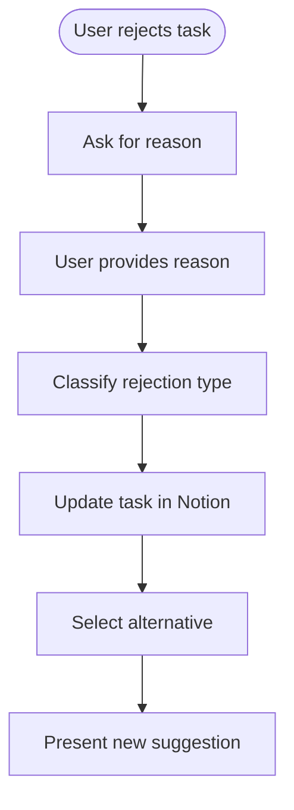
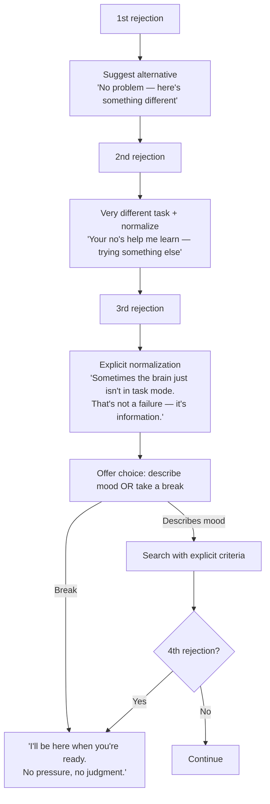

# Rejection Handling

Assumes you've already read `docs/ai-prompts/shared.md` for the base prompt, shame-prevention templates, user preferences context, and output handling.

## Module 4: Rejection Handling



### Rejection Handling Prompt

```
The user rejected the suggested task. Understand why and find an alternative.

REJECTED TASK: {task_title}
USER'S REASON: "{rejection_reason}"
REMAINING TASKS: {remaining_tasks_json}
USER CONTEXT: {time} minutes, {mood} mood

REJECTION CATEGORIES:
1. timing - "takes too long", "not enough time"
2. mood_mismatch - "not in the mood", "too tired for that"
3. blocked - "waiting on something", "can't do it yet"
4. already_done - "already did that", "finished already"
5. general - "just not feeling it", vague rejection

ACTIONS BY CATEGORY:
- timing: Suggest shorter task, note time preference
- mood_mismatch: Suggest different work type, avoid this type now
- blocked: Mark as blocked, don't suggest until unblocked
- already_done: Mark as completed, celebrate!
- general: Log rejection, try very different task

OUTPUT (JSON):
{
  "rejection_category": "...",
  "task_update": {
    "rejection_count_increment": 1,
    "rejection_note": "[timestamp] {reason}"
  },
  "alternative_task_id": "..." or null,
  "user_message": "conversational response with alternative"
}
```

### Rejection Response Templates (Shame-Safe)

> **Shame Prevention:** Every rejection response must reinforce that rejecting tasks is helpful, not failure. User gives info about what works. Say so.

| Category | Response Template |
|----------|-------------------|
| timing | "Got it — that one's too long right now. How about [shorter task]?" |
| mood_mismatch | "Fair enough — that tells me what kind of work fits right now. How about [task]?" |
| blocked | "I'll hold off on that one. In the meantime, try [task]?" |
| already_done | "Oh nice, already done! Let me mark that off. Ready for another?" |
| general | "No problem — that helps me learn what works for you. Here's something different: [task]?" |

### Escalation After Multiple Rejections (Shame-Aware)

> **Critical shame protection.** Multiple rejections = highest-risk shame moment. User may feel "broken." Every escalation must explicitly normalize.



### Emotional Distress Detection

Watch for frustration, shame, or overwhelm signals:

| Signal | Pattern | Response |
|--------|---------|----------|
| Frustration | "ugh", "I can't", short angry messages | "I hear you. Want to take a break, or try something totally different?" |
| Self-blame | "I'm useless", "what's wrong with me" | "Nothing's wrong with you. Brains just work differently with different tasks — that's not a flaw. Want to step away for a bit?" |
| Withdrawal | Increasingly short responses, long pauses | Offer exit ramp: "We can pick this up later. I'll be here." |
| Overwhelm | "too much", "I can't handle this" | "Let's pause. You don't have to do anything right now. The tasks aren't going anywhere." |

**Important:** Never be patronizing. Keep casual tone. Normalization should feel like friend who gets it, not therapist delivering script.


---

See also:
- `docs/ai-prompts/shared.md` — shame-prevention base, base prompt
