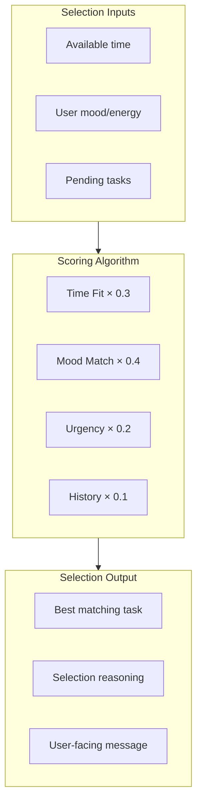
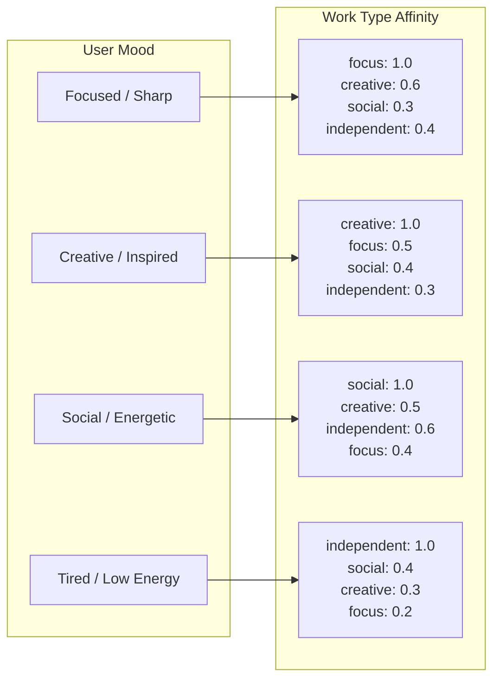
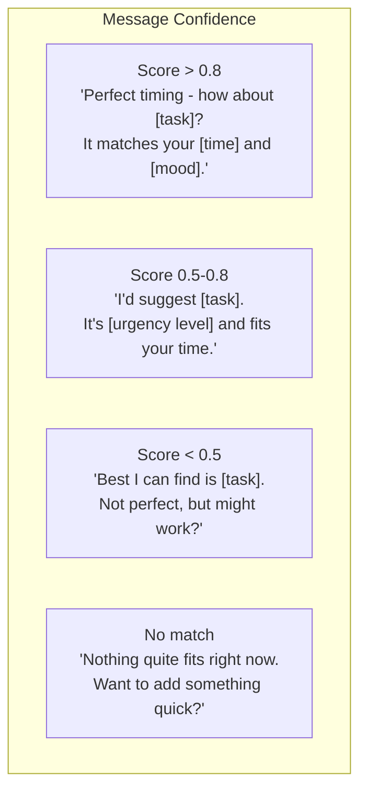

# Task Selection

Assumes you've already read `docs/ai-prompts/shared.md` for the base prompt, shame-prevention templates, user preferences context, and output handling.

## Module 3: Task Selection



### Task Selection Prompt

```
Select the best task for the user based on their current context.

USER CONTEXT:
- Available time: {available_minutes} minutes
- Current mood: {mood} (maps to: {preferred_work_type})
- Time of day: {time_of_day}

PENDING TASKS:
{tasks_json}

SCORING RULES:
1. Time Fit (30% weight):
   - Task fits with buffer: 1.0
   - Tight fit (within 10%): 0.5
   - Doesn't fit: 0.0 (EXCLUDE)

2. Mood Match (40% weight):
   - Perfect match: 1.0
   - Related type: 0.5
   - Opposite type: 0.0

3. Urgency (20% weight):
   - Score = urgency / 100

4. History (10% weight):
   - No rejections: 0.1
   - 1-2 rejections: 0.05
   - 3+ rejections: 0.0

MOOD MAPPING:
- "focused/sharp" → prefer focus work
- "creative/inspired" → prefer creative work
- "social/energetic" → prefer social work
- "tired/low energy" → prefer independent work

OUTPUT (JSON):
{
  "selected_task_id": "...",
  "score": 0.0,
  "reasoning": "brief explanation",
  "user_message": "conversational suggestion"
}

If no tasks fit, explain why and suggest alternatives.
```

### Mood to Work Type Affinity



### Selection Message Templates




---

See also:
- `docs/ai-prompts/shared.md` — base prompt, mood/confidence framing
- `docs/ai-prompts/rejection.md` — what happens when the user says no
