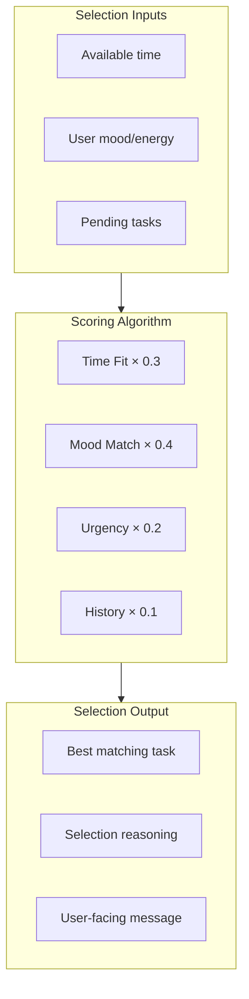
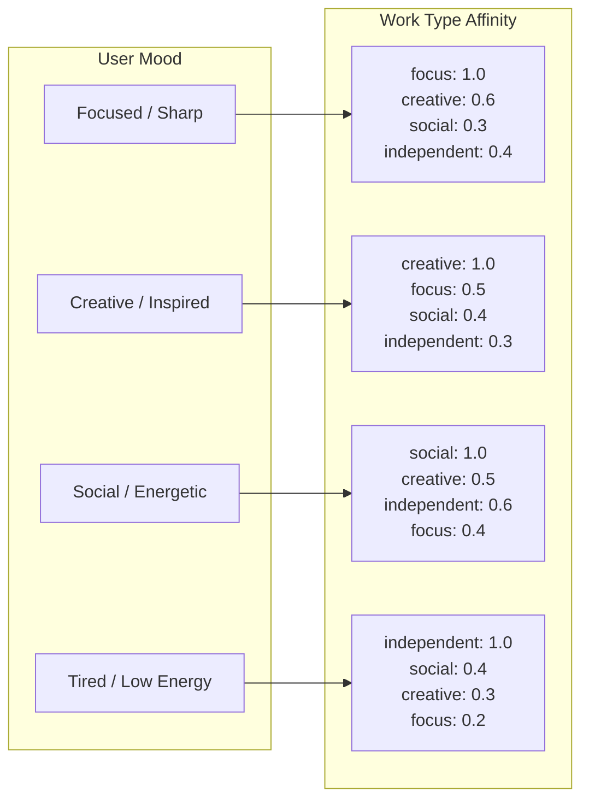
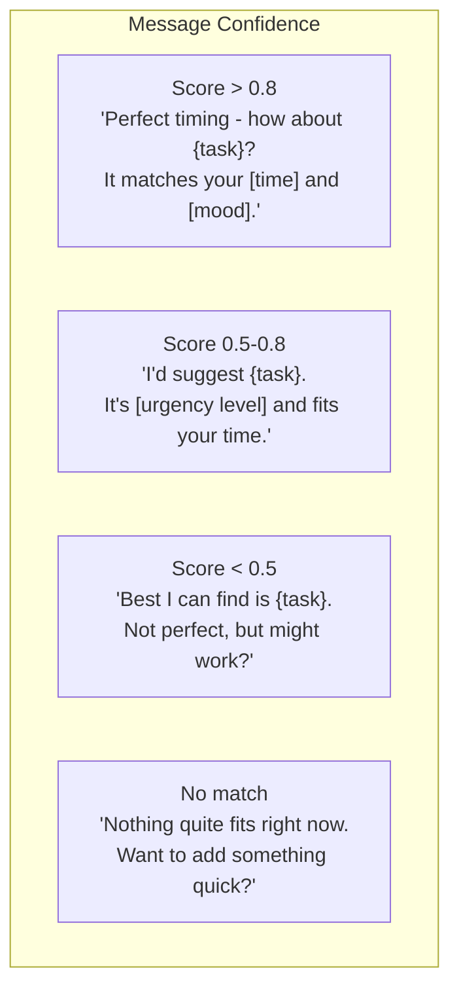

# Task Selection

Assumes you've already read `docs/ai-prompts/shared.md` for the base prompt, shame-prevention templates, user preferences context, and output handling.

## Module 3: Task Selection


```mermaid
flowchart TD
    subgraph Input["Selection Inputs"]
        Time[Available time]
        Mood[User mood/energy]
        Tasks[Pending tasks]
    end

    subgraph Scoring["Scoring Algorithm"]
        TimeFit["Time Fit × 0.3"]
        MoodMatch["Mood Match × 0.4"]
        UrgencyScore["Urgency × 0.2"]
        HistoryBonus["History × 0.1"]
    end

    subgraph Output["Selection Output"]
        Best[Best matching task]
        Reason[Selection reasoning]
        Message[User-facing message]
    end

    Input --> Scoring
    Scoring --> Output
```

### Task Selection Prompt

```
Select the best task for the user based on their current context.

USER CONTEXT:
- Available time (minutes): {available_minutes, or "not stated"}
- Current mood: {mood, or "not stated"} (maps to: {preferred_work_type})
- Time of day: {time_of_day}

User's message: "{user_message}"

Recent conversation:
{conversation_context}

When available time or mood says "not stated", read them from the user's
message above. Read available time and mood from that current message only.
The recent conversation tells you what the user is referring to; it is never
a source of available time or mood, even when an earlier turn stated them.
If the current message does not say how much time they have, assume 30
minutes; if it does not say how they feel, treat mood as neutral.

PENDING TASKS:
{tasks_json}

SCORING RULES:
1. Time Fit (30% weight):
   - Task fits with buffer: 1.0
   - Tight fit (within 10%): 0.5
   - Doesn't fit: 0.0 (EXCLUDE)

2. Mood Match (40% weight):
   - Perfect match: 1.0
   - Related type: 0.5
   - Opposite type: 0.0

3. Urgency (20% weight):
   - Score = urgency / 100

4. History (10% weight):
   - No rejections: 0.1
   - 1-2 rejections: 0.05
   - 3+ rejections: 0.0

MOOD MAPPING:
- "focused/sharp" → prefer focus work
- "creative/inspired" → prefer creative work
- "social/energetic" → prefer social work
- "tired/low energy" → prefer independent work

OUTPUT (JSON):
{
  "selected_task_id": "...",
  "score": 0.0,
  "reasoning": "brief explanation",
  "user_message": "conversational suggestion"
}

selected_task_id is either null or exactly one id copied from PENDING TASKS,
for a task whose title is non-empty. Never invent, shorten, or alter an id,
and never put a title or any other text in this field.

If no task fits, set selected_task_id to null and set user_message to
exactly: "Nothing quite fits right now. Want to add something quick?" Never
write {task} when selected_task_id is null.
```

### Mood to Work Type Affinity


```mermaid
flowchart LR
    subgraph Mood["User Mood"]
        Focused["Focused / Sharp"]
        Creative["Creative / Inspired"]
        Social["Social / Energetic"]
        Tired["Tired / Low Energy"]
    end

    subgraph Affinity["Work Type Affinity"]
        FocusHigh["focus: 1.0<br/>creative: 0.6<br/>social: 0.3<br/>independent: 0.4"]
        CreativeHigh["creative: 1.0<br/>focus: 0.5<br/>social: 0.4<br/>independent: 0.3"]
        SocialHigh["social: 1.0<br/>creative: 0.5<br/>independent: 0.6<br/>focus: 0.4"]
        TiredHigh["independent: 1.0<br/>social: 0.4<br/>creative: 0.3<br/>focus: 0.2"]
    end

    Focused --> FocusHigh
    Creative --> CreativeHigh
    Social --> SocialHigh
    Tired --> TiredHigh
```

### Selection Message Templates


```mermaid
flowchart TD
    subgraph Templates["Message Confidence"]
        High["Score > 0.8<br/>'Perfect timing - how about {task}?<br/>It matches your [time] and [mood].'"]
        Medium["Score 0.5-0.8<br/>'I'd suggest {task}.<br/>It's [urgency level] and fits your time.'"]
        Low["Score < 0.5<br/>'Best I can find is {task}.<br/>Not perfect, but might work?'"]
        None["No match<br/>'Nothing quite fits right now.<br/>Want to add something quick?'"]
    end
```

### Naming the Selected Task

`{task}` is a literal token, not a description to paraphrase. The module writes
it wherever `user_message` refers to the selected task; the application
substitutes the exact stored title before the message is sent.

Why this design: a suggestion that identifies the task only by attribute —
"this focus task", "this 30-minute one" — gives the user nothing to act on. The
attached page id is internal and never rendered to the user, so the title has to
appear in the message text itself. Code owns the substitution so the wording
cannot drift.

The bracketed slots that remain (`[time]`, `[mood]`, `[urgency level]`) are
prose the module writes itself.

### User Context Inputs

The selection prompt receives the incoming message and the last 8 messages of
conversation history alongside the scored task list. Available time and mood
come from state when a node has set them; otherwise the prompt shows "not
stated" and the module reads both from the user's current message ("I've got
2 hours", "I'm wiped"), because a fabricated default excludes tasks that fit
the time the user actually has. The recent conversation is context for what
the user is referring to, never a source of available time or mood: a "2
hours" or "feeling sharp" from an earlier turn may no longer be true, and a
task sized to stale capacity sets the user up to stall.

### Unknown Selection Guard

A selection counts only when `selected_task_id` names a task in the scored
list and that task has a non-empty title. Any other id is invalid model
output. The module asks the model once more with the same prompt plus a
reminder that `selected_task_id` is either `null` or an exact id from the
list, and uses that second answer when it is valid. When the second answer is
also invalid, it is treated as no selection: no task is marked In Progress, no
active task is set, nothing is recorded in the recent-task ledger, and the
user receives a neutral reply ("Couldn't land on one just now — ask me again
in a sec?"). A genuine `null` selection, and a reply that writes `{task}` with
a `null` selection, receive the no-match reply ("Nothing quite fits right
now. Want to add something quick?").

Why this design: an id outside the list, or a page with no name, would mark an
unknown page In Progress and suggest a task the user cannot identify. The
internal retry keeps that recovery step off the user, who otherwise has to
ask again. When the retry also fails, the case is still invalid model output,
not an empty fit, so the reply invites another request rather than a new
task: offering to add a task there grows the list and adds a decision the
user does not need.


---

See also:
- `docs/ai-prompts/shared.md` — base prompt, mood/confidence framing
- `docs/ai-prompts/rejection.md` — what happens when the user says no
