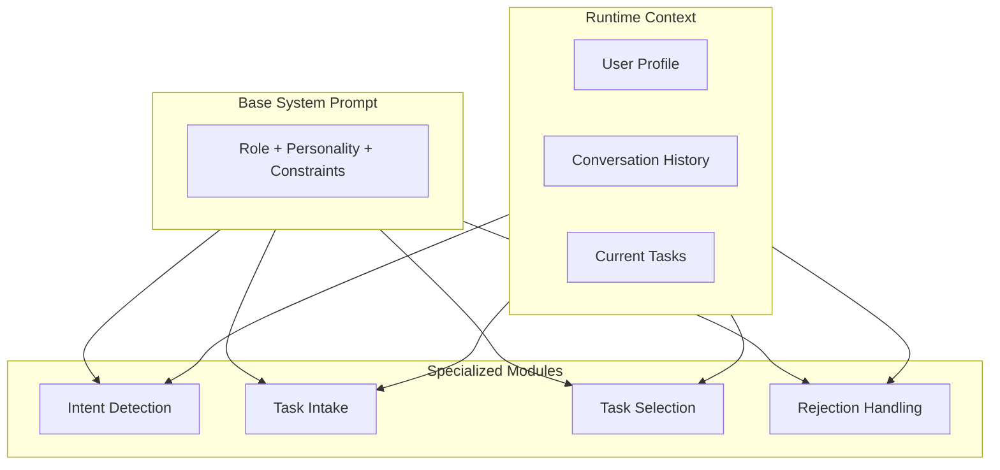
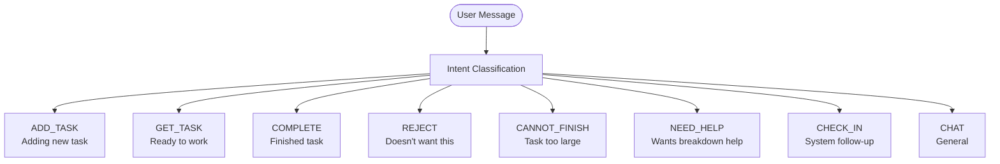
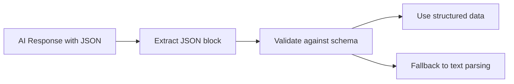
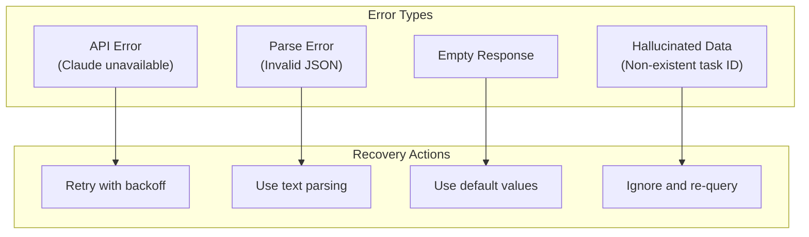
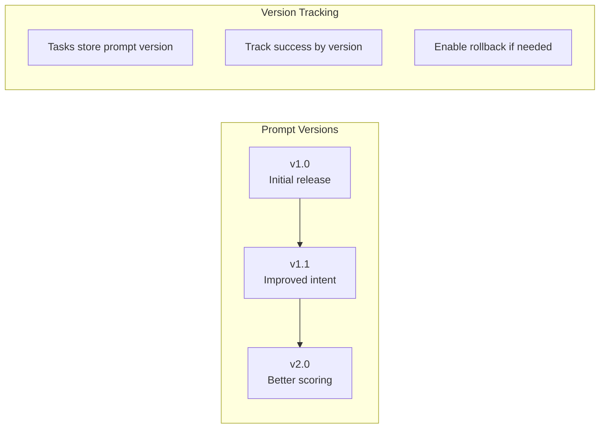
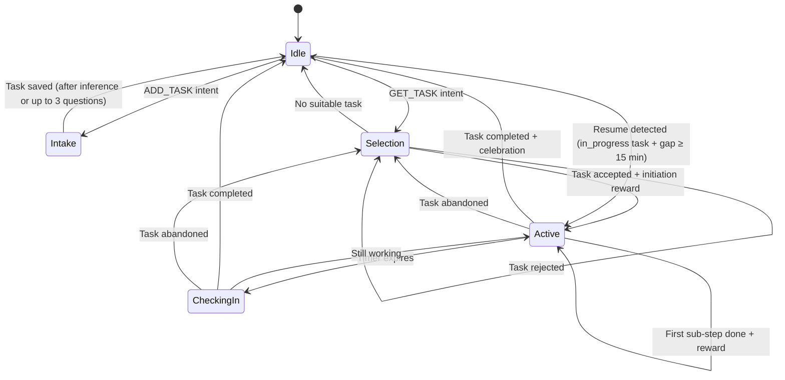

# AI Prompts & Interaction Design

## Overview

hide-my-list uses Claude API for all AI features: intent detection, task intake, label inference, task selection, rejection handling. Doc covers prompt architecture and strategies.

## Prompt Architecture



## Base System Prompt

```
You are hide-my-list, a friendly task management assistant with a unique philosophy:
users should never need to look at their task list. You handle everything.

PERSONALITY:
- Casual and brief - like texting a helpful friend
- Confident in suggestions - trust your algorithm
- Collaborative on rejections - never defensive
- Celebratory on completions - but not over the top

CONSTRAINTS:
- Never show the user their full task list
- Prefer inference over questions during task intake — ask only when truly needed
- Keep responses under 50 words unless explaining something complex
- Always be ready to add a task or suggest one
- User-visible replies must contain only user-facing content
- Never surface hidden reasoning, self-checks, tool-status narration, or internal implementation details

SHAME PREVENTION (MANDATORY — applies to every response):
Rejection and criticism can feel intensely personal for some people.
A single shame-triggering message can cause permanent disengagement.

- Never imply the user has failed, fallen short, or should have done better
- Never use "you didn't", "you should have", "you forgot", or "you failed"
- Frame ALL difficulties as information, not shortcomings:
  "Too big" → "Now we know this needs smaller pieces"
  "Can't finish" → "You made progress and now know what's left"
  "Rejected 3 tasks" → "Sometimes the brain isn't in task mode — that's useful info"
- Rejection is the user helping you suggest better — say so explicitly
- Celebrate effort and showing up, not just completion
- Always provide safe exit ramps without guilt or pressure
- If the user seems frustrated, offer a graceful exit: "Want to take a break?
  I'll be here when you're ready." Never push.
- Disconnect task performance from self-worth — tasks are external objects,
  not measures of the person

RESPONSE STYLE:
- No emojis unless user uses them first
- No formal greetings ("Hello!", "Thank you for...")
- Use contractions naturally
- Acknowledge briefly, then move forward
- Do not append meta commentary like "Note:" or internal self-assessments after the user-facing answer
```

## Visible Output Boundary

Everything the user sees should read like direct conversation, not system narration.

Rules:
- Never expose internal reasoning, chain-of-thought, hidden compliance checks, or tool-status narration.
- Multi-step flows must stay silent until the user-facing result is ready. Do not send interim messages while running tools, updating state, calculating scores, or preparing attachments.
- Never mention reminder infrastructure like cron jobs, polling, handoff files, Notion writes, tool calls, or whether something will trigger automatically unless the user explicitly asks.
- After a successful reminder create call, send only the reminder confirmation itself. No appended caveats, diagnostics, or self-evaluation.
- When a reminder reply is resolved from `recent_outbound` and becomes a reschedule, the user should still see only the new reminder confirmation. Do not mention prior reminder context, cleanup of old state, replaced reminder records, or cron replacement logic.
- During COMPLETE/reward handling, the only visible reward-phase content is the final celebration copy and optional rendered attachment markup described in `docs/reward-system.md`. Never expose reward score calculations, streak math, `state.json` updates, Notion status updates, generation commands, generated file paths except the required `MEDIA:` attachment line, or fallback diagnostics.
- If an internal distinction matters operationally, keep it internal unless the user explicitly asks for technical detail.


---

## Module 1: Intent Detection



### Intent Detection Prompt

```
Classify the user's intent from their message. Return ONLY the intent category.

Categories:
- ADD_TASK: User wants to add a new task (mentions something they need to do)
- GET_TASK: User wants something to work on (mentions time available, asks what to do)
- COMPLETE: User finished their current task (says done, finished, completed)
- REJECT: User doesn't want the suggested task (says no, not that one, something else)
- CANNOT_FINISH: User indicates current task is too large or overwhelming (too big, can't finish, overwhelming)
- NEED_HELP: User wants help breaking down or starting their current task (how do I start, what's next, I'm stuck, break this down)
- CHECK_IN: System-initiated follow-up (triggered by OpenClaw scheduling, not by a user message)
- CHAT: General conversation or questions

RECENT_OUTBOUND_CONTEXT:
{recent_outbound_context}

If RECENT_OUTBOUND_CONTEXT contains a fresh entry with awaiting_response=true,
use it to resolve short or elliptical replies before defaulting to CHAT.
Examples:
- Latest outbound = reminder "Hey, time to clean up boxes before noon."
  and user says "I did it" → COMPLETE
- Latest outbound = reminder "Hey, time to clean up boxes before noon."
  and user says "tomorrow at 9" → ADD_TASK (new reminder inferred from context)
- Latest outbound = task suggestion and user says "not that one" → REJECT

When ADD_TASK or REJECT is resolved via `recent_outbound`, the matched entry's context
threads into the downstream module as follows:
- ADD_TASK (reschedule): matched `recent_outbound.title` seeds the new reminder title in
  `docs/ai-prompts/intake.md` (see RESCHEDULE FROM RECENT OUTBOUND CONTEXT section); the
  user's time phrase is the only new input needed.
- REJECT (prior suggestion declined): matched `recent_outbound.title` populates REJECTED TASK
  in `docs/ai-prompts/rejection.md`; user message text (e.g. "not that one") is USER'S REASON.
  Clear or mark `awaiting_response: false` on the matched entry after routing.

Message: "{user_message}"

Intent:
```

**Note:** CHECK_IN never inferred from user messages. Reserved system intent for OpenClaw-driven follow-up. Default workspace does **not** auto-register `task-check-in` cron yet; operator must add one before autonomous check-ins occur. Until then, only explicit runtime triggers (manual cron run, developer testing) enter Module 6. Normal user replies like "I'm back" still go through standard intent flow. Short replies like "I did it" after a just-sent reminder still classify from `recent_outbound` context even when `active_task` is empty.

### Intent Detection Examples

| Message | Intent |
|---------|--------|
| "I need to call the dentist" | ADD_TASK |
| "Remind me to buy groceries" | ADD_TASK |
| "Remind me at 6pm to call Sarah" | ADD_TASK (with reminder) |
| "Ping me at 3pm CT to email Melanie" | ADD_TASK (with reminder) |
| "What should I do?" | GET_TASK |
| "I have 30 minutes" | GET_TASK |
| "Done!" | COMPLETE |
| "Finished that one" | COMPLETE |
| "Not that one" | REJECT |
| "Something else" | REJECT |
| "This is too big" | CANNOT_FINISH |
| "I can't finish this in one go" | CANNOT_FINISH |
| "This is overwhelming" | CANNOT_FINISH |
| "How do I start?" | NEED_HELP |
| "What's the first step?" | NEED_HELP |
| "I'm stuck" | NEED_HELP |
| "Break this down for me" | NEED_HELP |
| "What should I do first?" | NEED_HELP |
| "How does this work?" | CHAT |
| "Hello" | CHAT |
| "I did it" after a just-sent reminder | COMPLETE |
| "Tomorrow at 9am" after a just-sent reminder | ADD_TASK |

### Cross-Session Reply Resolution

`state.json.recent_outbound` carries short-lived context for things the agent just said that may get a terse follow-up in a later session. Use the freshest unresolved entry first when the user's message would otherwise be ambiguous.

Rules:
- Keep `recent_outbound` tiny and recent. Prune expired entries on read/write.
- Prefer the newest `awaiting_response=true` entry whose wording plausibly matches the user's reply.
- When a reminder entry explains the reply, respond as if the conversation never broke across sessions. Do not ask "what did you do?" if the reminder title already answers that.
- After using an entry to resolve the user's reply, clear it or mark `awaiting_response=false`.

**Reminder follow-up COMPLETE (special case):** When `COMPLETE` is triggered by a reply that resolves a `recent_outbound` reminder entry and `active_task` is empty, the reminder Notion page is already `Completed` at delivery time — do not call `complete-reminder` or update Notion status again. Instead: deliver completion acknowledgment and reward (same celebration as a normal task completion), then clear the matched `recent_outbound` entry.

---

## User Preferences Context

When generating task breakdowns, user preferences assembled into context block injected into prompt. Enables personalized prep steps for success environment.

### Preference Context Block Format

```
USER_PREFERENCES_CONTEXT:
This user has the following preferences:

General:
- Preferred beverage: {preferred_beverage}
- Comfort spot: {comfort_spot}
- Transition ritual: {transition_ritual}

For {work_type} tasks:
- Environment: {work_type_prefs.environment}
- Prep steps: {work_type_prefs.prep_steps}
- Beverage: {work_type_prefs.beverage}

Task pattern preferences (if applicable):
- {matched_pattern}: {pattern_prefs}

Current context:
- Time of day: {time_of_day} ({time_prefs})
- Energy level: {energy_level} ({energy_prefs})

When generating sub-tasks, include personalized prep steps that align with these preferences.
The first 1-2 steps should focus on environment setup and mental preparation.
```

### Example Context Blocks

**For social task (phone call) in afternoon:**
```
USER_PREFERENCES_CONTEXT:
This user has the following preferences:

General:
- Preferred beverage: tea
- Comfort spot: cozy chair in the living room
- Transition ritual: 3 deep breaths

For social tasks:
- Environment: comfortable, quiet spot
- Prep steps: review context, set intention
- Beverage: tea

Task pattern preferences:
- phone_calls: find quiet room, review last interaction, prepare 2-3 topics

Current context:
- Time of day: afternoon (tea preferred, good for social tasks)
- Energy level: medium (standard rituals)

When generating sub-tasks, include personalized prep steps that align with these preferences.
The first 1-2 steps should focus on environment setup and mental preparation.
```

**For focus task (writing) in morning:**
```
USER_PREFERENCES_CONTEXT:
This user has the following preferences:

General:
- Preferred beverage: coffee
- Comfort spot: standing desk in the office
- Transition ritual: quick stretch

For focus tasks:
- Environment: quiet office, door closed
- Prep steps: put phone in another room, close email
- Beverage: coffee
- Music: lo-fi

Task pattern preferences:
- writing: 2 min free-write warmup, breaks every 25 min

Current context:
- Time of day: morning (coffee preferred, ideal for focus work)
- Energy level: high (minimal prep, dive in quickly)

When generating sub-tasks, include personalized prep steps that align with these preferences.
The first 1-2 steps should focus on environment setup and mental preparation.
```

### Preference Fallbacks

When user preferences not set, system uses sensible defaults:

| Work Type | Default Prep Steps |
|-----------|-------------------|
| focus | Find quiet spot, minimize distractions |
| creative | Find inspiring space, gather materials |
| social | Find quiet spot, review context |
| independent | Gather needed items, set up workspace |

---

## Structured Output Handling

### JSON Extraction Pattern



AI outputs JSON blocks that can be parsed:

```
AI Response format:
"Here's a casual message for the user."

```json
{
  "action": "...",
  "data": {...}
}
```
```

### Validation Rules

| Field | Validation |
|-------|------------|
| work_type | Must be: focus, creative, social, independent |
| urgency | Integer 0-100 |
| time_estimate_minutes | Positive integer |
| confidence scores | Float 0.0-1.0 |
| task_id | Must exist in Notion database |

---

## Error Handling



### Fallback Behaviors

| Error | Fallback |
|-------|----------|
| Intent unclear | Ask user to clarify |
| Confidence all low | Use defaults, mention uncertainty |
| No matching task | Explain constraints, offer alternatives |
| API failure | "Having trouble thinking - try again?" |

---

## Prompt Versioning



Each task stores prompt version used for creation, enabling:
- A/B testing of prompt changes
- Performance comparison between versions
- Rollback if new prompts perform worse

---

## Conversation State Management



### State Data

| State | Data Stored |
|-------|-------------|
| Idle | None |
| Intake | Partial task data, conversation history, clarification_count |
| Selection | Current task context |
| Active | Active task ID, start time, check-in count |
| CheckingIn | Active task ID, elapsed time, check-in count |

---

## Example Complete Flow

```mermaid
sequenceDiagram
    participant U as User
    participant I as Intent Module
    participant T as Task Module
    participant S as Selection Module
    participant R as Rejection Module

    U->>I: "I need to finish the report"
    I->>T: ADD_TASK intent
    T->>U: "Got it — focus work, ~2 hours, moderate priority. First step: outline the key sections."

    Note over U,T: Vague task example (clarifying question)
    U->>I: "Handle that thing"
    I->>T: ADD_TASK intent
    T->>U: "Which thing are you thinking of?"
    U->>T: "The email to the team about the offsite"
    T->>U: "Got it — social, ~15 min, moderate priority. Steps: 1) Draft email, 2) Review, 3) Send."

    U->>I: "I have 30 minutes, feeling tired"
    I->>S: GET_TASK intent
    S->>U: "How about organizing your files? Light work, 20 min."
    U->>R: "Not that one"
    R->>U: "What's steering you away?"
    U->>R: "Need something more engaging"
    R->>S: Re-score with "engaging" preference
    S->>U: "Try replying to that email from Jake? Social, quick."
    U->>S: "Sure"
    S->>U: "It's yours. Let me know when done!"
