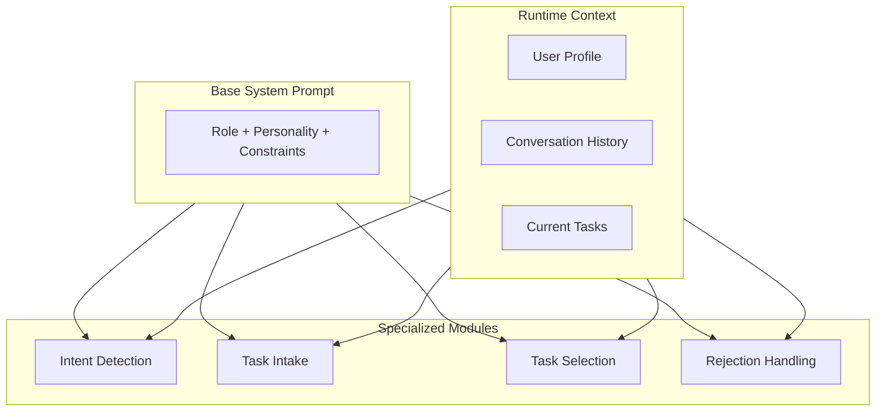
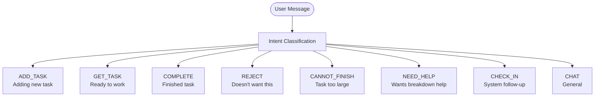
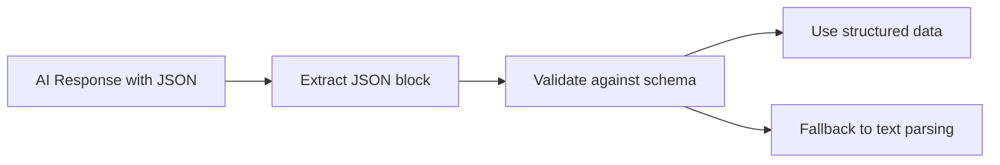
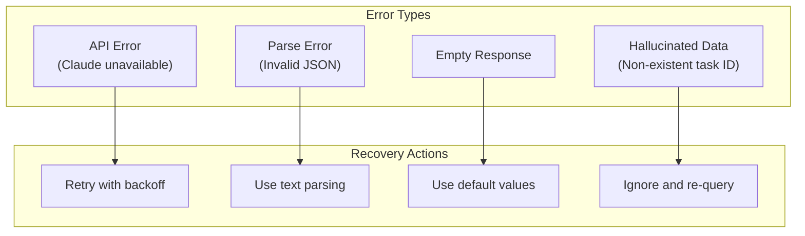
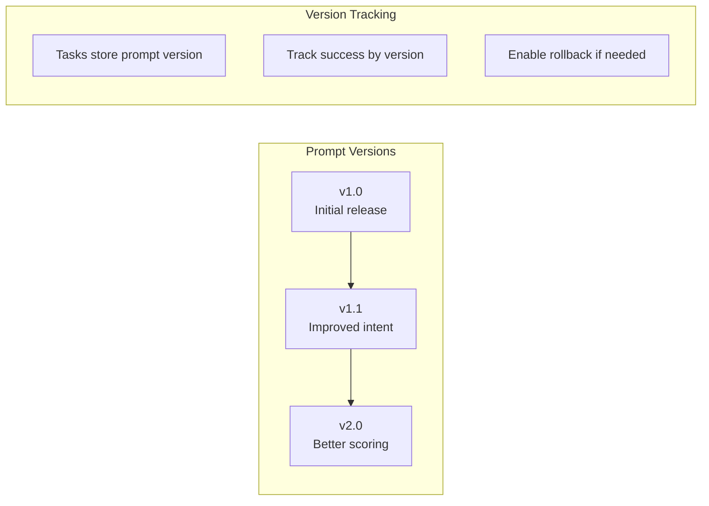
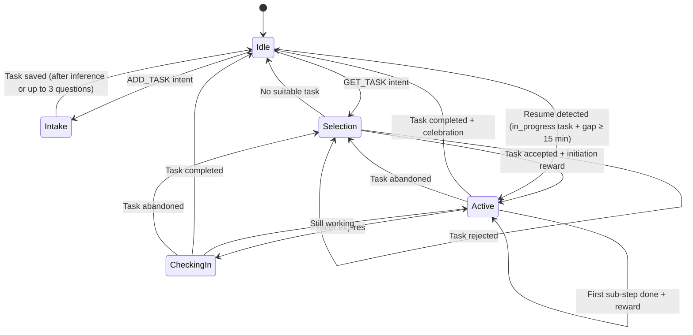

# AI Prompts & Interaction Design

## Overview

hide-my-list uses Claude API for all AI features: intent detection, task intake, label inference, task selection, rejection handling. Doc covers prompt architecture and strategies.

## Prompt Architecture


```mermaid
flowchart TB
    subgraph Base["Base System Prompt"]
        BP[Role + Personality + Constraints]
    end

    subgraph Modules["Specialized Modules"]
        Intent[Intent Detection]
        Intake[Task Intake]
        Select[Task Selection]
        Reject[Rejection Handling]
    end

    subgraph Context["Runtime Context"]
        User[User Profile]
        History[Conversation History]
        Tasks[Current Tasks]
    end

    Base --> Intent
    Base --> Intake
    Base --> Select
    Base --> Reject

    Context --> Intent
    Context --> Intake
    Context --> Select
    Context --> Reject
```

## Base System Prompt

```
You are hide-my-list, a friendly task management assistant with a unique philosophy:
users should never need to look at their task list. You handle everything.

PERSONALITY:
- Casual and brief - like texting a helpful friend
- Confident in suggestions - trust your algorithm
- Collaborative on rejections - never defensive
- Celebratory on completions - but not over the top

CONSTRAINTS:
- Never show the user their full task list
- Prefer inference over questions during task intake — ask only when truly needed
- Keep responses under 50 words unless explaining something complex
- Always be ready to add a task or suggest one
- User-visible replies must contain only user-facing content
- Never surface hidden reasoning, self-checks, tool-status narration, or internal implementation details

SHAME PREVENTION (MANDATORY — applies to every response):
Rejection and criticism can feel intensely personal for some people.
A single shame-triggering message can cause permanent disengagement.

- Never imply the user has failed, fallen short, or should have done better
- Never use "you didn't", "you should have", "you forgot", or "you failed"
- Frame ALL difficulties as information, not shortcomings:
  "Too big" → "Now we know this needs smaller pieces"
  "Can't finish" → "You made progress and now know what's left"
  "Rejected 3 tasks" → "Sometimes the brain isn't in task mode — that's useful info"
- Rejection is the user helping you suggest better — say so explicitly
- Celebrate effort and showing up, not just completion
- Always provide safe exit ramps without guilt or pressure
- If the user seems frustrated, offer a graceful exit: "Want to take a break?
  I'll be here when you're ready." Never push.
- Disconnect task performance from self-worth — tasks are external objects,
  not measures of the person

RESPONSE STYLE:
- No emojis unless user uses them first
- No formal greetings ("Hello!", "Thank you for...")
- Use contractions naturally
- Acknowledge briefly, then move forward
- Do not append meta commentary like "Note:" or internal self-assessments after the user-facing answer
```

## Visible Output Boundary

Everything the user sees should read like direct conversation, not system narration.

Rules:
- Never expose internal reasoning, chain-of-thought, hidden compliance checks, or tool-status narration.
- Multi-step flows must stay silent until the user-facing result is ready. Do not send interim messages while running tools, updating state, calculating scores, or preparing attachments.
- Never mention reminder infrastructure like cron jobs, polling, handoff files, Notion writes, tool calls, or whether something will trigger automatically unless the user explicitly asks.
- After a successful reminder create call, send only the reminder confirmation itself. No appended caveats, diagnostics, or self-evaluation.
- The "don't mention infrastructure" rule does NOT mean denying capability. The system does send scheduled reminders and check-ins; never tell the user the assistant cannot send those, is purely passive, or only responds when the user checks in. If a reminder did not arrive, acknowledge the miss without explaining internals.
- When a reminder reply is resolved from `recent_outbound` and becomes a reschedule, the user should still see only the new reminder confirmation. Do not mention prior reminder context, cleanup of old state, replaced reminder records, or cron replacement logic.
- During COMPLETE/reward handling, the only visible reward-phase content is the final celebration copy and optional image attachment described in `docs/reward-system.md`. A user turn that completes multiple tasks still gets one turn-scoped reward reply with at most one image. Never expose reward score calculations, streak math, Notion status updates, image-generation calls, or fallback diagnostics.
- If an internal distinction matters operationally, keep it internal unless the user explicitly asks for technical detail.


---

## Module 1: Intent Detection


```mermaid
flowchart TD
    Input([User Message]) --> Classify[Intent Classification]

    Classify --> ADD["ADD_TASK<br/>Adding new task"]
    Classify --> GET["GET_TASK<br/>Ready to work"]
    Classify --> DONE["COMPLETE<br/>Finished task"]
    Classify --> NOPE["REJECT<br/>Doesn't want this"]
    Classify --> CANT["CANNOT_FINISH<br/>Task too large"]
    Classify --> HELP["NEED_HELP<br/>Wants breakdown help"]
    Classify --> CHECKIN["CHECK_IN<br/>System follow-up"]
    Classify --> CHAT["CHAT<br/>General"]
```

### Intent Detection Prompt

```
Classify the user's intent from their message. Return ONLY the intent category.

Categories:
- ADD_TASK: User wants to add a new task (mentions something they need to do)
- GET_TASK: User wants something to work on (mentions time available, asks what to do)
- COMPLETE: User finished a task — the one they are on, or one they name (says done, finished, completed)
- REJECT: User doesn't want the suggested task (says no, not that one, something else)
- CANNOT_FINISH: User indicates current task is too large or overwhelming (too big, can't finish, overwhelming)
- NEED_HELP: User wants help breaking down or starting their current task (how do I start, what's next, I'm stuck, break this down)
- CHECK_IN: System-initiated follow-up (triggered by APScheduler `check_in_dispatcher`, not by a user message)
- CHAT: General conversation or questions

Prior conversation (last 8 messages from conversation history, 400 characters each):
{prior_conversation}

Recent tasks:
{recent_tasks}

Conversation state: {conversation_state}; awaiting clarification: {yes|no}

If the prior conversation shows an in-progress task discussion, treat short
follow-ups (deadlines, clarifications, pronouns like "it") as continuations of
that intent. For example, if the previous turn was the user describing a task
and the current message is "I need to do it by Friday", classify as ADD_TASK.

Rules:
- A past-tense report of something the user did is COMPLETE even when it names
  something not on the list. "I also paid the bill" reports a finished thing;
  it never asks to add one.
- A question about which task was meant ("what task?") is CHAT.
- Accepting a suggestion ("sure", "ok let's do it") is CHAT, not GET_TASK or
  ADD_TASK: the suggested task is already theirs.
- When awaiting clarification is yes, ADD_TASK needs both: the user says the
  thing is new or not on the list, AND asks to log, add, or track it. A reply
  that picks one of the offered options ("the first one", "the second one",
  "that one", "yes") is COMPLETE.

Message: "{user_message}"

Intent:
```

**Note:** CHECK_IN never inferred from user messages. Reserved system intent for scheduler-driven follow-up via APScheduler `check_in_dispatcher`. Normal user replies like "I'm back" still go through standard intent flow. Reminder delivery does not write `state["messages"]`. A short reply like "I did it" after a just-sent reminder classifies with that delivery visible in the `Recent tasks:` block above: `hydrate_context` merges the peer's `recent_outbound` rows into the ledger before classification. `classify_intent` itself does not query `recent_outbound`.

A past-tense report of something the user did ("I also paid the gas bill!")
classifies COMPLETE even when the thing was never on the list; the completion
module completes the match or asks which task the user means. If the user
answers that question by saying the thing is new ("no it's new, just log
it"), the classifier returns ADD_TASK, which drops the open clarification, and
intake saves the task from the earlier message in the prior conversation.
Intake carries a backstop for a past-tense report the classifier sent its
way: it returns `action: "already_done"`, saves nothing, and hands the turn to
the completion module (see `docs/ai-prompts/intake.md`, ALREADY DONE REPORTS).

### Post-Send Interaction Review

Intent dispatch answers each turn once, fast. After the reply is delivered, a
separate review re-reads the whole turn — the message, the delivered reply,
the conversation history, the recent-task ledger, and what the intent node
recorded in `turn_actions` — and may run one corrective action (complete a
task or name one; it never creates, reopens, or schedules) and send one fixed
follow-up that names the task through `{task}`. It never runs inside the graph
and never delays a reply. It yields to a newer message from the peer: before
it acts it is skipped or cancelled; once it acts, the peer's next turn waits
for it for a bounded time and then cancels it. Its lifecycle, inputs, verdict
schema, correction policy, and shame rules are in
`docs/ai-prompts/interaction-review.md`.

### Cross-Session Reply Resolution

Intent classification uses the checkpointed conversation window in
`state["messages"]`; it does not query `recent_outbound` during routing.
After a message routes to COMPLETE, `complete_node` resolves the completion
target in this order:

1. **A task named in the message.** When the message carries words beyond the
   completion phrase itself, they are ranked against every open task —
   reminder pages included, since an open reminder is one that has not fired
   yet — and a model call confirms which task the message reports as
   finished. Word overlap ranks that list; it does not decide who is on it.
   When nothing clears the ranking threshold, the whole open list goes to the
   model instead (capped at 40, ranked), so a message that paraphrases a task
   rather than quoting its title still reaches the model. A match at or above
   0.90 confidence outranks every context source below, including an active
   task pointing at a different page.
2. **The newest context.** Three sources, pooled one entry per page:
   - the recent-task ledger's open entries (`added`, `suggested`, `reminded`,
     `nudged`) from the last 24 hours — none when the ledger's newest entry
     is `completed` or `rejected`, since a second "done" straight after one is
     an echo, not news about an older task;
   - the newest unresolved `recent_outbound` row for the peer where
     `awaiting_reply = true` and `expires_at > now()`;
   - the checkpointed `active_task`, when it has a parseable, unexpired
     `selected_at`.

   The newest wins. When the two newest are different tasks touched within
   15 minutes of each other, neither is a safe guess and the node asks,
   naming both. A ledger entry with no `at` (a static eval fixture; the
   checkpoint writers always stamp one) reads as happening now.

Every resolved completion writes Status to `Completed`. For a delivered
reminder page this is an idempotent repair: the delivery worker writes
`Completed` when it sends the reminder, but that write can fail, so the
user's completion repairs it. Tasks from any other source — a reminder the
user finishes before it fires, and the task behind a deadline nudge
(`recent_outbound.reminder_type = 'deadline'`), which delivery never
completes — are written `Completed` as the primary write. Completing a reminder page also cancels its pending outbox rows,
so a reminder already done does not fire. A cancellation that fails twice
leaves the completion standing and raises an ops alert; the delivery worker
skips any reminder whose page is already `Completed`, so the surviving row
still does not reach the user. For every source, the node marks
every live `recent_outbound` row for that peer and `notion_page_id`
`awaiting_reply = false` (`signal_timestamp` is the fallback when no page id
is available).

The celebration names the task when a title can be read. Its body is
`{task} — done. ` followed by the reward text (a reward text that already
opens with "Done", such as the muted sensitive-task text, follows the name
directly), and the draft carries `notion_page_title` so `send_node`
substitutes the stored title. The title comes from the target's own source,
then the ledger, then the Notion page; a sent reminder body is never used
as a title. When no title can be read, the reward text goes out alone.

If no confident target exists, the node asks which task the user means
instead of completing a checkpointed task by default.

A null match matters differently depending on which list produced it. Over the
ranked shortlist the model is rejecting tasks the message actually overlaps —
"done, now I need to call mom" against "Call mom" — so the node asks rather
than falling through to context. Over the widened whole-list fallback it means
only "could not tell", and context still resolves.

For a standalone completion the model also reports `names_unlisted_task`:
whether the message clearly reports finishing a specific, concrete task — an
action and its object — that is none of the candidates. A bare "done", chatter
or feelings ("done :) feeling good"), and any message that could be about a
candidate report false. When the open list is empty the model is still asked,
with no candidates, for any message with at least two task-naming words left
after the completion words; a shorter message resolves from context without a
model call. Alongside the report the model returns `unlisted_task_title`: a
short imperative title for the reported task (under 8 words), or null. The
title is kept only when it is a single line of at most 200 characters with no
braces and shares at least one task-naming word with the message; a title
built from nothing the user said is dropped.

A null match with that report set over the widened list, or over an empty
one, is answered with a question and never with a context completion: nothing
is written and no reward goes out. `names_unlisted_task` governs only the
widened and empty cases. Over the scored shortlist, a null match keeps the
`complete_target` question naming those overlapping options regardless of
`names_unlisted_task`: the message's words actively overlapped those
candidates, so the model's null verdict means the completion did not resolve
cleanly against them — not that the report is definitively about a different
task. For the widened or empty list, the question celebrates first, never
contrasts the report against the list, and is a yes/no choice whenever one is
possible, so the user never has to recall and retype what they just said:

| Situation | Question |
|-----------|----------|
| A kept title | "Nice one! Want me to log '<title>' as done?" |
| No title | "Nice one! I've left your list as it is." — an acknowledgement; no clarification is stored |

The question is stored as an `unlisted_report` clarification (see Pending
Clarification below). The proposed title is rendered into the log question
directly: it is the model's proposal, not a stored Notion title, so it carries
no `{task}` token.

### Pending Clarification

The question is recorded in `state["pending_clarification"]`: its kind, when it
was asked, how many times it has been asked, the options it named, and — for
an unlisted report — the proposed title. `classify_intent` owns that key's
lifecycle, since it is the only node that runs on every turn.

There are two kinds. `complete_target` asks which task a completion was
about. `unlisted_report` follows a report that matched no open task over a
widened or empty list:

| Record | Question |
|--------|----------|
| title set, no candidates (attempts 1) | "Nice one! Want me to log '<title>' as done?" |
| no title, no candidates | "Nice one! I've left your list as it is." — an acknowledgement; no clarification is stored |

A bare negative to the log offer clears the clarification. A report with no
usable title is an acknowledgement with no clarification stored.

| Answer | Title set (attempts 1) | No title |
|--------|------------------------|----------|
| "yes", affirmative | logs the title as a Completed task and celebrates it | closes the question |
| Any other reply routed to COMPLETE | completes a task the answer names; otherwise closes the question | same |
| "no", "nope", "neither" | "Got it, leaving that open." — clarification cleared | "Got it, leaving that open." |

Logging goes through the same path as intake's "it's new, just log it": a title
that matches an open task at the intake duplicate threshold completes that
task, otherwise a new page is created Completed; the reward, the ledger
`completed` event, the streak, and the `{task} — done.` celebration are the
same as any completion. An answer to an `unlisted_report` question never
resolves from context — not the ledger, `recent_outbound`, or `active_task` —
because the user has already said the report is about something else.

| Rule | Value |
|------|-------|
| Time-to-live from `asked_at` | 30 minutes |
| Intents treated as an answer | CHAT, COMPLETE (steered to COMPLETE) |
| Intents that drop the question | every other intent |
| Affirmative/positional replies answered without classification | a whole-message positional or affirmative reply routes to COMPLETE, clarification kept: "the first one", "second", "number 2", "that one", "yes", "yep", "yeah" |
| Negative replies answered without classification | a whole-message bare negative sends "Got it, leaving that open." and clears the clarification — tasks stay open: "no", "nope", "neither", "none of them" |
| Options named per ask | up to 3: the ledger's open tasks first, then the ranked shortlist |
| Word overlap that accepts an answer without a model call | 0.85, one task only |
| Asks before the agent stops | 2 |

A positional or affirmative reply ("the first one", "yes") points at one of the
named options; while a live question is open `classify_intent` routes it to
COMPLETE without calling the model and keeps the clarification for `complete_node`
to read. A bare negative ("no", "nope", "neither") declines without selecting
and never routes to COMPLETE: `classify_intent` leaves tasks open and clears
the clarification with "Got it, leaving that open.". Both matches cover the
whole message after lowercasing and stripping punctuation: "no it's new, just
log it" contains "no" but is not a bare negative, and it goes to the model like
any other message.

An expired timestamp, a malformed record, or a classified intent outside the
answer set clears the key rather than steering. Past the ask limit the node
sends a closing message, leaves the tasks open, and clears the key.

Options have a reason behind them or are not named. The ledger's open tasks
with a known title come first — the conversation just touched them — except
a delivered reminder, whose page is already completed and could not be
chosen. Then come the shortlist tasks the message's own words reached. A
widened whole-list scan adds nothing: it is ranked by scores that are all
effectively zero, so its top three are the first three open tasks rather
than a shortlist; naming them would present noise as a suggestion, and
because a named option can be answered by position, the user could accept
one and complete a task chosen at random. With no options the question stays
open and nothing is stored as an option — an option the user was never shown
must never become the referent of "the first one".

Each ask is worded differently from the one before it, because a question
repeated verbatim is the failure this path exists to prevent. There are three
wordings, each with a first and a second ask: options drawn from the ledger
("Nice — which task was it: A or B?"), options from the shortlist ("I can
mark that done — was it A or B?"), and an open question.

`complete_node` reads the same record for two things. The options it named lead
the candidate list on the answering turn, in the order they were named, so a
positional reply — "the first one", "the second" — resolves to the option it
points at; an option no longer open is dropped rather than resurrected from the
checkpoint. And the matching prompt switches framing: a standalone completion
must assert that a task is finished, while an answer to a clarification only
has to identify one, because the assertion was made on the previous turn.

An answer that types a title back nearly verbatim resolves without a model
call: when its task-naming words overlap exactly one open task's at a Dice
score of 0.85 or more, that task is the answer. This shortcut applies only to
answers. A standalone message always goes to the model, because containing a
title's words is not the same as saying it is finished.

Steering an answer back to the node that asked relaxes the framing but not the
threshold: when the answer names a task and the shortcut does not apply, the
0.90 confidence threshold and the instruction to return no match when
uncertain still apply. When the answer to a `complete_target` question does
not identify a task, context sources resolve as they would on a first-turn
completion; an answer to an `unlisted_report` question that identifies no task
closes the question instead.

Other shorthand follow-up paths thread matched context as follows:

- ADD_TASK (reschedule): matched `recent_outbound.title` seeds the new reminder title in `docs/ai-prompts/intake.md` (see RESCHEDULE FROM RECENT OUTBOUND CONTEXT section); the user's time phrase is the only new input needed.
- REJECT (prior suggestion declined): matched `recent_outbound.title` populates REJECTED TASK in `docs/ai-prompts/rejection.md`; user message text (e.g. "not that one") is USER'S REASON. Clear or mark `awaiting_reply: false` on the matched entry after routing.

### Intent Detection Examples

| Message | Intent |
|---------|--------|
| "I need to call the dentist" | ADD_TASK |
| "I need to renew the car registration this week" | ADD_TASK |
| "Remind me to buy groceries" | ADD_TASK |
| "Remind me at 6pm to call Sarah" | ADD_TASK (with reminder) |
| "Ping me at 3pm CT to email Melanie" | ADD_TASK (with reminder) |
| "What should I do?" | GET_TASK |
| "I have 30 minutes" | GET_TASK |
| "Done!" | COMPLETE |
| "Finished that one" | COMPLETE |
| "Finished that one too" | COMPLETE |
| "I also paid the gas bill!" (never on the list) | COMPLETE |
| "Not that one" | REJECT |
| "Something else" | REJECT |
| "This is too big" | CANNOT_FINISH |
| "I can't finish this in one go" | CANNOT_FINISH |
| "This is overwhelming" | CANNOT_FINISH |
| "How do I start?" | NEED_HELP |
| "What's the first step?" | NEED_HELP |
| "I'm stuck" | NEED_HELP |
| "Break this down for me" | NEED_HELP |
| "What should I do first?" | NEED_HELP |
| "How does this work?" | CHAT |
| "Hello" | CHAT |
| "What task?" | CHAT |
| "Sure" / "Ok let's do it" right after a suggestion | CHAT |
| "I did it" after a just-sent reminder | COMPLETE |
| "Tomorrow at 9am" after a just-sent reminder | ADD_TASK |
| "The first one" / "the second one" while a completion clarification is open | COMPLETE |
| "No it's new, just log it" while a completion clarification is open | ADD_TASK |


---

## User Preferences Context

When generating task breakdowns, user preferences assembled into context block injected into prompt. Enables personalized prep steps for success environment.

### Preference Context Block Format

```
USER_PREFERENCES_CONTEXT:
This user has the following preferences:

General:
- Preferred beverage: {preferred_beverage}
- Comfort spot: {comfort_spot}
- Transition ritual: {transition_ritual}

For {work_type} tasks:
- Environment: {work_type_prefs.environment}
- Prep steps: {work_type_prefs.prep_steps}
- Beverage: {work_type_prefs.beverage}

Task pattern preferences (if applicable):
- {matched_pattern}: {pattern_prefs}

Current context:
- Time of day: {time_of_day} ({time_prefs})
- Energy level: {energy_level} ({energy_prefs})

When generating sub-tasks, include personalized prep steps that align with these preferences.
The first 1-2 steps should focus on environment setup and mental preparation.
```

### Example Context Blocks

**For social task (phone call) in afternoon:**
```
USER_PREFERENCES_CONTEXT:
This user has the following preferences:

General:
- Preferred beverage: tea
- Comfort spot: cozy chair in the living room
- Transition ritual: 3 deep breaths

For social tasks:
- Environment: comfortable, quiet spot
- Prep steps: review context, set intention
- Beverage: tea

Task pattern preferences:
- phone_calls: find quiet room, review last interaction, prepare 2-3 topics

Current context:
- Time of day: afternoon (tea preferred, good for social tasks)
- Energy level: medium (standard rituals)

When generating sub-tasks, include personalized prep steps that align with these preferences.
The first 1-2 steps should focus on environment setup and mental preparation.
```

**For focus task (writing) in morning:**
```
USER_PREFERENCES_CONTEXT:
This user has the following preferences:

General:
- Preferred beverage: coffee
- Comfort spot: standing desk in the office
- Transition ritual: quick stretch

For focus tasks:
- Environment: quiet office, door closed
- Prep steps: put phone in another room, close email
- Beverage: coffee
- Music: lo-fi

Task pattern preferences:
- writing: 2 min free-write warmup, breaks every 25 min

Current context:
- Time of day: morning (coffee preferred, ideal for focus work)
- Energy level: high (minimal prep, dive in quickly)

When generating sub-tasks, include personalized prep steps that align with these preferences.
The first 1-2 steps should focus on environment setup and mental preparation.
```

### Preference Fallbacks

When user preferences not set, system uses sensible defaults:

| Work Type | Default Prep Steps |
|-----------|-------------------|
| focus | Find quiet spot, minimize distractions |
| creative | Find inspiring space, gather materials |
| social | Find quiet spot, review context |
| independent | Gather needed items, set up workspace |

---

## Structured Output Handling

### JSON Extraction Pattern


```mermaid
flowchart LR
    Response["AI Response with JSON"] --> Parse["Extract JSON block"]
    Parse --> Validate["Validate against schema"]
    Validate --> Use["Use structured data"]
    Validate --> Fallback["Fallback to text parsing"]
```

AI outputs JSON blocks that can be parsed:

```
AI Response format:
"Here's a casual message for the user."

```json
{
  "action": "...",
  "data": {...}
}
```
```

### Validation Rules

| Field | Validation |
|-------|------------|
| work_type | Must be: focus, creative, social, independent |
| urgency | Integer 0-100 |
| time_estimate_minutes | Positive integer |
| confidence scores | Float 0.0-1.0 |
| task_id | Must exist in Notion database |

---

## Error Handling


```mermaid
flowchart TD
    subgraph Errors["Error Types"]
        API["API Error<br/>(Claude unavailable)"]
        Parse["Parse Error<br/>(Invalid JSON)"]
        Empty["Empty Response"]
        Hallucination["Hallucinated Data<br/>(Non-existent task ID)"]
    end

    subgraph Recovery["Recovery Actions"]
        Retry["Retry with backoff"]
        Fallback["Use text parsing"]
        Default["Use default values"]
        Ignore["Ignore and re-query"]
    end

    API --> Retry
    Parse --> Fallback
    Empty --> Default
    Hallucination --> Ignore
```

### Fallback Behaviors

| Error | Fallback |
|-------|----------|
| Intent unclear | Ask user to clarify |
| Confidence all low | Use defaults, mention uncertainty |
| No matching task | Explain constraints, offer alternatives |
| API failure | "Having trouble thinking - try again?" |

---

## Prompt Versioning


```mermaid
flowchart LR
    subgraph Versions["Prompt Versions"]
        V1["v1.0<br/>Initial release"]
        V2["v1.1<br/>Improved intent"]
        V3["v2.0<br/>Better scoring"]
    end

    V1 --> V2 --> V3

    subgraph Tracking["Version Tracking"]
        Tasks["Tasks store prompt version"]
        Metrics["Track success by version"]
        Rollback["Enable rollback if needed"]
    end
```

Each task stores prompt version used for creation, enabling:
- A/B testing of prompt changes
- Performance comparison between versions
- Rollback if new prompts perform worse

---

## Conversation State Management


```mermaid
stateDiagram-v2
    [*] --> Idle

    Idle --> Intake: ADD_TASK intent
    Idle --> Selection: GET_TASK intent

    Intake --> Idle: Task saved (after inference or up to 3 questions)

    Selection --> Active: Task accepted + initiation reward
    Selection --> Selection: Task rejected
    Selection --> Idle: No suitable task

    Active --> Active: First sub-step done + reward
    Active --> Idle: Task completed + celebration
    Active --> Selection: Task abandoned
    Active --> CheckingIn: Timer expires
    Idle --> Active: Resume detected (in_progress task + gap ≥ 15 min)

    CheckingIn --> Active: Still working
    CheckingIn --> Idle: Task completed
    CheckingIn --> Selection: Task abandoned
```

### State Data

| State | Data Stored |
|-------|-------------|
| Idle | None |
| Intake | Partial task data, conversation history, clarification_count |
| Selection | Current task context |
| Active | Active task ID, start time, check-in count |
| CheckingIn | Active task ID, elapsed time, check-in count |

### Recent Task Ledger

The checkpoint carries `recent_tasks`: the tasks this conversation touched
recently, newest first. It is the conversation's working memory of "the task
we just talked about". The intent classifier sees it as context, the chat
module uses it to answer "what task?" even when the previous reply did not
repeat the title, and the COMPLETE module anchors a bare "done" to it and
names its open tasks when it has to ask (see Cross-Session Reply Resolution).

Each entry holds:

| Field | Meaning |
|-------|---------|
| `page_id` | Notion page the event is about |
| `title` | The stored task title, or empty when the entry came from a reminder delivery whose page could not be read. Never a sent message body. |
| `kind` | `task` or `reminder` |
| `event` | `added`, `suggested`, `completed`, `reminded`, `nudged`, or `rejected` |
| `at` | ISO-8601 UTC time of the event |

Writers:

- **Intake** records `added` for the page it created (kind `reminder` when it
  created a reminder) or the existing page a duplicate matched.
- **Selection** records `suggested` for the task it offered.
- **Rejection** records `rejected` for the declined task and `suggested` for
  the named alternative it offers.
- **Complete** records `completed` for the page it resolved.
- **`hydrate_context`**, the graph's entry node, merges the peer's
  `recent_outbound` rows from the last 7 days at the start of every turn: a
  reminder delivery becomes `reminded`, a deadline delivery becomes `nudged`.
  A merged entry keeps the title the ledger already has for that page.
  Otherwise merged entries carry the stored title when the page can be read:
  `hydrate_context` reads each untitled delivery page from Notion, newest
  first, at most 3 per turn. A failed read leaves that entry untitled and
  the turn continues. A Postgres error keeps the existing ledger and the
  turn continues.

Rules: one entry per page, and the newest event wins — an older event never
replaces a newer one, and a known title is kept when the newer event carries
none. Entries older than 7 days are pruned and the ledger holds at most 8.

The ledger reaches prompts as one line per entry — title (or `(untitled)`),
`[reminder]` for a reminder, the event, and a relative age — under
`Recent tasks:` in the intent classifier and `### Recent Tasks` in the chat,
rejection, cannot-finish, and breakdown prompts; the last three also carry the
last 8 messages under `### Prior Conversation`. Each title is flattened to a
single line and capped at 120 characters, so one entry is always exactly one
rendered line. Page ids never reach a prompt.

Chat reads the ledger to answer **"what task?"**: when the user asks which
task was just discussed, chat finds the newest ledger entry that is not
`rejected` (a rejected entry was declined by the user) and names its title
word for word. When that entry is untitled, chat says it is not sure which
task the user means and asks them to name it. When every entry is `rejected`,
or the ledger is empty, chat names the current task, or asks when there is
none.

With no active task, breakdown help (NEED_HELP) is about the newest titled
entry whose event is `added` or `suggested`.

---

## Example Complete Flow

```mermaid
sequenceDiagram
    participant U as User
    participant I as Intent Module
    participant T as Task Module
    participant S as Selection Module
    participant R as Rejection Module

    U->>I: "I need to finish the report"
    I->>T: ADD_TASK intent
    T->>U: "Got it — Finish the report. First step: outline the key sections."

    Note over U,T: Vague task example (clarifying question)
    U->>I: "Handle that thing"
    I->>T: ADD_TASK intent
    T->>U: "Which thing are you thinking of?"
    U->>T: "The email to the team about the offsite"
    T->>U: "Got it — Email the team about the offsite."

    U->>I: "I have 30 minutes, feeling tired"
    I->>S: GET_TASK intent
    S->>U: "How about organizing your files? Light work, 20 min."
    U->>R: "Not that one"
    R->>U: "What's steering you away?"
    U->>R: "Need something more engaging"
    R->>S: Re-score with "engaging" preference
    S->>U: "Try replying to that email from Jake? Social, quick."
    U->>S: "Sure"
    S->>U: "It's yours. Let me know when done!"
