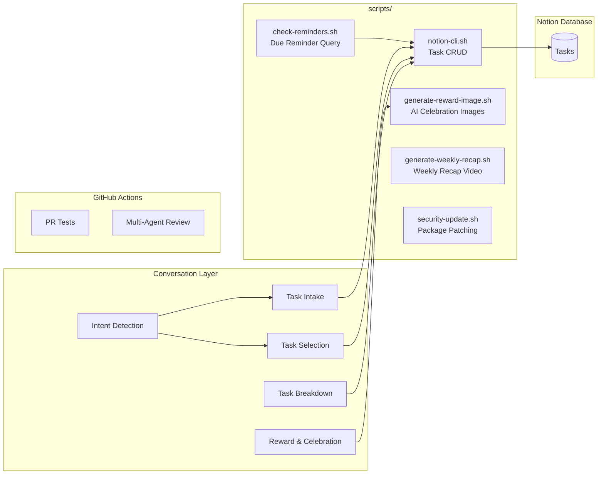
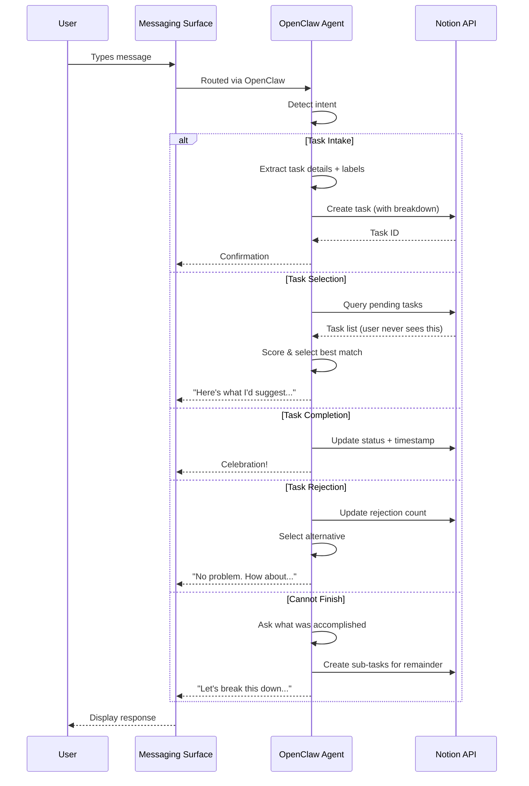
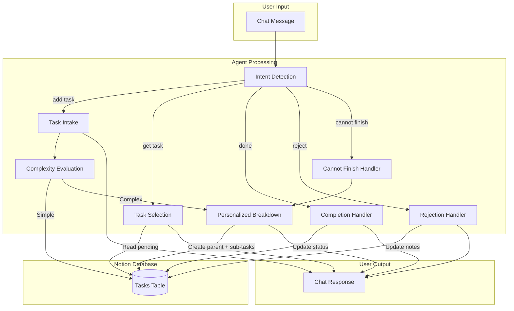
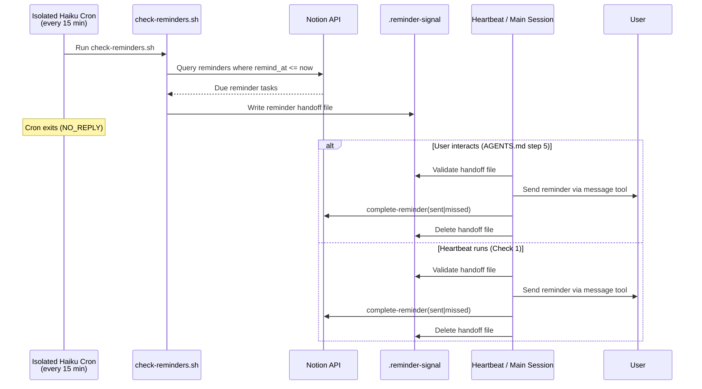
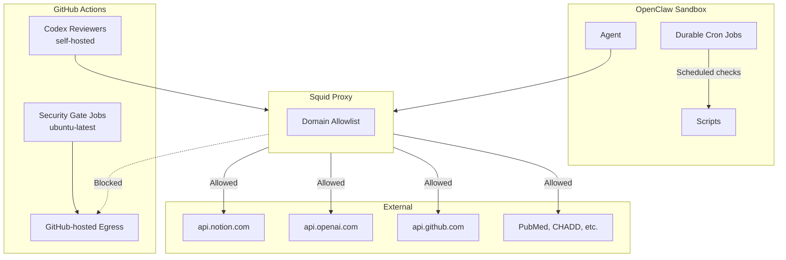

# hide-my-list: System Architecture

## Overview

hide-my-list = AI task manager. Users never see task list. Conversational AI intakes tasks, labels them, surfaces right task based on mood, time, urgency.

Runtime ownership split between main agent, heartbeat, isolated cron: see [Agent Capabilities](agent-capabilities.md).

## High-Level Architecture

## How It Works

No standalone server. OpenClaw agent *is* the application. It:

1. **Receives messages** from any configured messaging surface (web chat, Signal, Telegram, Discord, etc.)
2. **Detects intent** from natural language (add task, get task, complete, reject, etc.)
3. **Manages tasks** in Notion database via API
4. **Selects tasks** based on user mood, energy, available time
5. **Breaks down tasks** into concrete, personalized sub-steps
6. **Celebrates completions** with immediate positive reinforcement
7. **Delivers scheduled reminders** even when chat is idle

Interactive conversations: surface-agnostic. Durable cron jobs: isolated Haiku sessions for cost efficiency — execute scripts, write handoff files, no user-facing messages. Reminder delivery via heartbeat (every 60 min) and main-session startup check (AGENTS.md step 5, on every user interaction). All cron jobs silent when nothing actionable.

## Component Architecture

## Request Flow

## Data Flow

## Scheduled Reminders

OpenClaw agent: stateless between messages — no persistent process checks clock. For wall-clock reminders ("remind me at 6pm to email Melanie"), system uses **OpenClaw's durable cron** for periodic reminder check:

**How it works:**

1. At task intake, AI detects reminder language (e.g., "remind me at 6pm PT to call Sarah"), sets `is_reminder = true`, `remind_at` (full ISO 8601 with timezone), `reminder_status = pending`.
2. Durable cron (`reminder-check`) runs every 15 min as isolated Haiku session via OpenClaw native scheduling.
3. Cron runs `scripts/check-reminders.sh` — queries Notion for pending reminders where `remind_at <= now`.
4. Due reminders found → `check-reminders.sh` writes reminder handoff file in repo root (default: `.reminder-signal`, overridable via `REMINDER_SIGNAL_FILE` in `.env`). Isolated cron exits `NO_REPLY` — no reminder delivery.
5. Delivery via two mechanisms:
   - **AGENTS.md step 5** (opportunistic): every user conversation start, main session checks handoff file, delivers immediately.
   - **heartbeat Check 1** (hourly backstop, `docs/heartbeat-checks.md`): heartbeat reads handoff file every 60 min, delivers stranded reminders.
   Both paths validate handoff schema first: must be JSON with `reminders` array where each entry has string `page_id`, non-empty string `title`, `status` exactly `sent` or `missed`. Wrong shape or status = malformed; delivering session leaves file in place, sends ops alert via the OpenClaw `message` tool (`action: send`, `channel: signal`, `target: OPS_ALERT_SIGNAL_NUMBER`) describing the malformed handoff, and delivers/completes/deletes nothing. Valid handoff: each reminder sent to Signal via OpenClaw `message` tool (`action: send`, `channel: signal`), then `scripts/notion-cli.sh complete-reminder PAGE_ID sent|missed` atomically sets `Status` to `Completed`, `Reminder Status` to `sent` or `missed`, and `Completed At`, then deletes handoff file.
6. Reminders >15 min past due flagged `missed`, still delivered with shame-safe note: `This was due a bit ago — [task]. Want to handle it now or reschedule?`
7. Cron only fires when agent idle — won't interrupt mid-task. Better for ADHD focus.

Both `reminder-check` and `pull-main` use `sessionTarget: isolated` with `model: litellm/claude-haiku-4-5` and `payload.kind: agentTurn`. Deliberate design: previous architecture ran both on `sessionTarget: main`, loaded full Opus context for routine script work, burned ~18M tokens per 6 hours. Isolated cron cuts per-run cost by orders of magnitude. Trade-off: delivery deferred to next user interaction or heartbeat; fully idle case = up to ~75 min delay (discovery and delivery on separate schedules). If reminder delivery fails after handoff file written: fail visibly, leave file, don't mark `sent` or `missed` until delivery succeeds.

Deferred-delivery handoff = correctness constraint, not just implementation detail. OpenClaw has no post-announce delivery acknowledgment hook. Announce-only cron would mutate Notion before platform confirms delivery — cron crash or transport failure drops reminders permanently by moving them out of `pending` query set before delivery completes.

**Timezone handling:** AI converts user times (e.g., "6pm PT", "3pm Central") to full ISO 8601 with timezone offsets at intake. Check script compares against UTC — no timezone conversion at check time.

**Cron job expiry and drift:** Durable cron jobs auto-expire after 7 days. Heartbeat (every 60 min) verifies each job exists and matches canonical definition in `setup/cron/`, re-creating missing jobs and patching drifted ones. Drift comparison against full `CronCreate` contract: `name`, `durable`, `schedule`, `prompt`, `sessionTarget`, `model`, absence of direct-delivery `to`, `payload.kind`, `timeout-seconds`. `docs/heartbeat-checks.md` = authoritative comparison checklist (HEARTBEAT.md is a bootstrap stub that delegates to it). See `setup/cron/reminder-check.md` and `setup/cron/pull-main.md` for job definitions.

## Technology Choices

| Component | Technology | Rationale |
|-----------|------------|-----------|
| Runtime | OpenClaw Agent | Conversational AI *is* the app — no separate server needed |
| Storage | Notion Database | Zero setup, visual backup, rich API, schema flexibility |
| AI | Claude (via OpenClaw + LiteLLM) | Strong reasoning, structured output, conversation memory |
| Messaging | OpenClaw Surfaces | Interactive chat multi-channel (web, Signal, Telegram, Discord); reminder delivery via heartbeat + main-session startup check |
| CI/CD | GitHub Actions | Multi-agent review pipeline; GitHub-hosted gate jobs handle untrusted dispatch, self-hosted Codex reviewers inherit homelab proxy and VLAN restrictions |
| Scripts | Bash + curl | Minimal dependencies, runs anywhere |
| Scheduled Reminders | OpenClaw durable cron + check-reminders.sh | Isolated Haiku cron every 15 min writes `.reminder-signal`; heartbeat (60 min) + startup check deliver |
| Workspace Sync | OpenClaw durable cron + pull-main.sh | Isolated cron every 10 min keeps workspace current, recovers dirty pulls |
| Image Generation | OpenAI gpt-image-1 | Unique AI images for reward novelty |
| Video | ffmpeg | Weekly recap compilation |

## Core Runtime Variables

| Variable | Purpose |
|----------|---------|
| `NOTION_API_KEY` | Notion integration token |
| `NOTION_DATABASE_ID` | Tasks database identifier |
| `OPENAI_API_KEY` | OpenAI API key for reward image generation |
| `GITHUB_PAT` | Optional PAT for GitHub-maintenance scripts when `gh` not already authenticated |
| `REMINDER_SIGNAL_FILE` | Repo-root reminder handoff filename (default: `.reminder-signal`) |

## Prerequisites

| Dependency | Purpose |
|------------|---------|
| `python3` | JSON payload construction, image decoding |
| `curl` | API calls (Notion, OpenAI) |
| `ffmpeg` | Weekly recap video generation |
| `bc` | Arithmetic in recap script |

## Security Architecture

- **Network isolation**: Agent behind squid proxy with domain allowlist; kernel-level egress rules enforce independently of container
- **CI separation**: GitHub Actions reviewers have no access to infrastructure or home systems
- **Credential handling**: API keys and optional `GITHUB_PAT` in `.env` (gitignored), never logged or committed, runtime scripts load only needed variables per shell
- **Least privilege**: PR test workflows read-only permissions
- **No required webhook listener**: Durable cron replaced old socat listener for core ops; optional GitHub-triggered webhook paths remain extra inbound surface if configured

Full security architecture — agent trust model, threat model, prompt injection analysis — see [SECURITY.md](../SECURITY.md).