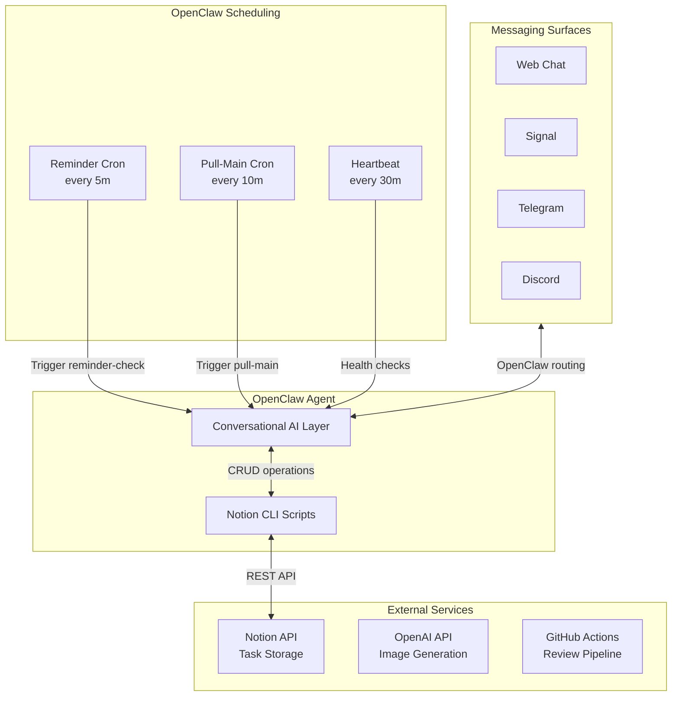
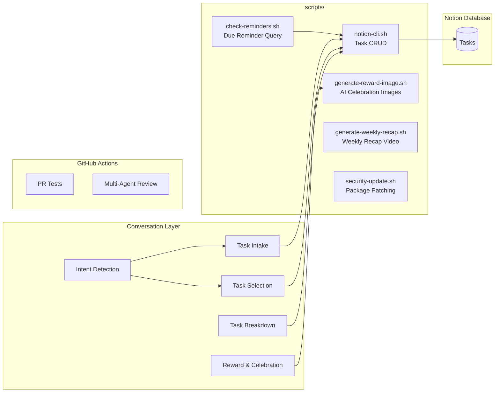
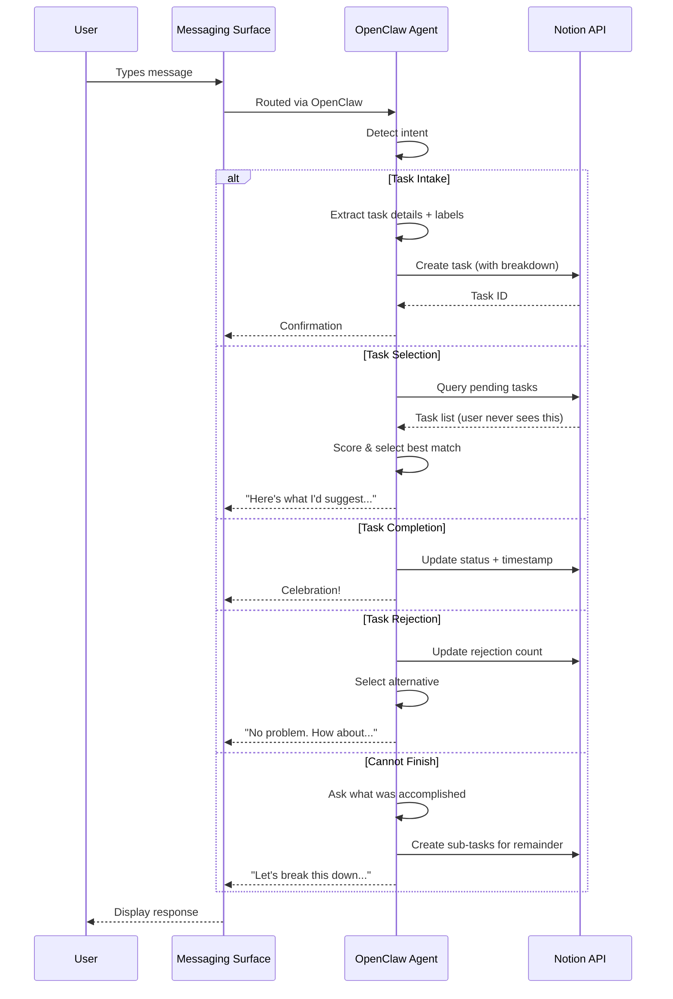
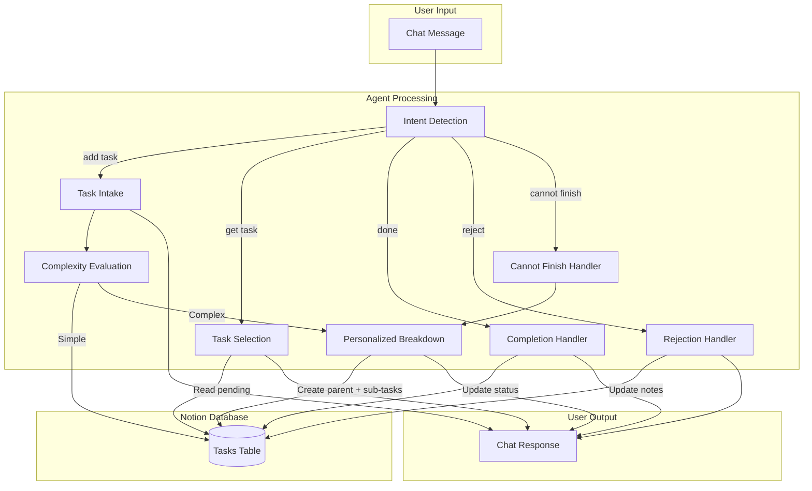
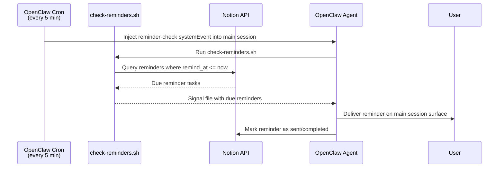
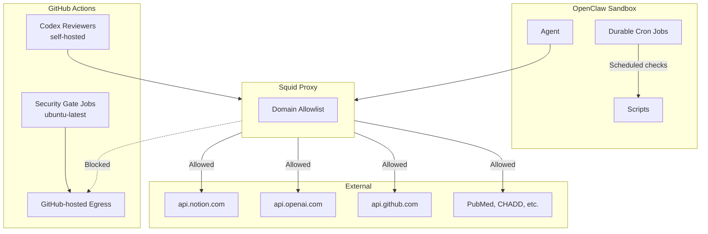

# hide-my-list: System Architecture

## Overview

hide-my-list is an AI-powered task manager where users never directly view their task list. The system uses conversational AI to intake tasks, intelligently label them, and surface the right task at the right time based on user mood, available time, and task urgency.

## High-Level Architecture

## How It Works

There is no standalone server. The OpenClaw agent *is* the application. It:

1. **Receives messages** from any configured messaging surface (web chat, Signal, Telegram, Discord, etc.)
2. **Detects intent** from natural language (add task, get task, complete, reject, etc.)
3. **Manages tasks** in a Notion database via API
4. **Selects tasks** based on user mood, energy, and available time
5. **Breaks down tasks** into concrete, personalized sub-steps
6. **Celebrates completions** with immediate positive reinforcement
7. **Delivers scheduled reminders** even when the chat is idle

Interactive conversations are surface-agnostic, and durable cron jobs inject `systemEvent` payloads into the main agent session for trusted reminder/sync work. All cron jobs should stay silent when there is nothing actionable.

## Component Architecture

## Request Flow

## Data Flow

## Scheduled Reminders

The OpenClaw agent model is stateless between messages — there is no persistent process to check a clock. To support wall-clock reminders ("remind me at 6pm to email Melanie"), the system uses **OpenClaw's durable cron** to periodically run a reminder check:

**How it works:**

1. During task intake, the AI detects reminder-style language (e.g., "remind me at 6pm PT to call Sarah") and sets `is_reminder = true`, `remind_at` (full ISO 8601 with timezone), and `reminder_status = pending`.
2. A durable cron job (`reminder-check`) runs every 5 minutes via OpenClaw's native scheduling.
3. The cron job injects a `systemEvent` into the main agent session, which then runs `scripts/check-reminders.sh` to query Notion for pending reminders where `remind_at <= now`.
4. If due reminders are found, `check-reminders.sh` writes `.reminder-signal`; the same cron-driven agent session reads that file, delivers the reminders on the already-bound `main` session surface, marks them as `sent` or `missed` in Notion, and deletes the handoff file.
5. Reminders more than 15 minutes past due are flagged as `missed` but still delivered with a note.
6. The cron job only fires when the agent is idle — it won't interrupt the user mid-task, which is better for ADHD focus.

`reminder-check` and `pull-main` use `sessionTarget: main`, `payload.kind: systemEvent`, and `delivery.mode: none` so trusted cron work re-enters the user-owned session without spawning a second conversational thread. For reminders, outbound routing is deterministic because the cron run can only speak back through the surface already attached to `main`; it must not choose a different recipient or channel. If `reminder-check` finds no due reminders, or if `main` has no attached user-facing surface when `.reminder-signal` exists, the main agent should reply with `NO_REPLY` and leave the handoff file untouched for a later retry. If reminder delivery fails after `.reminder-signal` is written, the session should fail visibly, leave the file in place, and avoid marking the reminder `sent` or `missed` until delivery actually succeeds.

**Timezone handling:** The AI converts user-specified times (e.g., "6pm PT", "3pm Central") to full ISO 8601 timestamps with timezone offsets at intake time. The check script compares against UTC — no timezone conversion at check time.

**Cron job expiry and drift:** Durable cron jobs auto-expire after 7 days. The heartbeat (every 30 min) verifies each cron job still exists and still matches the canonical definition in `setup/cron/`, re-creating missing jobs and patching drifted ones. See `setup/cron/reminder-check.md` for the job definition.

## Technology Choices

| Component | Technology | Rationale |
|-----------|------------|-----------|
| Runtime | OpenClaw Agent | Conversational AI *is* the app — no separate server needed |
| Storage | Notion Database | Zero setup, visual backup, rich API, schema flexibility |
| AI | Claude (via OpenClaw + LiteLLM) | Strong reasoning, structured output, conversation memory |
| Messaging | OpenClaw Surfaces | Interactive chat can be multi-channel (web, Signal, Telegram, Discord); trusted reminder/sync cron work reuses the main-agent delivery path |
| CI/CD | GitHub Actions | Multi-agent review pipeline; GitHub-hosted gate jobs handle untrusted dispatch, while self-hosted Codex reviewers inherit the homelab proxy and VLAN restrictions |
| Scripts | Bash + curl | Minimal dependencies, runs anywhere |
| Scheduled Reminders | OpenClaw durable cron + check-reminders.sh | Native cron every 5 min, heartbeat re-registers expired jobs and patches spec drift |
| Workspace Sync | OpenClaw durable cron + pull-main.sh | Native cron every 10 min keeps the workspace current and recovers dirty pulls |
| Image Generation | OpenAI gpt-image-1 | Unique AI images for reward novelty |
| Video | ffmpeg | Weekly recap compilation |

## Environment Variables

| Variable | Purpose |
|----------|---------|
| `NOTION_API_KEY` | Notion integration token |
| `NOTION_DATABASE_ID` | Tasks database identifier |
| `OPENAI_API_KEY` | OpenAI API key for reward image generation |
| `REMINDER_SIGNAL_FILE` | Path for reminder signal handoff (default: `.reminder-signal`) |

## Prerequisites

| Dependency | Purpose |
|------------|---------|
| `python3` | JSON payload construction, image decoding |
| `curl` | API calls (Notion, OpenAI) |
| `ffmpeg` | Weekly recap video generation |
| `bc` | Arithmetic in recap script |

## Security Architecture

- **Network isolation**: Agent runs behind squid proxy with domain allowlist; kernel-level egress rules enforce this independently of the container
- **CI separation**: GitHub Actions reviewers have no access to infrastructure or home systems
- **Credential handling**: API keys in `.env` (gitignored), never logged or committed
- **Least privilege**: PR test workflows have read-only permissions
- **No required webhook listener**: Durable cron replaced the old socat listener for core operations, though optional GitHub-triggered webhook paths remain an extra inbound surface if configured

For the full security architecture — including agent trust model, threat model, and prompt injection analysis — see [SECURITY.md](../SECURITY.md).
