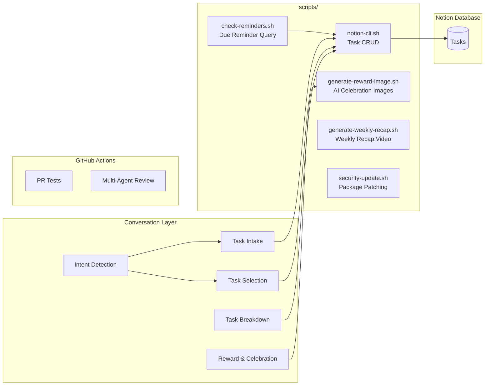
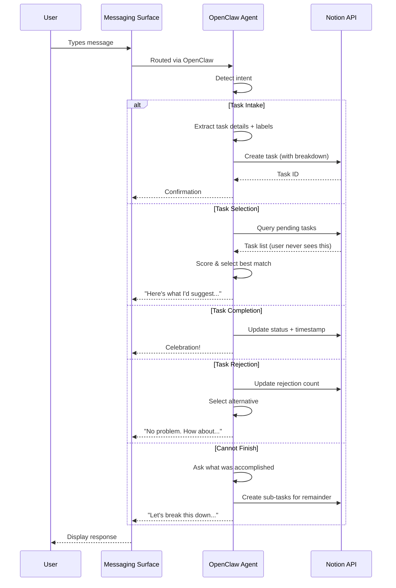
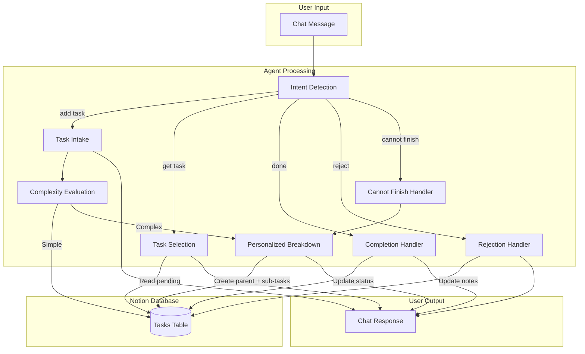
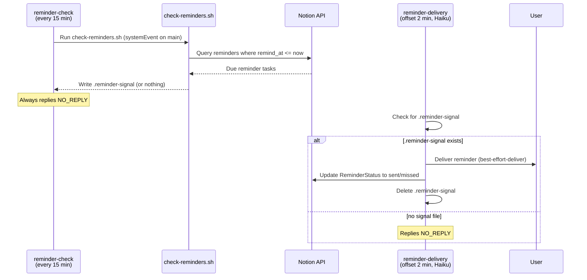
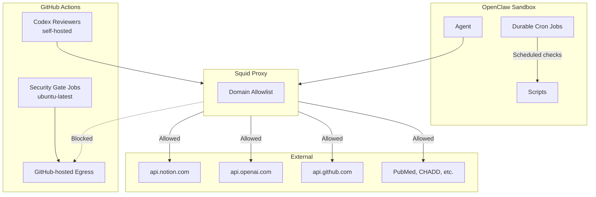

# hide-my-list: System Architecture

## Overview

hide-my-list is an AI-powered task manager where users never directly view their task list. The system uses conversational AI to intake tasks, intelligently label them, and surface the right task at the right time based on user mood, available time, and task urgency.

## High-Level Architecture

## How It Works

There is no standalone server. The OpenClaw agent *is* the application. It:

1. **Receives messages** from any configured messaging surface (web chat, Signal, Telegram, Discord, etc.)
2. **Detects intent** from natural language (add task, get task, complete, reject, etc.)
3. **Manages tasks** in a Notion database via API
4. **Selects tasks** based on user mood, energy, and available time
5. **Breaks down tasks** into concrete, personalized sub-steps
6. **Celebrates completions** with immediate positive reinforcement
7. **Delivers scheduled reminders** even when the chat is idle

Interactive conversations are surface-agnostic, and durable cron jobs inject `systemEvent` payloads into the main agent session for trusted reminder/sync work. All cron jobs should stay silent when there is nothing actionable.

## Component Architecture

## Request Flow

## Data Flow

## Scheduled Reminders

The OpenClaw agent model is stateless between messages — there is no persistent process to check a clock. To support wall-clock reminders ("remind me at 6pm to email Melanie"), the system uses **two durable cron jobs** — a procedural polling job and an agentic delivery job:

**How it works:**

1. During task intake, the AI detects reminder-style language (e.g., "remind me at 6pm PT to call Sarah") and sets `is_reminder = true`, `remind_at` (full ISO 8601 with timezone), and `reminder_status = pending`.
2. A procedural cron job (`reminder-check`) runs every 15 minutes via OpenClaw's durable cron. It injects a `systemEvent` into the main session, runs `scripts/check-reminders.sh` to query Notion, and always replies `NO_REPLY`. If due reminders are found, the script writes `.reminder-signal`.
3. A separate delivery cron job (`reminder-delivery`) runs 2 minutes after each check in an **isolated session** (not on `main`), pinned to `litellm/claude-haiku-4-5`. It checks for `.reminder-signal` — if absent, it replies `NO_REPLY` (near-zero token cost). If present, it reads the signal, delivers each reminder to the user via `best-effort-deliver`, and updates Notion `ReminderStatus`.
4. Status classification (`sent` vs `missed`) happens at actual delivery time: reminders more than 15 minutes past `remind_at` at the moment of delivery are flagged `missed` but still delivered with a note. Reminder delivery does **not** auto-complete the main task — task completion is a separate user action.
5. Both cron jobs only fire when the REPL is idle — they won't interrupt the user mid-task, which is better for ADHD focus.

`reminder-check` and `pull-main` use `sessionTarget: main`, `payload.kind: systemEvent`, and `delivery.mode: none` so trusted procedural cron work re-enters the user-owned session silently. `reminder-delivery` runs in an isolated cron session (no `sessionTarget`) with `delivery.mode: best-effort-deliver` — this is a deliberate security boundary: the main session may contain untrusted GitHub content, and isolating delivery keeps the reminder flow at [BC] (credentials + external actions, but no untrusted input). If reminder delivery fails after `.reminder-signal` is written, the delivery job leaves the file in place and avoids marking affected reminders as `sent` or `missed` until delivery actually succeeds.

**Timezone handling:** The AI converts user-specified times (e.g., "6pm PT", "3pm Central") to full ISO 8601 timestamps with timezone offsets at intake time. The check script compares against UTC — no timezone conversion at check time.

**Cron job expiry and drift:** Durable cron jobs auto-expire after 7 days. The heartbeat (every 60 min) verifies each cron job still exists and still matches the canonical definition in `setup/cron/`, re-creating missing jobs and patching drifted ones. Drift comparison is against the full `CronCreate` contract, including `name`, `durable`, `schedule`, `prompt`, `sessionTarget` (when required), the absence of any direct-delivery `to`, `payload.kind`, delivery behavior (`delivery.mode` or `best-effort-deliver`), `model` (when the spec pins one), and `timeout-seconds`. `HEARTBEAT.md` is the authoritative comparison checklist. `pull-main` also provides an immediate fast path: after a clean pull that advances `HEAD`, it diffs that invocation's before/after commits and reapplies any changed `setup/cron/` specs right away, while staying silent unless the run needs human attention. See `setup/cron/reminder-check.md`, `setup/cron/reminder-delivery.md`, and `setup/cron/pull-main.md` for the job definitions.

## Technology Choices

| Component | Technology | Rationale |
|-----------|------------|-----------|
| Runtime | OpenClaw Agent | Conversational AI *is* the app — no separate server needed |
| Storage | Notion Database | Zero setup, visual backup, rich API, schema flexibility |
| AI | Claude (via OpenClaw + LiteLLM) | Strong reasoning, structured output, conversation memory |
| Messaging | OpenClaw Surfaces | Interactive chat can be multi-channel (web, Signal, Telegram, Discord); reminder delivery uses best-effort-deliver from an isolated cron session |
| CI/CD | GitHub Actions | Multi-agent review pipeline; GitHub-hosted gate jobs handle untrusted dispatch, while self-hosted Codex reviewers inherit the homelab proxy and VLAN restrictions |
| Scripts | Bash + curl | Minimal dependencies, runs anywhere |
| Scheduled Reminders | OpenClaw durable cron (reminder-check + reminder-delivery) | Procedural polling every 15 min writes signal; Haiku delivery job runs offset, heartbeat re-registers and patches drift |
| Workspace Sync | OpenClaw durable cron + pull-main.sh | Native cron every 10 min keeps the workspace current and recovers dirty pulls |
| Image Generation | OpenAI gpt-image-1 | Unique AI images for reward novelty |
| Video | ffmpeg | Weekly recap compilation |

## Environment Variables

| Variable | Purpose |
|----------|---------|
| `NOTION_API_KEY` | Notion integration token |
| `NOTION_DATABASE_ID` | Tasks database identifier |
| `OPENAI_API_KEY` | OpenAI API key for reward image generation |
| `REMINDER_SIGNAL_FILE` | Path for reminder signal handoff (default: `.reminder-signal`) |

## Prerequisites

| Dependency | Purpose |
|------------|---------|
| `python3` | JSON payload construction, image decoding |
| `curl` | API calls (Notion, OpenAI) |
| `ffmpeg` | Weekly recap video generation |
| `bc` | Arithmetic in recap script |

## Security Architecture

- **Network isolation**: Agent runs behind squid proxy with domain allowlist; kernel-level egress rules enforce this independently of the container
- **CI separation**: GitHub Actions reviewers have no access to infrastructure or home systems
- **Credential handling**: API keys in `.env` (gitignored), never logged or committed
- **Least privilege**: PR test workflows have read-only permissions
- **No required webhook listener**: Durable cron replaced the old socat listener for core operations, though optional GitHub-triggered webhook paths remain an extra inbound surface if configured

For the full security architecture — including agent trust model, threat model, and prompt injection analysis — see [SECURITY.md](../SECURITY.md).
