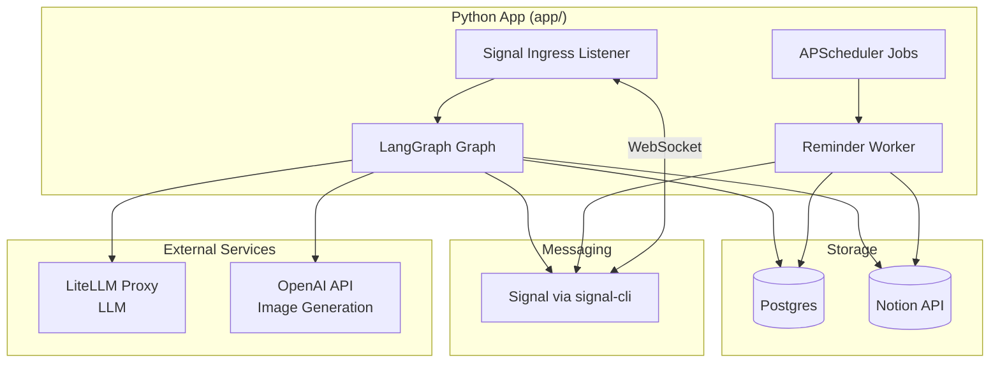

# hide-my-list: System Architecture

## Overview

hide-my-list = AI task manager. Users never see their task list. A conversational
AI intakes tasks, labels them, and surfaces the right task based on mood, time,
and urgency.

The runtime is a Python + LangGraph application deployed as a Docker Compose
stack.

## Container Topology

| Service | Image | Role |
|---|---|---|
| `app` | local Python 3.12 build | LangGraph runtime, APScheduler, reminder worker |
| `signal-cli` | `bbernhard/signal-cli-rest-api` (pinned by digest) | Signal bridge (infra-provided) |
| `postgres` | `postgres:16-alpine` | LangGraph checkpointer + reminder outbox + scheduler + private metadata |

`docker/compose.yaml` declares an internal Docker network for app ↔ postgres ↔
signal-cli. No host firewall rules are specified here — deployment-side egress
enforcement is the infra operator's concern.

## High-Level Architecture



## How It Works

The app container runs four concurrent async tasks:

1. **Signal ingress** (`app/ingress/signal_listener.py`) — WebSocket consumer on
   signal-cli REST API. Maps `(peer, text)` → `graph.ainvoke(...)` with
   `thread_id = peer` for per-peer conversation isolation.

2. **LangGraph graph** (`app/graph/graph.py`) — Eight intent nodes (`ADD_TASK`,
   `GET_TASK`, `COMPLETE`, `REJECT`, `CANNOT_FINISH`, `CHECK_IN`, `NEED_HELP`,
   `CHAT`) with deterministic conditional edges. `PostgresSaver` checkpoints
   conversation state per peer.

3. **APScheduler** (`app/scheduler/scheduler.py`) — Declarative job list
   (`app/scheduler/jobs.py`) with `PostgresJobStore`. Orphan reconciliation on
   startup removes stale jobs not in the declared list.

4. **Reminder worker** (`app/scheduler/reminder_worker.py`) — Runs as the
   `reminder_dispatcher` APScheduler job (every 30 seconds). Claims due
   `reminder_outbox` rows with `SELECT FOR UPDATE SKIP LOCKED`, delivers via
   signal-cli, then marks delivered and calls `scripts/notion-cli.sh
   complete-reminder`.

## Reminder Delivery

At-least-once with idempotency. The `reminder_outbox` table is the durable state
machine:

```
pending → scheduled → delivering → delivered
                             ↓
                          failed (backoff: 1m, 5m, 30m, 2h, 8h, cap 5)
                             ↓
                           dead → ops alert
```

Duplicates are possible if the worker crashes between signal-cli accept and
Postgres commit. This matches the existing at-least-once contract: prefer
duplicate delivery over loss.

## Scheduled Jobs

| Job | Interval | Function |
|-----|----------|----------|
| `reminder_dispatcher` | 30s | Claim + deliver due reminders |
| `notion_health` | 15 min | Ping Notion API; enqueue ops alert on failure |
| `ops_alerts_drain` | 5 min | Send pending ops alerts via Signal |
| `check_in_dispatcher` | 10 min | Trigger CHECK_IN graph turns for due tasks |
| `state_audit` | Daily 03:00 USER_TZ | VACUUM + prune `recent_outbound` (90-day retention) |
| `weekly_recap` | Sun 18:00 USER_TZ | Generate weekly recap |

## Model Routing

`app/models.py` reads `setup/model-tiers.json` at startup and validates all
model IDs. All LLM calls go through a LiteLLM proxy via `ChatOpenAI` with
`ANTHROPIC_BASE_URL` as the OpenAI-compatible `/v1` endpoint. LiteLLM
dispatches by model alias; the app has no direct connection to any provider
API. `ANTHROPIC_API_KEY` is forwarded as the bearer token (set to any
non-empty placeholder when the proxy does not require auth).

## Security

- Narrow code paths are the injection containment. The app has no `fetch_url`,
  no shell tool, no `git pull`, no self-modification surface. Tools are limited
  to Notion CRUD, signal-cli, and LLM calls.
- LangSmith disabled by default. Startup guard refuses to boot when
  `LANGSMITH_TRACING=true` unless `ALLOW_PRIVATE_TRACE_EXPORT=true` is also set.
- API keys in `.env` (gitignored), never logged or committed.
- `reward_manifests` stored in Postgres only, never logged or committed.

## Key Environment Variables

| Variable | Purpose |
|----------|---------|
| `NOTION_API_KEY` | Notion integration token |
| `NOTION_DATABASE_ID` | Tasks database identifier |
| `ANTHROPIC_BASE_URL` | LiteLLM proxy OpenAI-compatible `/v1` endpoint (required) |
| `ANTHROPIC_API_KEY` | Bearer token for LiteLLM proxy (required; use placeholder if proxy needs no auth) |
| `OPENAI_API_KEY` | Reward image generation |
| `DATABASE_URL` | Postgres connection string |
| `SIGNAL_CLI_URL` | signal-cli REST API base URL |
| `SIGNAL_ACCOUNT` | E.164 Signal account number |
| `AUTHORIZED_PEERS` | Comma-separated E.164 allowed inbound peers; empty or unset refuses startup |
| `USER_TZ` | User's IANA timezone (default `America/Chicago`) |

## Outbound Dependencies

For the infra operator / VM-isolation configuration:

- `api.notion.com` — Notion CRUD
- LiteLLM proxy (`ANTHROPIC_BASE_URL`) — all LLM calls; proxy handles provider dispatch
- `api.openai.com` — reward image generation
- Signal infrastructure — managed by the `signal-cli` container

## CI/CD

See `docs/agentic-pipeline-learnings.md` for the multi-agent review pipeline.
Python source changes trigger `python-validation.yml` (ruff + mypy + pytest-unit).
