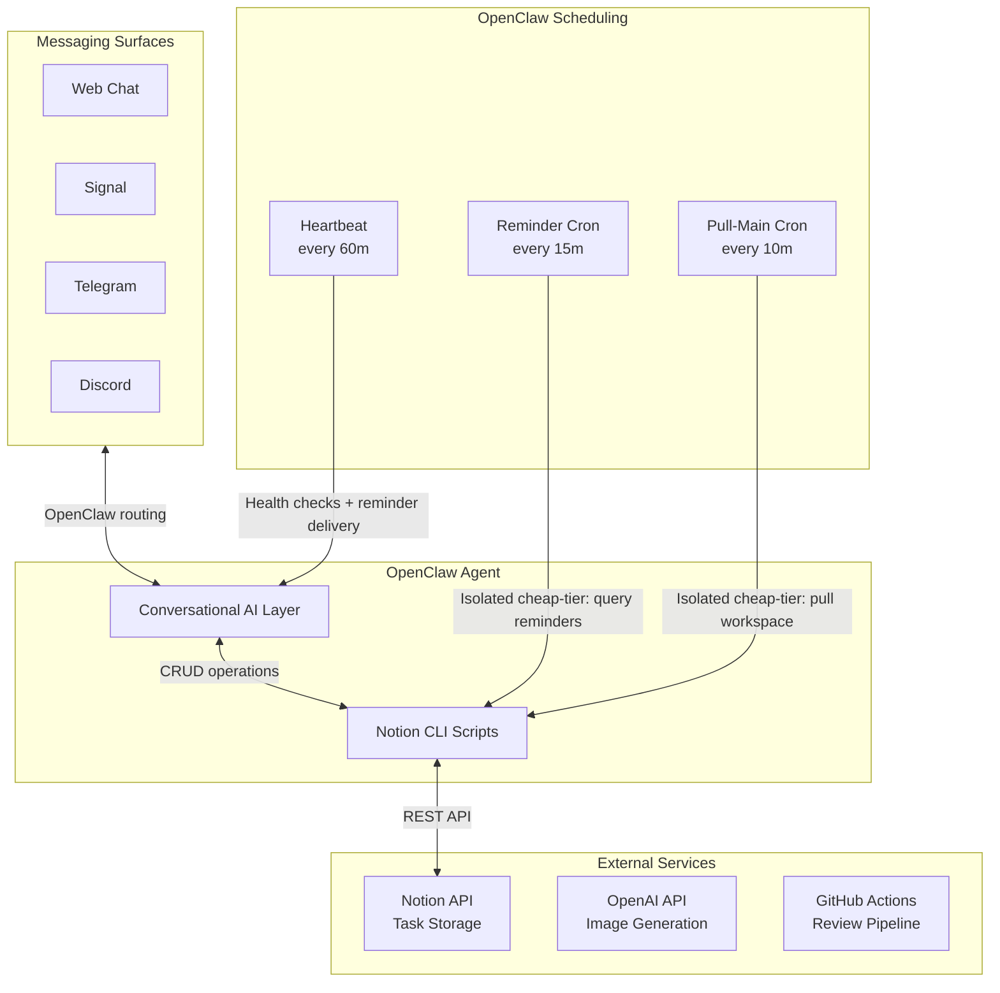
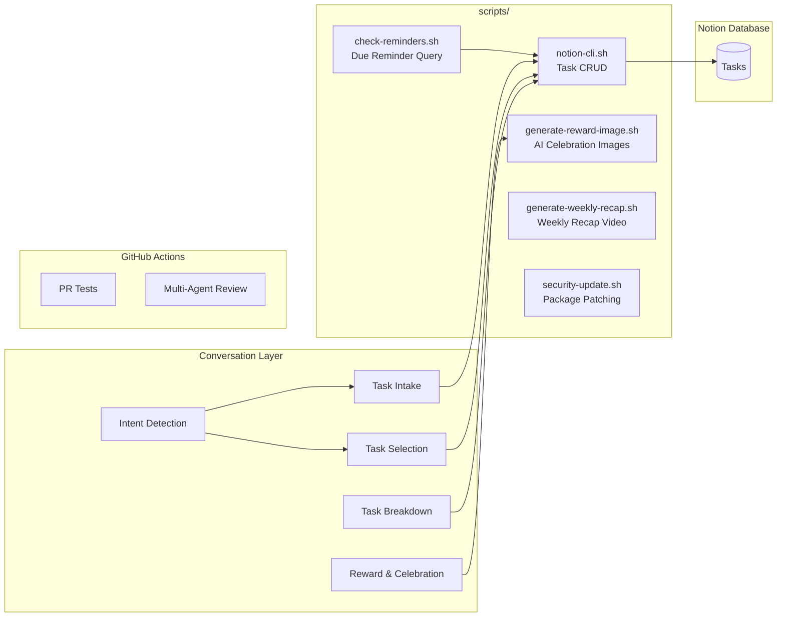
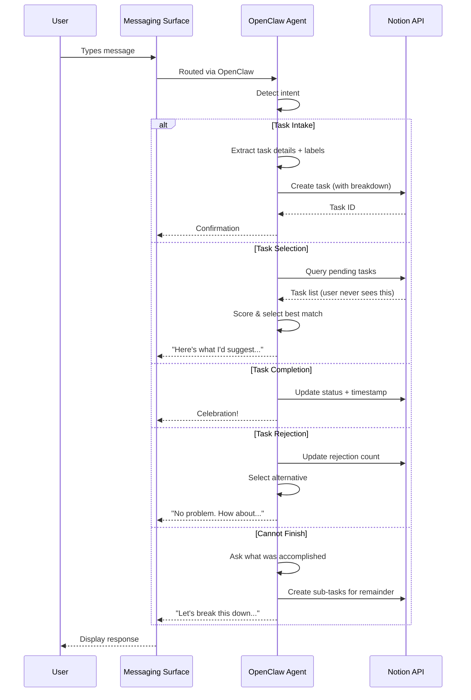
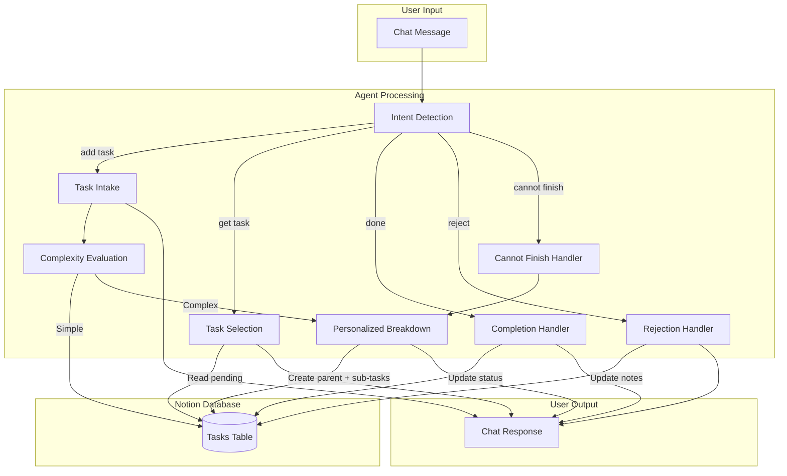
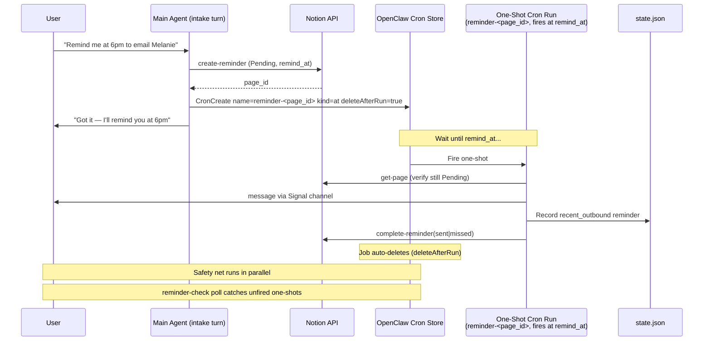
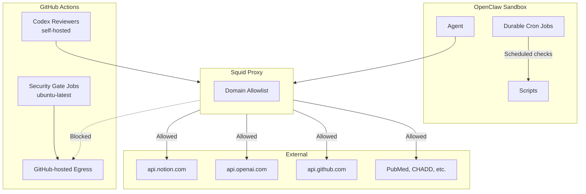

# hide-my-list: System Architecture

## Overview

hide-my-list = AI task manager. Users never see task list. Conversational AI intakes tasks, labels them, surfaces right task based on mood, time, urgency.

Runtime ownership split between main agent, heartbeat, isolated cron: see [Agent Capabilities](agent-capabilities.md).

## High-Level Architecture

## How It Works

No standalone server. OpenClaw agent *is* the application. It:

1. **Receives messages** from any configured messaging surface (web chat, Signal, Telegram, Discord, etc.)
2. **Detects intent** from natural language (add task, get task, complete, reject, etc.)
3. **Manages tasks** in Notion database via API
4. **Selects tasks** based on user mood, energy, available time
5. **Breaks down tasks** into concrete, personalized sub-steps
6. **Celebrates completions** with immediate positive reinforcement
7. **Delivers scheduled reminders** even when chat is idle

Interactive conversations: surface-agnostic. Durable cron jobs: isolated cheap-tier sessions for cost efficiency — execute scripts, write handoff files, no user-facing messages. Reminder delivery: one-shot `reminder-<page_id>` cron registered at intake fires at exact `remind_at`; `reminder-check` poll + heartbeat + startup check are safety-net paths only. All cron jobs silent when nothing actionable.

## Component Architecture

## Request Flow

## Data Flow

## Scheduled Reminders

OpenClaw agent: stateless between messages — no persistent process checks clock. For wall-clock reminders ("remind me at 6pm to email Melanie"), system uses **OpenClaw's native one-shot cron** at intake for exact-time delivery, with a recurring polling cron as a safety net:

**How it works:**

1. At task intake, AI detects reminder language (e.g., "remind me at 6pm PT to call Sarah"), sets `is_reminder = true`, `remind_at` (full ISO 8601 with timezone), `reminder_status = pending`. After `notion-cli.sh create-reminder` returns the Notion `page_id`, the same intake turn calls `CronCreate` to register a one-shot job named `reminder-<page_id>` with `schedule.kind: "at"`, `at: remind_at`, `deleteAfterRun: true`, `sessionTarget: main`. Registering the cron in the same turn also satisfies OpenClaw's `agent-runner-reminder-guard` (which would otherwise append `"Note: I did not schedule a reminder in this turn..."` to the confirmation reply). See `setup/cron/reminder-delivery.md` for the full contract.
2. At `remind_at`, OpenClaw fires the one-shot cron as a `sessionTarget: main` agent turn running the cheap-tier model. The fired turn: reads the Notion row to confirm it is still `Pending`, sends the reminder via the OpenClaw `message` tool (`action: send`, `channel: signal`), atomically updates `state.json.recent_outbound` with a short-lived entry (`type: reminder`, `page_id`, `title`, `status`, `sent_at`, `awaiting_response: true`, `expires_at` ~24h later), then runs `scripts/notion-cli.sh complete-reminder PAGE_ID sent|missed` to atomically set `Status → Completed`, `Reminder Status → sent|missed`, `Completed At`. On `ok` outcome the job self-deletes (`deleteAfterRun: true`).
3. Reminders >15 min past due flagged `missed`, still delivered with shame-safe note: `This was due a bit ago — [task]. Want to handle it now or reschedule?`
4. **Safety net** — recurring `reminder-check` cron runs every 15 min as an isolated cheap-tier session, executes `scripts/check-reminders.sh`, queries Notion for pending reminders where `remind_at <= now`, and writes the handoff file (default: `.reminder-signal`, overridable via `REMINDER_SIGNAL_FILE` in `.env`) for delivery via AGENTS.md step 5 (opportunistic, on user interaction) or heartbeat Check 1 (hourly). This catches anything the one-shot path misses: `CronCreate` failure at intake, gateway down at fire time, or reminders saved before the one-shot architecture shipped. Both delivery paths validate handoff schema first: must be JSON with `reminders` array where each entry has string `page_id`, non-empty string `title`, `status` exactly `sent` or `missed`. Wrong shape or status = malformed; delivering session leaves file in place, resolves `OPS_ALERT_SIGNAL_NUMBER` from `.env` to concrete Signal recipient, sends ops alert via the OpenClaw `message` tool (`action: send`, `channel: signal`, `target: "<resolved OPS_ALERT_SIGNAL_NUMBER>"`) describing the malformed handoff, and delivers/completes/deletes nothing. Valid handoff: same delivery sequence as the one-shot (Signal message → `state.json.recent_outbound` write → `complete-reminder` → handoff delete).

`state.json.recent_outbound` is the cross-session continuity bridge. It lets a fresh session connect terse follow-ups like "I did it" or "later" to the reminder that was just delivered, even after the reminder page is already completed in Notion. Entries should be pruned after they expire or once the user's reply clearly resolves them. The one-shot cron path and the safety-net path produce identical `recent_outbound` entries, so the next user reply resolves correctly regardless of which path delivered.

**Duplicate-delivery trade-off:** if the one-shot fires and delivers but crashes before `complete-reminder` succeeds, the safety net will pick the still-Pending row up at the next 15-min poll and re-deliver. We accept at-least-once over at-most-once — getting a reminder twice is far better than not getting it at all. The one-shot prompt runs `complete-reminder` immediately after delivery confirmation, with no other work in between, to minimize the duplicate window.

Both `reminder-check` and `pull-main` use `sessionTarget: isolated` with the cheap-tier model (per `modelTiers` in `setup/openclaw.json.template`), `payload.kind: agentTurn`, and `payload.lightContext: true` (skips bootstrap file loading — cron prompts are self-contained scripts). Deliberate design: previous architecture ran both on `sessionTarget: main`, loaded full Opus context for routine script work, burned ~18M tokens per 6 hours. Isolated cheap-tier cron with empty bootstrap cuts per-run cost by orders of magnitude. The one-shot delivery cron is registered separately at intake and uses `sessionTarget: main` with `lightContext: false` so it has SOUL.md tone + AGENTS.md state.json conventions in scope; the cheap-tier model still drives the turn, but bootstrap is loaded so the structured delivery prompt does not need to inline tone guidance. If reminder delivery fails after the one-shot fires: fail visibly without calling `complete-reminder`, and let the safety-net path deliver on its next sweep.

**Timezone handling:** AI converts user times (e.g., "6pm PT", "3pm Central") to full ISO 8601 with timezone offsets at intake. Both the one-shot cron's `schedule.at` field and the polling check script compare against UTC — no timezone conversion at fire/check time.

**Cron drift and re-registration:** Heartbeat (every 60 min) verifies each canonical recurring job exists and matches its definition in `setup/cron/`, re-creating missing jobs and patching drifted ones. Drift comparison against full `CronCreate` contract: `name`, `durable`, `schedule`, `prompt`, `sessionTarget`, `model`, absence of direct-delivery `to`, `payload.kind`, `payload.lightContext`, `timeout-seconds`. This guards against manual deletion, gateway data loss, or other failure modes that drop the job. `docs/heartbeat-checks.md` = authoritative comparison checklist (HEARTBEAT.md is a bootstrap stub that delegates to it). One-shot `reminder-<page_id>` jobs are NOT covered by drift / re-registration — they self-delete after firing, so checking their continued presence makes no sense; the safety-net polling path catches anything that fails to fire. See `setup/cron/reminder-check.md`, `setup/cron/pull-main.md`, and `setup/cron/reminder-delivery.md` for job definitions.

## Technology Choices

| Component | Technology | Rationale |
|-----------|------------|-----------|
| Runtime | OpenClaw Agent | Conversational AI *is* the app — no separate server needed |
| Storage | Notion Database | Zero setup, visual backup, rich API, schema flexibility |
| AI | Claude (via OpenClaw + LiteLLM) | Strong reasoning, structured output, conversation memory |
| Messaging | OpenClaw Surfaces | Interactive chat multi-channel (web, Signal, Telegram, Discord); reminder delivery via one-shot `reminder-<page_id>` cron (exact time); heartbeat + startup = safety net |
| CI/CD | GitHub Actions | Multi-agent review pipeline; GitHub-hosted gate jobs handle untrusted dispatch, self-hosted Codex reviewers inherit homelab proxy and VLAN restrictions |
| Scripts | Bash + curl | Minimal dependencies, runs anywhere |
| Scheduled Reminders | OpenClaw native one-shot cron (`schedule.kind: at`, `deleteAfterRun: true`) registered at intake, with recurring `reminder-check` poll + `.reminder-signal` handoff as safety net | One-shot fires at exact `remind_at`; safety-net poll catches `CronCreate` failures or unfired jobs |
| Workspace Sync | OpenClaw durable cron + pull-main.sh | Isolated cron every 10 min keeps workspace current, recovers dirty pulls |
| Image Generation | OpenAI gpt-image-1 | Unique AI images for reward novelty |
| Video | ffmpeg | Weekly recap compilation |

## Core Runtime Variables

| Variable | Purpose |
|----------|---------|
| `NOTION_API_KEY` | Notion integration token |
| `NOTION_DATABASE_ID` | Tasks database identifier |
| `OPENAI_API_KEY` | OpenAI API key for reward image generation |
| `GITHUB_PAT` | Optional PAT for GitHub-maintenance scripts when `gh` not already authenticated |
| `REMINDER_SIGNAL_FILE` | Repo-root reminder handoff filename (default: `.reminder-signal`) |

## Prerequisites

| Dependency | Purpose |
|------------|---------|
| `python3` | JSON payload construction, image decoding |
| `curl` | API calls (Notion, OpenAI) |
| `ffmpeg` | Weekly recap video generation |
| `bc` | Arithmetic in recap script |

## Security Architecture

- **Network isolation**: Agent behind squid proxy with domain allowlist; kernel-level egress rules enforce independently of container
- **CI separation**: GitHub Actions reviewers have no access to infrastructure or home systems
- **Credential handling**: API keys and optional `GITHUB_PAT` in `.env` (gitignored), never logged or committed, runtime scripts load only needed variables per shell
- **Least privilege**: PR test workflows read-only permissions
- **No required webhook listener**: Durable cron replaced old socat listener for core ops; optional GitHub-triggered webhook paths remain extra inbound surface if configured

Full security architecture — agent trust model, threat model, prompt injection analysis — see [SECURITY.md](../SECURITY.md).
