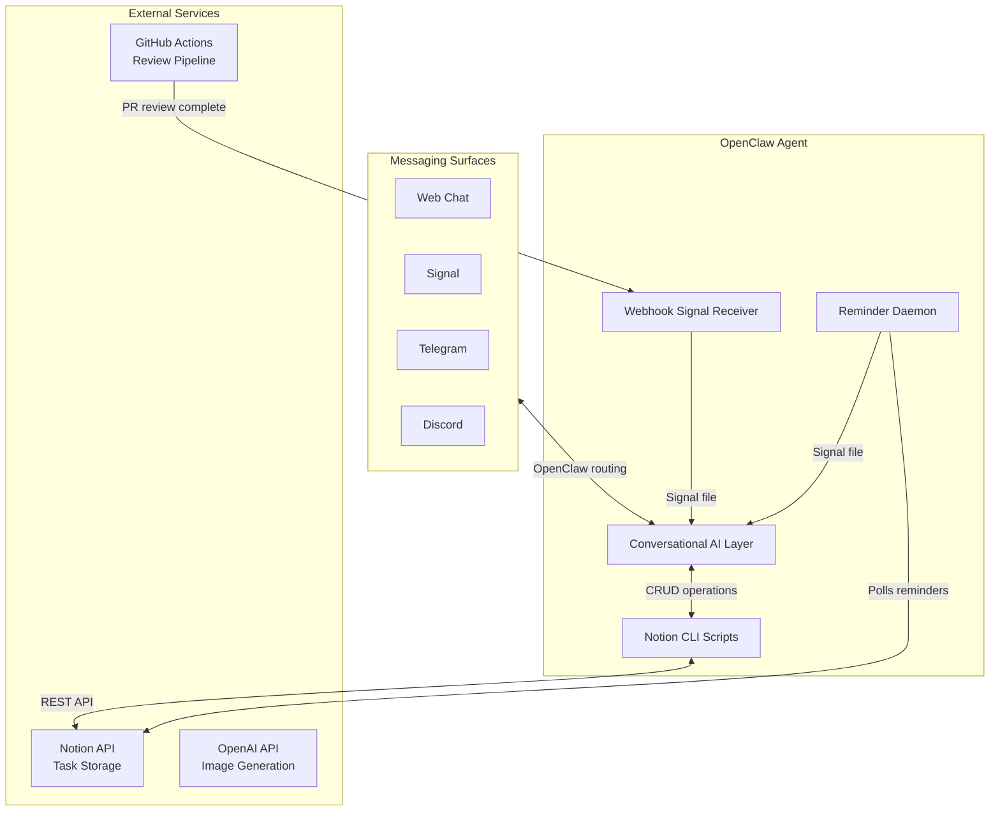
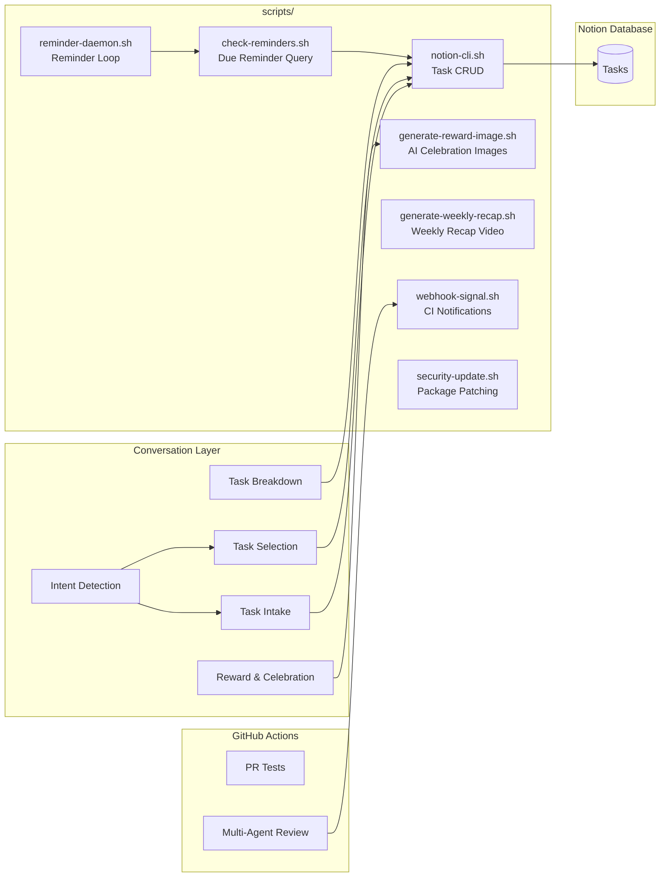
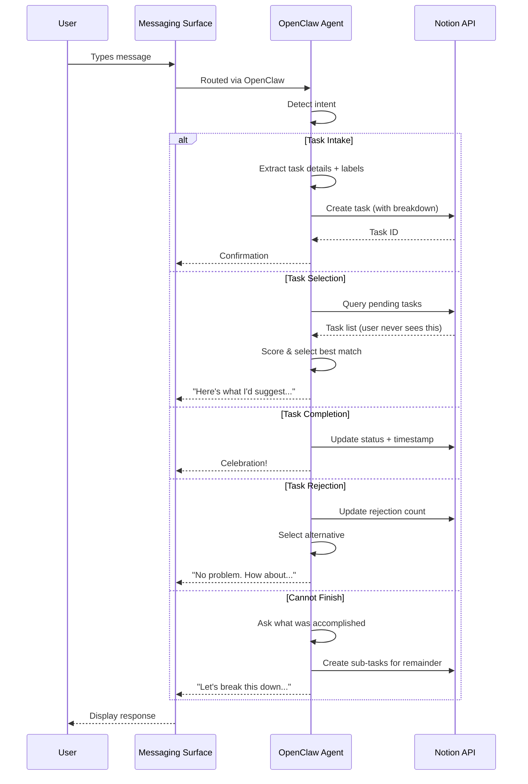
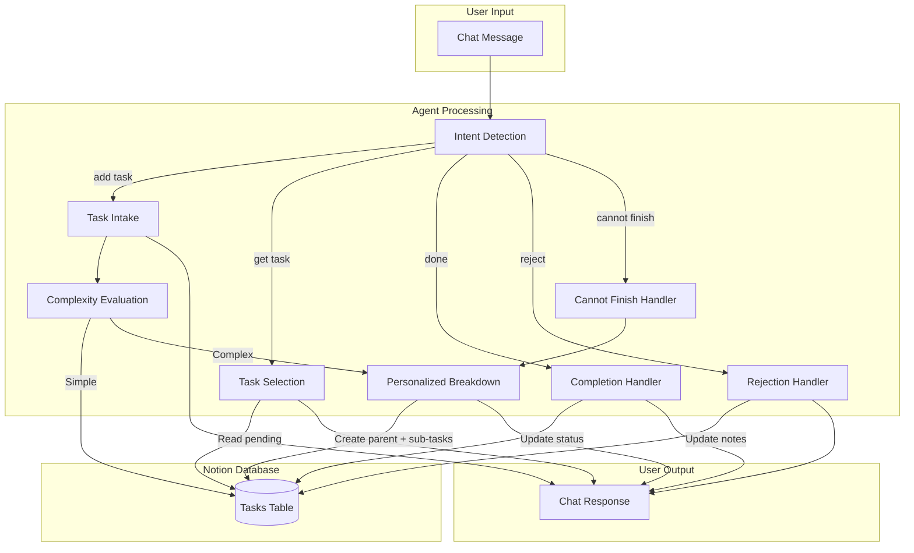
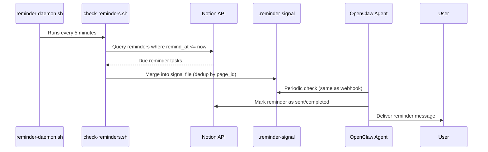
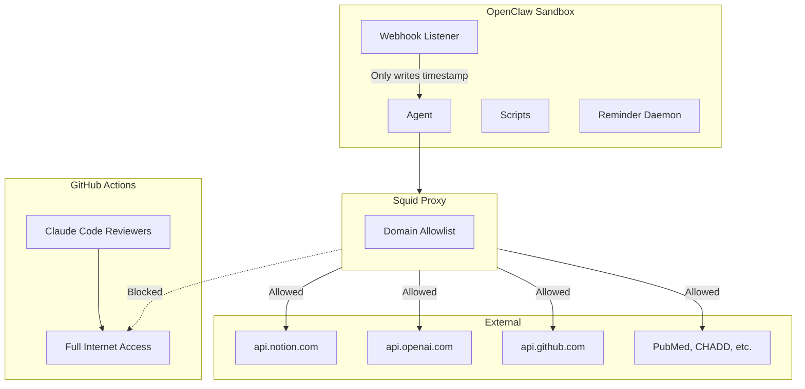

# hide-my-list: System Architecture

## Overview

hide-my-list is an AI-powered task manager where users never directly view their task list. The system uses conversational AI to intake tasks, intelligently label them, and surface the right task at the right time based on user mood, available time, and task urgency.

## High-Level Architecture




## How It Works

There is no standalone server. The OpenClaw agent *is* the application. It:

1. **Receives messages** from any configured messaging surface (web chat, Signal, Telegram, Discord, etc.)
2. **Detects intent** from natural language (add task, get task, complete, reject, etc.)
3. **Manages tasks** in a Notion database via API
4. **Selects tasks** based on user mood, energy, and available time
5. **Breaks down tasks** into concrete, personalized sub-steps
6. **Celebrates completions** with immediate positive reinforcement
7. **Delivers scheduled reminders** even when the chat is idle

## Component Architecture




## Request Flow



## Data Flow



## Scheduled Reminders

The OpenClaw agent model is stateless between messages — there is no persistent process to check a clock. To support wall-clock reminders ("remind me at 6pm to email Melanie"), the system uses a **signal-file pattern** identical to the webhook receiver:



**How it works:**

1. During task intake, the AI detects reminder-style language (e.g., "remind me at 6pm PT to call Sarah") and sets `is_reminder = true`, `remind_at` (full ISO 8601 with timezone), and `reminder_status = pending`.
2. The local `reminder-daemon.sh` loop runs `check-reminders.sh` every 5 minutes (configurable).
3. The script queries Notion for pending reminders where `remind_at <= now`.
4. For each due reminder, it merges entries into the `.reminder-signal` file (deduped by `page_id`), preserving any unconsumed reminders from previous cycles.
5. The agent picks up the signal file (same polling mechanism as the webhook signal), delivers the reminder to the user, and marks the reminder as sent/completed in Notion. This at-least-once delivery model ensures no reminder is silently lost — a duplicate is far better than a miss for an ADHD user.
6. Reminders more than 15 minutes past due are flagged as `missed` but still delivered with a note.

**Timezone handling:** The AI converts user-specified times (e.g., "6pm PT", "3pm Central") to full ISO 8601 timestamps with timezone offsets at intake time. The reminder daemon compares against UTC — no timezone conversion at check time.

### Operations

**Starting the daemon:**

```bash
scripts/reminder-daemon.sh              # loop forever, poll every 5 min
scripts/reminder-daemon.sh --once       # single check and exit
scripts/reminder-daemon.sh --interval 120  # custom interval (seconds)
```

**Environment overrides:**

| Variable | Default | Purpose |
|----------|---------|---------|
| `REMINDER_POLL_INTERVAL` | `300` (5 min) | Polling interval in seconds |
| `REMINDER_LOG_FILE` | `/tmp/reminder-daemon.log` | Log output location |
| `REMINDER_PID_FILE` | `/tmp/reminder-daemon.pid` | PID file to prevent duplicate daemons |

**Lifecycle notes:**

- The PID file prevents multiple daemon instances — if one is already running, a second invocation exits with an error.
- The PID file is automatically cleaned up on exit (via `trap`). If a daemon crashes without cleanup, a stale PID file is detected and removed on the next start.
- Logs are appended to `REMINDER_LOG_FILE` — check this file to debug missed or delayed reminders.
- Use `--once` for testing or one-shot cron setups.

## Technology Choices

| Component | Technology | Rationale |
|-----------|------------|-----------|
| Runtime | OpenClaw Agent | Conversational AI *is* the app — no separate server needed |
| Storage | Notion Database | Zero setup, visual backup, rich API, schema flexibility |
| AI | Claude (via OpenClaw) | Strong reasoning, structured output, conversation memory |
| Messaging | OpenClaw Surfaces | Multi-channel by default (web, Signal, Telegram, Discord) |
| CI/CD | GitHub Actions | Multi-agent review pipeline with full internet for research |
| Scripts | Bash + curl | Minimal dependencies, runs anywhere |
| Scheduled Reminders | reminder-daemon.sh + check-reminders.sh | Local polling every 5 min without GitHub cron |
| Image Generation | OpenAI gpt-image-1 | Unique AI images for reward novelty |
| Video | ffmpeg | Weekly recap compilation |

## Environment Variables

| Variable | Purpose |
|----------|---------|
| `NOTION_API_KEY` | Notion integration token |
| `NOTION_DATABASE_ID` | Tasks database identifier |
| `OPENAI_API_KEY` | OpenAI API key for reward image generation |
| `WEBHOOK_PORT` | CI notification webhook port (default: 9199) |
| `REMINDER_SIGNAL_FILE` | Path for reminder signal handoff (default: `.reminder-signal`) |
| `REMINDER_POLL_INTERVAL` | Reminder daemon polling interval in seconds (default: 300) |

## Prerequisites

| Dependency | Purpose |
|------------|---------|
| `python3` | JSON payload construction, image decoding |
| `curl` | API calls (Notion, OpenAI) |
| `ffmpeg` | Weekly recap video generation |
| `bc` | Arithmetic in recap script |

## Security Architecture



- **Network isolation**: Agent runs behind squid proxy with domain allowlist
- **Webhook security**: Listener discards all request data, only writes self-generated timestamp
- **CI separation**: GitHub Actions reviewers have full internet but no access to infrastructure or home systems
- **Credential handling**: API keys in `.env` (gitignored), never logged or committed
- **Least privilege**: PR test workflows have read-only permissions

For the full security architecture — including agent trust model, threat model, and prompt injection analysis — see [SECURITY.md](../SECURITY.md).
