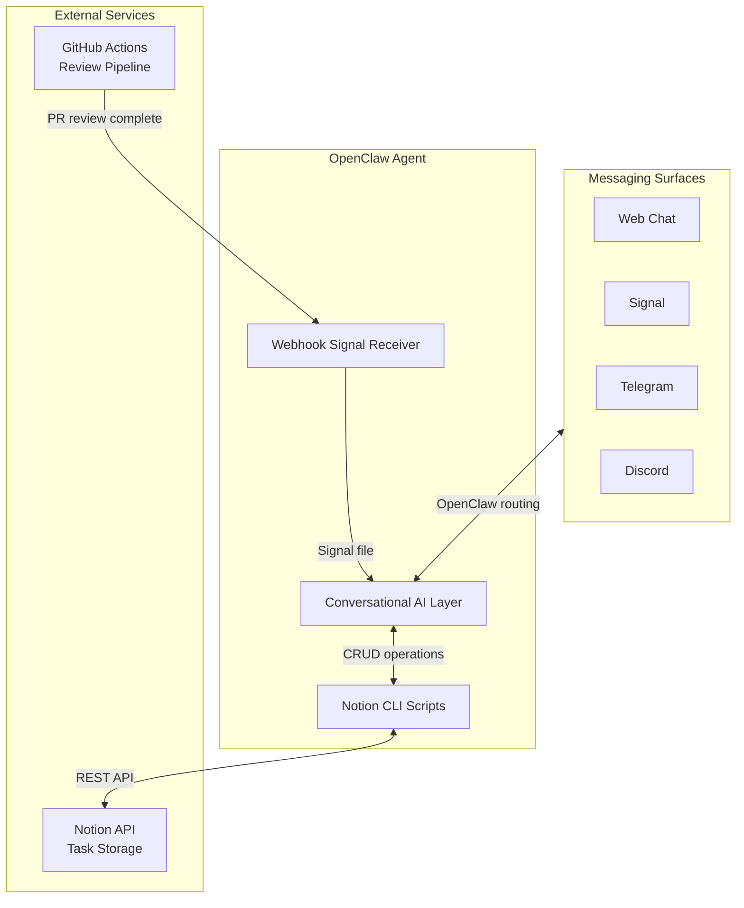
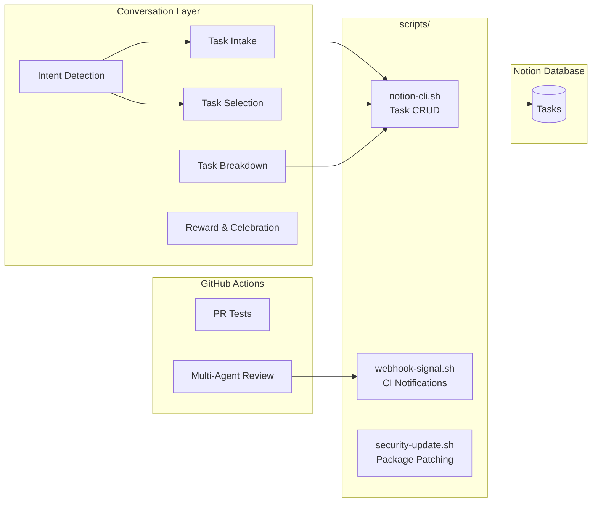
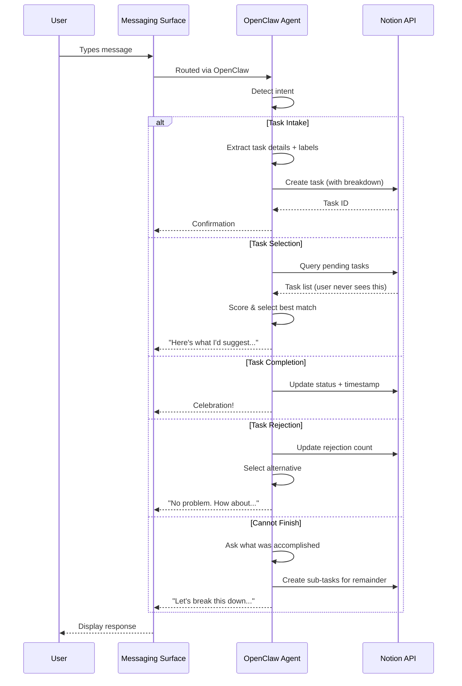
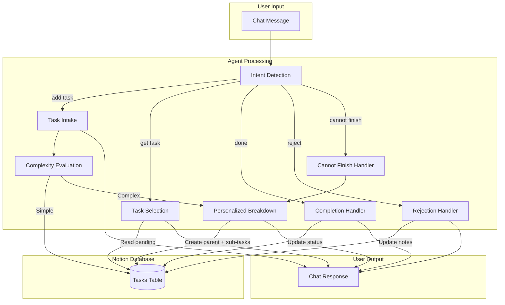
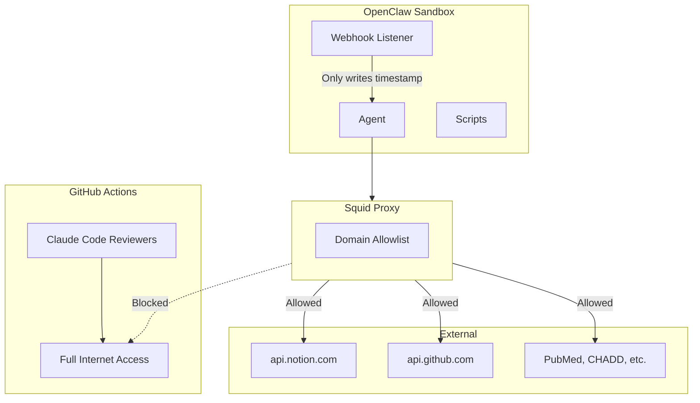

# hide-my-list: System Architecture

## Overview

hide-my-list is an AI-powered task manager where users never directly view their task list. The system uses conversational AI to intake tasks, intelligently label them, and surface the right task at the right time based on user mood, available time, and task urgency.

## High-Level Architecture

## How It Works

There is no standalone server. The OpenClaw agent *is* the application. It:

1. **Receives messages** from any configured messaging surface (web chat, Signal, Telegram, Discord, etc.)
2. **Detects intent** from natural language (add task, get task, complete, reject, etc.)
3. **Manages tasks** in a Notion database via API
4. **Selects tasks** based on user mood, energy, and available time
5. **Breaks down tasks** into concrete, personalized sub-steps
6. **Celebrates completions** with immediate positive reinforcement

## Component Architecture

## Request Flow

## Data Flow

## Technology Choices

| Component | Technology | Rationale |
|-----------|------------|-----------|
| Runtime | OpenClaw Agent | Conversational AI *is* the app — no separate server needed |
| Storage | Notion Database | Zero setup, visual backup, rich API, schema flexibility |
| AI | Claude (via OpenClaw) | Strong reasoning, structured output, conversation memory |
| Messaging | OpenClaw Surfaces | Multi-channel by default (web, Signal, Telegram, Discord) |
| CI/CD | GitHub Actions | Multi-agent review pipeline with full internet for research |
| Scripts | Bash + curl | Minimal dependencies, runs anywhere |

## Environment Variables

| Variable | Purpose |
|----------|---------|
| `NOTION_API_KEY` | Notion integration token |
| `NOTION_DATABASE_ID` | Tasks database identifier |
| `WEBHOOK_PORT` | CI notification webhook port (default: 9199) |

## Security Architecture

- **Network isolation**: Agent runs behind squid proxy with domain allowlist
- **Webhook security**: Listener discards all request data, only writes self-generated timestamp
- **CI separation**: GitHub Actions reviewers have full internet but no access to home systems
- **Credential handling**: API keys in `.env` (gitignored), never logged or committed
- **Least privilege**: PR test workflows have read-only permissions
