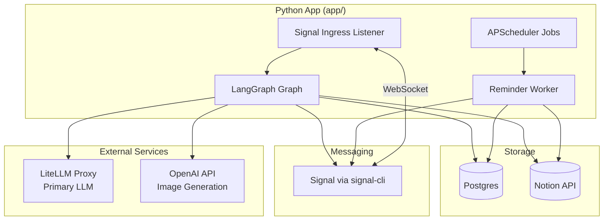

# hide-my-list: System Architecture

## Overview

hide-my-list = AI task manager. Users never see their task list. A conversational
AI intakes tasks, labels them, and surfaces the right task based on mood, time,
and urgency.

The runtime is a Python + LangGraph application deployed as a Docker Compose
stack.

## Container Topology

| Service | Image | Role |
|---|---|---|
| `app` | local Python 3.12 build | LangGraph runtime, APScheduler, reminder worker |
| `signal-cli` | `bbernhard/signal-cli-rest-api` (pinned by digest) | Signal bridge (infra-provided) |
| `postgres` | `postgres:16-alpine` | LangGraph checkpointer + reminder outbox + scheduler + private metadata |

`docker/compose.yaml` declares an internal Docker network for app ↔ postgres ↔
signal-cli. No host firewall rules are specified here — deployment-side egress
enforcement is the infra operator's concern.

## High-Level Architecture


```mermaid
flowchart TB
    subgraph App["Python App (app/)"]
        Ingress[Signal Ingress Listener]
        Graph[LangGraph Graph]
        Scheduler[APScheduler Jobs]
        Worker[Reminder Worker]
    end

    subgraph Storage["Storage"]
        Postgres[(Postgres)]
        Notion[(Notion API)]
    end

    subgraph Messaging["Messaging"]
        Signal[Signal via signal-cli]
    end

    subgraph External["External Services"]
        LLMProxy[LiteLLM Proxy<br/>Primary LLM]
        OpenAI[OpenAI API<br/>Image Generation]
    end

    Signal <-->|WebSocket| Ingress
    Ingress --> Graph
    Graph --> Notion
    Graph --> Postgres
    Graph --> Signal

    Scheduler --> Worker
    Worker --> Postgres
    Worker --> Signal
    Worker --> Notion

    Graph --> LLMProxy
    Graph --> OpenAI
```

## How It Works

The app container runs four concurrent async tasks:

1. **Signal ingress** (`app/ingress/signal_listener.py`) — WebSocket consumer on
   signal-cli REST API. For authorized text messages, extracts `(peer, text,
   timestamp)`, schedules a best-effort read receipt for the received timestamp,
   enqueues the text in a bounded in-memory buffer, and immediately returns to
   reading the socket. A single serial worker drains that buffer, briefly
   debounces same-peer backlog into one combined turn, maintains a refreshed
   typing indicator while graph execution is active, and maps `(peer, text)` →
   `graph.ainvoke(...)` with `thread_id = peer` for per-peer conversation
   isolation. Typing stop is scheduled after graph completion or graph error;
   queue overflow sends one visible reply to the authorized sender.

   After each turn the listener schedules the **post-send interaction review**
   (`app/graph/interaction_review.py`, spec in
   `docs/ai-prompts/interaction-review.md`) as a per-peer background task.
   Three seconds after the reply (`INTERACTION_REVIEW_DELAY_SECONDS`) the
   medium model re-reads the turn — history, recent-task ledger, the turn's
   recorded `turn_actions`, the open Notion tasks — and returns a strict JSON
   verdict. A valid `correct` verdict claims the job row (`executing`, with
   its action and page) and runs one action — `complete_task` or `send_only`;
   the review never creates, reopens, or schedules anything — storing each
   effect as it lands. It then re-reads the thread's latest checkpoint id;
   when it no longer equals the reviewed turn's (`turn_ref`), no follow-up is
   sent and nothing is written to the checkpoint — the row ends
   `error(stale_checkpoint)`. When the checkpoint is still current it sends
   the action's fixed follow-up template (the model writes no user-facing
   text), naming the task through `render_task_token`, and writes the
   checkpoint as the `send` node (follow-up in `messages`, ledger event,
   `pending_clarification` cleared).

   Each review is a durable job in the `interaction_reviews` table. The
   review task's first step, before the delay, stores a `pending` row keyed
   by peer and `turn_ref`; the claim moves it to `executing` before the first
   Notion write, reward, or send; every exit path finalizes it as `ok`,
   `correct`, `skipped`, or `error`, and a finalize on a row that is already
   final changes nothing. The review yields to the conversation:

   - It is skipped (`buffer_non_empty`) when the peer already has a message
     waiting.
   - When the worker picks up the peer's next message, a review that has not
     started writing is cancelled (`cancelled`).
   - A review that has started writing is awaited by that next turn for at
     most 60 seconds (`_REVIEW_EXECUTION_WAIT_SECONDS`); past that bound the
     listener cancels it (`timeout`, recording any Notion write that already
     ran) and only then runs the turn. No review writes after the next turn
     starts.
   - Shutdown cancels running reviews (`cancelled`).

   The cancelling side finalizes the row as well, so a cancel that lands
   before the review's own handler runs still closes it. On startup, before
   consuming the WebSocket, the listener reads the unfinished rows of
   authorized peers. An `executing` row is finalized `error(interrupted)`
   with its recorded action and page and never replayed, so no Notion write,
   reward, or follow-up repeats. A `pending` row younger than one hour whose
   `turn_ref` is still the peer's latest checkpoint is reviewed again from
   that checkpoint's state; the other pending rows are finalized `skipped`
   (`superseded`, or `disabled` when the review is off). Executed corrections are capped per peer per hour
   (`INTERACTION_REVIEW_MAX_PER_HOUR`); more than
   `INTERACTION_REVIEW_ALERT_THRESHOLD` in 24 hours raises an
   `interaction_review_excess` ops alert. `INTERACTION_REVIEW_ENABLED=false`
   turns it off.

2. **LangGraph graph** (`app/graph/graph.py`) — Every turn enters at
   `hydrate_context`, which merges the peer's recent reminder deliveries
   (`recent_outbound`, last 7 days) into the checkpointed recent-task ledger,
   reads the stored Notion title of each untitled delivery page (at most 3 per
   turn), then flows to `classify_intent`. The
   classifier routes to one of eight intent nodes (`ADD_TASK`, `GET_TASK`,
   `COMPLETE`, `REJECT`, `CANNOT_FINISH`, `CHECK_IN`, `NEED_HELP`, `CHAT`) with
   deterministic conditional edges, and every intent node flows to the terminal
   `send` node. `hydrate_context` is fail-soft: a Postgres error keeps the
   existing ledger, a failed title read leaves that entry untitled, and the
   turn continues. `PostgresSaver` checkpoints
   conversation state per peer.

   ```
   hydrate_context → classify_intent → <intent node> → send → END
   ```

3. **APScheduler** (`app/scheduler/scheduler.py`) — Declarative job list
   (`app/scheduler/jobs.py`) with `PostgresJobStore`. Orphan reconciliation on
   startup removes stale jobs not in the declared list.

4. **Reminder worker** (`app/scheduler/reminder_worker.py`) — Runs as the
   `reminder_dispatcher` APScheduler job (every 30 seconds). Claims due
   `reminder_outbox` rows with `SELECT FOR UPDATE SKIP LOCKED`, delivers via
   signal-cli, then marks delivered and writes a `recent_outbound` row whose
   `reminder_type` is the outbox row's `kind`. Rows with `kind='reminder'`
   complete the Notion reminder page after delivery. Rows with
   `kind='deadline'` leave the task open, and their body names the task
   ("Deadline nudge: <task>. Want one tiny next step?", or a generic
   "Deadline nudge for this task. Want one tiny next step?" when no stored
   title is available); a later "done" writes
   that task Completed because `reminder_type='deadline'` says delivery did
   not. When the user completes a reminder page before it fires,
   `complete_node` marks its pending and scheduled `kind='reminder'` rows
   `dead` with `last_error='completed by user'`, so the worker never claims
   them. That cancellation is retried once; when it still fails, the
   completion stands (the Notion write already happened) and an ops alert of
   kind `reminder_cancel_failed` goes to the operator. Every completion write
   (`complete_node`, the shared `_log_finished` path when it completes an
   open task, and the interaction review's `complete_task`) also calls
   `reminders.cancel_pending_nudges`, which marks the page's pending and
   scheduled `kind='deadline'` rows `dead` with `last_error='task completed'`
   and marks the series' active `reminder_scheduling_ledger` rows superseded;
   a failure there is logged and the completion stands. The worker's pre-send
   check covers any surviving row of either kind: before sending a row it
   reads the page, and when the page is already `Completed` it marks the row
   `dead` with `last_error='page already completed'` and sends nothing. A
   failed page read sends anyway — a missed reminder costs the user more than
   a redundant one.

## Reminder Delivery

At-least-once with idempotency. The `reminder_outbox` table is the durable state
machine:

```
pending → scheduled → delivering → delivered
                             ↓
                          failed (backoff: 1m, 5m, 30m, 2h, 8h, cap 5)
                             ↓
                           dead → ops alert
```

Duplicates are possible if the worker crashes between signal-cli accept and
Postgres commit. This matches the existing at-least-once contract: prefer
duplicate delivery over loss.

## Scheduled Jobs

| Job | Interval | Function |
|-----|----------|----------|
| `reminder_dispatcher` | 30s | Claim + deliver due reminders |
| `notion_health` | 15 min | Ping Notion API, then verify the task database exposes every property the client uses; enqueue ops alert on connectivity failure or schema mismatch |
| `ops_alerts_drain` | 5 min | Send pending ops alerts via Signal |
| `check_in_dispatcher` | 10 min | Trigger CHECK_IN graph turns for due tasks |
| `state_audit` | Daily 03:00 USER_TZ | VACUUM + prune `recent_outbound` (90-day retention) |
| `reminder_scheduler` | Daily 04:00 USER_TZ | Schedule missing deadline reminder series and refresh edited deadlines |
| `weekly_recap` | Sun 18:00 USER_TZ | Generate weekly recap |
| `signal_ingress_silence` | 60 min (configurable) | Read `signal_ingress_health`; log a warning when inbound silence exceeds threshold |
| `theme_evolution` | Mon 04:30 USER_TZ | Grow and prune each peer's reward descriptor vocabulary |

## Model Routing

`app/models.py` reads `setup/model-tiers.json` at startup and validates all
model IDs. LangChain sends OpenAI-format chat-completion requests to the
LiteLLM proxy configured by `LLM_PROXY_BASE_URL`. LiteLLM dispatches by model
alias; the app has no direct connection to any provider API.
`LLM_PROXY_API_KEY` is forwarded as the bearer token. If the proxy does not
require auth, set it to any non-empty placeholder in the runtime environment.

Every request carries an explicit timeout (`LLM_REQUEST_TIMEOUT_SECONDS`,
default 120s) and retry cap (`LLM_MAX_RETRIES`, default 1), giving a worst case
of 240s per call. The model host holds one model in RAM and serves one request
at a time, so an unbounded call does not merely delay its own turn — it holds
the only inference slot while every queued conversation waits behind it. The
ceiling stays below any gateway timeout in front of the proxy so the app gives
up on its own clock and can classify the failure, rather than waiting out a
504 it cannot distinguish from a slow answer.

## Security

- Narrow code paths are the injection containment. The app has no `fetch_url`,
  no shell tool, no `git pull`, no self-modification surface. Tools are limited
  to Notion CRUD, signal-cli, and LLM calls.
- LangSmith disabled by default. Startup guard refuses to boot when
  `LANGSMITH_TRACING=true` unless `ALLOW_PRIVATE_TRACE_EXPORT=true` is also set.
- API keys in `.env` (gitignored), never logged or committed.
- `reward_manifests` stored in Postgres only, never logged or committed.

## Key Environment Variables

| Variable | Purpose |
|----------|---------|
| `NOTION_API_KEY` | Notion integration token |
| `NOTION_DATABASE_ID` | Tasks database identifier |
| `LLM_PROXY_BASE_URL` | OpenAI-compatible LiteLLM proxy endpoint for the primary LLM |
| `LLM_PROXY_API_KEY` | LiteLLM proxy bearer token for the primary LLM |
| `LLM_REQUEST_TIMEOUT_SECONDS` | Per-LLM-request timeout (default `120`) |
| `LLM_MAX_RETRIES` | Retries per LLM request (default `1`) |
| `INTERACTION_REVIEW_ENABLED` | Post-send interaction review on/off (default `true`) |
| `INTERACTION_REVIEW_DELAY_SECONDS` | Wait after a reply before its review starts (default `3`) |
| `INTERACTION_REVIEW_MAX_PER_HOUR` | Executed review corrections per peer per hour (default `3`) |
| `INTERACTION_REVIEW_ALERT_THRESHOLD` | Executed review corrections in 24 h above which an ops alert fires (default `5`) |
| `OPENAI_API_KEY` | Reward image generation |
| `DATABASE_URL` | Postgres connection string |
| `SIGNAL_CLI_URL` | signal-cli REST API base URL |
| `SIGNAL_ACCOUNT` | E.164 Signal account number |
| `AUTHORIZED_PEERS` | Comma-separated E.164 allowed inbound peers; empty or unset refuses startup |
| `USER_TZ` | User's IANA timezone (default `America/Chicago`) |
| `REMINDER_SLOT_MINUTES` | Deadline reminder load-balancing bucket size (default `30`) |
| `REMINDER_SLOT_CAPACITY` | Maximum deadline reminders per bucket (default `2`) |
| `REMINDER_QUIET_START_HOUR` | User-local quiet-hours start for deadline reminders (default `22`) |
| `REMINDER_QUIET_END_HOUR` | User-local quiet-hours end for deadline reminders (default `8`) |
| `SIGNAL_RECEIVE_IDLE_TIMEOUT_SECONDS` | Receive WebSocket idle deadline before reconnect (default `300`) |
| `SIGNAL_INGRESS_SILENCE_CHECK_INTERVAL_MINUTES` | Interval for `signal_ingress_silence` job (default `60`) |
| `SIGNAL_INBOUND_SILENCE_ALERT_THRESHOLD_SECONDS` | Inbound silence duration before structured warning log (default `129600`, 36 hours) |

## Outbound Dependencies

For the infra operator / VM-isolation configuration:

- `api.notion.com` — Notion CRUD
- LiteLLM proxy endpoint — primary LLM, configured by `LLM_PROXY_BASE_URL`
- `api.openai.com` — reward image generation
- Signal infrastructure — managed by the `signal-cli` container

## CI/CD

See `docs/agentic-pipeline-learnings.md` for the multi-agent review pipeline.
Python source changes trigger `python-validation.yml` (ruff + mypy + pytest-unit + pytest-db); pytest-db runs integration and regression suites against a Postgres service container.
