# Notion Database Schema

## Overview

hide-my-list uses Notion as its database, leveraging Notion's API for all CRUD operations. This approach provides zero database setup, a visual backup interface, and rich querying capabilities.

## Database Structure

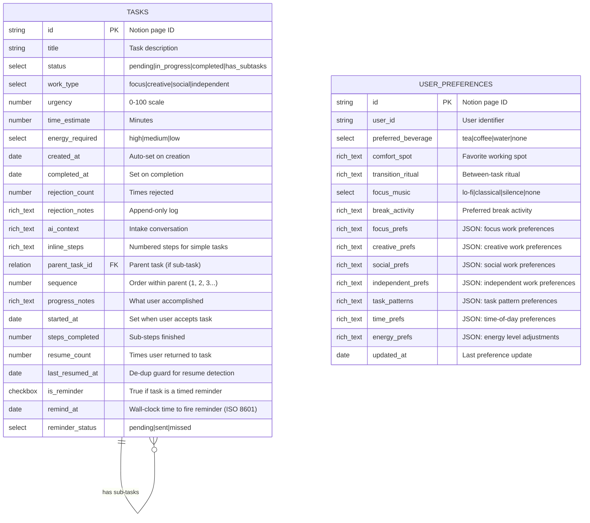

## Property Definitions

### Title (title)
The main task description as entered by the user.

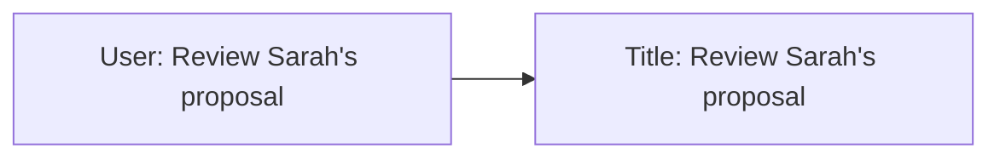

**Constraints:**
- Required field
- Maximum 200 characters (enforced by application)
- Plain text only

---

### Status (select)

Tracks task lifecycle state.

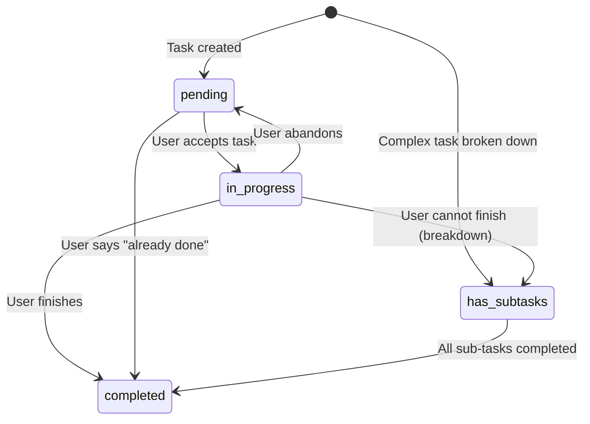

| Value | Description | Trigger |
|-------|-------------|---------|
| `pending` | Waiting to be worked on | Default on creation |
| `in_progress` | Currently active | User accepts suggestion |
| `completed` | Finished | User marks done |
| `has_subtasks` | Parent task with hidden sub-tasks | Complex task or CANNOT_FINISH |

**Note:** There is no "rejected" status. Rejected tasks return to `pending` with rejection notes appended.

**Note:** Tasks with `has_subtasks` status are never directly suggested to users. Only their pending sub-tasks are surfaced.

---

### WorkType (select)

Categorizes the nature of the work required.

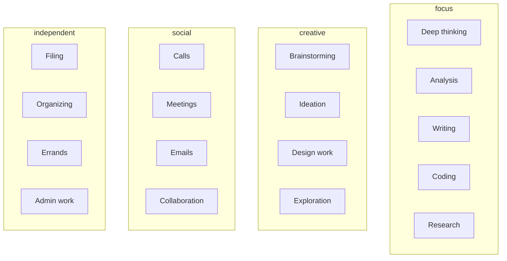

| Value | Energy Level | Example Tasks |
|-------|--------------|---------------|
| `focus` | High | Write report, debug code, analyze data |
| `creative` | Medium-High | Brainstorm ideas, design logo, explore options |
| `social` | Medium | Call client, team meeting, reply to emails |
| `independent` | Low | Organize files, pay bills, book appointments |

---

### Urgency (number)

0-100 scale indicating time sensitivity. **Static** - does not auto-increase.

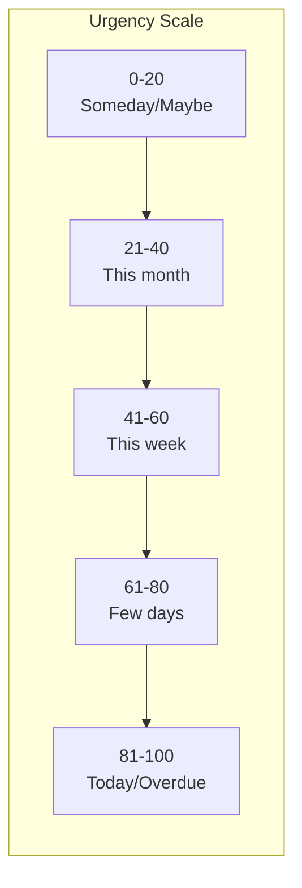

**Inference Rules:**

| Signal | Urgency Range |
|--------|---------------|
| "today", "ASAP", "urgent" | 81-100 |
| "tomorrow", "soon" | 61-80 |
| "this week", "by Friday" | 41-60 |
| "whenever", "no rush", "this month", "next week" | 0-40 |

---

### TimeEstimate (number)

Estimated minutes to complete the task.

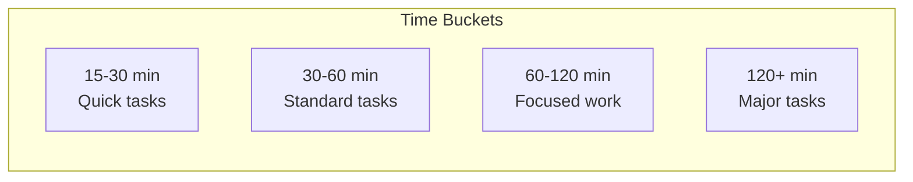

**Inference Guidelines:**

| Task Type | Base Estimate |
|-----------|---------------|
| Phone call | 15 min |
| Email batch | 20 min |
| Quick meeting | 30 min |
| Standard meeting | 60 min |
| Writing (short) | 30-45 min |
| Writing (long) | 90-120 min |
| Coding (bug fix) | 45 min |
| Coding (feature) | 120+ min |

---

### EnergyRequired (select)

Indicates cognitive/physical energy needed.

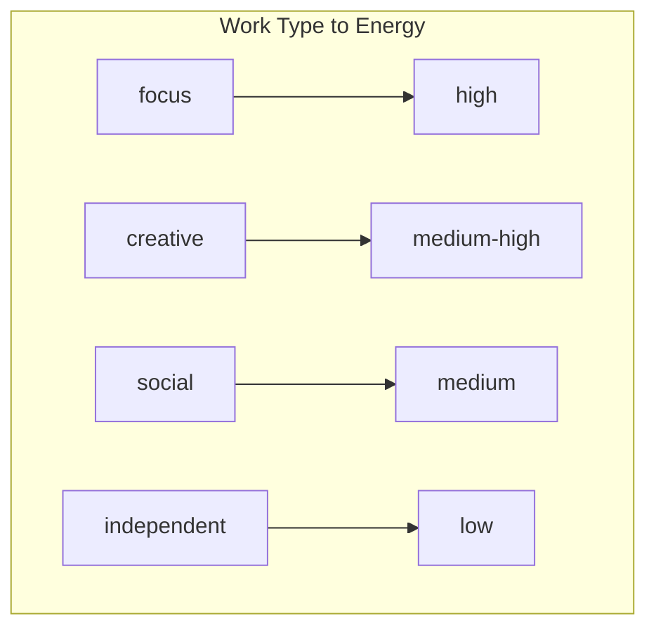

| Value | Best For | Avoid When |
|-------|----------|------------|
| `high` | Well-rested, morning, caffeinated | Tired, end of day |
| `medium` | Normal energy, mid-day | Exhausted |
| `low` | Tired, low energy, winding down | — |

---

### CreatedAt (date)

Timestamp when task was added. Auto-populated on creation.

```
Format: ISO 8601 (2025-01-04T10:30:00Z)
```

---

### CompletedAt (date)

Timestamp when task was marked complete. Null until completion.

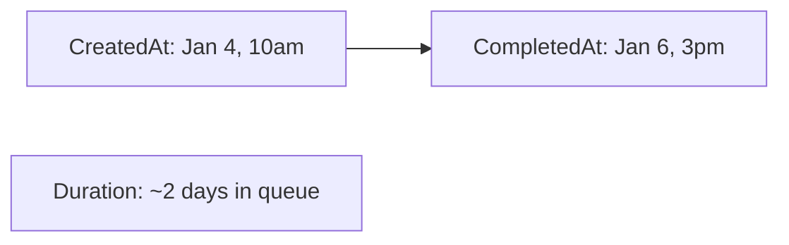

---

### RejectionCount (number)

Number of times user rejected this task when suggested. Starts at 0.

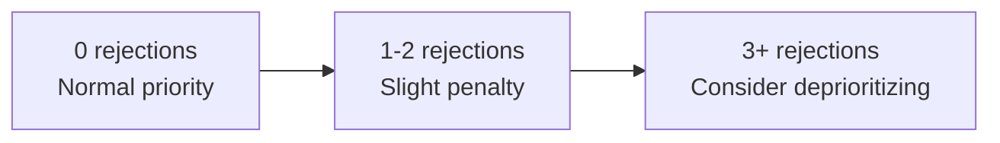

**Impact on Selection:**
- 0 rejections: No penalty
- 1-2 rejections: -0.05 from score
- 3+ rejections: -0.10 from score

---

### RejectionNotes (rich text)

Append-only log of rejection reasons with timestamps.

```
Format:
[2025-01-04 10:30] Not in the mood for focus work
[2025-01-05 14:15] Takes too long right now
[2025-01-06 09:00] Waiting on Sarah's input
```

**Used for:**
- Pattern detection (always rejected at certain times)
- Identifying blocking dependencies
- Learning user preferences

---

### AIContext (rich text)

Stores the original intake conversation for reference.

```
Format:
User: I need to review Sarah's proposal
AI: Got it. Is this time-sensitive?
User: She needs feedback by Friday
AI: Added - focused work, ~30 min, moderate urgency.
```

**Used for:**
- Debugging label assignments
- Providing context when task is suggested
- Improving future intake prompts

---

### InlineSteps (rich text)

Stores the numbered action steps for simple tasks (those not requiring hidden sub-tasks).

```
Format:
1. Find a quiet spot
2. Make the call
3. Note any follow-ups needed
```

**Core Principle:** Users interpret vague goals as infinite, and thus avoid them. By always providing concrete steps, we make every task feel achievable.

**Used for:**
- Showing users exactly what to do when they accept a task
- Providing on-demand breakdown assistance
- Guiding users through task completion step-by-step

**When populated:**
- All tasks with `time_estimate` ≤ 60 minutes
- All standalone tasks (no parent_task_id)
- Even "simple" tasks like "Call mom" get inline steps

**Example values:**

| Task | Inline Steps |
|------|--------------|
| Call mom | 1. Find quiet spot\n2. Make call\n3. Note any follow-ups |
| Review proposal | 1. Read intro\n2. Check numbers\n3. Note concerns\n4. Draft feedback |
| Pay bills | 1. Open banking app\n2. Find payee\n3. Enter amount and pay |

---

### ParentTaskId (relation)

Links sub-tasks to their parent task. Null for standalone tasks.

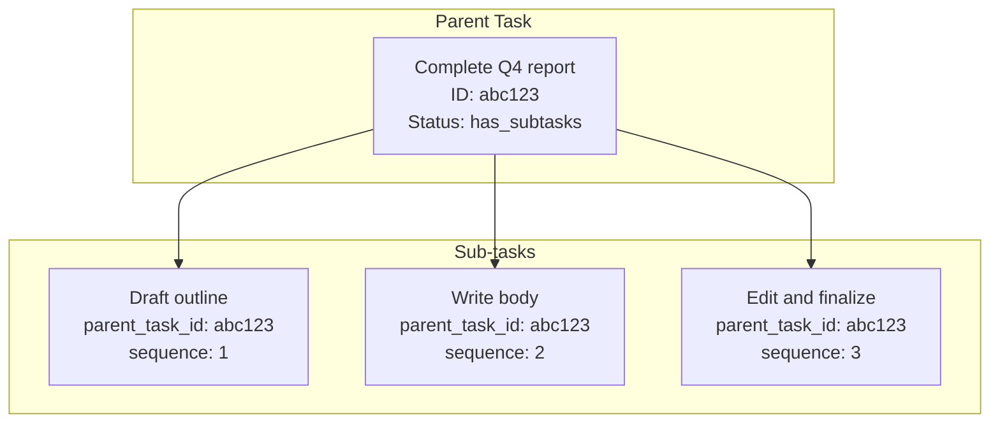

**Constraints:**
- Self-referential relation to same database
- Null for parent tasks and standalone tasks
- Set on sub-task creation

**Note:** This relation is used internally and never exposed to users.

---

### Sequence (number)

Order of sub-task within its parent. Determines which sub-task to offer next.

| Value | Meaning |
|-------|---------|
| 1 | First sub-task (offered first) |
| 2 | Second sub-task |
| 3+ | Subsequent sub-tasks |
| null | Not a sub-task |

**Used for:**
- Determining next sub-task to suggest after completion
- Maintaining logical order of work
- Skipping to later sub-tasks if earlier ones are blocked

---

### ProgressNotes (rich text)

Tracks what the user accomplished, especially during CANNOT_FINISH events.

```
Format:
[2025-01-04 10:30] User started: "outlined the main points"
[2025-01-04 11:00] CANNOT_FINISH: "wrote intro, need to continue with body"
[2025-01-05 09:00] Sub-task 1 completed
```

**Used for:**
- Understanding what work remains after CANNOT_FINISH
- Creating accurate sub-tasks for remaining work
- Providing context when resuming work

### StartedAt (date)

Timestamp set when the user accepts and begins a task. Used for:
- Calculating actual task duration (with CompletedAt)
- Triggering initiation rewards
- Building per-user time estimation data for time blindness compensation (Issue #6)

### StepsCompleted (number)

Count of sub-steps the user has completed within the current task. Used for:
- Triggering first-step rewards (when incrementing from 0 to 1)
- Tracking partial progress during CANNOT_FINISH events
- Providing encouragement on sub-task completion

### ResumeCount (number)

Number of times the user has returned to a task after stepping away. Used for:
- Triggering "back at it" rewards (re-starting is hard)
- Understanding user work patterns (frequent breaks vs. sustained sessions)
- Selecting escalating resume reward messages (1st, 2nd, 3rd+)

Incremented by the resume detection mechanism (see [task-lifecycle.md Phase 5.1](./task-lifecycle.md#phase-51-resume-detection)) when ALL of:
1. Task has `status = in_progress`
2. Gap ≥ 15 minutes since last user message
3. No resume already recorded for this gap (checked via `last_resumed_at`)

---

### LastResumedAt (date)

Timestamp of the most recent resume detection for this task. Used as a de-duplication guard to prevent multiple resume events from firing for the same inactivity gap.

```
Format: ISO 8601 (2025-01-04T10:30:00Z)
```

**Set when:** Resume detection fires (all three conditions met)
**Checked by:** Resume detection gate — if `last_resumed_at` falls after the start of the current gap, resume has already been recorded and does not fire again
**Reset when:** Never reset — each resume overwrites with the new timestamp

See [task-lifecycle.md Phase 5.1](./task-lifecycle.md#phase-51-resume-detection) for the full detection mechanism.

---

### IsReminder (checkbox)

Boolean flag indicating this task is a time-specific reminder rather than a normal work item. Reminder tasks are not surfaced through the normal task selection flow. They become eligible at `Remind At` and are delivered proactively by the scheduled reminder system on the next eligible `reminder-check` poll.

| Value | Description |
|-------|-------------|
| `true` | This task is a timed reminder |
| `false` | Normal task (default) |

**Set when:** AI detects reminder-style language during task intake (e.g., "remind me at 6pm", "ping me at 3pm to call Sarah").

---

### RemindAt (date)

The wall-clock time at which the reminder becomes due. Stored as a full ISO 8601 timestamp with timezone offset so the scheduled reminder check can compare against the current time.

```
Format: ISO 8601 with timezone (e.g., 2025-01-04T18:00:00-06:00)
```

**Set when:** Task is created with `is_reminder = true`. The AI parses the user's time reference (including timezone like "6pm PT" or "3pm CT") and converts it to a full ISO 8601 timestamp.

**Used by:** The `check-reminders.sh` script, which the durable `reminder-check` cron job runs every 15 minutes before handing due reminders to the agent via the repo-root reminder handoff file (default filename: `.reminder-signal`).

---

### ReminderStatus (select)

Tracks whether a scheduled reminder has been delivered.

| Value | Description | Trigger |
|-------|-------------|---------|
| `pending` | Not yet delivered | Default on creation |
| `sent` | Successfully delivered to user | Agent confirms delivery after scheduler surfaces the reminder |
| `missed` | Delivered after being more than 15 minutes late | Agent confirms late delivery using the scheduler's missed flag |

**Note:** When a reminder is `sent`, the task's main `Status` is also updated to `Completed` since the reminder action (notifying the user) is done.

---

## User Preferences Properties

The User Preferences table stores personalized settings that help create an environment for success during task execution. See [user-preferences.md](./user-preferences.md) for full documentation.

### PreferredBeverage (select)

User's preferred drink when working on tasks.

| Value | Description |
|-------|-------------|
| `tea` | Hot tea (default for social/creative tasks) |
| `coffee` | Coffee (default for focus tasks) |
| `water` | Water or no specific preference |
| `none` | User prefers no beverage prompts |

---

### ComfortSpot (rich text)

Description of the user's favorite working location(s).

```
Examples:
- "Cozy chair in the living room"
- "Standing desk in the office"
- "Kitchen table with morning light"
- "Patio when weather is nice"
```

**Used for:** Suggesting environment setup in task breakdowns.

---

### TransitionRitual (rich text)

Brief activity the user prefers between tasks.

```
Examples:
- "Quick stretch"
- "3 deep breaths"
- "Walk to get water"
- "Pet the cat"
```

**Used for:** Suggesting breaks between tasks and helping user reset.

---

### FocusMusic (select)

Music preference during focused work.

| Value | Description |
|-------|-------------|
| `lo-fi` | Lo-fi beats, ambient electronic |
| `classical` | Classical music, instrumentals |
| `silence` | Prefers quiet environment |
| `none` | No music suggestions needed |

---

### BreakActivity (rich text)

Preferred activity after completing tasks.

```
Examples:
- "Quick walk around the block"
- "Cup of tea on the patio"
- "5 minutes with a book"
- "Check in with partner"
```

---

### Work Type Preferences (rich text - JSON)

Four fields storing JSON objects with work-type-specific preferences:

**FocusPrefs:**
```json
{
  "beverage": "coffee",
  "environment": "quiet office, door closed",
  "prep_steps": ["put phone in another room", "close email"],
  "music": "lo-fi",
  "ideal_duration": "45-90 min"
}
```

**CreativePrefs:**
```json
{
  "beverage": "tea",
  "environment": "natural light, open space",
  "prep_steps": ["brief walk", "grab notebook"],
  "tools": "paper before digital"
}
```

**SocialPrefs:**
```json
{
  "beverage": "tea",
  "environment": "comfortable, quiet spot",
  "prep_steps": ["review context", "set intention"],
  "follow_up": "note key takeaways"
}
```

**IndependentPrefs:**
```json
{
  "beverage": "water",
  "environment": "anywhere",
  "batching": true,
  "reward": "treat after batch"
}
```

---

### TaskPatterns (rich text - JSON)

Preferences for specific recurring task types.

```json
{
  "phone_calls": {
    "prep_steps": ["find quiet room", "review last interaction"],
    "environment": "comfortable seat",
    "beverage": "tea"
  },
  "writing": {
    "warmup": "2 min free-write",
    "breaks": "every 25 min"
  },
  "email_batch": {
    "setup": ["close tabs", "set timer"],
    "approach": "quick ones first"
  }
}
```

---

### TimePrefs (rich text - JSON)

Preferences that vary by time of day.

```json
{
  "morning": {
    "beverage": "coffee",
    "best_for": ["focus", "creative"],
    "energy_tolerance": "high"
  },
  "afternoon": {
    "beverage": "tea",
    "best_for": ["social", "creative"],
    "note": "post-lunch dip"
  },
  "evening": {
    "beverage": "herbal tea",
    "best_for": ["independent"],
    "energy_tolerance": "low"
  }
}
```

---

### EnergyPrefs (rich text - JSON)

Adjustments based on user's current energy level.

```json
{
  "high": {
    "prep_style": "minimal",
    "task_duration": "longer ok"
  },
  "medium": {
    "prep_style": "standard rituals",
    "task_duration": "normal"
  },
  "low": {
    "prep_style": "extended, comfort-focused",
    "task_duration": "shorter tasks",
    "extra_steps": ["comfortable spot", "warm drink"]
  }
}
```

---

## Sub-task Relationships

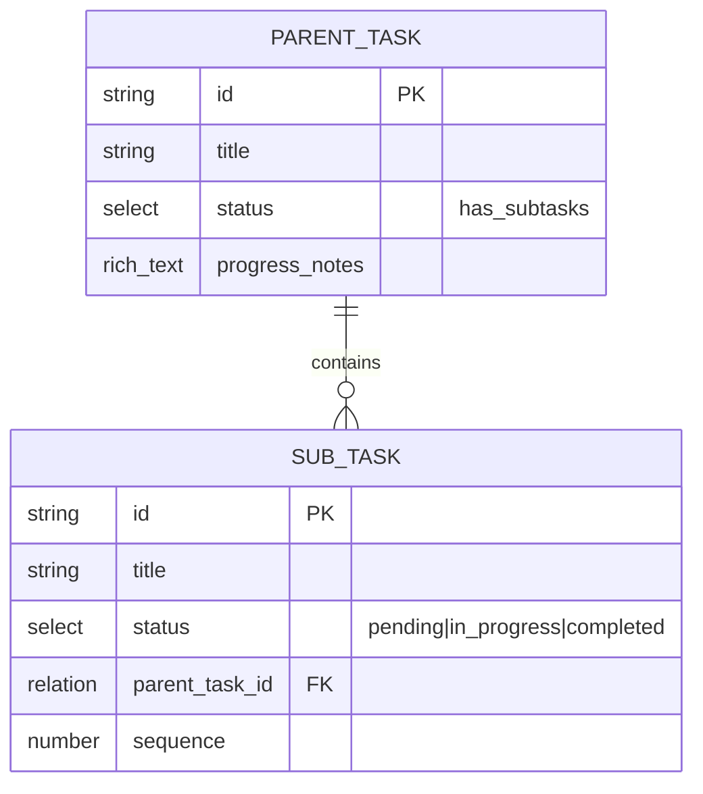

### Parent Task Completion

A parent task automatically moves to `completed` when all its sub-tasks are completed:

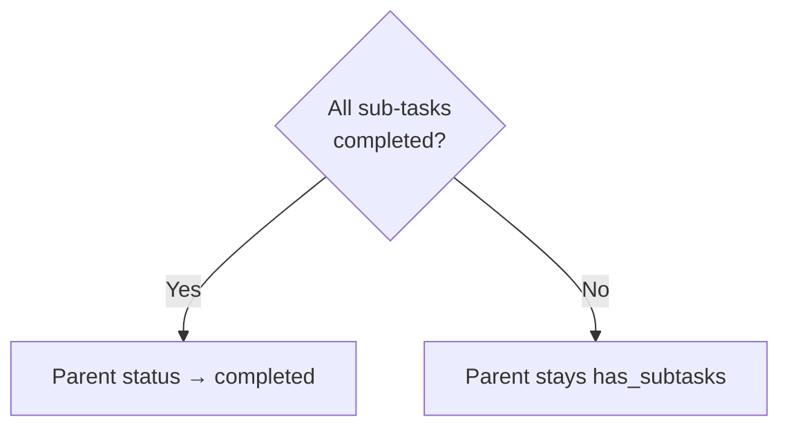

---

## API Operations

### Create Task

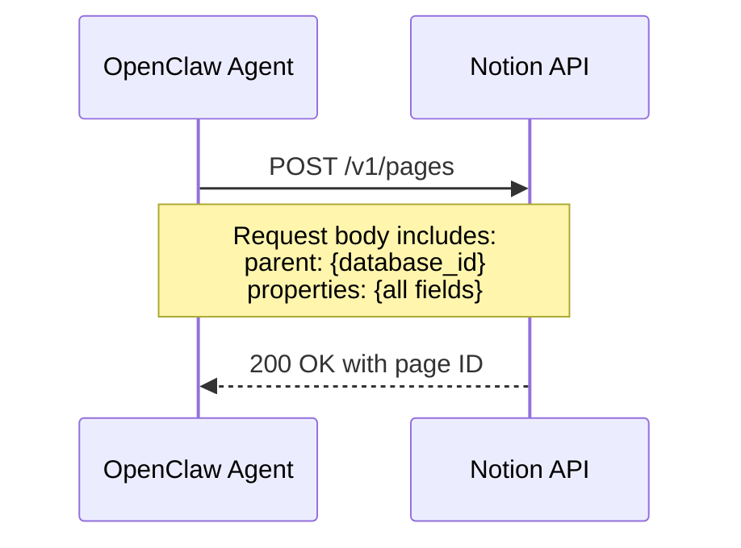

**Required Fields on Create:**
- Title
- Status: `pending`
- WorkType
- Urgency
- TimeEstimate
- EnergyRequired
- CreatedAt

---

### Query Tasks

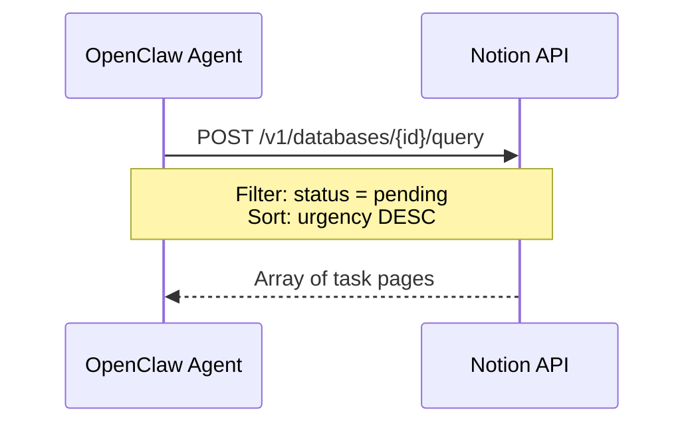

**Common Queries:**

| Purpose | Filter |
|---------|--------|
| All pending | `status = "pending"` |
| Short tasks | `status = "pending" AND time_estimate <= 30` |
| High urgency | `status = "pending" AND urgency >= 70` |
| Focus work | `status = "pending" AND work_type = "focus"` |
| Sub-tasks of parent | `parent_task_id = "{parent_id}"` |
| Next sub-task | `parent_task_id = "{parent_id}" AND status = "pending"` (sort by sequence) |
| Standalone tasks only | `parent_task_id IS NULL AND status != "has_subtasks"` |
| Parent tasks | `status = "has_subtasks"` |

---

### Update Task

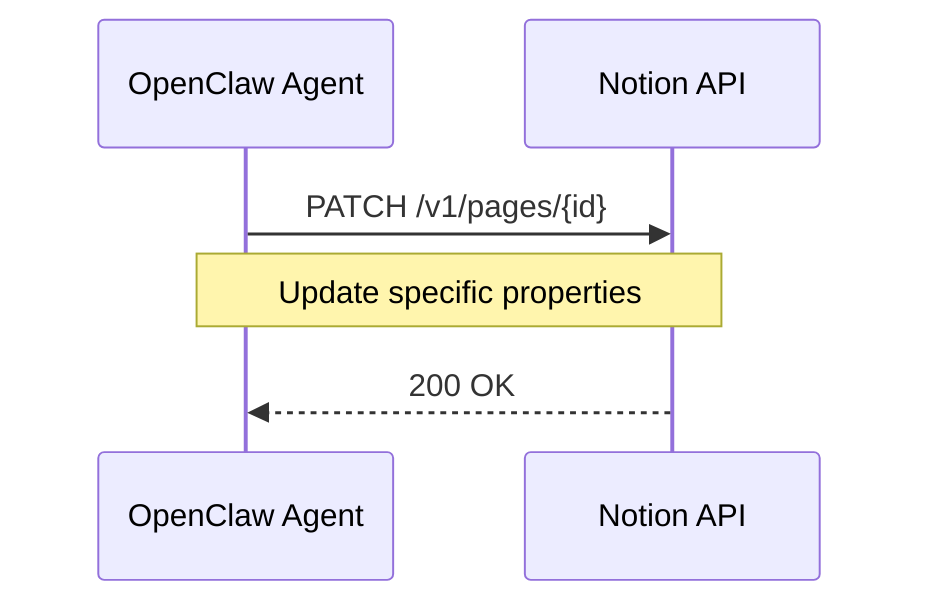

**Common Updates:**

| Action | Fields Updated |
|--------|----------------|
| Accept task | `status → in_progress` |
| Complete task | `status → completed, completedAt → now` |
| Reject task | `rejectionCount += 1, rejectionNotes += reason` |
| Unblock task | Clear blocked status in rejectionNotes |
| Cannot finish | `status → has_subtasks, progressNotes += progress` |
| Resume task | `resume_count += 1, last_resumed_at → now, progressNotes += "[ts] Resumed (gap: Xm)"` |
| Create sub-task | `parent_task_id, sequence, status = pending` |
| Complete sub-task | `status → completed` (check if parent complete) |

---

## Data Flow Diagram

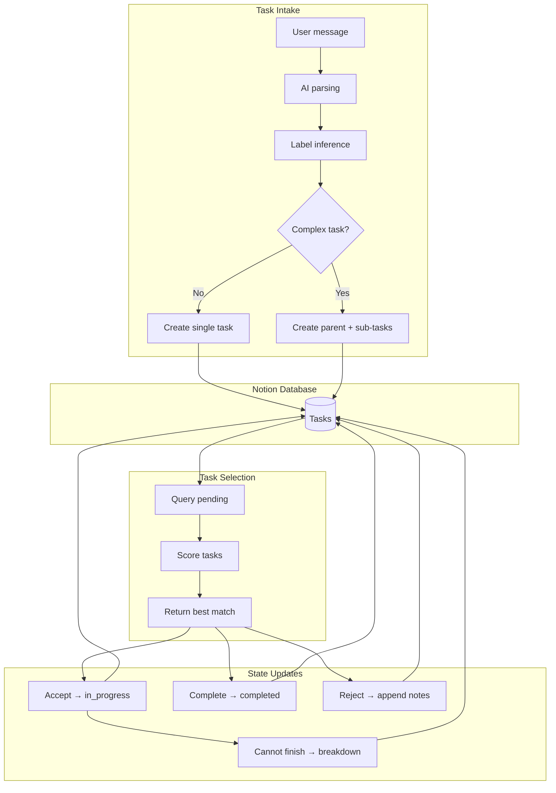

## Notion Setup Instructions

### 1. Create Integration

1. Go to [notion.so/my-integrations](https://www.notion.so/my-integrations)
2. Click "New integration"
3. Name: `hide-my-list`
4. Capabilities: Read, Update, Insert content
5. Copy the "Internal Integration Token"

### 2. Create Database

1. Create a new Notion page
2. Add a full-page database (table view)
3. Add properties matching the schema above
4. Copy the database ID from the URL

```
URL: https://notion.so/abc123...?v=xyz
Database ID: abc123...
```

### 3. Share with Integration

1. Open the database page
2. Click "Share" in the top right
3. Invite your integration by name
4. Grant "Can edit" access

### 4. Configure Environment

```bash
cp .env.template .env
# Then edit .env with your real values:
# NOTION_API_KEY="secret_..."
# NOTION_DATABASE_ID="abc123..."
```

For normal runtime operation, `.env` is the canonical source of truth. Exported
shell variables are still supported as optional overrides for manual or ad hoc
script runs.

## Sample Data

### Standalone Tasks

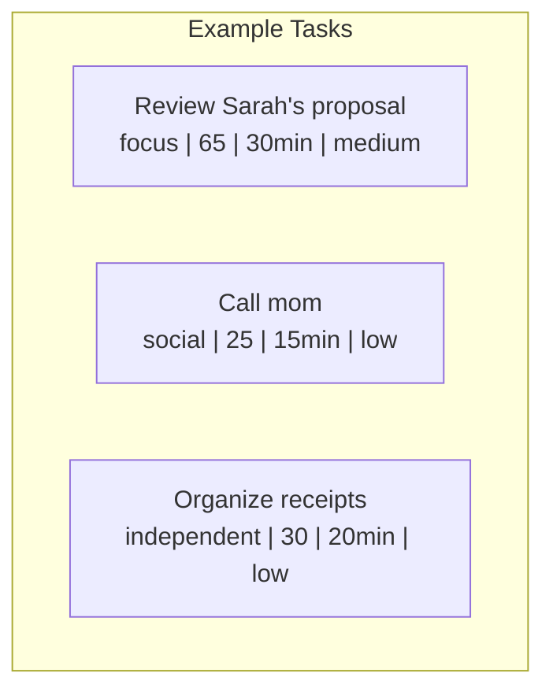

| Title | WorkType | Urgency | Time | Energy | Status | Parent |
|-------|----------|---------|------|--------|--------|--------|
| Review Sarah's proposal | focus | 65 | 30 | medium | pending | — |
| Call mom | social | 25 | 15 | low | pending | — |
| Organize receipts | independent | 30 | 20 | low | pending | — |
| Book dentist appointment | independent | 15 | 10 | low | completed | — |

### Parent Task with Sub-tasks (Hidden from User)

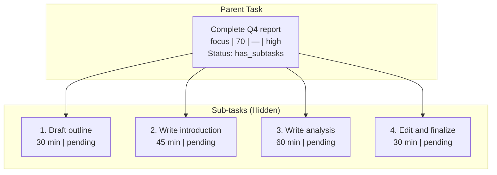

| Title | WorkType | Urgency | Time | Energy | Status | Parent | Seq |
|-------|----------|---------|------|--------|--------|--------|-----|
| Complete Q4 report | focus | 70 | 165 | high | has_subtasks | — | — |
| Draft outline | focus | 70 | 30 | medium | pending | Q4 report | 1 |
| Write introduction | focus | 70 | 45 | high | pending | Q4 report | 2 |
| Write analysis | focus | 70 | 60 | high | pending | Q4 report | 3 |
| Edit and finalize | focus | 70 | 30 | medium | pending | Q4 report | 4 |

**User Experience:** When the user asks for a task, they see: "How about drafting the outline for the Q4 report? Should take about 30 minutes." They never see the parent task or full breakdown.
