# Notion Database Schema

## Overview

hide-my-list uses Notion as database, Notion API for all CRUD. Zero DB setup, visual backup, rich querying.

## Database Structure

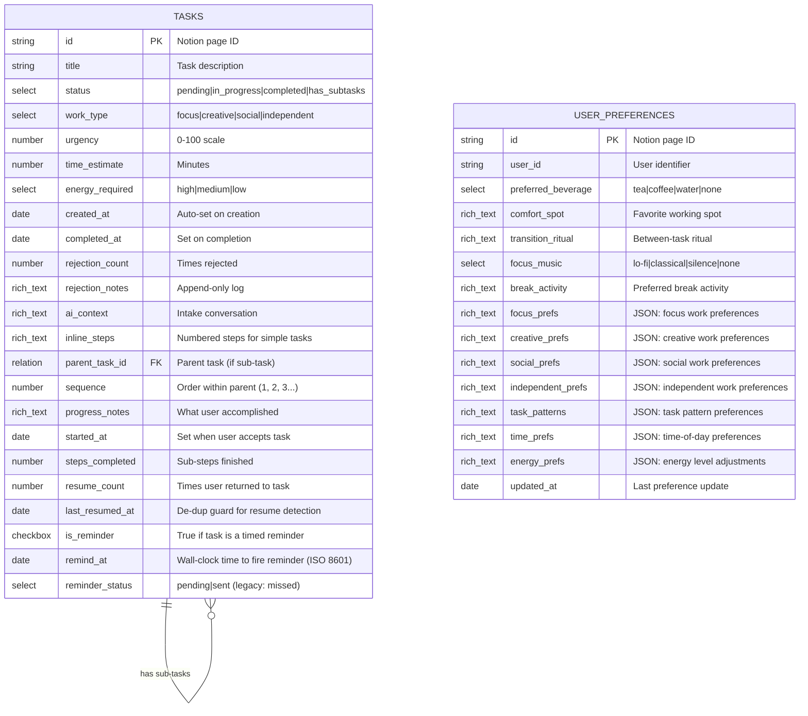

## Property Definitions

### Title (title)
Main task description as entered by user.

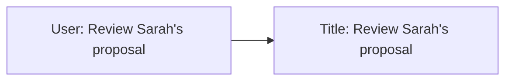

**Constraints:**
- Required
- Max 200 chars (app-enforced)
- Plain text only

---

### Status (select)

Tracks task lifecycle.

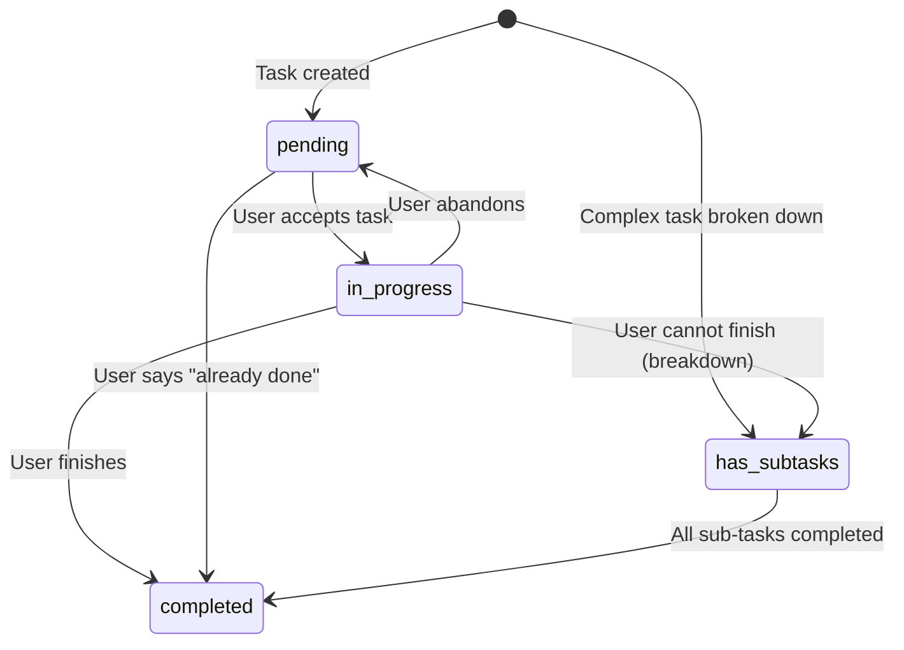

| Value | Description | Trigger |
|-------|-------------|---------|
| `pending` | Waiting to be worked on | Default on creation |
| `in_progress` | Currently active | User accepts suggestion |
| `completed` | Finished | User marks done |
| `has_subtasks` | Parent task with hidden sub-tasks | Complex task or CANNOT_FINISH |

**Note:** No "rejected" status. Rejected tasks return to `pending` with rejection notes appended.

**Note:** Tasks with `has_subtasks` never suggested directly. Only pending sub-tasks surfaced.

---

### WorkType (select)

Categorizes work nature.

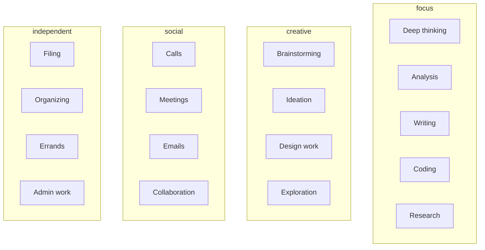

| Value | Energy Level | Example Tasks |
|-------|--------------|---------------|
| `focus` | High | Write report, debug code, analyze data |
| `creative` | Medium-High | Brainstorm ideas, design logo, explore options |
| `social` | Medium | Call client, team meeting, reply to emails |
| `independent` | Low | Organize files, pay bills, book appointments |

---

### Urgency (number)

0-100 time sensitivity. **Static** — no auto-increase.

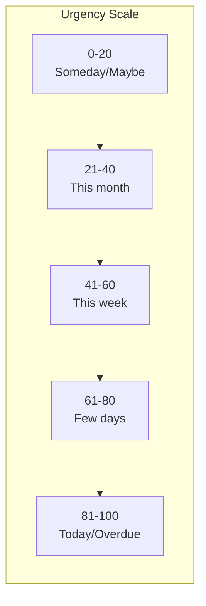

**Inference Rules:**

| Signal | Urgency Range |
|--------|---------------|
| "today", "ASAP", "urgent" | 81-100 |
| "tomorrow", "soon" | 61-80 |
| "this week", "by Friday" | 41-60 |
| "whenever", "no rush", "this month", "next week" | 0-40 |

---

### TimeEstimate (number)

Estimated minutes to complete.

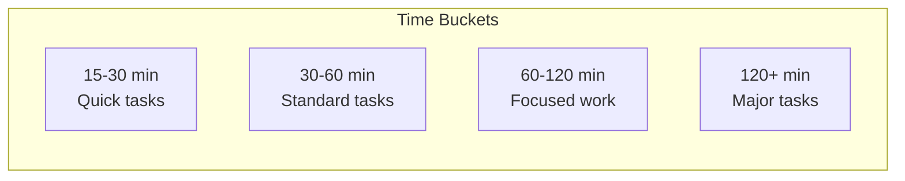

**Inference Guidelines:**

| Task Type | Base Estimate |
|-----------|---------------|
| Phone call | 15 min |
| Email batch | 20 min |
| Quick meeting | 30 min |
| Standard meeting | 60 min |
| Writing (short) | 30-45 min |
| Writing (long) | 90-120 min |
| Coding (bug fix) | 45 min |
| Coding (feature) | 120+ min |

---

### EnergyRequired (select)

Cognitive/physical energy needed.

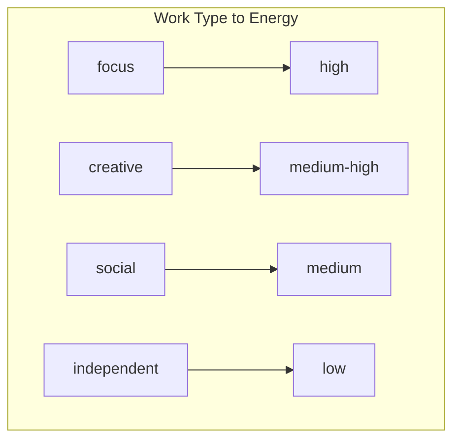

| Value | Best For | Avoid When |
|-------|----------|------------|
| `high` | Well-rested, morning, caffeinated | Tired, end of day |
| `medium` | Normal energy, mid-day | Exhausted |
| `low` | Tired, low energy, winding down | — |

---

### CreatedAt (date)

Auto-populated on creation.

```
Format: ISO 8601 (2025-01-04T10:30:00Z)
```

---

### CompletedAt (date)

Set on completion. Null until then.

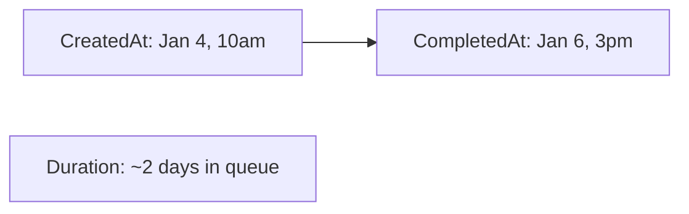

---

### RejectionCount (number)

Times user rejected this task. Starts at 0.

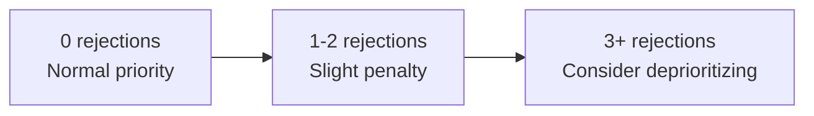

**Score impact:**
- 0 rejections: No penalty
- 1-2: -0.05
- 3+: -0.10

---

### RejectionNotes (rich text)

Append-only log with timestamps.

```
Format:
[2025-01-04 10:30] Not in the mood for focus work
[2025-01-05 14:15] Takes too long right now
[2025-01-06 09:00] Waiting on Sarah's input
```

**Used for:** Pattern detection, blocking dependencies, learning preferences.

---

### AIContext (rich text)

Original intake conversation for reference.

```
Format:
User: I need to review Sarah's proposal
AI: Got it. Is this time-sensitive?
User: She needs feedback by Friday
AI: Added - focused work, ~30 min, moderate urgency.
```

**Used for:** Debugging labels, context on suggestion, improving intake prompts.

---

### InlineSteps (rich text)

Numbered action steps for simple tasks (not requiring hidden sub-tasks).

```
Format:
1. Find a quiet spot
2. Make the call
3. Note any follow-ups needed
```

**Core Principle:** Vague goals feel infinite — users avoid them. Concrete steps make every task feel achievable.

**Used for:** Showing what to do on accept, on-demand breakdown, step-by-step guidance.

**When populated:**
- All tasks with `time_estimate` ≤ 60 min
- All standalone tasks (no `parent_task_id`)
- Even "simple" tasks like "Call mom"

**Example values:**

| Task | Inline Steps |
|------|--------------|
| Call mom | 1. Find quiet spot\n2. Make call\n3. Note any follow-ups |
| Review proposal | 1. Read intro\n2. Check numbers\n3. Note concerns\n4. Draft feedback |
| Pay bills | 1. Open banking app\n2. Find payee\n3. Enter amount and pay |

---

### ParentTaskId (relation)

Links sub-tasks to parent. Null for standalone.

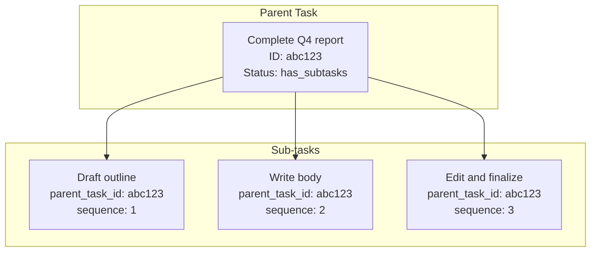

**Constraints:**
- Self-referential relation
- Null for parents and standalones
- Set on sub-task creation

**Note:** Internal only — never exposed to users.

---

### Sequence (number)

Sub-task order within parent. Determines next suggestion.

| Value | Meaning |
|-------|---------|
| 1 | First sub-task (offered first) |
| 2 | Second sub-task |
| 3+ | Subsequent |
| null | Not a sub-task |

**Used for:** Next sub-task suggestion, logical order, skipping blocked steps.

---

### ProgressNotes (rich text)

Tracks accomplishments, especially during CANNOT_FINISH.

```
Format:
[2025-01-04 10:30] User started: "outlined the main points"
[2025-01-04 11:00] CANNOT_FINISH: "wrote intro, need to continue with body"
[2025-01-05 09:00] Sub-task 1 completed
```

**Used for:** Understanding remaining work, creating accurate sub-tasks, context on resume.

### StartedAt (date)

Set when user accepts and begins task. Used for:
- Actual duration calc (with CompletedAt)
- Initiation rewards
- Per-user time estimation for time blindness compensation

### StepsCompleted (number)

Count of sub-steps finished. Used for:
- First-step rewards (0→1)
- Partial progress tracking during CANNOT_FINISH
- Sub-task completion encouragement

### ResumeCount (number)

Times user returned after stepping away. Used for:
- "Back at it" rewards (re-starting is hard)
- Work pattern understanding (frequent breaks vs. sustained)
- Escalating resume messages (1st, 2nd, 3rd+)

Incremented by resume detection (see [task-lifecycle.md Phase 5.1](./task-lifecycle.md#phase-51-resume-detection)) when ALL:
1. Task `status = in_progress`
2. Gap ≥ 15 min since last user message
3. No resume already recorded for this gap (checked via `last_resumed_at`)

---

### LastResumedAt (date)

Most recent resume detection timestamp. De-dup guard — prevents multiple resume events per inactivity gap.

```
Format: ISO 8601 (2025-01-04T10:30:00Z)
```

**Set when:** Resume detection fires (all three conditions met)
**Checked by:** Resume detection gate — if `last_resumed_at` falls after gap start, resume already recorded, skip
**Reset when:** Never — each resume overwrites with new timestamp

See [task-lifecycle.md Phase 5.1](./task-lifecycle.md#phase-51-resume-detection) for full detection mechanism.

---

### IsReminder (checkbox)

Flags task as time-specific reminder, not normal work item. Not surfaced in normal task selection. At intake, agent registers one-shot `reminder-<page_id>` cron (`deleteAfterRun: true`) that fires at exact `Remind At` for primary delivery. `reminder-check` poll + startup check + heartbeat (Check 1) are safety-net paths only — see `docs/architecture.md` §Reminders.

| Value | Description |
|-------|-------------|
| `true` | Timed reminder |
| `false` | Normal task (default) |

**Set when:** AI detects reminder language during intake (e.g., "remind me at 6pm", "ping me at 3pm to call Sarah").

---

### RemindAt (date)

Wall-clock time reminder becomes due. Full ISO 8601 with timezone for comparison against current time.

```
Format: ISO 8601 with timezone (e.g., 2025-01-04T18:00:00-06:00)
```

**Set when:** Task created with `is_reminder = true`. AI parses time reference (including timezone like "6pm PT") and converts to full ISO 8601. Relative phrases such as "tomorrow", "tonight", and day-of-week names must be resolved against the user's timezone from `USER.md`, not UTC message metadata; use `scripts/user-time-context.sh` when a UTC timestamp needs conversion first.

**Used by:** One-shot `reminder-<page_id>` cron (primary, registered at intake) which fires at exact `remind_at`. Also `check-reminders.sh`, run by isolated `reminder-check` cron every 30 min as safety net: due reminders found → script writes repo-root handoff file (default: `.reminder-signal`) for delivery by `reminder-delivery-sweep`, the `heartbeat` cron (Check 1 in `docs/heartbeat-checks.md`), or main-session startup (AGENTS.md step 6). Delivery paths validate handoff is JSON with `reminders` array where each entry has string `page_id`, non-empty string `title`, and string `status`. New handoff writers emit only `sent`; legacy `missed` entries should still be delivered and normalized to `sent`. Malformed handoffs stay in place, resolve `OPS_ALERT_SIGNAL_NUMBER` from `.env` to concrete Signal recipient, send ops alert via OpenClaw `message` tool (`action: send`, `channel: signal`, `target: "<resolved OPS_ALERT_SIGNAL_NUMBER>"`), and do not deliver, complete, or delete anything. Delivery failures also leave the handoff in place until retry succeeds. On successful delivery, the delivering session appends/updates `state.json.recent_outbound` with a short-lived reminder entry (`type: "reminder"`, `page_id`, `title`, `status: "sent"`, `sent_at`, `awaiting_response: true`, `expires_at` about 24h later), pruning expired entries, then calls `scripts/notion-cli.sh complete-reminder PAGE_ID sent`, then deletes the handoff file.

---

### ReminderStatus (select)

Tracks reminder delivery.

| Value | Description | Trigger |
|-------|-------------|---------|
| `pending` | Not yet delivered | Default on creation |
| `sent` | Delivered successfully | Delivering session confirms after one-shot delivery or handoff-file fallback |

**Note:** When marked `sent`, task `Status` also → `Completed` — reminder action (notifying user) done.

**Legacy compatibility:** Older deployments may still have a `missed` select option or historical rows using it. Runtime behavior no longer produces that value; if a legacy handoff or record is touched during delivery, normalize it to `sent`.

**Design constraint:** Isolated `reminder-check` cron does not set `Reminder Status` directly. OpenClaw exposes no post-announce delivery hook — pre-delivery mutation would drop reminder from `pending` query before confirmed delivery.

---

## User Preferences Properties

Personalized settings for task execution success. See [user-preferences.md](./user-preferences.md) for full docs.

### PreferredBeverage (select)

| Value | Description |
|-------|-------------|
| `tea` | Hot tea (default for social/creative) |
| `coffee` | Coffee (default for focus) |
| `water` | Water or no preference |
| `none` | No beverage prompts |

---

### ComfortSpot (rich text)

Favorite working location(s).

```
Examples:
- "Cozy chair in the living room"
- "Standing desk in the office"
- "Kitchen table with morning light"
- "Patio when weather is nice"
```

**Used for:** Environment setup in task breakdowns.

---

### TransitionRitual (rich text)

Between-task activity.

```
Examples:
- "Quick stretch"
- "3 deep breaths"
- "Walk to get water"
- "Pet the cat"
```

**Used for:** Suggesting breaks, helping user reset.

---

### FocusMusic (select)

Music preference during focused work.

| Value | Description |
|-------|-------------|
| `lo-fi` | Lo-fi beats, ambient electronic |
| `classical` | Classical, instrumentals |
| `silence` | Quiet environment |
| `none` | No music suggestions |

---

### BreakActivity (rich text)

Preferred post-task activity.

```
Examples:
- "Quick walk around the block"
- "Cup of tea on the patio"
- "5 minutes with a book"
- "Check in with partner"
```

---

### Work Type Preferences (rich text - JSON)

Four fields with work-type-specific preferences:

**FocusPrefs:**
```json
{
  "beverage": "coffee",
  "environment": "quiet office, door closed",
  "prep_steps": ["put phone in another room", "close email"],
  "music": "lo-fi",
  "ideal_duration": "45-90 min"
}
```

**CreativePrefs:**
```json
{
  "beverage": "tea",
  "environment": "natural light, open space",
  "prep_steps": ["brief walk", "grab notebook"],
  "tools": "paper before digital"
}
```

**SocialPrefs:**
```json
{
  "beverage": "tea",
  "environment": "comfortable, quiet spot",
  "prep_steps": ["review context", "set intention"],
  "follow_up": "note key takeaways"
}
```

**IndependentPrefs:**
```json
{
  "beverage": "water",
  "environment": "anywhere",
  "batching": true,
  "reward": "treat after batch"
}
```

---

### TaskPatterns (rich text - JSON)

Preferences for recurring task types.

```json
{
  "phone_calls": {
    "prep_steps": ["find quiet room", "review last interaction"],
    "environment": "comfortable seat",
    "beverage": "tea"
  },
  "writing": {
    "warmup": "2 min free-write",
    "breaks": "every 25 min"
  },
  "email_batch": {
    "setup": ["close tabs", "set timer"],
    "approach": "quick ones first"
  }
}
```

---

### TimePrefs (rich text - JSON)

Time-of-day preferences.

```json
{
  "morning": {
    "beverage": "coffee",
    "best_for": ["focus", "creative"],
    "energy_tolerance": "high"
  },
  "afternoon": {
    "beverage": "tea",
    "best_for": ["social", "creative"],
    "note": "post-lunch dip"
  },
  "evening": {
    "beverage": "herbal tea",
    "best_for": ["independent"],
    "energy_tolerance": "low"
  }
}
```

---

### EnergyPrefs (rich text - JSON)

Adjustments by current energy level.

```json
{
  "high": {
    "prep_style": "minimal",
    "task_duration": "longer ok"
  },
  "medium": {
    "prep_style": "standard rituals",
    "task_duration": "normal"
  },
  "low": {
    "prep_style": "extended, comfort-focused",
    "task_duration": "shorter tasks",
    "extra_steps": ["comfortable spot", "warm drink"]
  }
}
```

---

## Sub-task Relationships

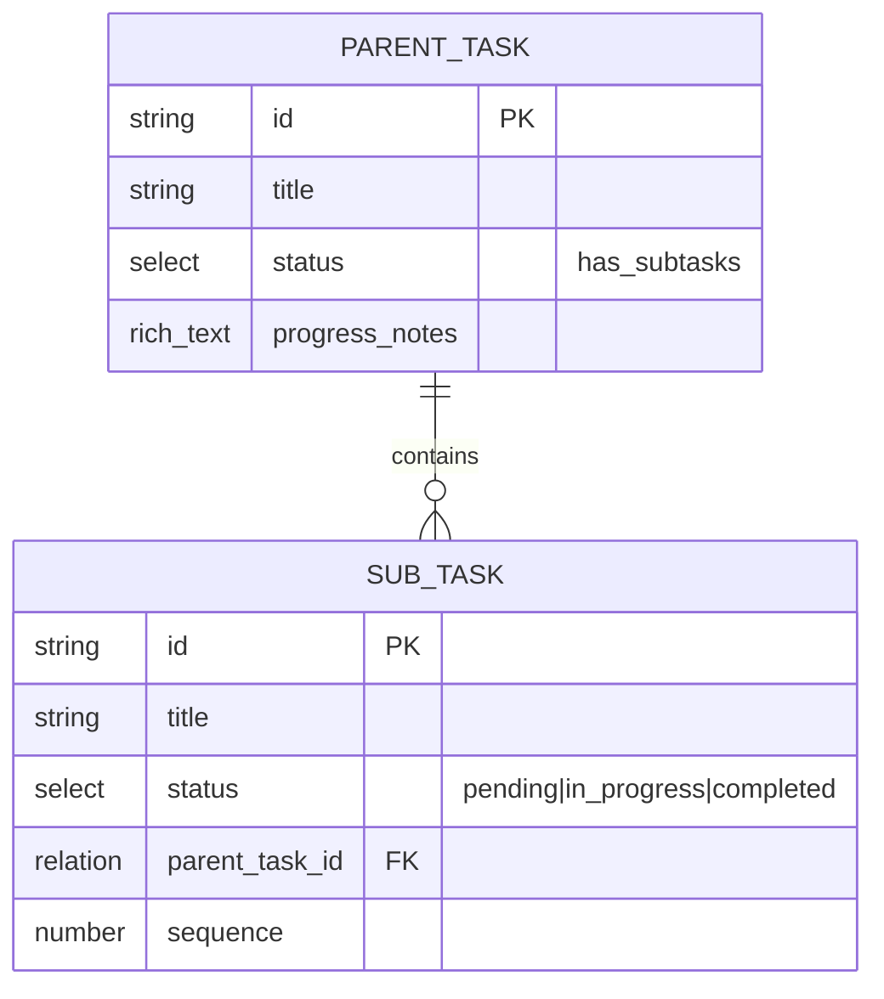

### Parent Task Completion

Parent auto-moves to `completed` when all sub-tasks complete:

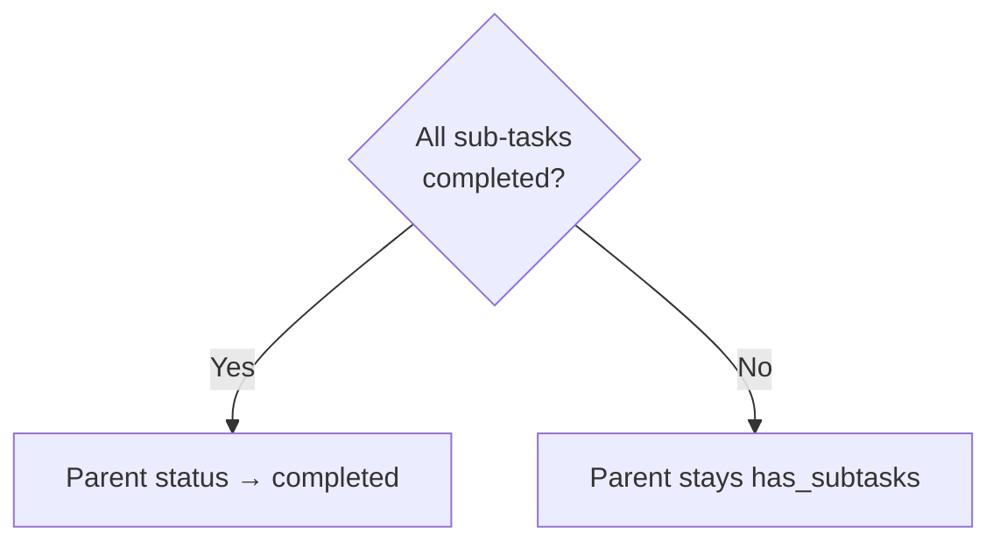

---

## API Operations

### Create Task

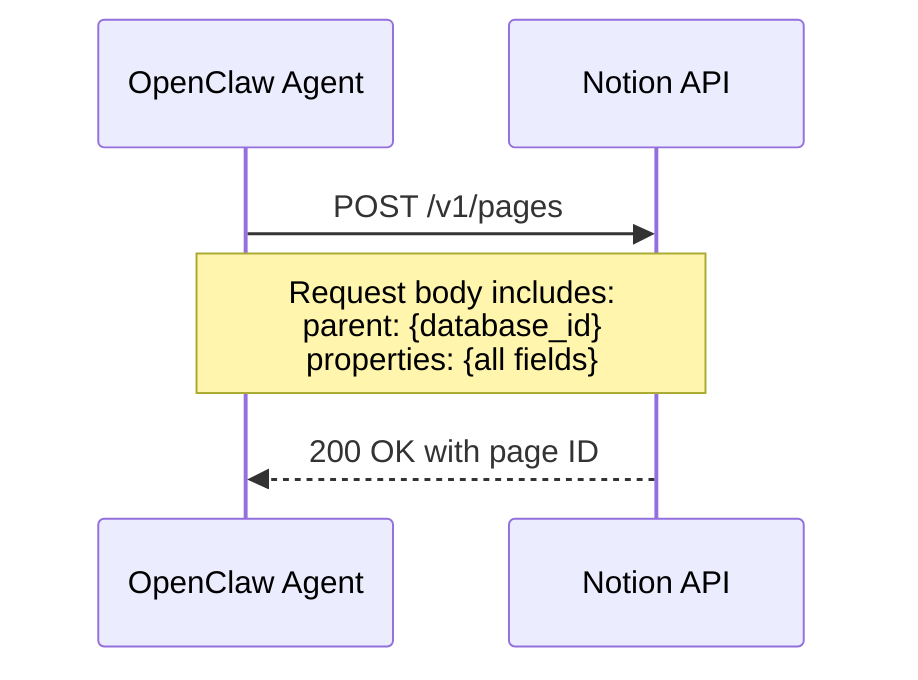

**Required on Create:**
- Title
- Status: `pending`
- WorkType
- Urgency
- TimeEstimate
- EnergyRequired
- CreatedAt

---

### Query Tasks

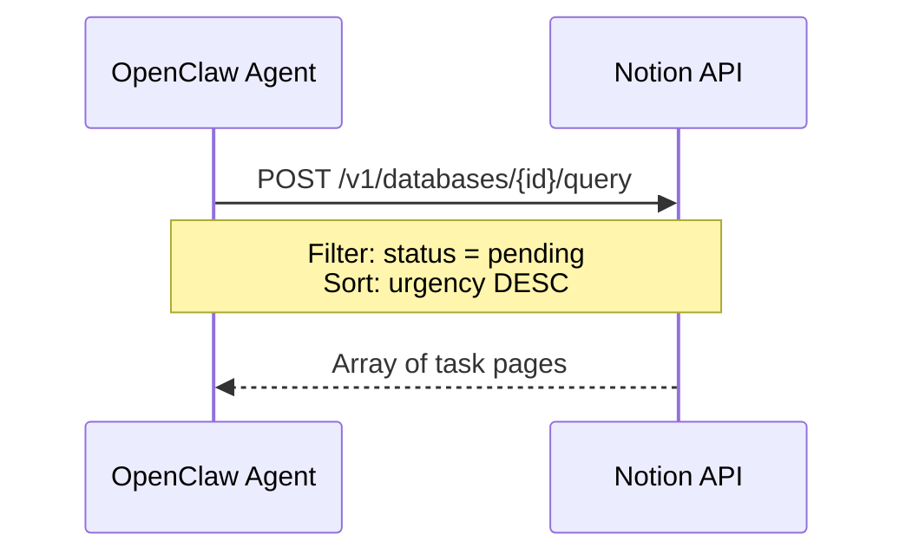

**Common Queries:**

| Purpose | Filter |
|---------|--------|
| All pending | `status = "pending"` |
| Short tasks | `status = "pending" AND time_estimate <= 30` |
| High urgency | `status = "pending" AND urgency >= 70` |
| Focus work | `status = "pending" AND work_type = "focus"` |
| Sub-tasks of parent | `parent_task_id = "{parent_id}"` |
| Next sub-task | `parent_task_id = "{parent_id}" AND status = "pending"` (sort by sequence) |
| Standalone tasks only | `parent_task_id IS NULL AND status != "has_subtasks"` |
| Parent tasks | `status = "has_subtasks"` |

---

### Update Task

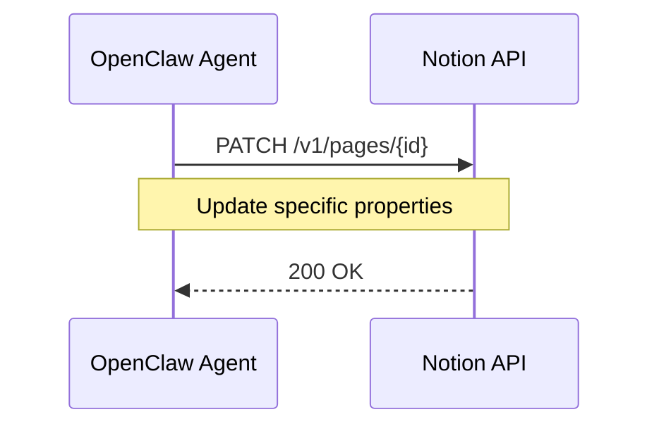

**Common Updates:**

| Action | Fields Updated |
|--------|----------------|
| Accept task | `status → in_progress` |
| Complete task | `status → completed, completedAt → now` |
| Reject task | `rejectionCount += 1, rejectionNotes += reason` |
| Unblock task | Clear blocked status in rejectionNotes |
| Cannot finish | `status → has_subtasks, progressNotes += progress` |
| Resume task | `resume_count += 1, last_resumed_at → now, progressNotes += "[ts] Resumed (gap: Xm)"` |
| Create sub-task | `parent_task_id, sequence, status = pending` |
| Complete sub-task | `status → completed` (check if parent complete) |

---

## Data Flow Diagram

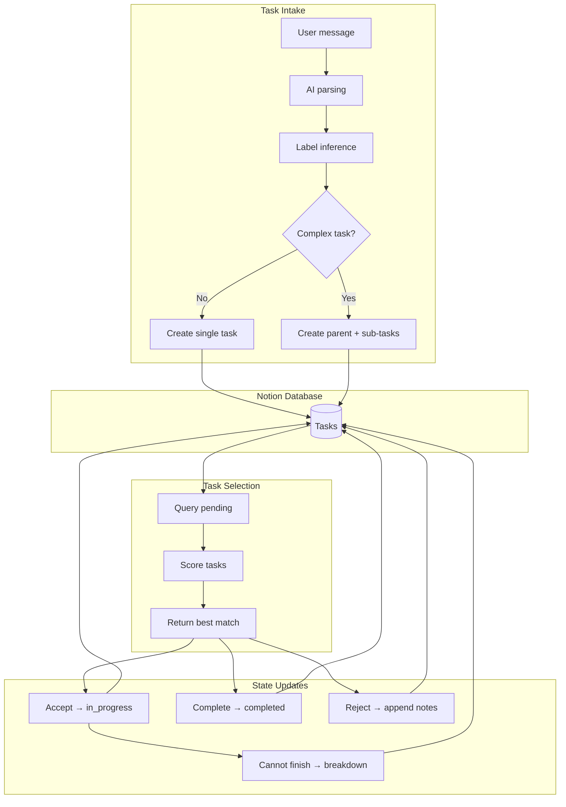

## Notion Setup Instructions

### 1. Create Integration

1. Go to [notion.so/my-integrations](https://www.notion.so/my-integrations)
2. Click "New integration"
3. Name: `hide-my-list`
4. Capabilities: Read, Update, Insert content
5. Copy "Internal Integration Token"

### 2. Create Database

1. Create new Notion page
2. Add full-page database (table view)
3. Add properties matching schema above
4. Copy database ID from URL

```
URL: https://notion.so/abc123...?v=xyz
Database ID: abc123...
```

### 3. Share with Integration

1. Open database page
2. Click "Share" top right
3. Invite integration by name
4. Grant "Can edit"

### 4. Configure Environment

```bash
cp .env.template .env
# Then edit .env with your real values:
# NOTION_API_KEY="secret_..."
# NOTION_DATABASE_ID="abc123..."
```

`.env` is canonical source of truth. Exported shell vars supported as optional overrides for manual/ad hoc runs.

## Sample Data

### Standalone Tasks

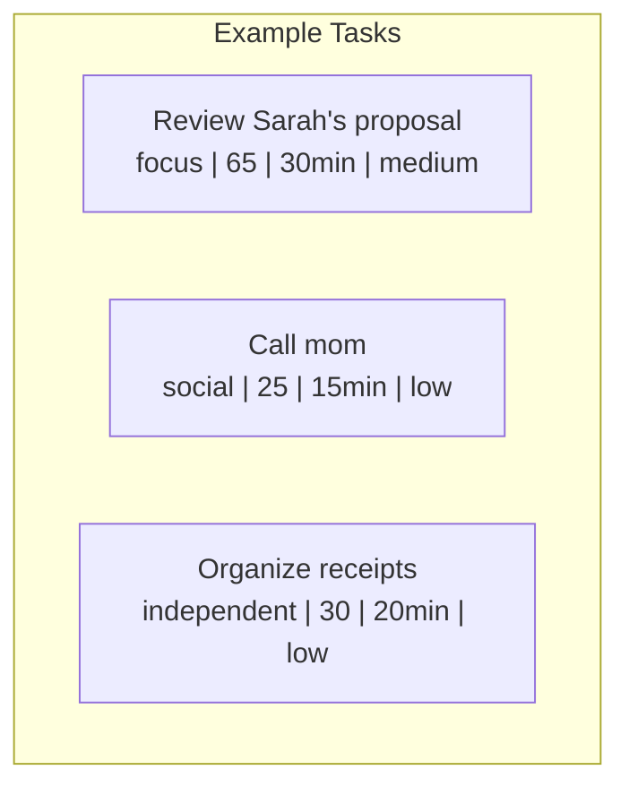

| Title | WorkType | Urgency | Time | Energy | Status | Parent |
|-------|----------|---------|------|--------|--------|--------|
| Review Sarah's proposal | focus | 65 | 30 | medium | pending | — |
| Call mom | social | 25 | 15 | low | pending | — |
| Organize receipts | independent | 30 | 20 | low | pending | — |
| Book dentist appointment | independent | 15 | 10 | low | completed | — |

### Parent Task with Sub-tasks (Hidden from User)

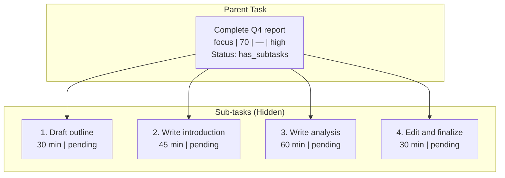

| Title | WorkType | Urgency | Time | Energy | Status | Parent | Seq |
|-------|----------|---------|------|--------|--------|--------|-----|
| Complete Q4 report | focus | 70 | 165 | high | has_subtasks | — | — |
| Draft outline | focus | 70 | 30 | medium | pending | Q4 report | 1 |
| Write introduction | focus | 70 | 45 | high | pending | Q4 report | 2 |
| Write analysis | focus | 70 | 60 | high | pending | Q4 report | 3 |
| Edit and finalize | focus | 70 | 30 | medium | pending | Q4 report | 4 |

**User Experience:** User asks for task, sees: "How about drafting the outline for the Q4 report? Should take about 30 minutes." Never sees parent or full breakdown.
