# Reward System

## Overview

Reward system = core hide-my-list component. Dopamine-inducing positive reinforcement on task completion/progress. Multiple reward channels — system-generated + interpersonal — create motivation loop.

## Reward Philosophy

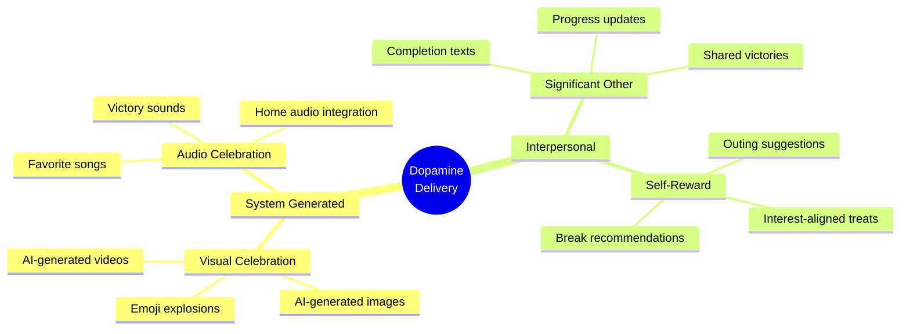

Principle: **completing tasks should feel genuinely rewarding**. Achieved via:

1. **Immediate gratification** - Instant visual/audio feedback
2. **Social reinforcement** - Loved ones acknowledge achievements
3. **Anticipatory pleasure** - Suggestions for enjoyable activities

### Shame-Safe Reward Principles

> **Shame Prevention:** Reward system must never create implicit comparison between "good" sessions (many completions) and "bad" sessions (few or none). Rewards celebrate what happened, never highlight what didn't.

- **Celebrate effort, not just results** — "You showed up and tried today. That counts."
- **Never reference streak breaks negatively** — streak ends: don't mention. Just start fresh.
- **Partial progress is real progress** — sub-task completion deserves acknowledgment
- **Safe exits get warmth, not silence** — "See you next time" beats no response
- **No guilt-inducing comparisons** — never "You did 3 tasks yesterday but only 1 today"

---

## Reward Architecture

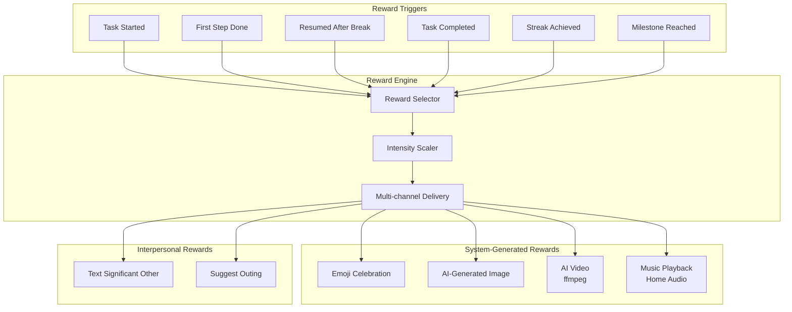

> **Note:** All initiation-phase triggers (Task Started, First Step Done, Resumed After Break)
> fire as reward events within the **Active** conversation state — they are not separate
> conversation states. See the conversation state diagram in `docs/ai-prompts/shared.md`.

---

## System-Generated Rewards

### Emoji Celebrations

Emoji-loaded congratulations messages scaling with achievement significance.

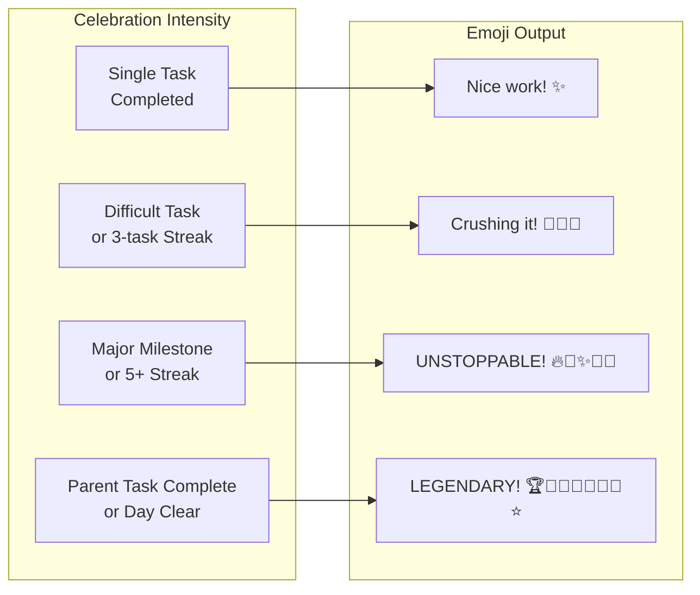

#### Initiation Reward Templates

> **Design principle:** Starting harder than finishing for ADHD brains. Initiation rewards acknowledge this truth. Feel like genuine encouragement from someone who understands, not participation trophies. Keep brief — user about to start working.

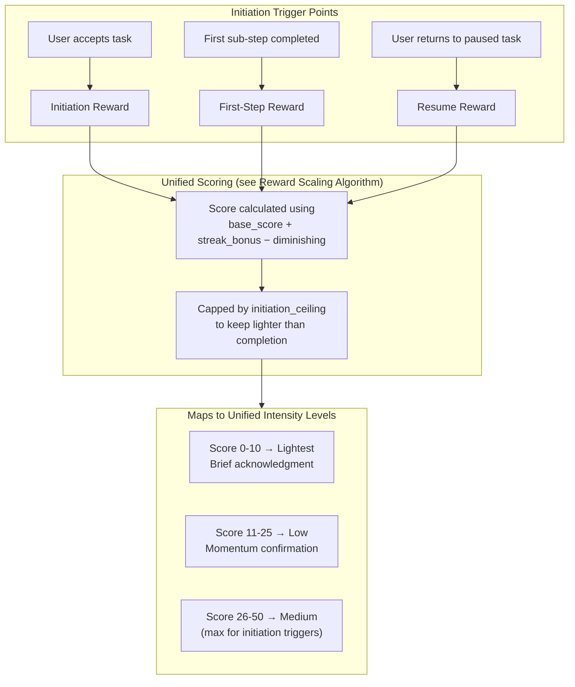

Initiation rewards use **same scoring algorithm** as completion rewards
(see [Reward Scaling Algorithm](#reward-scaling-algorithm)), with two
initiation-specific adjustments:

1. **`initiation_base_weight`** — multiplier (default `0.4`) on base score, keeping initiation rewards inherently lighter.
2. **`initiation_ceiling`** — intensity cap (default `Medium / 50`) preventing initiation rewards from reaching `High` or `Epic`, preserving those tiers for completion.

| Trigger | Base-Weight | Ceiling | Example Messages |
|---------|-------------|---------|------------------|
| Task accepted (starting) | 0.3 | Lightest (10) | "You're in. That's the hardest part.", "Starting — nice.", "Let's go." |
| First sub-step done | 0.4 | Low (25) | "First step done — you're in motion now.", "One down. Momentum's real." |
| Resumed after break | 0.5 | Medium (50) | "Back at it — picking up where you left off is a skill.", "Welcome back. Ready to keep going?" |
| Started 3+ tasks today | 0.4 | Low (25) | "Third start today — your initiation muscle is getting stronger." |

**Important design constraints:**
- Initiation rewards must be **briefer and lighter** than completion rewards
- Never celebrate starting so much it diminishes completion celebration
- Tone is **acknowledgment of difficulty**, not generic cheerleading
- "You started" validates that starting is genuinely hard — don't trivialize it
- First-time users always get initiation reward; returning users: vary frequency to avoid habituation

#### Completion Celebration Message Templates

| Trigger | Intensity | Example Messages |
|---------|-----------|------------------|
| Single task | Low | "Nice work! ✨", "Done! 💫", "Got it! ✅" |
| Quick task (< 15 min) | Low | "Speed demon! ⚡", "Quick win! 🎯" |
| Focus task complete | Medium | "Deep work done! 🧠✨", "Focus mode: crushed! 💪🎯" |
| 3-task streak | Medium | "Hat trick! 🎩✨🎉", "Three down! 🔥💪" |
| 5-task streak | High | "On fire! 🔥🔥🔥✨💪", "Unstoppable! 🚀🎉💪" |
| Difficult task | High | "Beast mode! 💪🔥🎉", "Conquered! ⚔️✨🏆" |
| Parent task (all subs done) | Epic | "MAJOR WIN! 🏆👑🎉✨🔥", "PROJECT COMPLETE! 🚀⭐💪🎊" |
| All tasks cleared | Epic | "INBOX ZERO! 🏆👑✨🎉🔥💪🚀", "LEGENDARY DAY! 👑⭐🏆🎊" |

---

### AI-Generated Celebration Images

Every completion gets **unique, AI-generated celebration image** via OpenAI's `gpt-image-1` model. Novelty ADHD brains crave — no two celebrations identical, prevents habituation, maintains dopamine response.

#### Why AI-Generated Images

- **Novelty**: ADHD brains habituate to repeated stimuli. Every AI image unique, no predictability.
- **Dopamine**: Novel visual stimuli trigger stronger dopamine than familiar ones.
- **Personalization**: Prompts incorporate user context, streaks, preferences.
- **Scalability**: No static image library to curate/maintain.

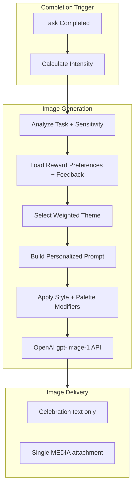

#### Image Generation Script

`scripts/generate-reward-image.sh` handles all image generation:

```bash
# Generate a reward image
./scripts/generate-reward-image.sh <intensity> [task_title] [streak_count]

# Examples:
./scripts/generate-reward-image.sh low "Call dentist" 0
./scripts/generate-reward-image.sh medium "Review proposal" 2
./scripts/generate-reward-image.sh epic "Complete Q4 report" 5

# Optional context from the caller:
REWARD_WORK_TYPE=focus REWARD_ENERGY_LEVEL=low \
  ./scripts/generate-reward-image.sh medium "Review proposal" 2
```

Output: writes PNG to `/tmp/reward-<timestamp>.png` and prints the path.
OpenClaw then stages attachment delivery through `~/.openclaw/media/outbound/`,
which must stay traversable (for example `0755`) so Signal can read the staged
file.

#### Prompt Personalization Pipeline

Reward prompts are built from four layers:

1. **Intensity theme pool** - low/medium/high/epic still control the overall celebration scale
2. **Task motif extraction** - task title becomes a safe visual motif (call, writing, setup, cleanup, etc.)
3. **Preference modifiers** - optional `state.json.user_preferences.rewards` values bias style, palette, and subject matter
4. **Feedback weighting** - prior positive/negative reactions bias future theme-family, style, and palette selection

Task titles are not copied blindly into the image prompt. The script first classifies the task and builds either:

- **Literal motifs** for ordinary tasks: "glowing phone and confetti" for calls, "pages turning into stars" for writing
- **Metaphorical motifs** for sensitive tasks: therapy/medical/personal/legal/financial tasks use abstract or symbolic celebration instead of literal depictions
- **Generic progress imagery** when the title is too vague to trust

#### Reward Delivery Contract

The COMPLETE reward phase has a strict visible-output boundary. All work before
delivery is hidden implementation detail: status updates, `state.json` writes,
reward scoring, streak math, channel selection, script invocations, fallback
diagnostics, and image-generation progress must not be sent to the user.

Do not narrate reward preparation. A COMPLETE turn must not contain visible text
like "calculating the reward", "updating Notion", "generating an image", score
breakdowns, shell commands, tool names, or progress updates before the reward.

When `scripts/generate-reward-image.sh` returns a `.png`, the final
assistant-authored reward turn passed to OpenClaw should contain only:

1. Celebration text for the completion
2. One `MEDIA:<absolute-path-to-image>` line

OpenClaw consumes the `MEDIA:` line as attachment markup. End users should see
only the celebration text plus the rendered image attachment — never the raw
filesystem path or transport syntax.

Example assistant-authored reply:

```text
CRUSHED IT! 🔥💪✨
MEDIA:/absolute/path/to/image.png
```

Reward Delivery Checklist:

- [ ] No interim user-visible messages were sent during reward scoring, state updates, Notion updates, or image generation
- [ ] Visible user copy is celebration only — no orchestration notes, no "Now let me...", no tool narration
- [ ] Exactly one `MEDIA:` line in the assistant-authored turn
- [ ] User sees rendered attachment, not raw `MEDIA:` syntax or filesystem path
- [ ] No inline media tags such as `<media:image>` in the same reply
- [ ] No second send of the same image via the `message` tool in the same turn
- [ ] If the script returns a `.txt` fallback instead of `.png`, read the suggestion and send plain text only — no `MEDIA:` line
- [ ] If the turn also includes an outing suggestion or other follow-up, send that as a separate plain-text message after the attachment-bearing reward reply
- [ ] If multiple completions are handled in one user turn, per-task score math and tool work remain hidden; user-visible output is still only final celebration text plus each intended attachment/fallback

#### Theme Pools by Intensity

Each intensity level has 5+ theme candidates. Selection is weighted by preferences and bounded feedback.

| Intensity | Theme Style | Examples |
|-----------|-------------|---------|
| Low | Gentle, warm, cozy | Cheerful bird with sparkle, paper airplane in clouds, happy cat in sunbeam |
| Medium | Enthusiastic, joyful | Fox dancing in wildflowers, confetti explosion, otter on rainbow waterfall |
| High | Majestic, powerful | Phoenix rising from golden flames, astronaut planting flag, whale in starfield |
| Epic | Cosmic, transcendent | Galaxy forming a crown, reality folding into light cathedral, cosmic phoenix |

#### Sensitive Task Guardrail

When the task classifier detects a private or shame-heavy completion (therapy, medical, legal, financial, or private admin work), reward generation switches to a stricter mode:

- `task_mode` forced to `metaphorical`
- theme/style/palette chosen only from calm abstract-or-symbolic allowlists
- humor forced to `subtle`
- literal task artifacts, mascots, animal scenes, paperwork, money, medical tools, and joke imagery excluded

#### Reward Preference Schema

Canonical reward image preferences live in `state.json.user_preferences.rewards`:

```json
{
  "user_preferences": {
    "rewards": {
      "preferred_styles": ["storybook watercolor", "paper collage illustration"],
      "preferred_palettes": ["cozy pastel glow", "aurora jewel tones"],
      "favorite_subjects": ["space", "cats", "nature"],
      "avoid": ["medical literal", "spiders"],
      "humor_level": "playful"
    }
  }
}
```

Supported preference dimensions:

- **Styles** - e.g. watercolor, collage, 3D, graphic illustration
- **Palettes** - warm, pastel, jewel-tone, neon, nature-led
- **Subjects** - space, animals, nature, abstract, cozy
- **Avoid list** - tags or vibes to suppress
- **Humor level** - `subtle`, `playful`, or `maximal`

#### Streak Enhancements

Streak count modifies generated image:

| Streak | Visual Enhancement |
|--------|--------------------|
| 0-2 | Base theme only |
| 3-4 | Three orbiting stars added |
| 5+ | Trail of five glowing orbs added |

#### Feedback Loop

Generated rewards leave two metadata trails:

- `rewards/manifest.log` - stable tab-delimited recap manifest (`timestamp`, `intensity`, `task_title`, `file_path`)
- `rewards/manifest.jsonl` - feedback metadata only (`reward_id`, `prompt_version`, `generated_at`, `timestamp`, `intensity`, `task_mode`, `task_profile`, `task_tags`, `theme_id`, `theme_family`, `theme_tags`, `style`, `palette`, `archive_file`)

The companion script `scripts/log-reward-feedback.sh` records lightweight reactions:

```bash
# Record feedback for the most recent reward
./scripts/log-reward-feedback.sh latest positive "Loved the space vibe"

# Record feedback for a specific reward
./scripts/log-reward-feedback.sh 2026-04-30_091530_medium_21422 negative "Too busy"
```

Those reactions append to `rewards/feedback.jsonl` and are used to bias future style/theme/palette selection. Feedback is intentionally bounded: recent reactions decay over time, aggregate weights are capped, and the result is only a nudge so novelty still matters.

#### Novelty Mechanics

Image generation system inherently addresses novelty:

1. **Weighted theme selection** - each intensity has 5+ themes, with preferences and bounded feedback nudging rather than dictating the outcome
2. **Task motifs** - the same theme can feel different because the accomplished task changes the scene details
3. **AI variation** - same prompt produces different images each time
4. **Streak-responsive** - visual elements change as streaks grow
5. **Expandable pools** - new themes, styles, and palettes can be added without changing the delivery contract

#### Graceful Degradation — Offline Fallback Rewards

If image generation unavailable (API outage, missing key, network error, malformed response), script **does not fail silently**. Suggests fun non-digital real-life reward from pool of 12:

- Favorite snack, cupcake, ice cream, chocolate
- 30 minutes of a favorite video game
- Fancy coffee or hot chocolate
- A walk outside, stretches, or yoga
- Mini dance party, calling a friend, watching a show
- Ordering favorite takeout

Fallback writes suggestion to `.txt` file (instead of `.png`) and exits successfully — reward pipeline always delivers something. Prevents "expected reward didn't arrive" anti-pattern from Hallowell-Ratey's ADHD framework.

#### Environment Variables

| Variable | Purpose |
|----------|---------|
| `OPENAI_API_KEY` | OpenAI API authentication for image generation |
| `REWARD_STATE_FILE` | Optional override for where reward preferences are loaded from |
| `REWARD_WORK_TYPE` | Optional task context used to shape composition |
| `REWARD_ENERGY_LEVEL` | Optional task context used to tune intensity and gentleness |

#### Image Archive & Collection

Every generated reward image auto-archived to `rewards/` with metadata:

- **File naming**: `YYYY-MM-DD_HHMMSS_<intensity>.png`
- **Recap manifest**: `rewards/manifest.log` tracks timestamp, intensity, task title, file path
- **Metadata manifest**: `rewards/manifest.jsonl` tracks only feedback-loop selection fields plus archive path; raw task title, task motif, sensitive reason, and full prompt text are intentionally excluded
- **Feedback log**: `rewards/feedback.jsonl` stores positive/neutral/negative reactions for future weighting
- **Persistent**: Images survive across sessions — celebration history preserved

#### Weekly Recap Video

`scripts/generate-weekly-recap.sh` compiles all reward images from past week into card-flip transition video:

```bash
# Generate recap of past 7 days (default)
./scripts/generate-weekly-recap.sh

# Custom range
./scripts/generate-weekly-recap.sh 14  # past 2 weeks
```

Features:
- **Card-flip transitions** between images (fadegrays, circlecrop, radial, etc.)
- **Variety in transitions** — each cut uses different style
- **Fade-out ending** for polished finish
- **Output**: `rewards/weekly-recap-YYYY-MM-DD.mp4`

Recap = tangible accomplishment record — scrolling a week of unique celebration images is itself a reward.

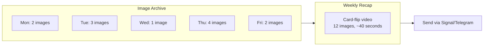

#### Technical Details

| Setting | Value |
|---------|-------|
| Model | `gpt-image-1` |
| Size | 1024x1024 |
| Quality | `auto` (low-high), `high` (epic) |
| Output format | PNG (images), MP4 (recap video) |
| Typical generation time | 10-20 seconds |
| Archive location | `rewards/` |
| Video codec | H.264 (libx264) |
| Display per image | 2.5 seconds |
| Transition duration | 0.8 seconds |

---

### Music Playback (Home Audio Integration)

Home automation plays celebratory music on task completion.


#### Music Playback Configuration

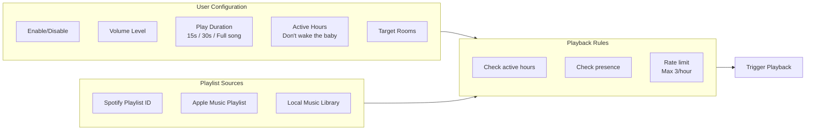

#### Example Music Triggers

| Achievement | Music Selection | Duration |
|-------------|-----------------|----------|
| Quick task | Random from "Victory Jingles" | 15 seconds |
| Focus task | Random from "Triumphant" | 30 seconds |
| Major milestone | User's favorite song | Full song |
| All tasks cleared | "We Are The Champions" | Full song |

#### Home Automation Integration Points

| System | Integration Method | Notes |
|--------|-------------------|-------|
| Sonos | Sonos API | Direct HTTP calls |
| Apple HomePod | HomeKit/Shortcuts | Via Shortcuts automation |
| Amazon Echo | Alexa Skills | Custom skill or routines |
| Google Home | Google Home API | Cast-enabled playback |
| Home Assistant | REST API | Universal bridge for any system |
| Custom | MQTT | Publish to configured topic |

---

## Interpersonal Rewards

### Text Significant Other

Auto-notify loved one on task completion — external positive reinforcement + social accountability.

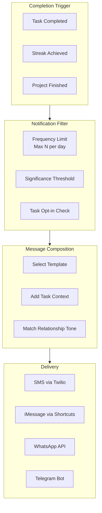

#### Notification Configuration

| Setting | Options | Default |
|---------|---------|---------|
| recipient | Phone number or contact ID | Required |
| delivery_method | sms, imessage, whatsapp, telegram | sms |
| frequency_limit | 1-10 per day | 3 |
| min_significance | low, medium, high, epic | medium |
| active_hours | Time range | 9am-9pm |
| task_opt_in | all, tagged, manual | tagged |

#### Message Templates

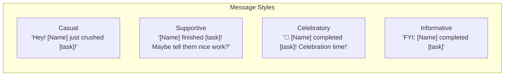

| Trigger | Example Message |
|---------|-----------------|
| Single task | "Hey! [Name] just finished '[task]' - maybe give them a high five later? 🙌" |
| Streak (3+) | "[Name] is on a roll - [N] tasks done today! 🔥" |
| Difficult task | "[Name] just conquered a big one: '[task]'. They might need a hug! 💪" |
| Parent complete | "BIG NEWS: [Name] finished the entire '[project]'! Celebration dinner? 🎉" |
| All cleared | "[Name] cleared their ENTIRE task list! This calls for ice cream 🍦" |

#### Privacy & Consent

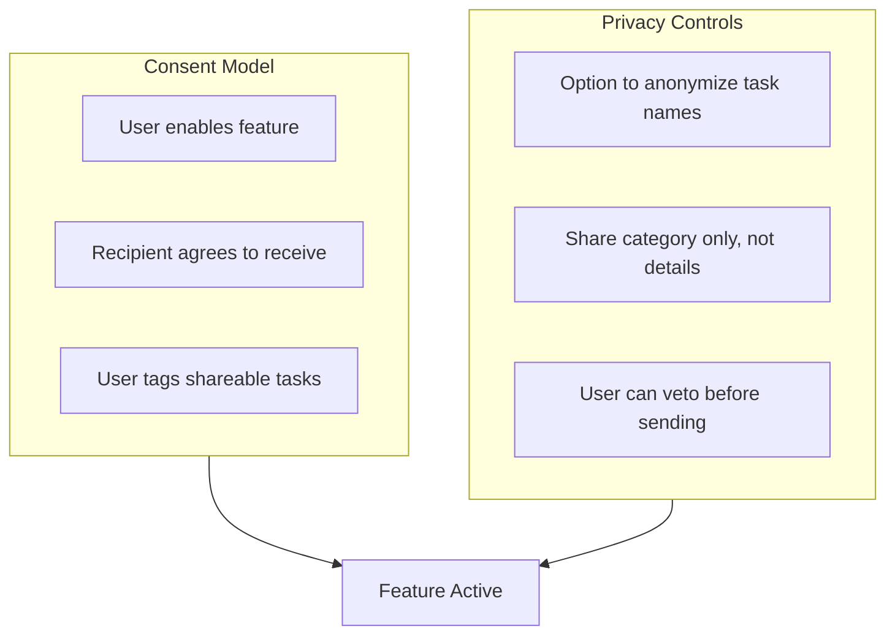

---

### Outing Suggestions

After completing tasks (especially difficult), suggest fun activities aligned with user interests — creates anticipation + self-reward.

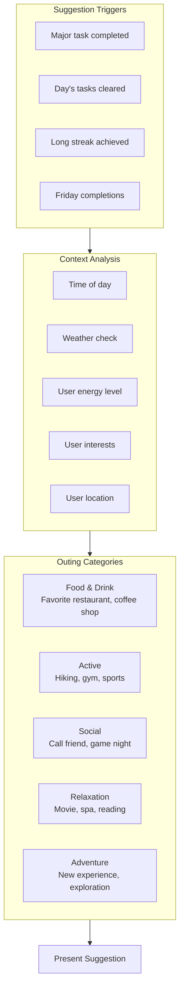

#### User Interest Configuration

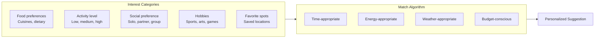

#### Suggestion Templates

| Context | Example Suggestions |
|---------|---------------------|
| After focus work (tired) | "You've earned a break! How about grabbing a coffee from [favorite_cafe]? ☕" |
| After physical task | "Nice work! Maybe reward yourself with [favorite_food] from [restaurant]? 🍕" |
| Friday afternoon | "Weekend's calling! Movie night with [partner] at [theater]? 🎬" |
| All tasks cleared | "EVERYTHING DONE! Time for an adventure - what about [saved_activity]? 🎉" |
| Long streak | "5 tasks in a row! You deserve [favorite_treat] 🏆" |
| Morning completion | "Great start! Save room for [lunch_spot] later? 🌮" |

#### External Integrations

| Service | Use Case |
|---------|----------|
| Google Maps | Location search, directions |
| Yelp API | Restaurant recommendations |
| Weather API | Weather-appropriate suggestions |
| Calendar | Check availability |
| Partner's calendar | Coordinate joint activities |

---

## Reward Scaling Algorithm

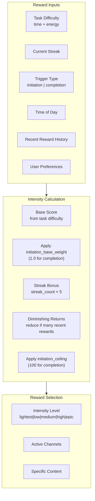

### Intensity Levels

| Level | Score Range | Emoji Count | AI Image | Music | Text SO | Outing | Used For |
|-------|-------------|-------------|----------|-------|---------|--------|----------|
| Lightest | 0-10 | 0 | No | No | No | No | Initiation only |
| Low | 11-25 | 1-2 | Gentle theme | No | No | No | Initiation + Completion |
| Medium | 26-50 | 2-4 | Enthusiastic theme | Maybe | Maybe | No | Initiation (max) + Completion |
| High | 51-75 | 4-6 | Majestic theme | Yes | Yes | Maybe | Completion only |
| Epic | 76-100 | 6+ | Cosmic theme (high quality) | Yes | Yes | Yes | Completion only |

### Score Calculation

Same formula for **both** initiation and completion rewards. Initiation triggers apply weight + ceiling to keep lighter.

```
# --- Shared base calculation (initiation + completion) ---
base_score = (time_estimate / 15) * 10 + (energy_level * 10)
streak_bonus = streak_count * 5
milestone_bonus = is_parent_complete ? 25 : 0
milestone_bonus += is_all_cleared ? 50 : 0

raw_score = base_score + streak_bonus + milestone_bonus
diminishing = max(0, (rewards_in_last_hour - 2) * 10)

# --- Completion rewards ---
completion_score = min(100, max(0, raw_score - diminishing))

# --- Initiation rewards ---
# initiation_base_weight: per-trigger multiplier (see table above)
#   task_accepted = 0.3, first_step = 0.4, resumed = 0.5, multi_start = 0.4
# initiation_ceiling: per-trigger max score
#   task_accepted = 10, first_step = 25, resumed = 50, multi_start = 25
weighted_score = (base_score * initiation_base_weight) + streak_bonus
initiation_score = min(initiation_ceiling, max(0, weighted_score - diminishing))
```

**Why two adjustments?**
- `initiation_base_weight` scales down task-difficulty component — user hasn't done work yet, only started.
- `initiation_ceiling` guarantees no initiation reward ever reaches `High` or `Epic`, keeping those tiers exclusively for completion. Starting never feels more rewarding than finishing.
- `streak_bonus` kept at full value for initiation — building a *starting* streak is genuinely hard for ADHD, deserves recognition.

---

## Configuration Schema

### Reward Delivery Settings (runtime config)

Image-style preferences live in `state.json.user_preferences.rewards`. The schema below is separate: it covers delivery-channel toggles and channel-specific runtime settings, not the user's reward-image taste profile.

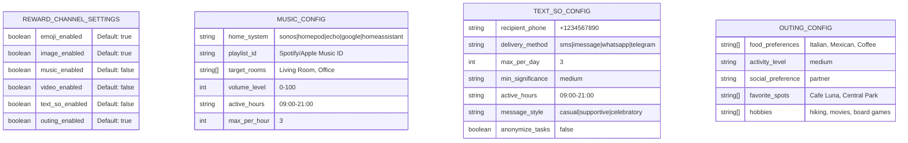

---

## Integration with Existing Flows

### Completion Flow Enhancement

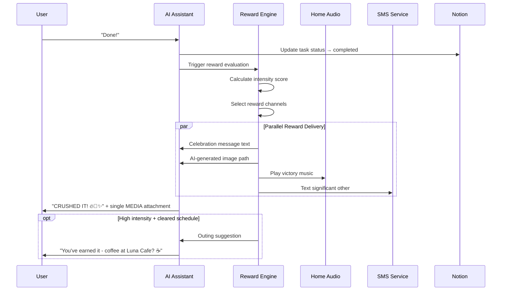

### State Diagram Update

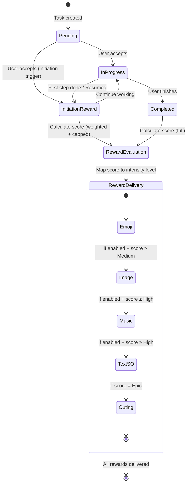

---

## Agent Commands

Capabilities exposed via conversation commands, not HTTP endpoints. OpenClaw agent handles directly.

| Command | Purpose |
|---------|---------|
| Reward settings | Get or update current reward settings |
| Test music | Test music integration |
| Test SMS | Test SMS delivery |
| Reward history | Get recent reward history |
| Home status | Check home system connectivity |
| List rooms | List available rooms |
| Play music | Trigger music playback |
| Stop music | Stop current playback |

---

## Environment Variables

| Variable | Purpose | Example |
|----------|---------|---------|
| `OPENAI_API_KEY` | OpenAI API for image generation | `sk-proj-xxxxxxxx` |
| `REWARD_STATE_FILE` | Override reward preference source file | `/workspace/state.json` |
| `REWARD_WORK_TYPE` | Optional work type hint for reward imagery | `focus` |
| `REWARD_ENERGY_LEVEL` | Optional energy hint for reward imagery | `low` |
| `TWILIO_ACCOUNT_SID` | Twilio authentication | `ACxxxxxxxx` |
| `TWILIO_AUTH_TOKEN` | Twilio authentication | `xxxxxxxx` |
| `TWILIO_PHONE_NUMBER` | Sender phone number | `+1234567890` |
| `SONOS_API_KEY` | Sonos integration | `xxxxxxxx` |
| `HOME_ASSISTANT_URL` | Home Assistant endpoint | `http://ha.local:8123` |
| `HOME_ASSISTANT_TOKEN` | Home Assistant auth | `xxxxxxxx` |
| `OPENWEATHER_API_KEY` | Weather for outings | `xxxxxxxx` |

---

## Success Metrics

| Metric | Target | Measurement |
|--------|--------|-------------|
| Task completion rate | +20% | Compare before/after |
| Session duration | +15% | Average time in app |
| Return rate | +25% | Users returning within 24h |
| Streak length | +30% | Average consecutive completions |
| User satisfaction | 4.5/5 | Post-session survey |
| Reward engagement | 80%+ | Rewards not dismissed immediately |
