# Reward System

## Overview

The reward system is a core component of hide-my-list designed to provide dopamine-inducing positive reinforcement when users complete tasks or make progress. By leveraging multiple reward channels—both system-generated and interpersonal—we create a powerful motivation loop that keeps users engaged and productive.

## Reward Philosophy

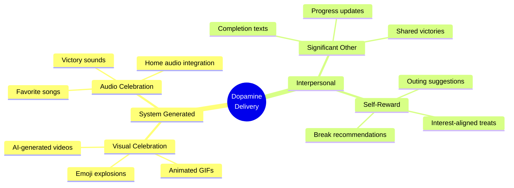

The reward system operates on the principle that **completing tasks should feel genuinely rewarding**. We achieve this through:

1. **Immediate gratification** - Instant visual/audio feedback
2. **Social reinforcement** - Loved ones acknowledge achievements
3. **Anticipatory pleasure** - Suggestions for enjoyable activities

---

## Reward Architecture

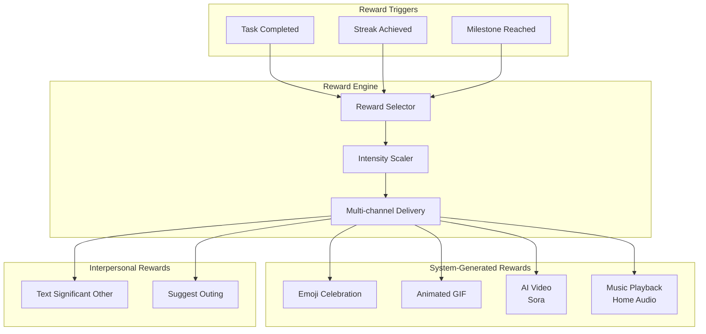

---

## System-Generated Rewards

### Emoji Celebrations

Emoji-loaded congratulations messages that scale with achievement significance.

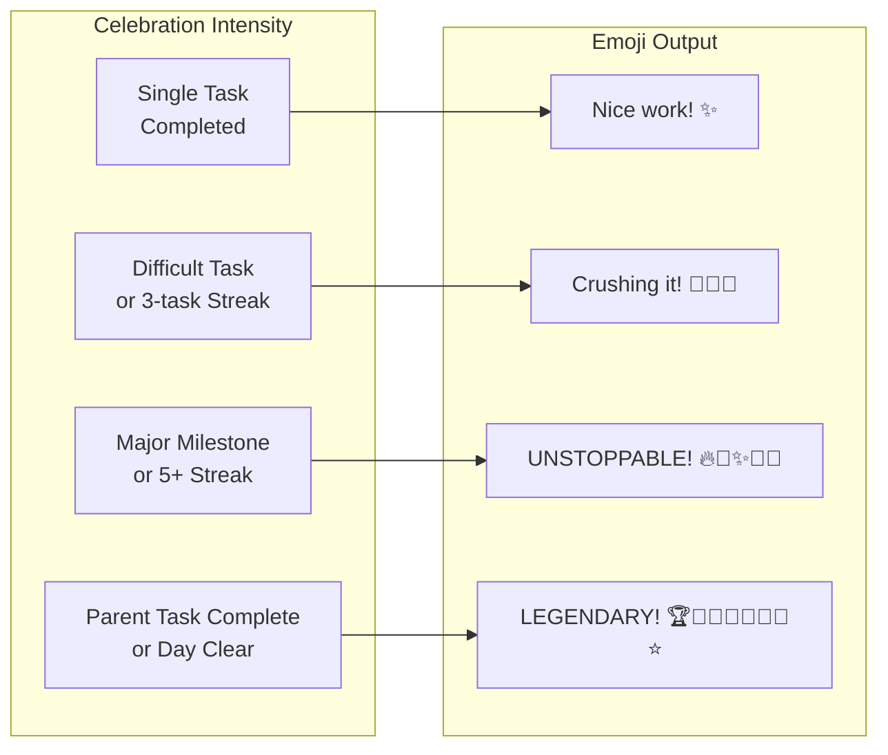

#### Celebration Message Templates

| Trigger | Intensity | Example Messages |
|---------|-----------|------------------|
| Single task | Low | "Nice work! ✨", "Done! 💫", "Got it! ✅" |
| Quick task (< 15 min) | Low | "Speed demon! ⚡", "Quick win! 🎯" |
| Focus task complete | Medium | "Deep work done! 🧠✨", "Focus mode: crushed! 💪🎯" |
| 3-task streak | Medium | "Hat trick! 🎩✨🎉", "Three down! 🔥💪" |
| 5-task streak | High | "On fire! 🔥🔥🔥✨💪", "Unstoppable! 🚀🎉💪" |
| Difficult task | High | "Beast mode! 💪🔥🎉", "Conquered! ⚔️✨🏆" |
| Parent task (all subs done) | Epic | "MAJOR WIN! 🏆👑🎉✨🔥", "PROJECT COMPLETE! 🚀⭐💪🎊" |
| All tasks cleared | Epic | "INBOX ZERO! 🏆👑✨🎉🔥💪🚀", "LEGENDARY DAY! 👑⭐🏆🎊" |

---

### AI-Generated Celebration Images

Every completion gets a **unique, AI-generated celebration image** via OpenAI's `gpt-image-1` model. This provides the novelty that ADHD brains crave — no two celebrations look the same, preventing habituation and maintaining dopamine response.

#### Why AI-Generated Over Static GIFs

- **Novelty**: ADHD brains habituate to repeated stimuli. Static GIF pools become predictable. Every AI image is unique.
- **Dopamine**: Novel visual stimuli trigger stronger dopamine release than familiar ones.
- **Personalization**: Prompts can incorporate user context, streaks, and preferences.
- **Scalability**: No need to curate and maintain a GIF library.

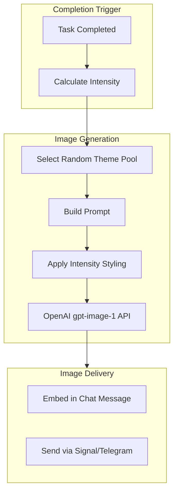

#### Image Generation Script

`scripts/generate-reward-image.sh` handles all image generation:

```bash
# Generate a reward image
./scripts/generate-reward-image.sh <intensity> [task_title] [streak_count]

# Examples:
./scripts/generate-reward-image.sh low "Call dentist" 0
./scripts/generate-reward-image.sh medium "Review proposal" 2
./scripts/generate-reward-image.sh epic "Complete Q4 report" 5
```

Output: writes PNG to `/tmp/reward-<timestamp>.png` and prints the path.

#### Theme Pools by Intensity

Each intensity level has a pool of 5+ thematic prompts. A random theme is selected each time, ensuring variety.

| Intensity | Theme Style | Examples |
|-----------|-------------|---------|
| Low | Gentle, warm, cozy | Cheerful bird with sparkle, paper airplane in clouds, happy cat in sunbeam |
| Medium | Enthusiastic, joyful | Fox dancing in wildflowers, confetti explosion, otter on rainbow waterfall |
| High | Majestic, powerful | Phoenix rising from golden flames, astronaut planting flag, whale in starfield |
| Epic | Cosmic, transcendent | Galaxy forming a crown, reality folding into light cathedral, cosmic phoenix |

#### Streak Enhancements

Streak count modifies the generated image:

| Streak | Visual Enhancement |
|--------|--------------------|
| 0-2 | Base theme only |
| 3-4 | Three orbiting stars added |
| 5+ | Trail of five glowing orbs added |

#### Novelty Mechanics (Issue #12)

The image generation system inherently addresses novelty concerns:

1. **Random theme selection** — each intensity has 5+ themes, randomly chosen
2. **AI variation** — even the same prompt produces different images each time
3. **Streak-responsive** — visual elements change as streaks grow
4. **Expandable pools** — new themes can be added to the script without code changes

Future enhancements:
- Seasonal/holiday theme injection
- User preference learning (track which themes get positive reactions)
- Milestone surprise themes (hidden achievements at 10th, 50th, 100th task)

#### Environment Variables

| Variable | Purpose |
|----------|---------|
| `OPENAI_API_KEY` | OpenAI API authentication for image generation |

#### Technical Details

| Setting | Value |
|---------|-------|
| Model | `gpt-image-1` |
| Size | 1024x1024 |
| Quality | `auto` (low-high), `high` (epic) |
| Output format | PNG |
| Typical generation time | 10-20 seconds |

---

### Music Playback (Home Audio Integration)

Leverage home automation systems to play celebratory music when tasks are completed.

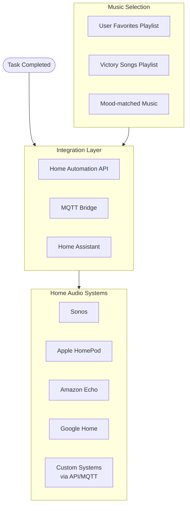

#### Music Playback Configuration

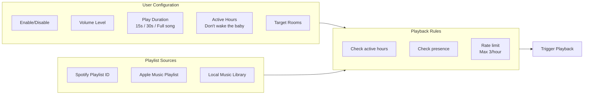

#### Example Music Triggers

| Achievement | Music Selection | Duration |
|-------------|-----------------|----------|
| Quick task | Random from "Victory Jingles" | 15 seconds |
| Focus task | Random from "Triumphant" | 30 seconds |
| Major milestone | User's favorite song | Full song |
| All tasks cleared | "We Are The Champions" | Full song |

#### Home Automation Integration Points

| System | Integration Method | Notes |
|--------|-------------------|-------|
| Sonos | Sonos API | Direct HTTP calls |
| Apple HomePod | HomeKit/Shortcuts | Via Shortcuts automation |
| Amazon Echo | Alexa Skills | Custom skill or routines |
| Google Home | Google Home API | Cast-enabled playback |
| Home Assistant | REST API | Universal bridge for any system |
| Custom | MQTT | Publish to configured topic |

---

## Interpersonal Rewards

### Text Significant Other

Automatically notify a loved one when the user completes tasks, creating external positive reinforcement and social accountability.

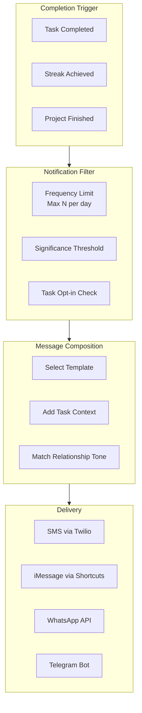

#### Notification Configuration

| Setting | Options | Default |
|---------|---------|---------|
| recipient | Phone number or contact ID | Required |
| delivery_method | sms, imessage, whatsapp, telegram | sms |
| frequency_limit | 1-10 per day | 3 |
| min_significance | low, medium, high, epic | medium |
| active_hours | Time range | 9am-9pm |
| task_opt_in | all, tagged, manual | tagged |

#### Message Templates

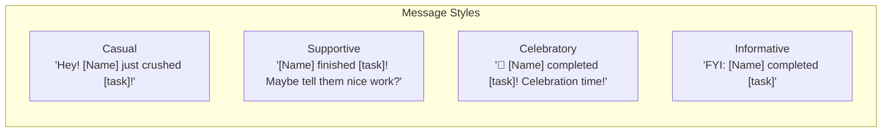

| Trigger | Example Message |
|---------|-----------------|
| Single task | "Hey! [Name] just finished '[task]' - maybe give them a high five later? 🙌" |
| Streak (3+) | "[Name] is on a roll - [N] tasks done today! 🔥" |
| Difficult task | "[Name] just conquered a big one: '[task]'. They might need a hug! 💪" |
| Parent complete | "BIG NEWS: [Name] finished the entire '[project]'! Celebration dinner? 🎉" |
| All cleared | "[Name] cleared their ENTIRE task list! This calls for ice cream 🍦" |

#### Privacy & Consent

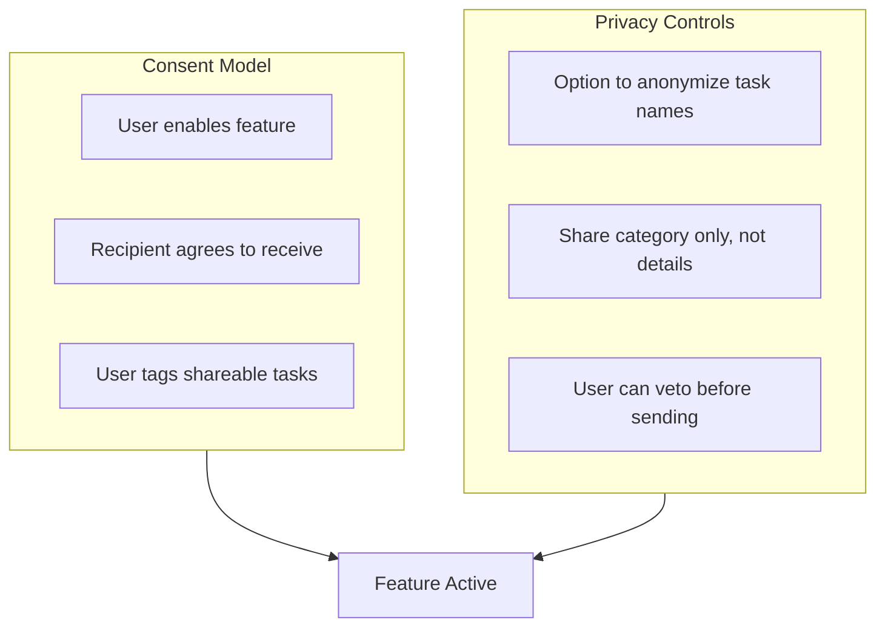

---

### Outing Suggestions

After completing tasks (especially difficult ones), suggest fun activities aligned with user interests to create anticipation and self-reward.

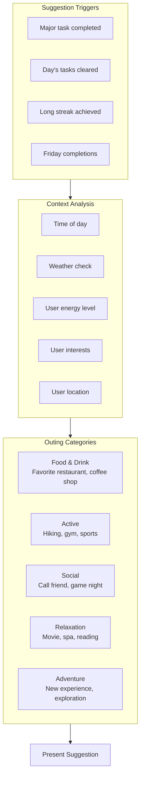

#### User Interest Configuration

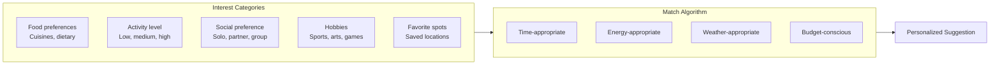

#### Suggestion Templates

| Context | Example Suggestions |
|---------|---------------------|
| After focus work (tired) | "You've earned a break! How about grabbing a coffee from [favorite_cafe]? ☕" |
| After physical task | "Nice work! Maybe reward yourself with [favorite_food] from [restaurant]? 🍕" |
| Friday afternoon | "Weekend's calling! Movie night with [partner] at [theater]? 🎬" |
| All tasks cleared | "EVERYTHING DONE! Time for an adventure - what about [saved_activity]? 🎉" |
| Long streak | "5 tasks in a row! You deserve [favorite_treat] 🏆" |
| Morning completion | "Great start! Save room for [lunch_spot] later? 🌮" |

#### External Integrations

| Service | Use Case |
|---------|----------|
| Google Maps | Location search, directions |
| Yelp API | Restaurant recommendations |
| Weather API | Weather-appropriate suggestions |
| Calendar | Check availability |
| Partner's calendar | Coordinate joint activities |

---

## Reward Scaling Algorithm

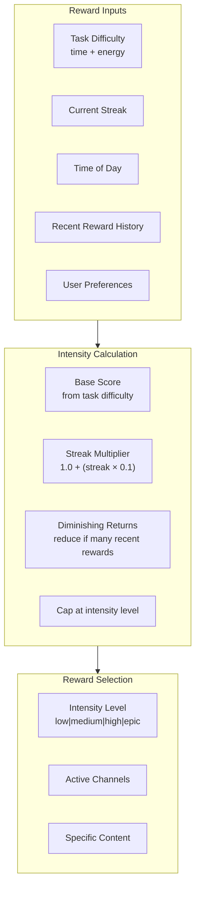

### Intensity Levels

| Level | Score Range | Emoji Count | AI Image | Music | Text SO | Outing |
|-------|-------------|-------------|----------|-------|---------|--------|
| Low | 0-25 | 1-2 | Gentle theme | No | No | No |
| Medium | 26-50 | 2-4 | Enthusiastic theme | Maybe | Maybe | No |
| High | 51-75 | 4-6 | Majestic theme | Yes | Yes | Maybe |
| Epic | 76-100 | 6+ | Cosmic theme (high quality) | Yes | Yes | Yes |

### Score Calculation

```
base_score = (time_estimate / 15) * 10 + (energy_level * 10)
streak_bonus = streak_count * 5
milestone_bonus = is_parent_complete ? 25 : 0
milestone_bonus += is_all_cleared ? 50 : 0

raw_score = base_score + streak_bonus + milestone_bonus
diminishing = max(0, (rewards_in_last_hour - 2) * 10)

final_score = min(100, max(0, raw_score - diminishing))
```

---

## Configuration Schema

### User Preferences (stored in Notion or local config)

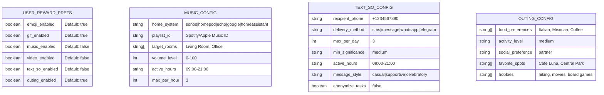

---

## Integration with Existing Flows

### Completion Flow Enhancement

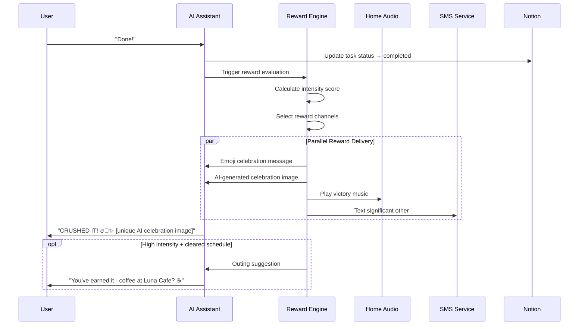

### State Diagram Update

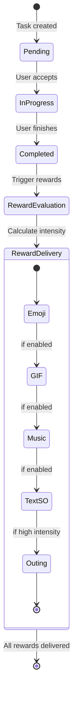

---

## API Endpoints

### Reward Configuration

| Endpoint | Method | Purpose |
|----------|--------|---------|
| `/api/rewards/config` | GET | Get current reward settings |
| `/api/rewards/config` | PUT | Update reward settings |
| `/api/rewards/music/test` | POST | Test music integration |
| `/api/rewards/sms/test` | POST | Test SMS delivery |
| `/api/rewards/history` | GET | Get recent reward history |

### Home Automation Integration

| Endpoint | Method | Purpose |
|----------|--------|---------|
| `/api/home/status` | GET | Check home system connectivity |
| `/api/home/rooms` | GET | List available rooms |
| `/api/home/play` | POST | Trigger music playback |
| `/api/home/stop` | POST | Stop current playback |

---

## Environment Variables

| Variable | Purpose | Example |
|----------|---------|---------|
| `OPENAI_API_KEY` | OpenAI API for image generation | `sk-proj-xxxxxxxx` |
| `TWILIO_ACCOUNT_SID` | Twilio authentication | `ACxxxxxxxx` |
| `TWILIO_AUTH_TOKEN` | Twilio authentication | `xxxxxxxx` |
| `TWILIO_PHONE_NUMBER` | Sender phone number | `+1234567890` |
| `SONOS_API_KEY` | Sonos integration | `xxxxxxxx` |
| `HOME_ASSISTANT_URL` | Home Assistant endpoint | `http://ha.local:8123` |
| `HOME_ASSISTANT_TOKEN` | Home Assistant auth | `xxxxxxxx` |
| `OPENWEATHER_API_KEY` | Weather for outings | `xxxxxxxx` |

---

## Implementation Phases

```mermaid
gantt
    title Reward System Implementation
    dateFormat  X
    axisFormat %s

    section Phase 1: Core
    Emoji celebrations           :done, p1a, 0, 1
    Basic completion messages    :done, p1b, 0, 1

    section Phase 2: AI Images
    Image generation script      :done, p2a, 1, 2
    Intensity-based themes       :done, p2b, 1, 2
    Streak visual enhancements   :done, p2c, 1, 2

    section Phase 3: Audio
    Home audio integration       :p3a, 2, 3
    Music preference config      :p3b, 3, 4

    section Phase 4: Social
    SMS notifications            :p4a, 4, 5
    Multi-platform messaging     :p4b, 5, 6

    section Phase 5: Novelty
    Seasonal theme injection     :p5a, 6, 7
    Milestone surprises          :p5b, 6, 7
    Preference learning          :p5c, 7, 8

    section Phase 6: Polish
    Personalized outings         :p6a, 8, 9
    A/B testing framework        :p6b, 9, 10
```

---

## Success Metrics

| Metric | Target | Measurement |
|--------|--------|-------------|
| Task completion rate | +20% | Compare before/after |
| Session duration | +15% | Average time in app |
| Return rate | +25% | Users returning within 24h |
| Streak length | +30% | Average consecutive completions |
| User satisfaction | 4.5/5 | Post-session survey |
| Reward engagement | 80%+ | Rewards not dismissed immediately |
