# Task Lifecycle

## Overview

A task in hide-my-list goes through several states from creation to completion. This document details each phase of that journey.

## Complete Task Lifecycle

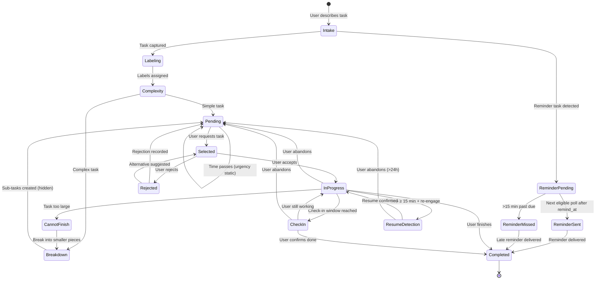

## Task States

| State | Description | Notion Status |
|-------|-------------|---------------|
| Intake | Task being captured, AI inferring labels (may ask up to 3 clarifying questions if too vague) | N/A (not yet saved) |
| Labeling | AI assigning work type, urgency, time estimate | N/A (not yet saved) |
| Complexity | AI evaluating if task needs breakdown | N/A (not yet saved) |
| Breakdown | AI creating sub-tasks (hidden from user) | N/A (parent) / `pending` (sub-tasks) |
| Pending | Task saved, waiting to be selected | `pending` |
| Selected | Task suggested to user, awaiting response | `pending` |
| In Progress | User actively working on task | `in_progress` |
| Check-In | System following up on task progress | `in_progress` |
| Rejected | User declined, giving feedback | `pending` |
| Resume Detection | User re-engages after ≥ 15 min gap | `in_progress` |
| Cannot Finish | User indicates task is too large | `in_progress` (triggers breakdown) |
| Reminder Pending | Reminder task waiting for scheduled time | `pending` (is_reminder=true, reminder_status=pending) |
| Reminder Sent | Reminder delivered to user on time | `completed` (reminder_status=sent) |
| Reminder Missed | Reminder >15 min late, delivered with apology | `completed` (reminder_status=missed) |
| Completed | Task finished | `completed` |

## Phase 1: Task Intake

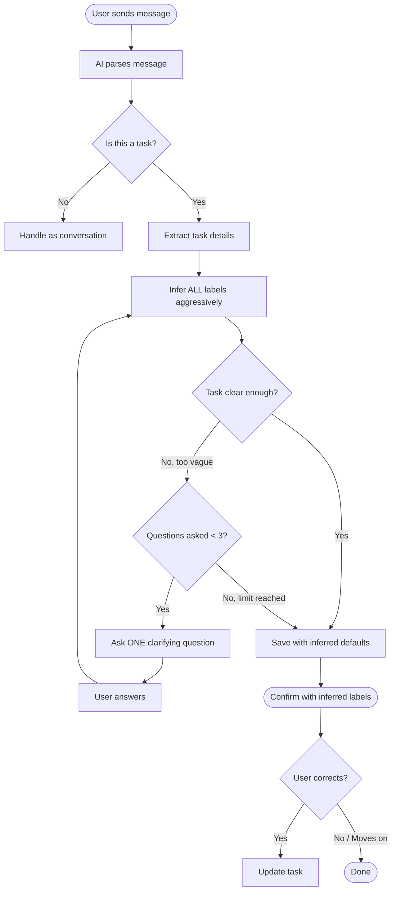

## Phase 2: Label Assignment

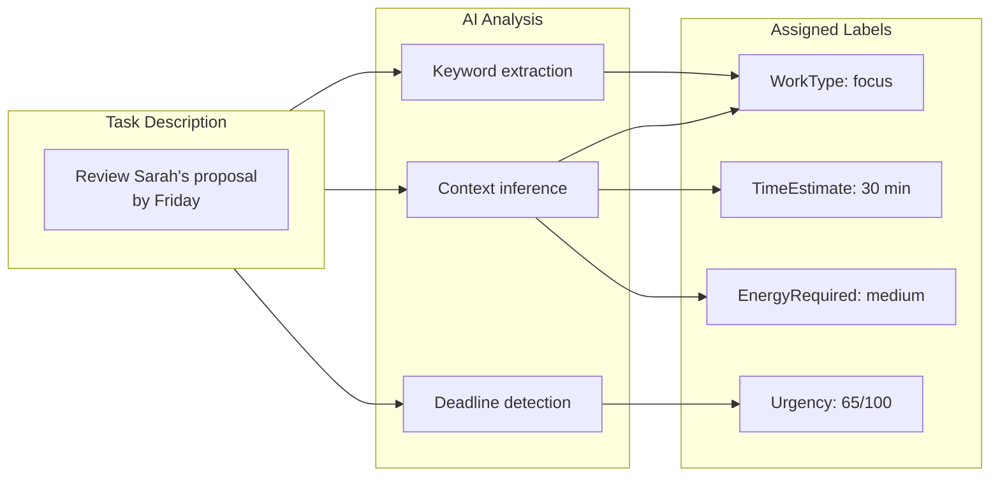

### Label Inference Rules

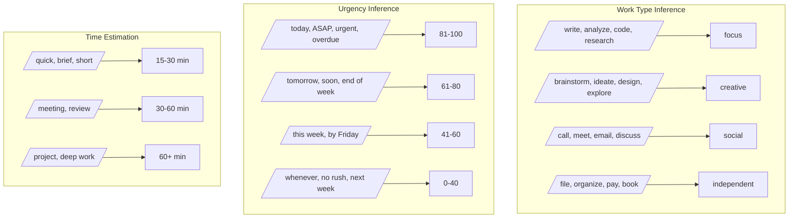

## Phase 2.5: Sub-task Generation (All Tasks)

After labeling, the AI **always** generates a series of actionable sub-tasks for every task. This is a core principle: **users interpret vague goals as infinite, and thus avoid them.** By providing clear, specific sub-tasks upfront, we give users a defined path forward.

**Key Principle:** Every task, no matter how simple it appears, gets explicit sub-tasks that define exactly what "done" looks like.

**Key Enhancement:** Sub-tasks are personalized based on user preferences to create an environment for success. The first 1-2 steps focus on preparation and comfort.

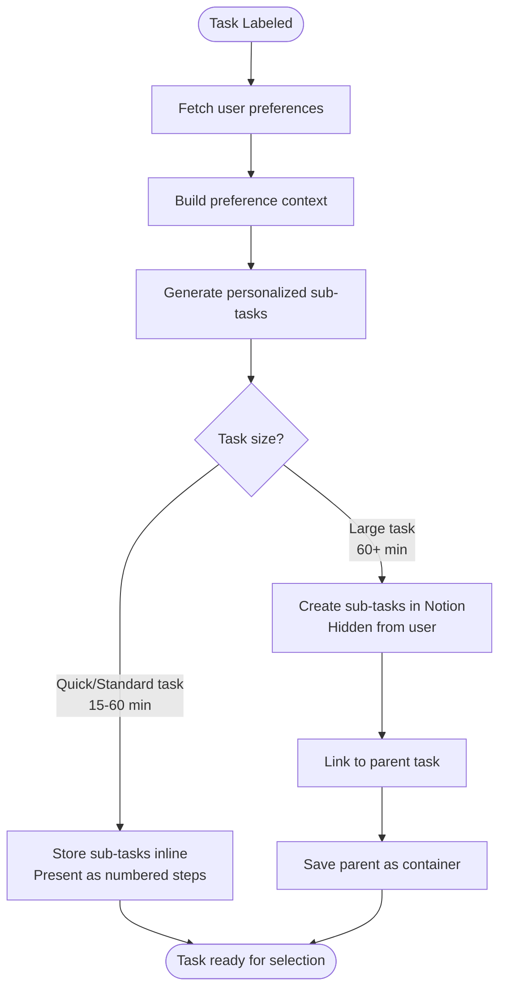

### Why All Tasks Get Sub-tasks

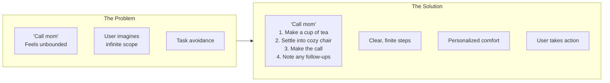

### Personalized Prep Steps

Before generating core task steps, the system fetches user preferences and injects them into the breakdown prompt. This enables personalized "environment for success" steps.

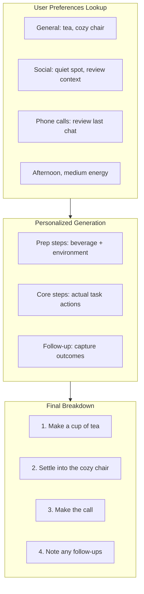

See [user-preferences.md](./user-preferences.md) for full preference system documentation.

### Sub-task Generation Rules

| Task Type | Sub-task Approach | Example (with preferences: tea, cozy chair) |
|-----------|-------------------|---------|
| Quick (15 min) | 2-3 inline steps | "Call mom" → 1. Make tea, 2. Settle into cozy chair, 3. Make call |
| Standard (30-60 min) | 3-5 inline steps | "Review proposal" → 1. Make coffee, 2. Find quiet spot, 3. Read intro, 4. Check numbers, 5. Note concerns |
| Large (60+ min) | Hidden sub-tasks | "Complete report" → 4+ separate tasks in Notion (each with prep steps) |

### Complexity Signals (For Hidden vs. Inline)

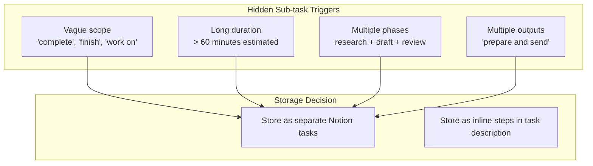

### Sub-task Structure

When a task is broken down, the system creates:
- **Parent task**: The original task description (status: `has_subtasks`)
- **Sub-tasks**: Actionable pieces (status: `pending`, linked to parent)

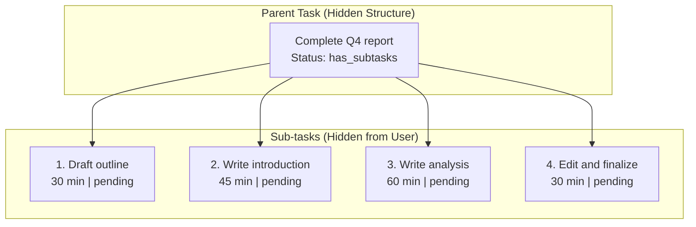

**User Experience:** When a task is suggested, the user sees the actionable first step along with a brief summary of what completing the full task involves:

- For inline steps: "How about calling mom? Here's the plan: 1) Find a quiet spot, 2) Make the call, 3) Note any follow-ups. Should take about 15 minutes."
- For hidden sub-tasks: "How about drafting the outline for the Q4 report? This is the first of 4 steps to complete the full report. Should take about 30 minutes."

### On-Demand Breakdown Assistance

The agent must always stand ready to help users further break down tasks. When a user starts a task or expresses hesitation, the agent proactively offers specific suggestions for how to approach the work.

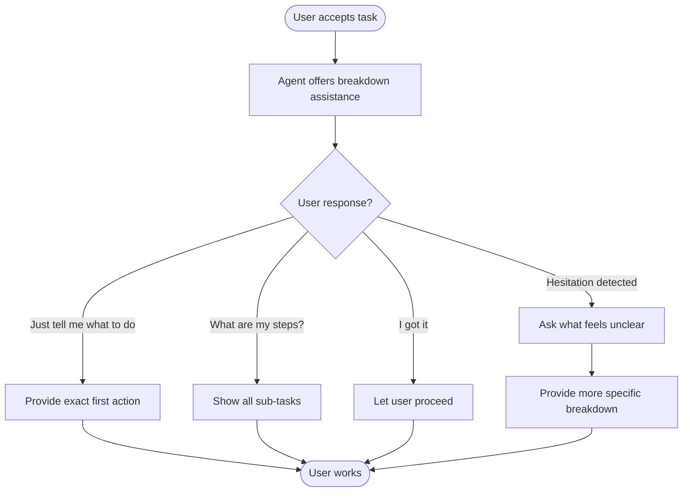

**Key Behaviors:**
- Agent never assumes user knows what to do next
- Agent always has specific, concrete next actions ready
- If user seems stuck, agent proactively offers smaller sub-tasks
- User should never have to figure out "how" on their own

### Task Reframing

| User Says | What User Sees (personalized) | Hidden Reality |
|-----------|-------------------------------|----------------|
| "Complete the project" | "Make coffee, then draft project outline - 35 min" | 4 sub-tasks created (each with personalized prep) |
| "Finish the report" | "Find your quiet spot, then write report introduction - 50 min" | 4 sub-tasks created |
| "Plan the event" | "Grab a tea and list event requirements - 25 min" | 5 sub-tasks created |
| "Call mom" | "Make tea, settle into cozy chair, make call - 15 min" | Inline steps with prep |

## Phase 3: Task Selection

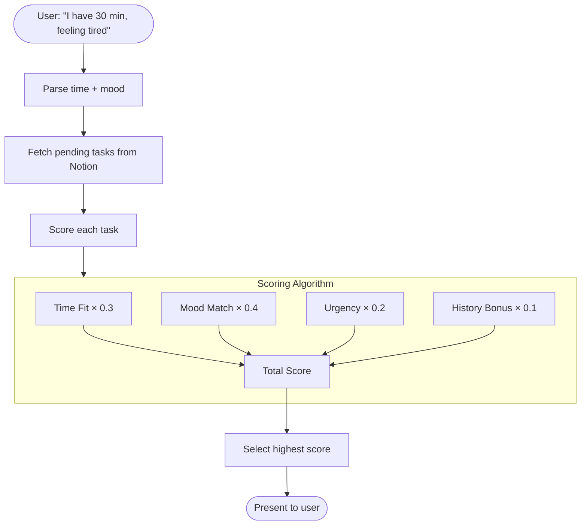

### Scoring Details

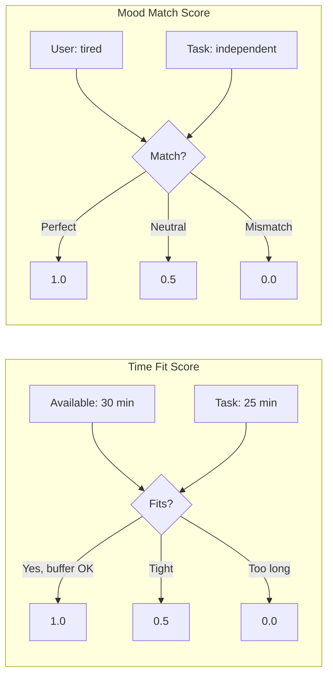

### Mood to Work Type Matching

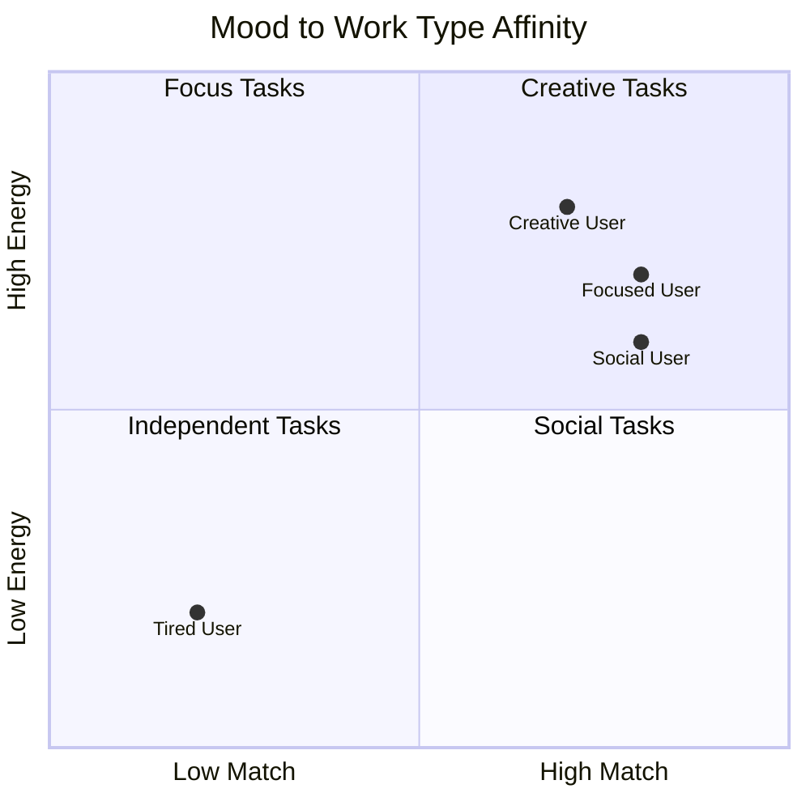

## Phase 4: Task Execution

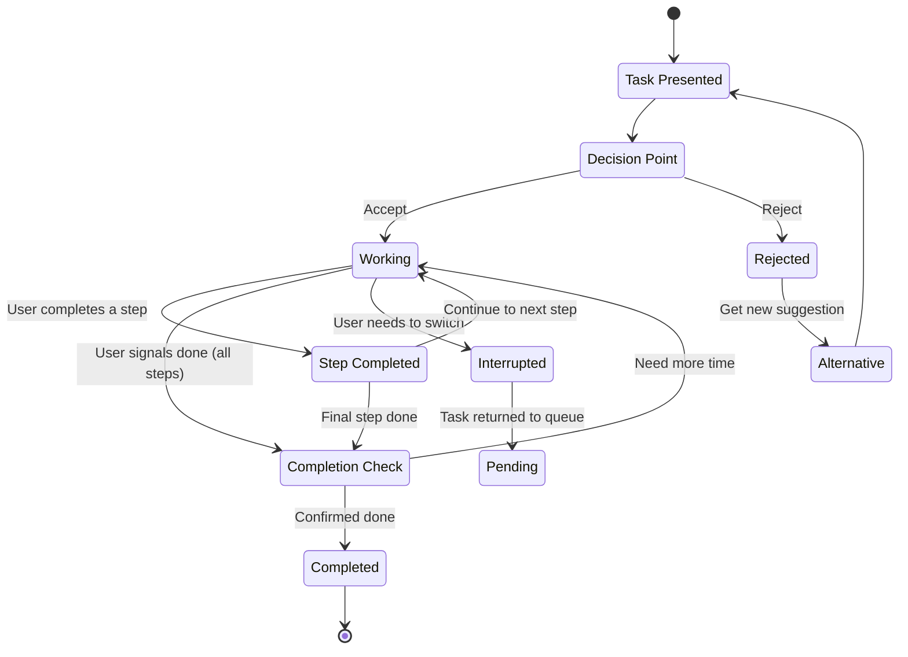

### Step Completion and `steps_completed` Tracking

When a user completes a sub-step (inline step or sub-task), the system increments `steps_completed` and checks whether to fire a first-step reward.

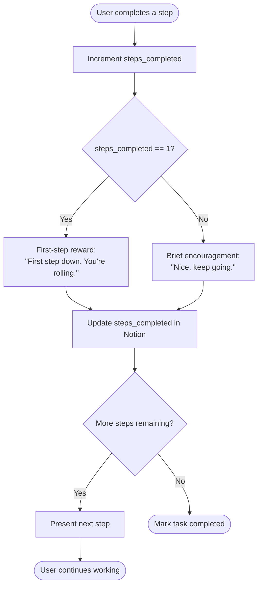

> **First-Step Rewards (Issue #7):** Completing the first step is a critical
> momentum point for ADHD brains. The reward is lighter than task completion
> but acknowledges progress: "First step down. You're rolling." This bridges
> the gap between the initiation reward (accepting) and completion celebration.

### Step Tracking Examples

| Scenario | `steps_completed` | Reward Triggered |
|----------|-------------------|------------------|
| User accepts task | 0 | Initiation reward |
| User finishes step 1 | 0 → 1 | **First-step reward** |
| User finishes step 2 | 1 → 2 | Brief encouragement |
| User finishes step 3 (last) | 2 → 3 | Completion reward |
| User hits CANNOT_FINISH after step 2 | 2 (preserved) | — (progress noted) |

### Task Initiation Rewards

When a user accepts a task, the system provides a brief **initiation reward** acknowledging that starting is the hardest part.

> **Task Initiation Rewards (Issue #7):** Starting is harder than finishing for
> ADHD brains. The moment of acceptance triggers a brief acknowledgment:
> "You're in. That's the hardest part." This is lighter than completion
> celebrations — encouragement, not a party.

## Phase 5: Check-In Follow-Up

After acceptance, the agent records timing metadata and (optionally) relies on an OpenClaw cron job to prompt follow-ups. No browser timer exists.

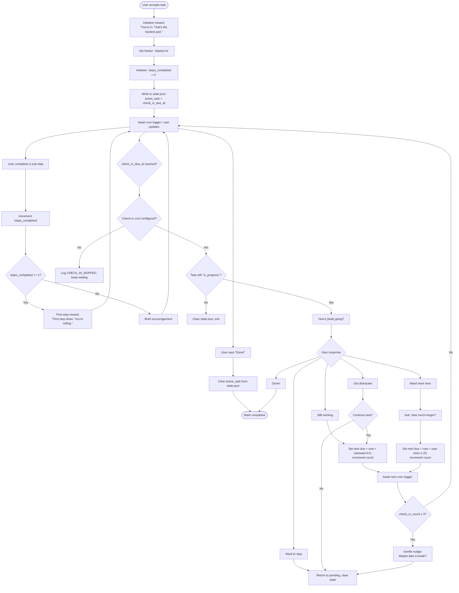

### Check-In Timing Examples

| Time Estimate | First Check-In (state.json) | Second Check-In | Third Check-In |
|---------------|-----------------------------|-----------------|----------------|
| 15 min | Started At + 18.75 min | +7.5 min | +3.75 min |
| 30 min | Started At + 37.5 min | +15 min | +7.5 min |
| 60 min | Started At + 75 min | +30 min | +15 min |
| 120 min | Started At + 150 min | +60 min | +30 min |

### Check-In Response Handling

| Response | Action | Timer |
|----------|--------|-------|
| "Done!" | Mark completed; clear state | N/A |
| "Still working" | Encourage; increment count | Set `check_in_due_at = now + estimate × 0.5` |
| "Got distracted" (continue) | Gentle nudge | Same as still working |
| "Got distracted" (stop) | Return to queue | Clear |
| "Need X more minutes" | Acknowledge | Set `check_in_due_at = now + X × 1.25` |
| "Want to stop" | Return to queue | Clear |

### Maximum Check-Ins

The system limits check-ins to 3 per task session to avoid nagging:

1. **1st check-in**: Friendly inquiry
2. **2nd check-in**: Brief follow-up
3. **3rd check-in**: Suggest taking a break, stop checking in

If the user returns later and re-accepts the same task, the check-in count resets when `state.json.active_task` is recreated.

## Phase 6: Rejection Handling

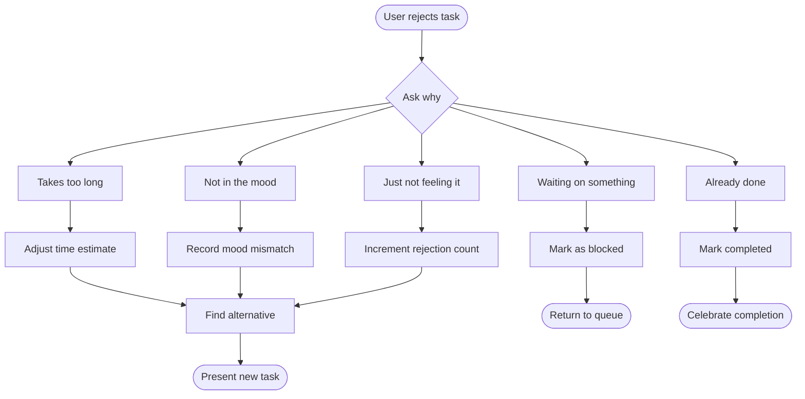

**Rejection Scoring Impact** (see [notion-schema.md](notion-schema.md#rejectioncount-number) for full details):
- 0 rejections: No penalty
- 1-2 rejections: -0.05 from score
- 3+ rejections: -0.10 from score

### Rejection Learning

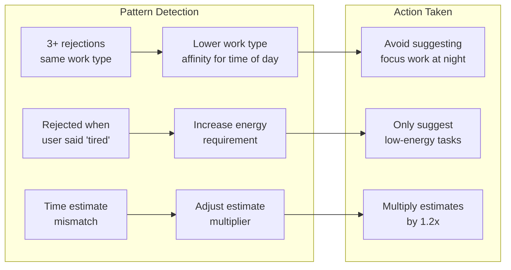

## Phase 5.1: Resume Detection

When a user returns to a conversation after stepping away while a task is `in_progress`, the system detects this as a **resume event** and provides encouragement. Re-engaging after a break is psychologically harder than starting fresh — the system explicitly acknowledges this.

### Single Trigger Model

Resume detection uses a **single gate** — all conditions must be met simultaneously. There are no alternate trigger paths or override mechanisms.

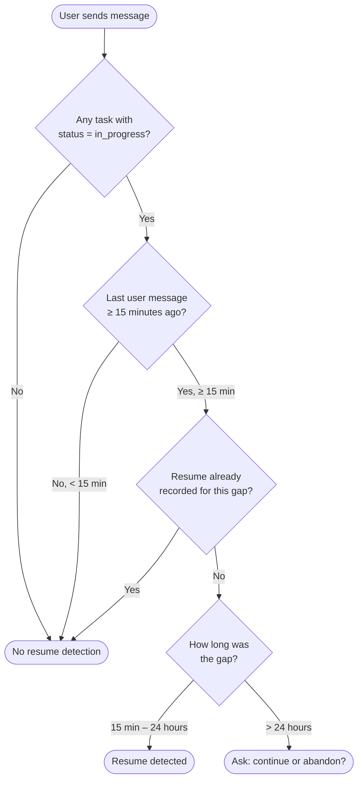

**Why a single gate:** PR #50 attempted a three-signal approach (session boundary, explicit phrase, inactivity gap) where some signals could bypass the time threshold. Three of four reviewers identified this as a contradiction that produces unreliable behavior. The single-gate model eliminates ambiguity: every resume event goes through the same conditions, every time.

### Trigger Conditions (ALL required)

| # | Condition | Source | Rationale |
|---|-----------|--------|-----------|
| 1 | At least one task has `status = in_progress` | Notion query | No resume without active work |
| 2 | Gap ≥ 15 minutes since last user message | Conversation platform timestamp | Filters out normal pauses (bathroom, snack, quick interruption) |
| 3 | No resume already recorded for this gap | `last_resumed_at` field | Prevents duplicate detection within same re-engagement |

**What about session boundaries and explicit phrases?**
- A new conversation session naturally involves a time gap — if it's ≥ 15 minutes, resume fires. If not, no resume is needed (the user barely left).
- Phrases like "I'm back" or "resuming" are treated as normal messages. If they arrive after a 15+ minute gap, resume fires. The system does not need to parse intent to detect a resume — the gap speaks for itself.

### Gap Duration Behavior

| Gap Duration | Behavior | Rationale |
|--------------|----------|-----------|
| < 15 minutes | No action | Normal pause — bathroom, snack, quick interruption |
| 15 min – 4 hours | Resume detected, brief encouragement | Standard break — user likely remembers context |
| 4 – 24 hours | Resume detected, state reminder | Extended break — remind user where they left off |
| > 24 hours | Confirmation prompt: "Still working on X, or should we put it back?" | Stale task — user may have moved on mentally |

### Resume Response Flow

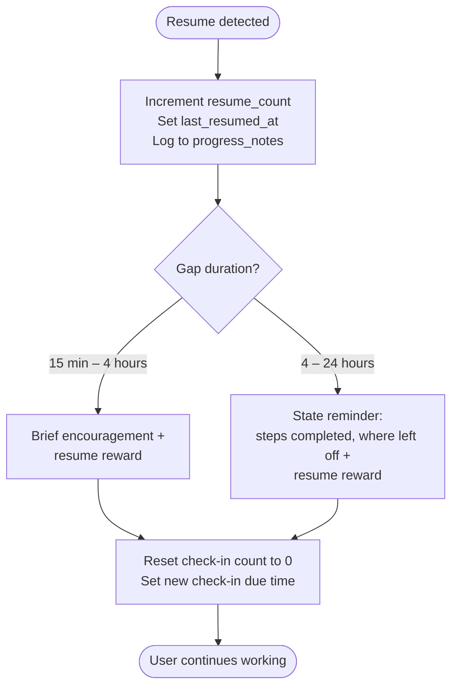

```mermaid
flowchart TD
    LongGap([Gap > 24 hours]) --> Ask["Still working on [task],<br/>or should we put it back?"]

    Ask --> UserChoice{User response}

    UserChoice -->|Continue| RecordResume[Record resume +<br/>state reminder +<br/>resume reward]
    UserChoice -->|Abandon| ReturnPending[Set status → pending<br/>Log gap in progress_notes]

    RecordResume --> ResetCheckins[Reset check-in count<br/>Set new check-in due time]
    ResetCheckins --> Continue([User continues])
    ReturnPending --> Done([Task returned to queue])
```

### Resume Rewards

Resume rewards are **light-medium intensity** — heavier than initiation rewards (because re-starting is harder than starting) but lighter than completion rewards.

| Resume # | Message Examples | Intensity |
|----------|------------------|-----------|
| 1st | "Welcome back! Picking up where you left off is a superpower." | Light-medium |
| 2nd | "Back again — that's persistence." | Light-medium |
| 3rd+ | "You keep coming back to this. That takes real grit." | Light-medium |

> **Shame-safe:** Resume messages always celebrate the return, never reference the absence.
> Never say "You were gone for X hours" or "It's been a while." The gap is logged
> internally for analytics but never surfaced to the user.

### State Restoration on Resume

When resume fires, the system restores task context:

| Action | Purpose |
|--------|---------|
| Increment `resume_count` | Track pattern for rewards and analytics |
| Set `last_resumed_at` to now | De-duplication guard for this gap |
| Append to `progress_notes`: `[timestamp] Resumed (gap: Xm)` | Internal audit trail |
| Reset check-in count to 0 | Fresh check-in cycle after break |
| Set new check-in due time (based on remaining estimate) | Proactive follow-up without carrying over stale timers |
| Remind user of `steps_completed` and last progress note | Help user regain context (4+ hour gaps only) |

### De-duplication Guards

**Problem:** Without guards, a resume could be detected multiple times for the same gap — e.g., if the user sends several messages in quick succession after returning.

**Solution:** The `last_resumed_at` timestamp acts as a de-duplication key.

```mermaid
flowchart TD
    GapDetected{Gap ≥ 15 min?} -->|Yes| CheckLastResume{last_resumed_at<br/>within this gap?}

    CheckLastResume -->|"last_resumed_at is before<br/>the gap started"| Fire[Resume fires ✓]
    CheckLastResume -->|"last_resumed_at is after<br/>the gap started"| Skip[Already recorded ✗]

    Fire --> UpdateField[Set last_resumed_at = now]
```

**Concrete example:**
1. User sends message at 10:00
2. User goes silent
3. User returns at 10:30 — gap is 30 min, `last_resumed_at` is null or before 10:00 → **resume fires**, sets `last_resumed_at = 10:30`
4. User sends another message at 10:31 — gap from 10:30 is 1 min → **no resume** (gap < 15 min from most recent message)
5. User goes silent again
6. User returns at 11:15 — gap is 44 min from 10:31, `last_resumed_at` is 10:30 (before 10:31) → **resume fires again**

### Multiple In-Progress Tasks

If more than one task has `status = in_progress` when resume fires:

```mermaid
flowchart TD
    ResumeDetected([Resume detected]) --> CountTasks{How many<br/>in_progress tasks?}

    CountTasks -->|1 task| SingleResume[Resume that task directly]
    CountTasks -->|2+ tasks| AskUser["Which one are you<br/>picking back up?<br/>• Task A<br/>• Task B<br/>• Neither — suggest something new"]

    AskUser --> UserPicks{User choice}
    UserPicks -->|Task A or B| ResumeChosen[Resume chosen task]
    UserPicks -->|Neither| ReturnAll[Return all to pending<br/>Enter task selection]

    SingleResume --> ResumeFlow([Normal resume flow])
    ResumeChosen --> ResumeFlow
```

**Rules for multiple in-progress tasks:**
- Resume reward fires **once** (for the session), not once per task
- The user chooses which task to resume — the system does not auto-select
- Tasks the user doesn't choose remain `in_progress` (they may resume those later)
- If user says "neither," all in-progress tasks return to `pending`

### False-Positive Mitigation

| Risk | Mitigation | Why It Works |
|------|------------|--------------|
| Micro-breaks (< 15 min) trigger resume | 15-minute floor | Filters bathroom breaks, snack runs, quick interruptions |
| Stale tasks auto-resume after days | >24h confirmation prompt | User explicitly confirms intent to continue |
| Duplicate resume for same gap | `last_resumed_at` de-dup guard | Only one resume per inactivity gap |
| Multiple tasks get separate resume rewards | Single reward per session return | One acknowledgment regardless of task count |
| Unearned reward from false detection | Light-medium intensity only | Resume rewards are encouragement, not celebration — low blast radius if wrong |

### Notion Field Requirements

Resume detection requires these fields on each task:

| Field | Type | Purpose |
|-------|------|---------|
| `resume_count` | number | Running total of resume events (existing) |
| `last_resumed_at` | date | Timestamp of most recent resume detection (new) |
| `progress_notes` | rich_text | Append-only log including resume entries (existing) |
| `started_at` | date | When task was accepted (existing) |
| `steps_completed` | number | For context restoration on resume (existing) |

## Phase 5.5: Cannot Finish (Re-breakdown)

When a user indicates they cannot finish a task, the system gathers progress information and creates new sub-tasks for the remaining work.

```mermaid
flowchart TD
    Working([User working on task]) --> CannotFinish["User: 'This is too big'"]
    CannotFinish --> AskProgress[AI asks what was accomplished]
    AskProgress --> UserResponds[User describes progress]
    UserResponds --> Analyze[Analyze remaining work]
    Analyze --> CreateNew[Create sub-tasks for remainder]
    CreateNew --> UpdateParent[Update parent task progress]
    UpdateParent --> OfferNext[Offer next manageable piece]
    OfferNext --> Continue([Continue with smaller task])
```

### Progress Gathering

The AI must always ask what the user accomplished before breaking down remaining work:

```mermaid
sequenceDiagram
    participant U as User
    participant AI as AI Assistant
    participant N as Notion

    U->>AI: "I can't finish this"
    AI->>U: "No worries - what did you get done?"
    U->>AI: "I outlined it and wrote the intro"

    Note over AI: Progress: outline + intro done<br/>Remaining: body + conclusion + edit

    AI->>N: Update task with progress notes
    AI->>N: Create sub-tasks for remainder (hidden)

    AI->>U: "Nice progress! Ready to tackle the body section? About 45 min."
```

### Re-breakdown Rules

| Scenario | Action |
|----------|--------|
| First CANNOT_FINISH | Ask progress → Break into 3-5 sub-tasks |
| Second CANNOT_FINISH | Break current sub-task into 2-3 smaller pieces |
| Third+ CANNOT_FINISH | Ask what specific part is blocking → Create atomic tasks |

### Learning from Cannot Finish

Each CANNOT_FINISH signal teaches the system:
- Original time estimates may be too aggressive
- Task scope was underestimated
- Future similar tasks should be pre-broken

```mermaid
flowchart LR
    subgraph Signal["CANNOT_FINISH Signal"]
        CF[Task too large]
    end

    subgraph Learning["System Learning"]
        L1[Increase time estimates<br/>for similar tasks]
        L2[Lower complexity threshold<br/>for auto-breakdown]
        L3[Remember task patterns<br/>that need breakdown]
    end

    CF --> L1
    CF --> L2
    CF --> L3
```

## Phase 6: Task Completion

```mermaid
flowchart TD
    Done(["User: #quot;Done!#quot;"]) --> Update[Update Notion status]
    Update --> Reward[Trigger Reward Engine]

    Reward --> Calculate[Calculate intensity score]
    Calculate --> Deliver[Deliver rewards in parallel]

    subgraph RewardDelivery["Reward Delivery"]
        Emoji[Emoji celebration]
        AIImage[AI-Generated Image]
        Music[Play music via home audio]
        TextSO[Text significant other]
    end

    Deliver --> Emoji
    Deliver --> AIImage
    Deliver --> Music
    Deliver --> TextSO

    Deliver --> Feedback{Ask for feedback?}

    Feedback -->|Optional| HowFelt["How did that feel?"]
    Feedback -->|Skip| Summary

    HowFelt --> Easier["Easier than expected"]
    HowFelt --> Right["About right"]
    HowFelt --> Harder["Harder than expected"]

    Easier --> AdjustDown[Lower time estimate]
    Right --> NoChange[Keep estimate]
    Harder --> AdjustUp[Increase time estimate]

    AdjustDown --> Summary[Session Summary]
    NoChange --> Summary
    AdjustUp --> Summary

    Summary --> Prompt{Continue?}
    Prompt -->|Yes| NextTask([Get another task])
    Prompt -->|No| Outing{High intensity?}
    Outing -->|Yes| SuggestOuting[Suggest fun outing]
    Outing -->|No| End([End session])
    SuggestOuting --> End
```

### Reward Intensity Scaling

The reward system scales celebrations based on achievement significance:

| Trigger | Intensity | Rewards Activated |
|---------|-----------|-------------------|
| Initiation only | Lightest | Brief encouragement, no image |
| Quick task (< 15 min) | Low | 1-2 emoji + gentle AI image |
| Standard task | Medium | 2-4 emoji + enthusiastic AI image |
| Focus/difficult task | High | 4-6 emoji + majestic AI image + Music + Text SO |
| Parent task complete | Epic | 6+ emoji + cosmic AI image + Music + Text SO + Outing |
| All tasks cleared | Epic | Maximum celebration |

## Phase 7: Scheduled Reminder Delivery

Reminder tasks follow a separate lifecycle from normal tasks. They are not surfaced through task selection — instead, a procedural `reminder-check` cron job writes the handoff file and a separate `reminder-delivery` cron job delivers the reminder proactively at the specified time.

```mermaid
flowchart TD
    Intake([User: Remind me at 6pm PT to email Melanie]) --> Detect[AI detects reminder intent]
    Detect --> Parse[Parse time + timezone]
    Parse --> Save[Save to Notion with is_reminder=true]

    Save --> Wait[Task waits in Notion]
    Wait --> Cron[reminder-check cron runs every 15 min]
    Cron --> Due{remind_at <= now?}
    Due -->|No| Wait
    Due -->|Yes| Signal[check-reminders.sh writes .reminder-signal]
    Signal --> Deliver[reminder-delivery cron runs 2 min later]
    Deliver --> Surface{main session has attached surface?}
    Surface -->|No| Retry[Reply NO_REPLY and keep .reminder-signal]
    Retry --> Wait
    Surface -->|Yes| Late{>15 min past due?}

    Late -->|No| Send[Deliver reminder]
    Late -->|Yes| SendMissed[Deliver with apology]

    Send --> Complete[Mark completed + reminder_status=sent]
    SendMissed --> Complete2[Mark completed + reminder_status=missed]

    Complete --> Done([Done])
    Complete2 --> Done
```

### Reminder vs. Normal Task

| Property | Normal Task | Reminder Task |
|----------|-------------|---------------|
| Selection | User requests → AI suggests | `reminder-check` writes `.reminder-signal`, then `reminder-delivery` surfaces it on `main` at `remind_at` |
| Lifecycle | Pending → In Progress → Completed | Pending → Sent/Missed → Completed |
| Check-ins | Timer-based follow-ups | None (single delivery) |
| Rejection | User can reject suggestion | N/A (delivered once) |

Reminder delivery stays on the existing `main` session surface. `reminder-check` always stays silent; `reminder-delivery` replies `NO_REPLY` when no `.reminder-signal` exists, or when the `main` session has no attached surface and the reminder must remain pending for a later retry.

### Timezone Handling

The AI converts user-specified times to full ISO 8601 timestamps at intake:
- User's default timezone: US Central (America/Chicago, UTC-6/UTC-5)
- "6pm PT" → `2025-01-04T18:00:00-08:00`
- "3pm" (no TZ) → `2025-01-04T15:00:00-06:00` (default Central)
- "tomorrow 9am ET" → `2025-01-05T09:00:00-05:00`

## Complete Task Journey Example

```mermaid
journey
    title Task: "Review Sarah's proposal"
    section Intake
      User describes task: 5: User
      AI infers labels from context: 4: AI
      AI confirms with inferred labels: 4: AI
    section Waiting
      Task sits in Notion: 3: System
      2 days pass: 2: System
    section Selection
      User has 30 minutes: 5: User
      AI suggests this task: 4: AI
      User accepts: 5: User
    section Execution
      User reviews proposal: 4: User
      User marks done: 5: User
    section Celebration
      Emoji explosion displayed: 5: AI
      AI-generated celebration image: 5: AI
      Victory song plays on speakers: 5: System
      Partner receives celebration text: 5: System
      AI suggests coffee at favorite cafe: 4: AI
```
