# User Interactions

## Overview

All interactions in hide-my-list happen through natural language conversation. The AI determines user intent from their message and responds appropriately. This document details all conversation flows and user journeys.

## Intent Detection

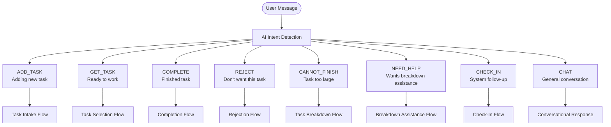
```mermaid
flowchart TD
    Message([User Message]) --> Detect[AI Intent Detection]

    Detect --> AddTask["ADD_TASK<br/>Adding new task"]
    Detect --> GetTask["GET_TASK<br/>Ready to work"]
    Detect --> Complete["COMPLETE<br/>Finished task"]
    Detect --> Reject["REJECT<br/>Don't want this task"]
    Detect --> CannotFinish["CANNOT_FINISH<br/>Task too large"]
    Detect --> NeedHelp["NEED_HELP<br/>Wants breakdown assistance"]
    Detect --> CheckIn["CHECK_IN<br/>System follow-up"]
    Detect --> Chat["CHAT<br/>General conversation"]

    AddTask --> IntakeFlow[Task Intake Flow]
    GetTask --> SelectionFlow[Task Selection Flow]
    Complete --> CompletionFlow[Completion Flow]
    Reject --> RejectionFlow[Rejection Flow]
    CannotFinish --> BreakdownFlow[Task Breakdown Flow]
    NeedHelp --> AssistFlow[Breakdown Assistance Flow]
    CheckIn --> CheckInFlow[Check-In Flow]
    Chat --> ChatResponse[Conversational Response]
```

### Intent Signal Examples

| Intent | Example Messages |
|--------|------------------|
| ADD_TASK | "I need to...", "Add...", "Remind me to...", "New task:", "Ping me at 6pm to..." |
| GET_TASK | "I have X minutes", "What should I do?", "I'm ready to work" |
| COMPLETE | "Done", "Finished", "Completed", "I did it" |
| REJECT | "Not that one", "Something else", "I don't want to" |
| CANNOT_FINISH | "This is too big", "I can't finish this", "Too much for one sitting" |
| NEED_HELP | "How do I start?", "What should I do first?", "I'm stuck", "Break this down" |
| CHECK_IN | System-initiated (runtime follow-up, not user message) |
| CHAT | "Hello", "How does this work?", "What's in my list?" |

## Flow 1: Task Intake

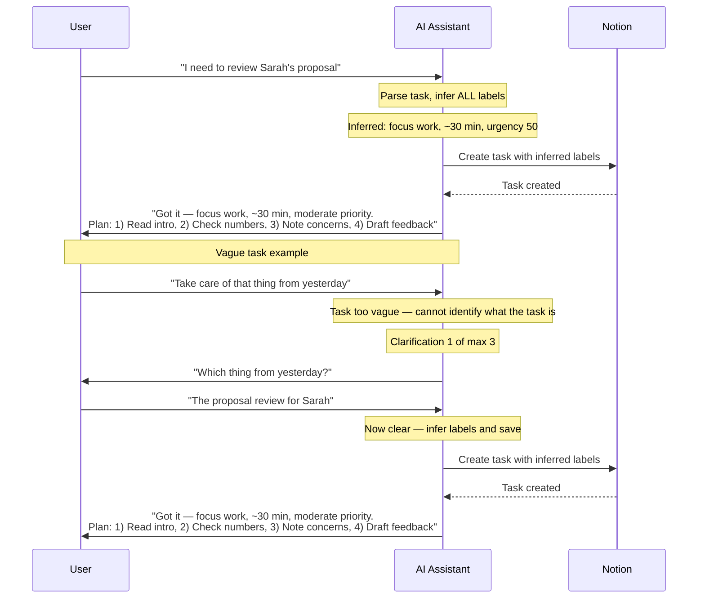
```mermaid
sequenceDiagram
    participant U as User
    participant AI as AI Assistant
    participant N as Notion

    U->>AI: "I need to review Sarah's proposal"

    Note over AI: Parse task, infer ALL labels
    Note over AI: Inferred: focus work, ~30 min, urgency 50

    AI->>N: Create task with inferred labels
    N-->>AI: Task created
    AI->>U: "Got it — focus work, ~30 min, moderate priority.<br/>Plan: 1) Read intro, 2) Check numbers, 3) Note concerns, 4) Draft feedback"

    Note over U,AI: Vague task example

    U->>AI: "Take care of that thing from yesterday"

    Note over AI: Task too vague — cannot identify what the task is
    Note over AI: Clarification 1 of max 3

    AI->>U: "Which thing from yesterday?"
    U->>AI: "The proposal review for Sarah"

    Note over AI: Now clear — infer labels and save

    AI->>N: Create task with inferred labels
    N-->>AI: Task created
    AI->>U: "Got it — focus work, ~30 min, moderate priority.<br/>Plan: 1) Read intro, 2) Check numbers, 3) Note concerns, 4) Draft feedback"
```

> **Decision Fatigue Prevention:** The system strongly prefers inference over
> questions. All labels (urgency, time, work type) are always inferred from
> context and keywords — never asked about. When the task itself is too vague to
> identify (e.g., "do the thing"), the system may ask up to 3 simple clarifying
> questions, one at a time. The user can also correct after the fact ("actually
> that's urgent") but is never forced to decide on labels.
> See [Issue #11](https://github.com/NickBorgersProbably/hide-my-list/issues/11).

### Intake Flow (Inference-First, Questions as Last Resort)

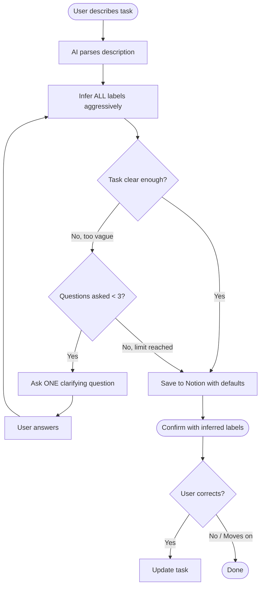
```mermaid
flowchart TD
    Start([User describes task]) --> Parse[AI parses description]
    Parse --> Infer[Infer ALL labels aggressively]
    Infer --> Clear{Task clear enough?}
    Clear -->|Yes| Save[Save to Notion with defaults]
    Clear -->|No, too vague| AskCount{Questions asked < 3?}
    AskCount -->|Yes| Ask[Ask ONE clarifying question]
    AskCount -->|No, limit reached| Save
    Ask --> UserAnswer[User answers]
    UserAnswer --> Infer
    Save --> Confirm([Confirm with inferred labels])
    Confirm --> Correction{User corrects?}
    Correction -->|Yes| Update[Update task]
    Correction -->|No / Moves on| Done([Done])
```

### All Tasks Are Quick Capture

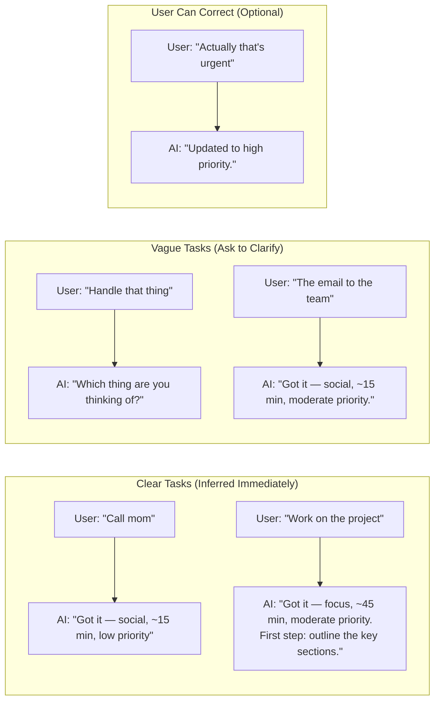
```mermaid
flowchart LR
    subgraph Always["Clear Tasks (Inferred Immediately)"]
        Q1["User: #quot;Call mom#quot;"] --> Q2["AI: #quot;Got it — social, ~15 min, low priority#quot;"]
        Q3["User: #quot;Work on the project#quot;"] --> Q4["AI: #quot;Got it — focus, ~45 min, moderate priority.<br/>First step: outline the key sections.#quot;"]
    end

    subgraph Clarify["Vague Tasks (Ask to Clarify)"]
        V1["User: #quot;Handle that thing#quot;"] --> V2["AI: #quot;Which thing are you thinking of?#quot;"]
        V3["User: #quot;The email to the team#quot;"] --> V4["AI: #quot;Got it — social, ~15 min, moderate priority.#quot;"]
    end

    subgraph Correction["User Can Correct (Optional)"]
        C1["User: #quot;Actually that's urgent#quot;"] --> C2["AI: #quot;Updated to high priority.#quot;"]
    end
```

## Flow 2: Task Selection

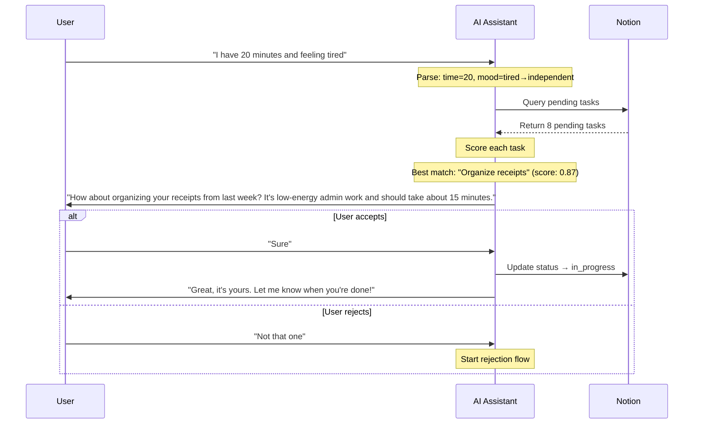
```mermaid
sequenceDiagram
    participant U as User
    participant AI as AI Assistant
    participant N as Notion

    U->>AI: "I have 20 minutes and feeling tired"

    Note over AI: Parse: time=20, mood=tired→independent

    AI->>N: Query pending tasks
    N-->>AI: Return 8 pending tasks

    Note over AI: Score each task
    Note over AI: Best match: "Organize receipts" (score: 0.87)

    AI->>U: "How about organizing your receipts from last week? It's low-energy admin work and should take about 15 minutes."

    alt User accepts
        U->>AI: "Sure"
        AI->>N: Update status → in_progress
        AI->>U: "Great, it's yours. Let me know when you're done!"
    else User rejects
        U->>AI: "Not that one"
        Note over AI: Start rejection flow
    end
```

### Selection Decision Tree

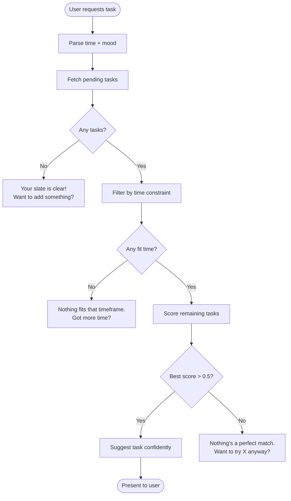
```mermaid
flowchart TD
    Request([User requests task]) --> ParseContext[Parse time + mood]
    ParseContext --> FetchTasks[Fetch pending tasks]
    FetchTasks --> HasTasks{Any tasks?}

    HasTasks -->|No| NoTasks["Your slate is clear!<br/>Want to add something?"]
    HasTasks -->|Yes| FilterTime[Filter by time constraint]

    FilterTime --> HasMatches{Any fit time?}
    HasMatches -->|No| NoFit["Nothing fits that timeframe.<br/>Got more time?"]
    HasMatches -->|Yes| ScoreTasks[Score remaining tasks]

    ScoreTasks --> BestScore{Best score > 0.5?}
    BestScore -->|Yes| Suggest[Suggest task confidently]
    BestScore -->|No| Unsure["Nothing's a perfect match.<br/>Want to try X anyway?"]

    Suggest --> Present([Present to user])
```

### Mood Interpretation

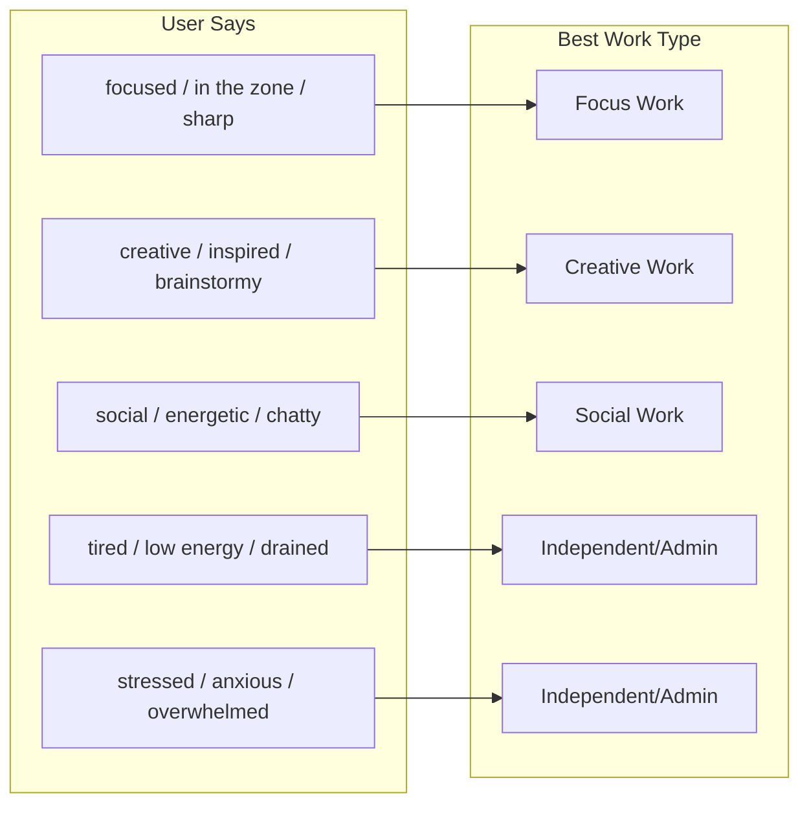
```mermaid
flowchart LR
    subgraph Input["User Says"]
        I1["focused / in the zone / sharp"]
        I2["creative / inspired / brainstormy"]
        I3["social / energetic / chatty"]
        I4["tired / low energy / drained"]
        I5["stressed / anxious / overwhelmed"]
    end

    subgraph Output["Best Work Type"]
        O1[Focus Work]
        O2[Creative Work]
        O3[Social Work]
        O4[Independent/Admin]
        O5[Independent/Admin]
    end

    I1 --> O1
    I2 --> O2
    I3 --> O3
    I4 --> O4
    I5 --> O5
```

## Flow 3: Task Completion

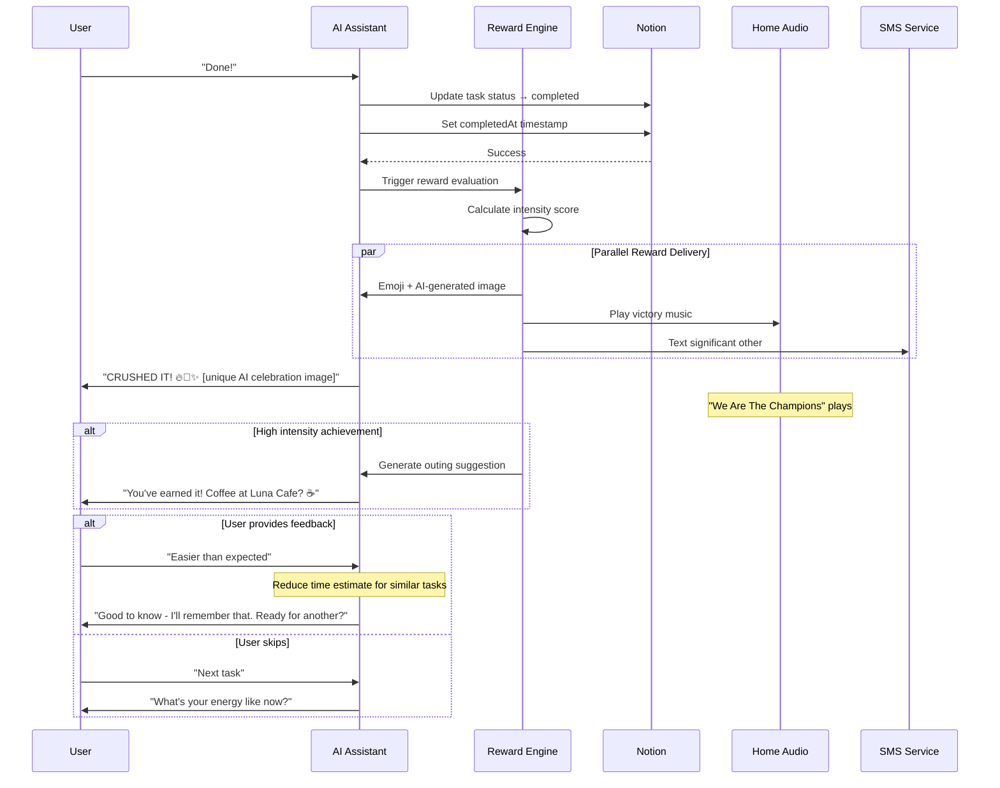
```mermaid
sequenceDiagram
    participant U as User
    participant AI as AI Assistant
    participant R as Reward Engine
    participant N as Notion
    participant HA as Home Audio
    participant SMS as SMS Service

    U->>AI: "Done!"

    AI->>N: Update task status → completed
    AI->>N: Set completedAt timestamp
    N-->>AI: Success

    AI->>R: Trigger reward evaluation
    R->>R: Calculate intensity score

    par Parallel Reward Delivery
        R->>AI: Emoji + AI-generated image
        R->>HA: Play victory music
        R->>SMS: Text significant other
    end

    AI->>U: "CRUSHED IT! 🔥💪✨ [unique AI celebration image]"

    Note over HA: "We Are The Champions" plays

    alt High intensity achievement
        R->>AI: Generate outing suggestion
        AI->>U: "You've earned it! Coffee at Luna Cafe? ☕"
    end

    alt User provides feedback
        U->>AI: "Easier than expected"
        Note over AI: Reduce time estimate for similar tasks
        AI->>U: "Good to know - I'll remember that. Ready for another?"
    else User skips
        U->>AI: "Next task"
        AI->>U: "What's your energy like now?"
    end
```

### Reward Delivery System

The completion flow triggers a multi-channel reward system designed to maximize dopamine delivery:

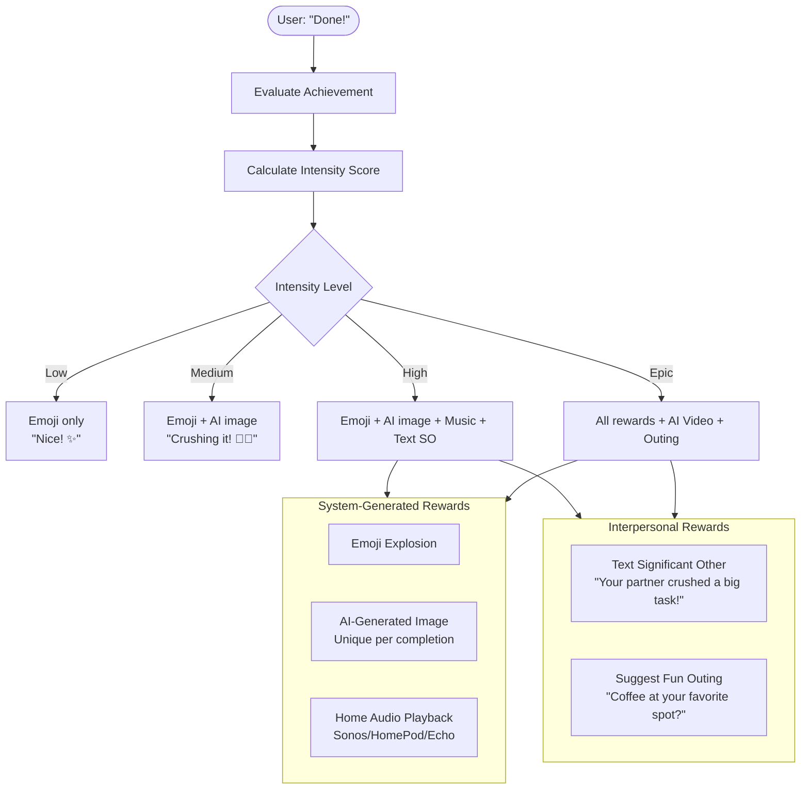
```mermaid
flowchart TD
    Done(["User: #quot;Done!#quot;"]) --> Evaluate[Evaluate Achievement]

    Evaluate --> Score[Calculate Intensity Score]
    Score --> Level{Intensity Level}

    Level -->|Low| LowReward["Emoji only<br/>#quot;Nice! ✨#quot;"]
    Level -->|Medium| MedReward["Emoji + AI image<br/>#quot;Crushing it! 🎉💪#quot;"]
    Level -->|High| HighReward[Emoji + AI image + Music + Text SO]
    Level -->|Epic| EpicReward[All rewards + AI Video + Outing]

    subgraph SystemRewards["System-Generated Rewards"]
        Emoji[Emoji Explosion]
        AIImage[AI-Generated Image<br/>Unique per completion]
        
        Music[Home Audio Playback<br/>Sonos/HomePod/Echo]
    end

    subgraph InterpersonalRewards["Interpersonal Rewards"]
        TextSO["Text Significant Other<br/>#quot;Your partner crushed a big task!#quot;"]
        Outing["Suggest Fun Outing<br/>#quot;Coffee at your favorite spot?#quot;"]
    end

    HighReward --> SystemRewards
    HighReward --> InterpersonalRewards
    EpicReward --> SystemRewards
    EpicReward --> InterpersonalRewards
```

### Intensity Scoring

| Factor | Weight | Examples |
|--------|--------|----------|
| Task difficulty | 30% | Time estimate, energy required |
| Current streak | 25% | 3+ tasks = bonus |
| Task type | 20% | Parent complete = major bonus |
| Time of day | 15% | End of day = bonus |
| Recent history | 10% | Diminishing returns if many recent rewards |

### Completion Feedback Loop

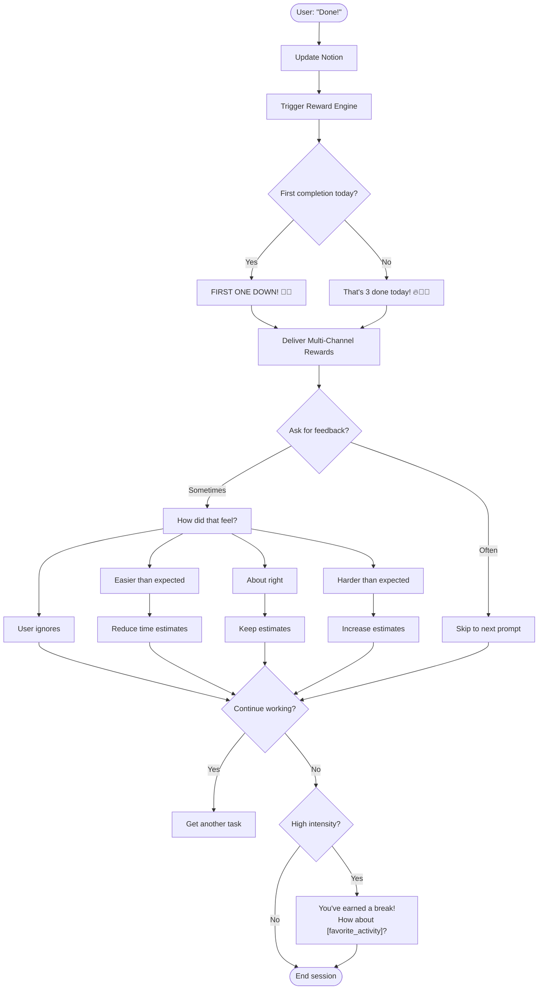
```mermaid
flowchart TD
    Done(["User: #quot;Done!#quot;"]) --> Update[Update Notion]
    Update --> Reward[Trigger Reward Engine]

    Reward --> SessionCheck{First completion today?}

    SessionCheck -->|Yes| Celebrate["FIRST ONE DOWN! 🎯✨"]
    SessionCheck -->|No| Streak["That's 3 done today! 🔥💪🎉"]

    Celebrate --> DeliverRewards
    Streak --> DeliverRewards

    DeliverRewards[Deliver Multi-Channel Rewards] --> Feedback

    Feedback{Ask for feedback?}
    Feedback -->|Sometimes| Ask["How did that feel?"]
    Feedback -->|Often| Skip[Skip to next prompt]

    Ask --> Easier[Easier than expected]
    Ask --> Right[About right]
    Ask --> Harder[Harder than expected]
    Ask --> NoAnswer[User ignores]

    Easier --> LearnEasy[Reduce time estimates]
    Right --> NoChange[Keep estimates]
    Harder --> LearnHard[Increase estimates]
    NoAnswer --> Continue

    LearnEasy --> Continue
    NoChange --> Continue
    LearnHard --> Continue

    Skip --> Continue{Continue working?}
    Continue -->|Yes| NextTask[Get another task]
    Continue -->|No| OutingCheck{High intensity?}
    OutingCheck -->|Yes| SuggestOuting["You've earned a break!<br/>How about [favorite_activity]?"]
    OutingCheck -->|No| End([End session])
    SuggestOuting --> End
```

## Flow 4: Task Rejection

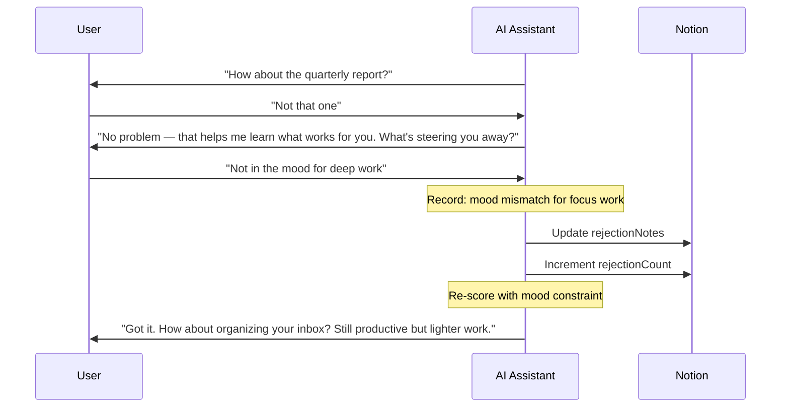
```mermaid
sequenceDiagram
    participant U as User
    participant AI as AI Assistant
    participant N as Notion

    AI->>U: "How about the quarterly report?"
    U->>AI: "Not that one"

    AI->>U: "No problem — that helps me learn what works for you. What's steering you away?"
    U->>AI: "Not in the mood for deep work"

    Note over AI: Record: mood mismatch for focus work

    AI->>N: Update rejectionNotes
    AI->>N: Increment rejectionCount

    Note over AI: Re-score with mood constraint

    AI->>U: "Got it. How about organizing your inbox? Still productive but lighter work."
```

### Rejection Reason Categories

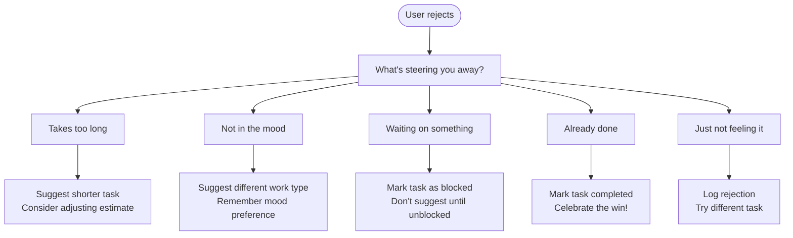
```mermaid
flowchart TD
    Reject([User rejects]) --> Why["What's steering you away?"]

    Why --> TooLong["Takes too long"]
    Why --> WrongMood["Not in the mood"]
    Why --> Blocked["Waiting on something"]
    Why --> AlreadyDone["Already done"]
    Why --> NotFeeling["Just not feeling it"]

    TooLong --> ActionTime[Suggest shorter task<br/>Consider adjusting estimate]
    WrongMood --> ActionMood[Suggest different work type<br/>Remember mood preference]
    Blocked --> ActionBlock[Mark task as blocked<br/>Don't suggest until unblocked]
    AlreadyDone --> ActionDone[Mark task completed<br/>Celebrate the win!]
    NotFeeling --> ActionGeneral[Log rejection<br/>Try different task]
```

### Rejection Escalation (Shame-Safe)

> **Shame Prevention:** Multiple rejections are the highest-risk moment for
> rejection-triggered shame. Each escalation step must explicitly normalize the
> experience. Never frame rejection accumulation as a problem.

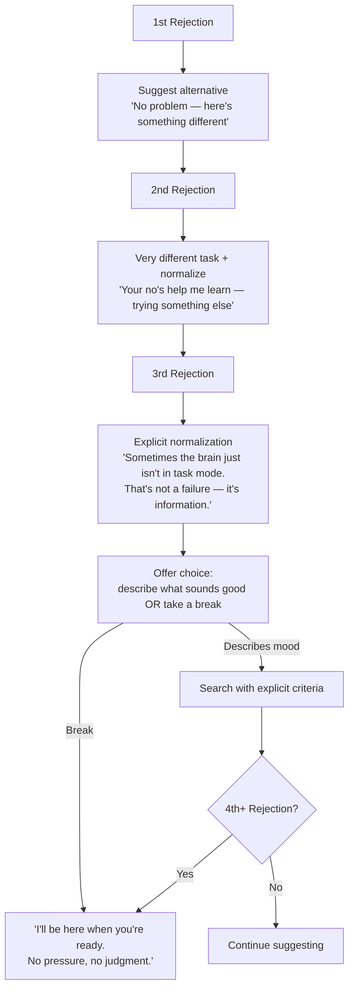
```mermaid
flowchart TD
    R1[1st Rejection] --> Suggest1["Suggest alternative<br/>'No problem — here's something different'"]
    Suggest1 --> R2[2nd Rejection]
    R2 --> Suggest2["Very different task + normalize<br/>'Your no's help me learn — trying something else'"]
    Suggest2 --> R3[3rd Rejection]
    R3 --> Normalize["Explicit normalization<br/>'Sometimes the brain just isn't in task mode.<br/>That's not a failure — it's information.'"]
    Normalize --> Offer["Offer choice:<br/>describe what sounds good OR take a break"]
    Offer -->|Describes mood| CustomSearch[Search with explicit criteria]
    Offer -->|Break| SafeExit["'I'll be here when you're ready.<br/>No pressure, no judgment.'"]
    CustomSearch --> R4{4th+ Rejection?}
    R4 -->|Yes| SafeExit
    R4 -->|No| Continue[Continue suggesting]
```

## Flow 5: Cannot Finish (Task Breakdown)

When a user indicates they cannot finish a task, it signals the task was too large and needs to be broken down into smaller sub-tasks. **Critically, the AI must first acknowledge their progress, then ask what they accomplished** to understand what remains.

> **Shame Prevention:** "Cannot finish" is a high-risk moment. The user is telling
> you they couldn't do something. Always lead with acknowledging effort and reframe
> the situation: they didn't fail — they discovered the task's real size. That's
> valuable information.

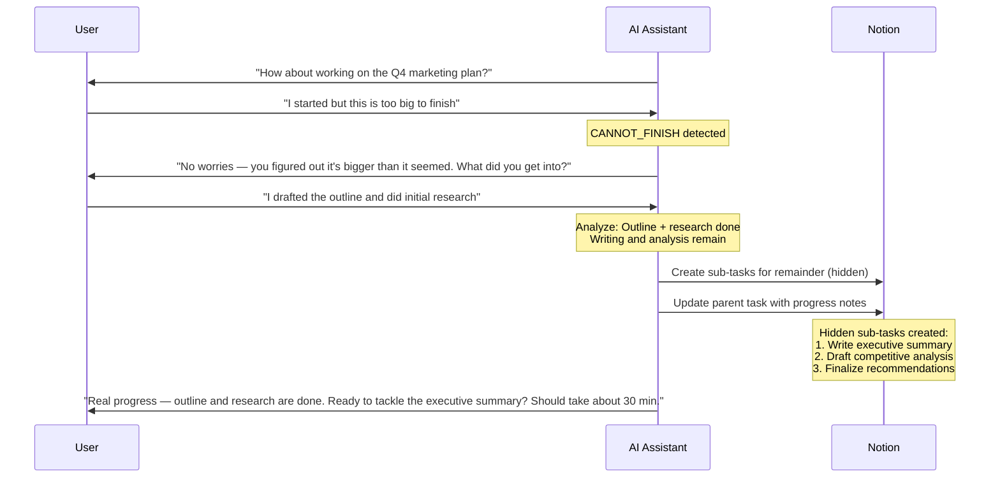
```mermaid
sequenceDiagram
    participant U as User
    participant AI as AI Assistant
    participant N as Notion

    AI->>U: "How about working on the Q4 marketing plan?"
    U->>AI: "I started but this is too big to finish"

    Note over AI: CANNOT_FINISH detected

    AI->>U: "No worries — you figured out it's bigger than it seemed. What did you get into?"
    U->>AI: "I drafted the outline and did initial research"

    Note over AI: Analyze: Outline + research done<br/>Writing and analysis remain

    AI->>N: Create sub-tasks for remainder (hidden)
    AI->>N: Update parent task with progress notes

    Note over N: Hidden sub-tasks created:<br/>1. Write executive summary<br/>2. Draft competitive analysis<br/>3. Finalize recommendations

    AI->>U: "Real progress — outline and research are done. Ready to tackle the executive summary? Should take about 30 min."
```

### Cannot Finish Decision Tree

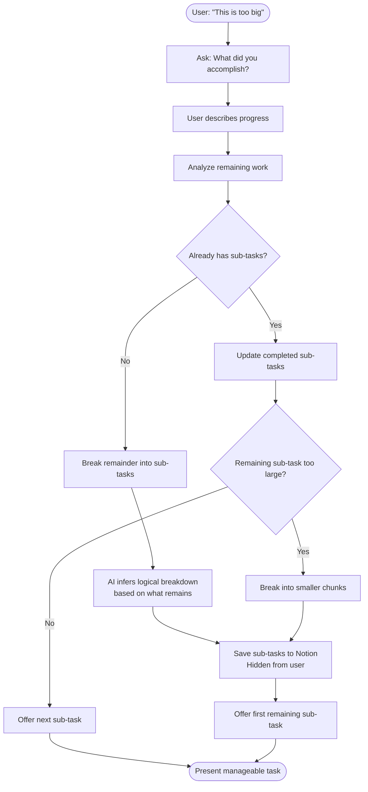
```mermaid
flowchart TD
    CannotFinish(["User: #quot;This is too big#quot;"]) --> AskProgress["Ask: What did you accomplish?"]
    AskProgress --> UserDescribes[User describes progress]
    UserDescribes --> Analyze[Analyze remaining work]
    Analyze --> HasSubtasks{Already has sub-tasks?}

    HasSubtasks -->|Yes| UpdateProgress[Update completed sub-tasks]
    HasSubtasks -->|No| CreateSubtasks[Break remainder into sub-tasks]

    UpdateProgress --> RemainingTooLarge{Remaining sub-task too large?}
    RemainingTooLarge -->|Yes| BreakFurther[Break into smaller chunks]
    RemainingTooLarge -->|No| OfferNext[Offer next sub-task]

    CreateSubtasks --> InferBreakdown[AI infers logical breakdown<br/>based on what remains]
    InferBreakdown --> SaveHidden[Save sub-tasks to Notion<br/>Hidden from user]

    BreakFurther --> SaveHidden
    SaveHidden --> OfferFirst[Offer first remaining sub-task]

    OfferNext --> Present([Present manageable task])
    OfferFirst --> Present
```

### Breakdown Strategy

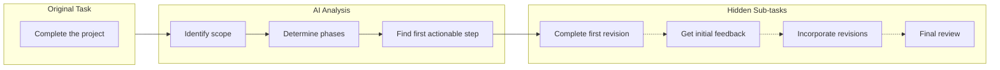
```mermaid
flowchart LR
    subgraph Input["Original Task"]
        Big["Complete the project"]
    end

    subgraph Analysis["AI Analysis"]
        Scope[Identify scope]
        Phases[Determine phases]
        FirstAction[Find first actionable step]
    end

    subgraph Output["Hidden Sub-tasks"]
        S1["Complete first revision"]
        S2["Get initial feedback"]
        S3["Incorporate revisions"]
        S4["Final review"]
    end

    Input --> Scope
    Scope --> Phases
    Phases --> FirstAction
    FirstAction --> S1
    S1 -.-> S2
    S2 -.-> S3
    S3 -.-> S4
```

**Key Principles:**
- Sub-task breakdown is NEVER shown to the user as a full list
- Each sub-task should be completable in one sitting (typically 15-90 min)
- The AI presents only the current actionable sub-task
- Parent task only completes when all sub-tasks are done

### Cannot Finish Response Templates (Shame-Safe)

| Scenario | Response Template |
|----------|-------------------|
| First time | "Now we know this task's real size. I've broken it into smaller pieces — ready for the first chunk?" |
| Already broken | "Still too big — that's useful info. Let me find an even smaller piece to start with." |
| Can't break further | "This is pretty focused already. What's the specific part that's hard?" |
| Making progress | "Nice — one piece done! Ready for the next bit?" |

---

## Flow 6: Breakdown Assistance (On-Demand Help)

A core principle of hide-my-list: **users interpret vague goals as infinite, and thus avoid them.** The agent must always be ready to help users understand exactly what to do next. This flow handles when users need help starting or continuing a task.

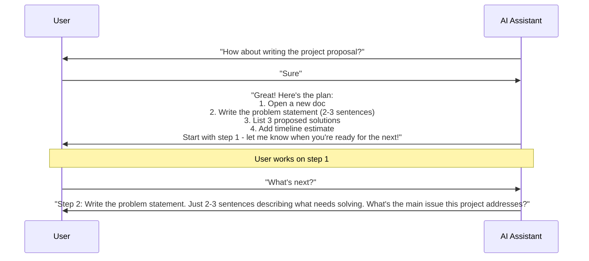
```mermaid
sequenceDiagram
    participant U as User
    participant AI as AI Assistant

    AI->>U: "How about writing the project proposal?"
    U->>AI: "Sure"
    AI->>U: "Great! Here's the plan:<br/>1. Open a new doc<br/>2. Write the problem statement (2-3 sentences)<br/>3. List 3 proposed solutions<br/>4. Add timeline estimate<br/>Start with step 1 - let me know when you're ready for the next!"

    Note over U,AI: User works on step 1

    U->>AI: "What's next?"
    AI->>U: "Step 2: Write the problem statement. Just 2-3 sentences describing what needs solving. What's the main issue this project addresses?"
```

### Breakdown Assistance Decision Tree

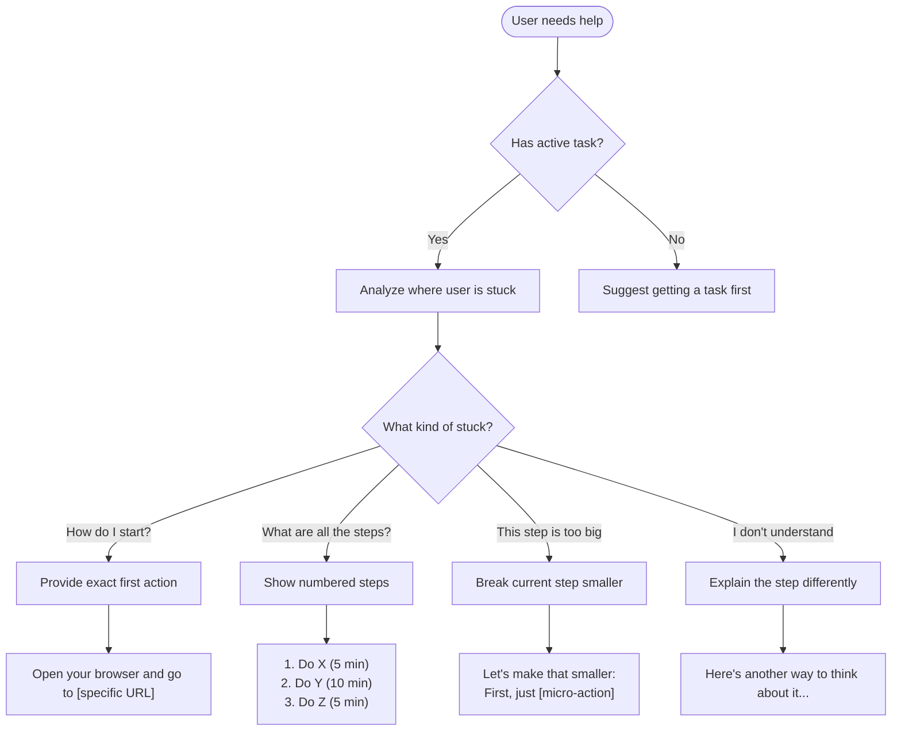
```mermaid
flowchart TD
    Start([User needs help]) --> HasActive{Has active task?}

    HasActive -->|Yes| Analyze[Analyze where user is stuck]
    HasActive -->|No| GetTask[Suggest getting a task first]

    Analyze --> StuckType{What kind of stuck?}

    StuckType -->|"How do I start?"| FirstStep[Provide exact first action]
    StuckType -->|"What are all the steps?"| ShowPlan[Show numbered steps]
    StuckType -->|"This step is too big"| BreakStep[Break current step smaller]
    StuckType -->|"I don't understand"| Clarify[Explain the step differently]

    FirstStep --> Specific["Open your browser and go to [specific URL]"]
    ShowPlan --> Numbered["1. Do X (5 min)<br/>2. Do Y (10 min)<br/>3. Do Z (5 min)"]
    BreakStep --> Smaller["Let's make that smaller:<br/>First, just [micro-action]"]
    Clarify --> Rephrase["Here's another way to think about it..."]
```

### Proactive Assistance Triggers

The agent should proactively offer breakdown assistance when it detects:

| Signal | Agent Response |
|--------|----------------|
| Long pause after accepting task | "Need help getting started? I can break this down further." |
| "Hmm" / "Uh" / hesitation words | "Want me to walk you through the steps?" |
| "I guess" / uncertain acceptance | "Let me give you a clear starting point..." |
| User returns without completing | "Picking this back up? Here's where you left off and what's next." |

### Assistance Response Levels

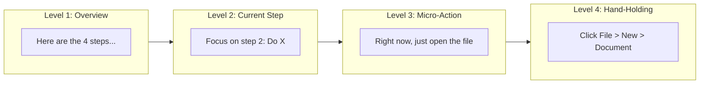
```mermaid
flowchart LR
    subgraph Level1["Level 1: Overview"]
        L1["Here are the 4 steps..."]
    end

    subgraph Level2["Level 2: Current Step"]
        L2["Focus on step 2: Do X"]
    end

    subgraph Level3["Level 3: Micro-Action"]
        L3["Right now, just open the file"]
    end

    subgraph Level4["Level 4: Hand-Holding"]
        L4["Click File > New > Document"]
    end

    Level1 --> Level2 --> Level3 --> Level4
```

The agent adjusts detail level based on user signals:
- Confident user → Level 1-2
- Uncertain user → Level 2-3
- Stuck user → Level 3-4
- Very stuck user → Level 4 with encouragement

### Assistance Conversation Examples

**User needs starting help:**
```
User: "Sure, I'll do the proposal"
AI: "Perfect! Let's make this concrete:
     1. Open Google Docs and create a new file
     2. Title it 'Project Proposal - [Date]'
     3. Write one sentence: What problem are you solving?

     Just do step 1 right now. Ready when you are!"
```

**User stuck mid-task:**
```
User: "I'm stuck on this"
AI: "No problem - where did you get to? Tell me the last thing you finished and I'll point you to the exact next action."
```

**User wants the full picture:**
```
User: "What are all the steps?"
AI: "Here's the full breakdown:
     1. Problem statement (5 min) ← you are here
     2. Solution options (10 min)
     3. Timeline (5 min)
     4. Quick review (5 min)

     Total: ~25 min. Want to start with the problem statement?"
```

---

## Flow 7: Check-In Follow-Up

When a user accepts a task, the agent records the acceptance in Notion and stores timing metadata in `state.json`. OpenClaw's optional `task-check-in` cron job re-enters the conversation if the task runs long. If the cron job is not configured, proactive check-ins are disabled.

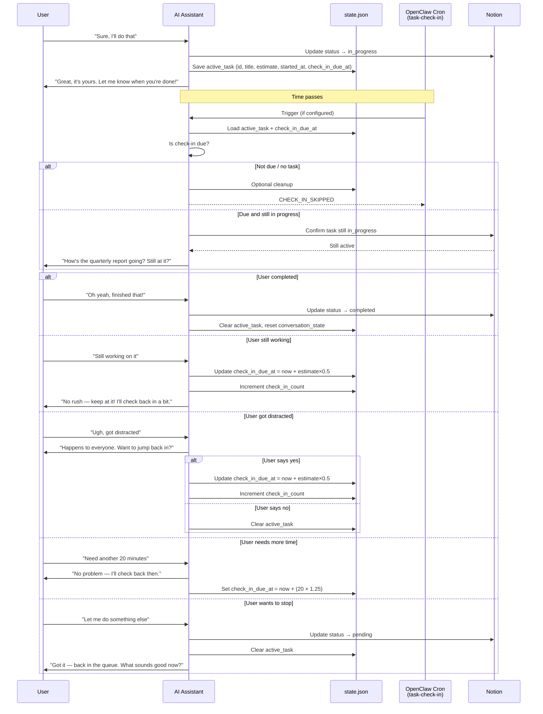
```mermaid
sequenceDiagram
    participant U as User
    participant AI as AI Assistant
    participant State as state.json
    participant Cron as OpenClaw Cron<br/>(task-check-in)
    participant N as Notion

    U->>AI: "Sure, I'll do that"
    AI->>N: Update status → in_progress
    AI->>State: Save active_task (id, title, estimate, started_at, check_in_due_at)
    AI->>U: "Great, it's yours. Let me know when you're done!"

    Note over AI,Cron: Time passes

    Cron->>AI: Trigger (if configured)
    AI->>State: Load active_task + check_in_due_at
    AI->>AI: Is check-in due?
    alt Not due / no task
        AI->>State: Optional cleanup
        AI-->>Cron: CHECK_IN_SKIPPED
    else Due and still in progress
        AI->>N: Confirm task still in_progress
        N-->>AI: Still active
        AI->>U: "How's the quarterly report going? Still at it?"
    end

    alt User completed
        U->>AI: "Oh yeah, finished that!"
        AI->>N: Update status → completed
        AI->>State: Clear active_task, reset conversation_state
    else User still working
        U->>AI: "Still working on it"
        AI->>State: Update check_in_due_at = now + estimate×0.5
        AI->>State: Increment check_in_count
        AI->>U: "No rush — keep at it! I'll check back in a bit."
    else User got distracted
        U->>AI: "Ugh, got distracted"
        AI->>U: "Happens to everyone. Want to jump back in?"
        alt User says yes
            AI->>State: Update check_in_due_at = now + estimate×0.5
            AI->>State: Increment check_in_count
        else User says no
            AI->>State: Clear active_task
        end
    else User needs more time
        U->>AI: "Need another 20 minutes"
        AI->>U: "No problem — I'll check back then."
        AI->>State: Set check_in_due_at = now + (20 × 1.25)
    else User wants to stop
        U->>AI: "Let me do something else"
        AI->>N: Update status → pending
        AI->>State: Clear active_task
        AI->>U: "Got it — back in the queue. What sounds good now?"
    end
```

### Check-In Decision Tree

```mermaid
flowchart TD
    Due["check_in_due_at reached"] --> StillActive{Task still in_progress?}

    StillActive -->|No| Skip[Skip — clear active_task]
    StillActive -->|Yes| Count{check_in_count}

    Count -->|0| Friendly["How's [task] going?"]
    Count -->|1| Brief["Still working on [task]?"]
    Count -->|2| Gentle["Want to take a break from [task]?<br/>No further check-ins"]

    Friendly --> Response
    Brief --> Response
    Gentle --> Response

    Response --> Done["Done"]
    Response --> Working["Still working"]
    Response --> Distracted["Got distracted"]
    Response --> MoreTime["Need more time"]
    Response --> Stop2["Want to stop"]

    Done --> Complete[Mark completed; clear state]
    Working --> ResetHalf[check_in_due_at = now + estimate×0.5]
    Distracted --> Continue{Continue task?}
    MoreTime --> AskDuration["Ask for duration"]
    Stop2 --> ReturnQueue[Return task to pending; clear state]

    Continue -->|Yes| ResetHalf
    Continue -->|No| ReturnQueue

    AskDuration --> Custom["check_in_due_at = now + user_time×1.25"]
    ResetHalf --> Increment[Increment check_in_count]
    Custom --> Increment
```

### Check-In Response Templates (Shame-Safe)

> **Shame Prevention:** Check-ins can feel like surveillance. Keep the tone
> curious and warm — a friend checking in, not a manager following up.
> Never imply the user should have finished by now.

| Scenario | AI Response |
|----------|-------------|
| 1st check-in | "How's [task] going? Still at it?" |
| 2nd check-in | "Still working on [task]? No rush either way." |
| 3rd check-in | "Want to take a break from [task]? Totally fine — I'll be here when you're ready." |
| User says done | "Nice! Marking that off. Ready for another?" |
| User still working | "No rush — keep at it! I'll check back in a bit." |
| User got distracted | "Happens to literally everyone. Want to jump back in, or try something else?" |
| User needs more time | "No problem — time estimates are just guesses anyway. About how much longer?" |
| User wants to stop | "Totally fine — I'll keep it for later. No pressure. What sounds good instead?" |

### OpenClaw Scheduling

There is no browser timer. Use OpenClaw infrastructure instead:

- **Recommended cron:** `task-check-in` running every 5 minutes, durable.
- **Session payload:** Prompt should instruct the agent to load `state.json` and evaluate `check_in_due_at`.
- **Early exit:** If the due time has not been reached, reply `CHECK_IN_SKIPPED` for observability.
- **State fields:** `active_task.id`, `active_task.title`, `active_task.time_estimate`, `active_task.started_at`, `active_task.check_in_due_at`, `active_task.check_in_count`.

If the cron is not configured, the agent should not attempt proactive check-ins. The rest of the flow remains valid for future deployment.

---

## Flow 8: Scheduled Reminder Delivery

Reminders are tasks with a specific wall-clock delivery time. Unlike check-ins (which are based on active-task state and optional OpenClaw scheduling), reminders fire proactively even when the chat is idle.

```mermaid
sequenceDiagram
    participant Cron as Isolated Haiku Cron
    participant Scr as check-reminders.sh
    participant Notion as Notion API
    participant Signal as .reminder-signal
    participant Delivery as Heartbeat / Main Session
    participant User

    Cron->>Scr: Run check-reminders.sh
    Scr->>Notion: Query due reminders (remind_at <= now)
    Notion-->>Scr: Due reminder tasks
    Scr->>Signal: Write reminder handoff file
    Note over Cron: Cron exits (NO_REPLY)
    alt User interacts (AGENTS.md step 5)
        Delivery->>Signal: Read handoff file
        Delivery->>User: Deliver reminder
        Delivery->>Notion: Set Status=Completed and Reminder Status=sent/missed
        Delivery->>Signal: Delete handoff file
    else Heartbeat runs (Check 1)
        Delivery->>Signal: Read handoff file
        Delivery->>User: Deliver reminder
        Delivery->>Notion: Set Status=Completed and Reminder Status=sent/missed
        Delivery->>Signal: Delete handoff file
    end
```

The `reminder-check` cron runs as an isolated Haiku session — it is query-only and does not deliver reminders. Delivery happens through two paths: the main-session startup check (AGENTS.md step 5, on every user interaction) and the heartbeat (HEARTBEAT.md Check 1, every 60 min).

Both delivery paths must use the `message` tool to proactively send the reminder over Signal with `action: send`, `channel: signal`, and `target: <defaultTo from config>`. They must not rely on a normal assistant reply for delivery. Only after the send succeeds should the agent call `scripts/notion-cli.sh complete-reminder PAGE_ID sent|missed`; if the send fails, the handoff file is left in place for retry.

### Reminder Delivery Messages

The agent delivers reminders with a brief, casual tone — like a friend tapping your shoulder:

**Approximate delivery (next eligible poll after the scheduled time, before the missed threshold):**
> "Hey — this is your reminder to email Melanie about availability."

**Missed delivery (>15 minutes past due, flagged as missed):**
> "I'm late on this one — you had a reminder at 6pm PT to email Melanie. Want to handle it now or reschedule?"

### Reminder Intake

During task intake, the AI detects reminder-style language and sets:
- `is_reminder = true`
- `remind_at` = full ISO 8601 timestamp with timezone
- `reminder_status = pending`
- `urgency = 90` (time-critical)

**Confirmation message style:**
> "Got it — I'll queue a reminder for 6pm PT to email Melanie. It should come through on the next reminder check after that."

The user's timezone defaults to US Central. The AI converts timezone references (PT, CT, ET) to UTC offsets at intake time.

### Reminder vs. Deadline

Reminders and deadlines are different:
- **Reminder**: "Ping me at 6pm to call Sarah" → proactive notification shortly after 6pm, on the next reminder check
- **Deadline**: "Review proposal by Friday" → urgency-scored task, no proactive ping

The key signal is notification intent: the user wants to be *told* to do something at a specific time, not just have it prioritized.

---

## Flow 9: Special Cases

### Empty Queue

```mermaid
flowchart TD
    Request(["User: #quot;What should I do?#quot;"]) --> Check[Check Notion]
    Check --> Empty{Any pending tasks?}

    Empty -->|Yes| Normal[Normal selection flow]
    Empty -->|No| Celebrate["Your slate is clear!"]

    Celebrate --> Prompt["Nothing's waiting for you.<br/>Enjoy it, or add something new?"]

    Prompt --> Add["Add a task"]
    Prompt --> Leave["Take a break"]
```

### No Good Match

```mermaid
flowchart TD
    Request(["User: #quot;15 min, feeling focused#quot;"]) --> Check[Check tasks]
    Check --> NoMatch{Any tasks match?}

    NoMatch -->|All too long| TimeIssue["Nothing fits 15 minutes.<br/>Your shortest task is 30 min."]
    NoMatch -->|Wrong mood| MoodIssue["No focus tasks available.<br/>Want to try something else?"]
    NoMatch -->|Both| BothIssue["Tough to find a match right now."]

    TimeIssue --> Options1["Got more time?<br/>Or add a quick task?"]
    MoodIssue --> Options2["How about [other type]<br/>Or change your mood?"]
    BothIssue --> Options3["Want to add something<br/>or come back later?"]
```

### User Asks About Their List

```mermaid
flowchart TD
    Ask(["User: #quot;What's in my list?#quot;"]) --> Philosophy[Explain philosophy]

    Philosophy --> Response["I keep track so you don't have to!<br/>You've got 8 tasks waiting.<br/>Ready to knock one out?"]

    Response --> Follow{User follows up?}
    Follow -->|Insists| Gentle["The point is not having to look.<br/>Trust me - I'll surface the right one."]
    Follow -->|Accepts| Selection[Normal selection flow]
```

## Conversation Tone Guidelines

```mermaid
mindmap
  root((Tone))
    Casual
      "Got it"
      "Nice work"
      "No problem"
    Brief
      One question at a time
      Short confirmations
      Minimal small talk
    Collaborative
      "Help me learn"
      "What's steering you away?"
      Never apologize excessively
    Confident
      Present suggestions directly
      Trust the algorithm
      Don't second-guess
```

## Example Full Session

```mermaid
sequenceDiagram
    participant U as User
    participant AI as AI
    participant HA as Home Audio
    participant SMS as SMS

    U->>AI: Hey
    AI->>U: Hey! Ready to add a task or work on something?

    U->>AI: I need to email the team about the offsite
    AI->>U: Got it — social, ~15 min, moderate priority. Steps: 1) Draft email, 2) Review, 3) Send. What else?
    U->>AI: Actually that's urgent, needs to go out today
    AI->>U: Updated to high priority. Anything else?

    U->>AI: Oh and deal with that thing
    AI->>U: Which thing are you thinking of?
    U->>AI: Booking travel for the offsite
    AI->>U: Got it — independent, ~30 min. Ready to work or keep adding?

    U->>AI: I've got 20 minutes before a meeting
    AI->>U: Perfect - how about sending that team email? It's short and urgent.
    U->>AI: Yeah let's do it
    AI->>U: Great, it's yours. Let me know when you're done!

    Note over U,AI: 12 minutes later

    U->>AI: Done

    par Celebration
        AI->>U: FIRST ONE DOWN! 🎯✨💪 [unique AI celebration image]
        HA->>HA: Plays victory jingle (15 sec)
        SMS->>SMS: "[Partner], your person just knocked out their first task! 🙌"
    end

    AI->>U: Got time for another quick one?
    U->>AI: No, meeting's starting
    AI->>U: No worries - you're off to a great start! ✨
```

## Example Session with Check-In

```mermaid
sequenceDiagram
    participant U as User
    participant AI as AI Assistant
    participant State as state.json
    participant Cron as OpenClaw Cron

    U->>AI: I have an hour, feeling focused
    AI->>U: How about working on the quarterly report? ~45 min of focus work.
    U->>AI: Sure
    AI->>State: Save active_task (estimate 45, due_in 56 min, count 0)
    AI->>U: Great — it's yours. Let me know when you're done!

    Note over AI,Cron: 56 minutes pass

    Cron->>AI: Trigger task-check-in
    AI->>State: Load active_task + due time
    AI->>U: How's the quarterly report going? Still at it?

    U->>AI: Ugh, I got distracted reading emails
    AI->>U: Happens to everyone. Want to jump back in, or try something else?
    U->>AI: Yeah let me finish it
    AI->>State: Set new due = now + 22 min
    AI->>State: Increment check_in_count

    Note over AI,Cron: 22 minutes pass

    Cron->>AI: Trigger task-check-in
    AI->>State: Due again → ping
    AI->>U: Still working on the report?

    U->>AI: Just finished!
    AI->>State: Clear active_task
    AI->>U: Nice work! That's a big one done. Ready for a break or another task?
```
